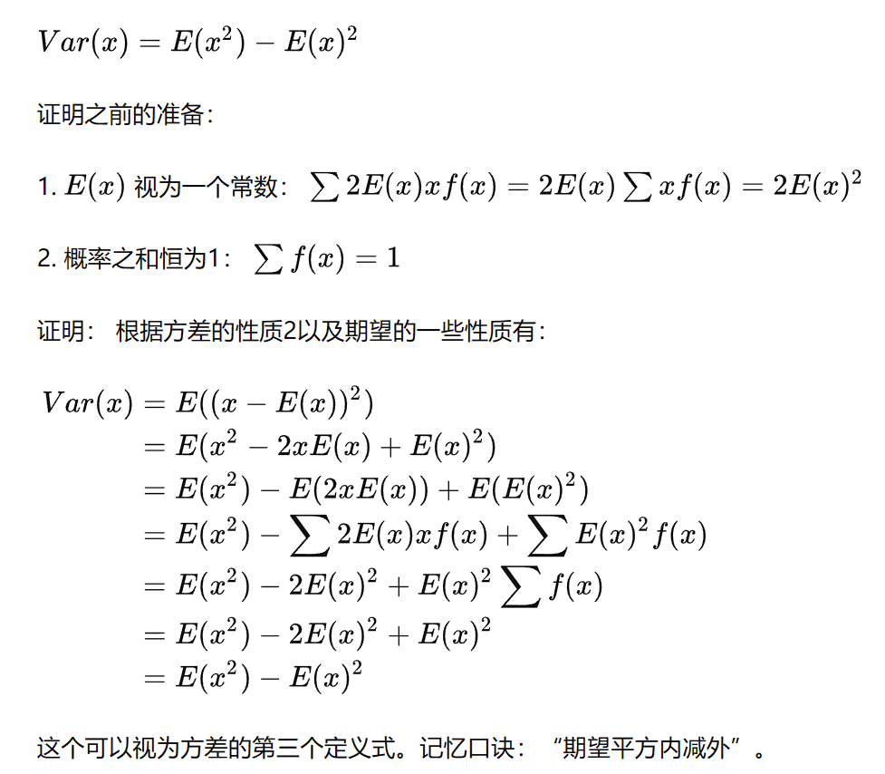

## 期望

### 性质1：期望的线性关系

$E(X+Y)=E(X)+E(Y)$

期望的可加性永远适用，即使$X,Y$并非独立。

## 样本期望均值的期望

与总期望一致。

## 期望的乘积关系

- 对于独立随机变量：$E(XY)=E(X)*E(Y)$
  
$E(x)=\sum_{i=1}^m Xf(X)$   

 $E(y)=\sum_{j=1}^nYg(Y)$

 $E(X)*E(Y)$拆出来就是$X_1Y_1f(X_1)g(Y_1)$，因为变量独立，所欲等于$(X_1Y_1*h(X_1Y_1))$即$E(XY)$。

 ## 方差

 ### 定义式

 $Var(x)=\sum(x-\mu)^2f(x)$

### 等价式

1. $Var(x)=E((x-\mu)^2),\mu=E(x)$

2. $Var(x)=E(x^2)-E(x)^2$

### 独立随机变量的可加性

对于独立随机变量 $x_1,x_2,\dots x_n$

$Var(x_1+x_2+\dots x_n)=Var(x_1)+Var(x_2)+\dots +Var(x_n)$

----

### 条件独立和独立不是等价的概念。

---- 

## 协方差与独立性

协方差的定义是从数字的表示特征出发进行概况的而随机变量独立性的定义更触及本质一些，即：X的取值不会影响Y的条件分布，因此独立性的描述意义要更强。

----

