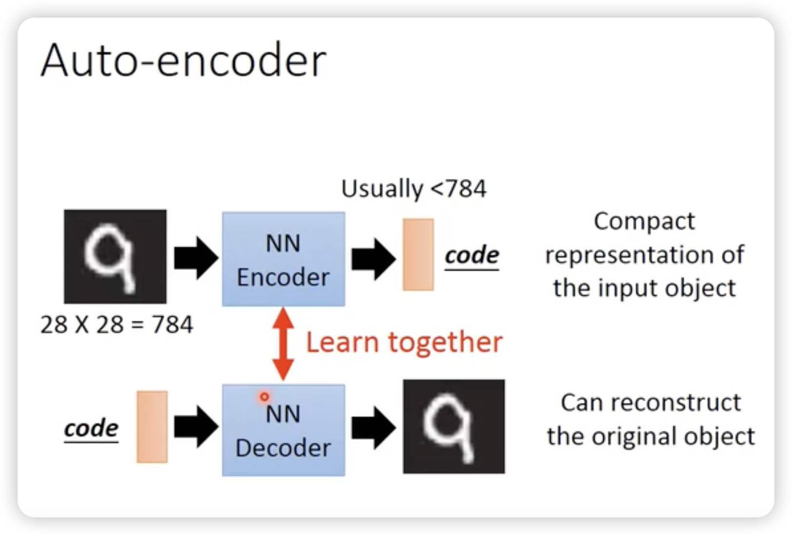
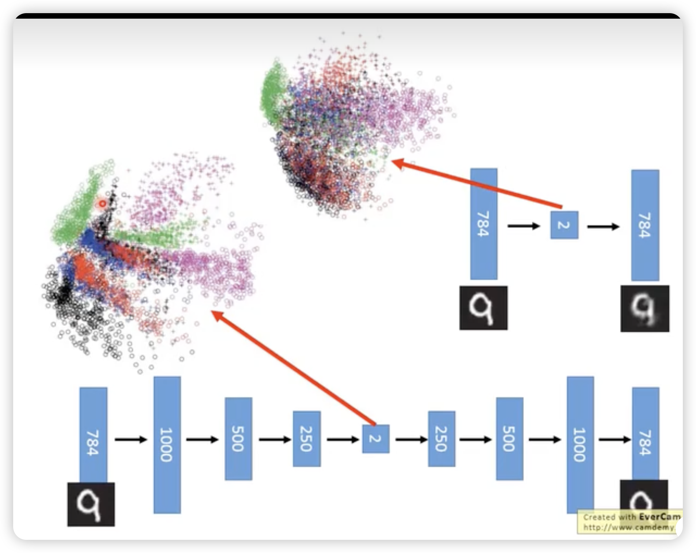
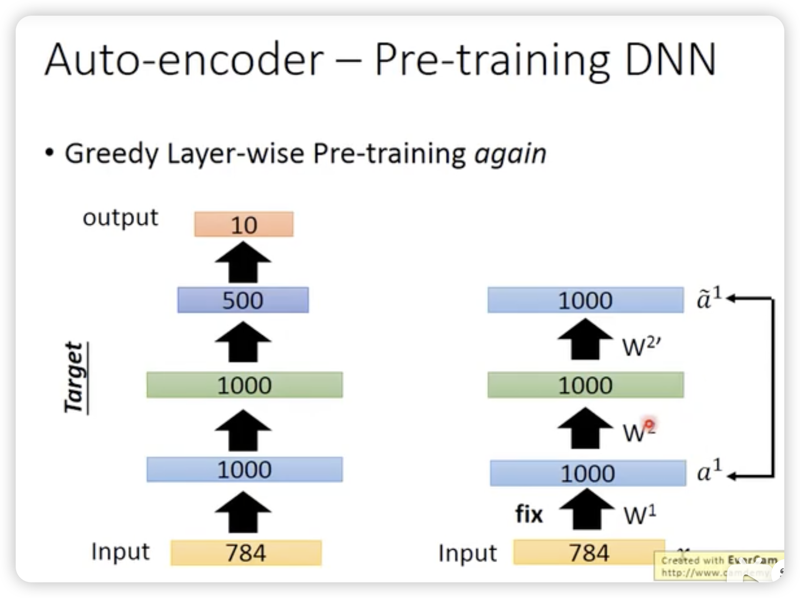
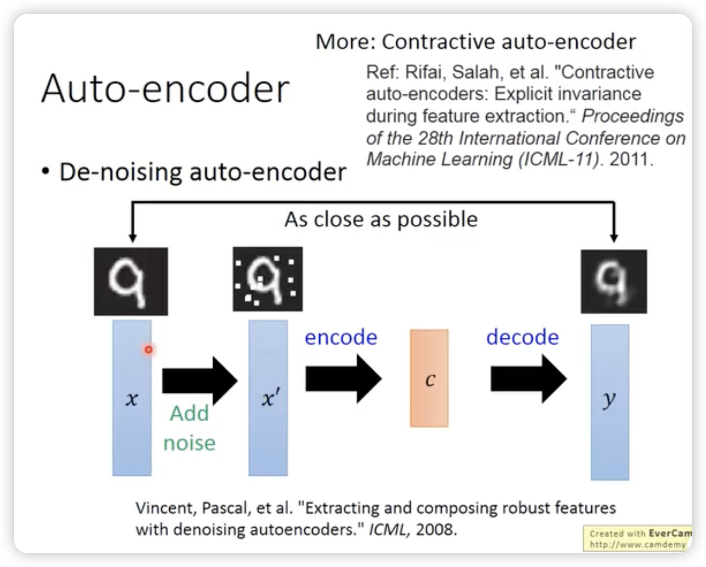
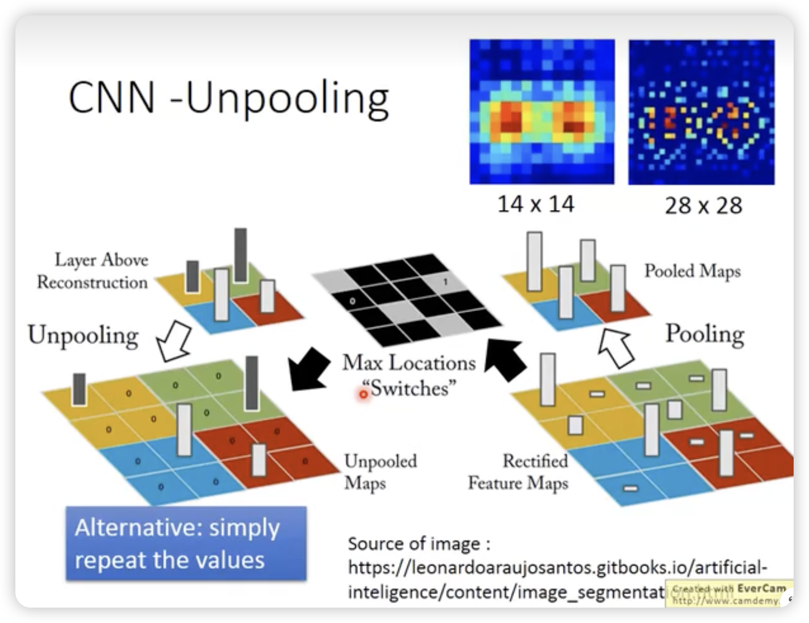
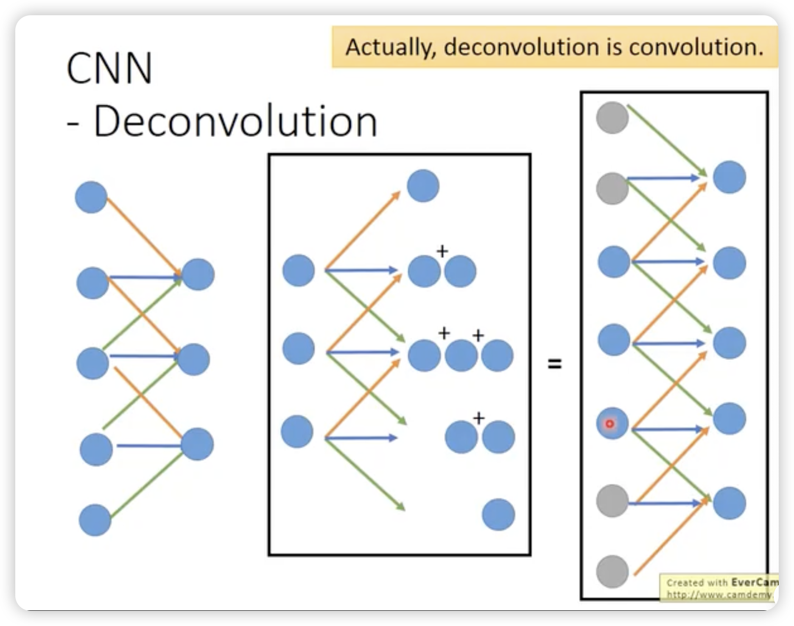
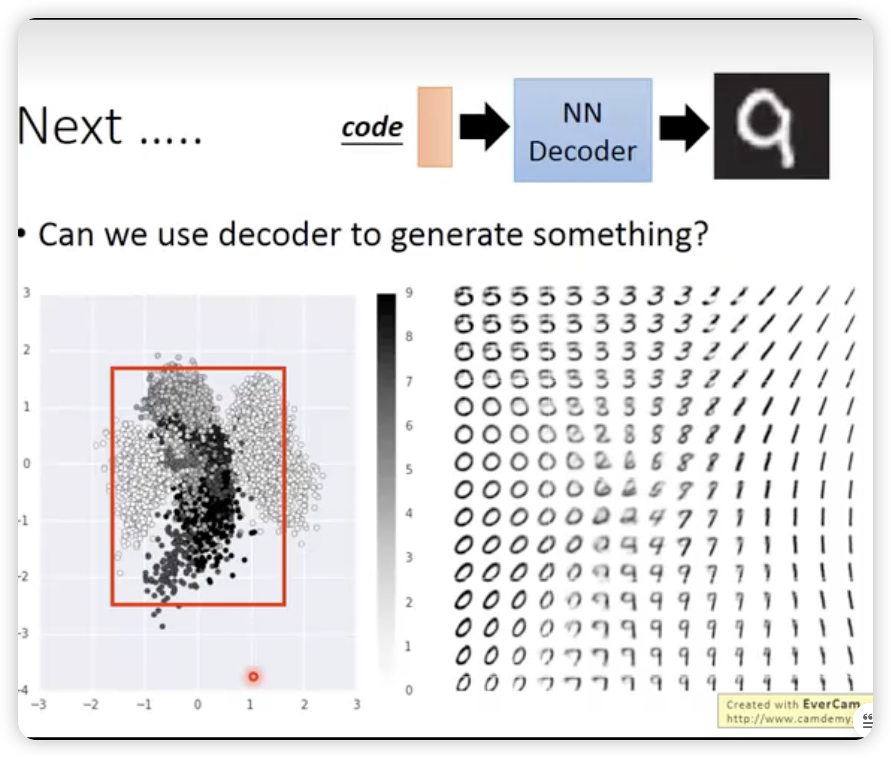
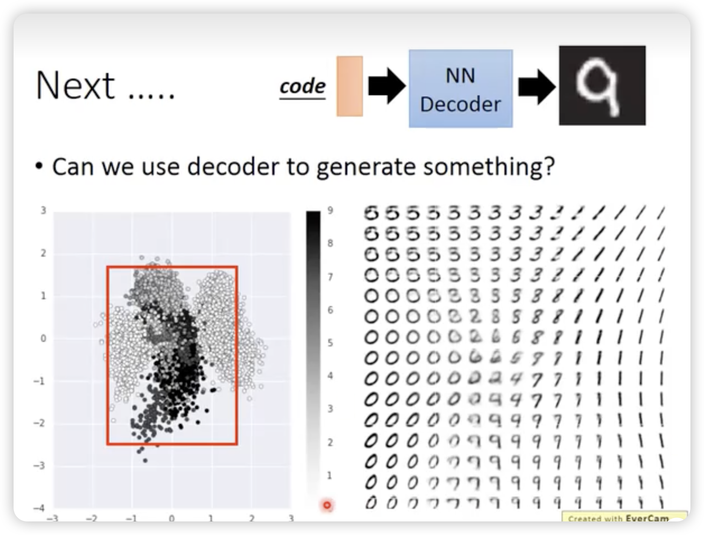

## Auto-encoder

其实方法论上很简单：

从PCA的视角看：

就是两边的weight是转置的，但是这个PCA限制的，没有必要说encoder和decoder的weight是对称的。

所以可以去掉这个限制，直接train一发。

---

deep的方法比PCA好一些：（下面是deep）

---

### Auto-encoder还可以用来做预训练参数

比如上图中，先把500 1000 1000之间的参数按每一层去学好，作为初始值。

最后在调W4的时候，对所有参数一起fine-tune就行。

但是一般没什么用了现在，现在的optimizer都挺牛逼的。

主要是针对大量没有标签（用来pre-train），只有少量的labeled data去稍微调整weight。

### 加噪版auto-encoder增加抗干扰能力，更robust

让auto-encoder学会去除噪音。

### 对CNN也有对应的unpooling和deconvolutional

### 使用decoder去做generation

但是怎么选择框不太方便。

这里可以加一个L2的regularization，让其分布与0点的周围，然后直接取0周围的空间去做generation就可以了。

