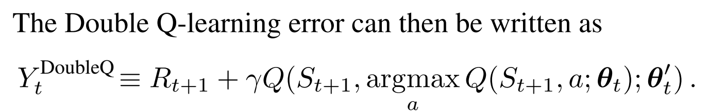
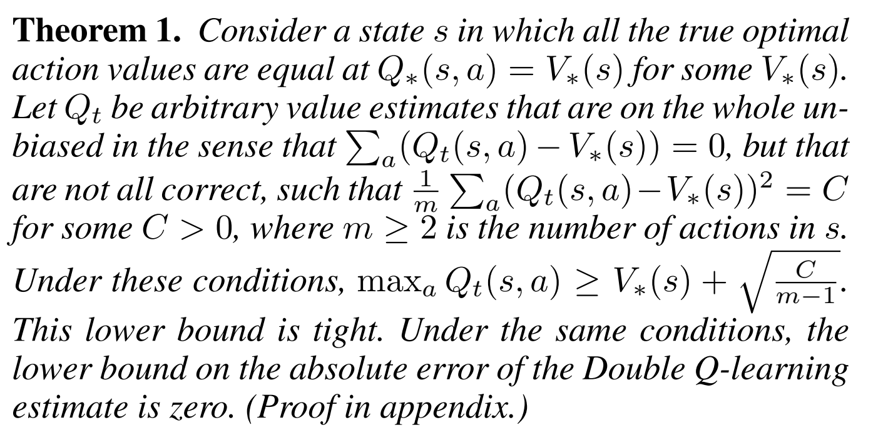
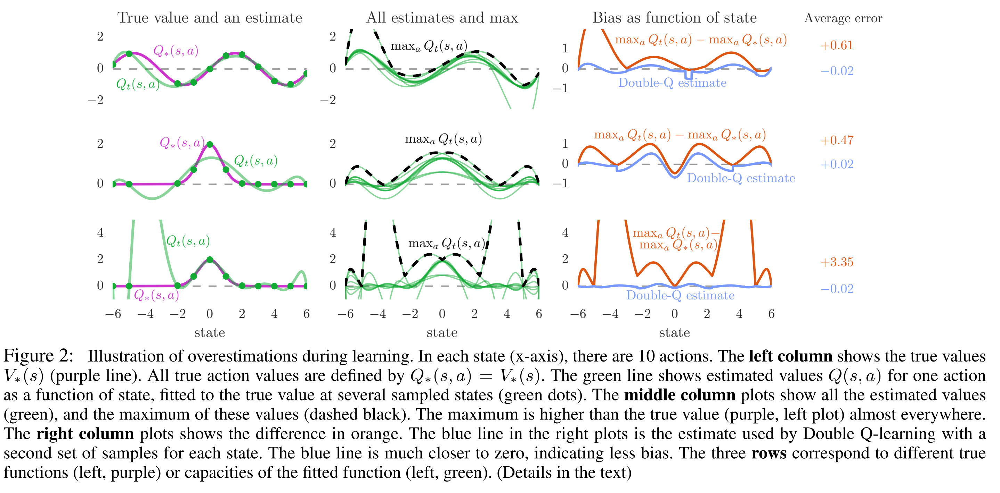
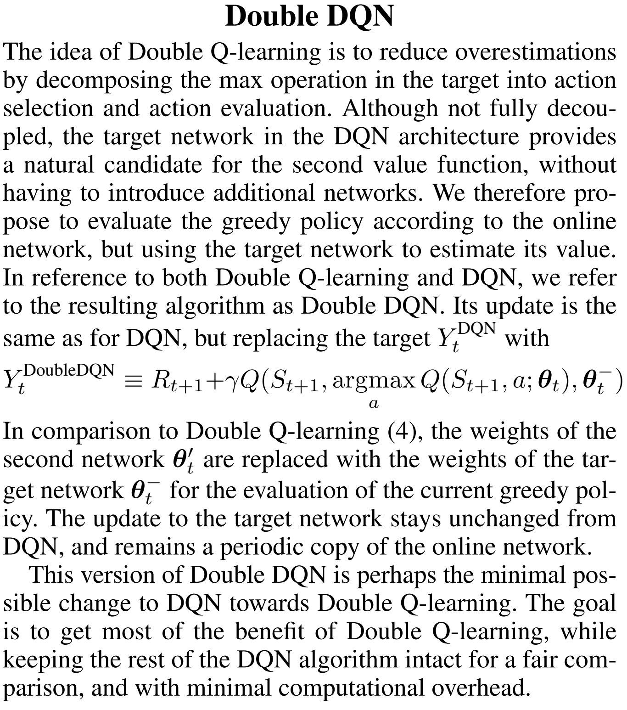
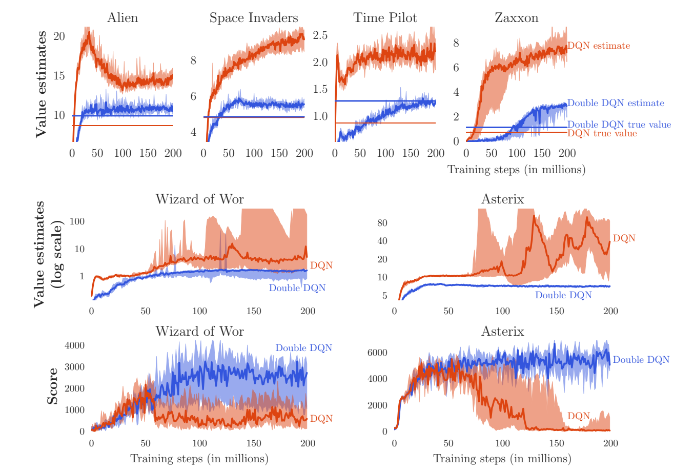
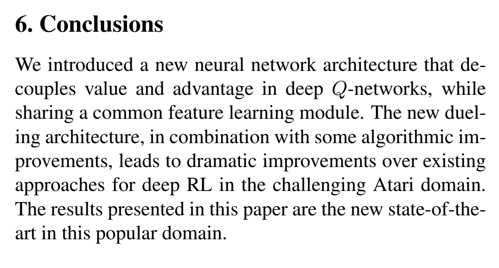

# 
 Double DQN 

### DQN的overestimation的问题
众所周知DQN有substantial overestimations的问题

乐观估计在某种程度上是我们鼓励在不确定时的探索技巧，但是因为DQN中max操作和各种噪音、误差的原因，这种乐观估计不是uniform或者集中在我们希望的status上，会造成性能退化。

Atari游戏很适合DQN，因为环境是deterministic，同时deep nn可以很好地渐进拟合Q值。

我们依然用原nn评估用哪一个动作，但是计算这个动作的最后TD估计时，我们用另一个nn来计算。这样可以减少overestimation的问题。

### errors and noises

errors and noises无处不在，包括environment,function approximation,non-stationary，这是很显然的，因为我们不知道true values，任何的方法都有不准确性。即是没有bias，uniform是0，也会有variance。这些都会导致overestimation。

- 数学上bias和variance导致的overestimation
没有bias，但是有variance，经过max后会有一个tight low bound。这个bound会严格导致overestimation。

但是在DDQN中，没有tight low bound。同时注意到，action数量越多，overestimation越严重。

- function approximation导致的overestimation

可以看到无论是欠拟合还是过拟合，已知的点在什么位置，都会造成function approximation的overestimation。
更坏的情况是由于bootstrapping，overestimation会传递。

### Overestimation v.s. Overoptimism

同时，弄清楚overestimation和overoptimism的区别，overoptimism是针对uncertain status的exploration bonus，而overestimation occurs only after updating，会造成确定局面的overoptimism，进而阻碍学习。

### Double DQN

两个方面，其一，用原始nn选择max动作，然后用target network计算Q值。其二，虽然前面用target nn的操作还是会有overestimation，但是这样做是易拓展性和接口不变，也是一种trade-off。

### 实验表现

直线是用对应的best policy测出来的。

可以看出，DDQN不仅有更好的evaluate精度，也有更好的performance。

#### 评测方式

起点：
1. 30 times no-op action
2. human export's trajectory（防止针对特定state的特定策略，增加robustness的考量。）

时间：
走18000frames，来100次取平均

### 总结

