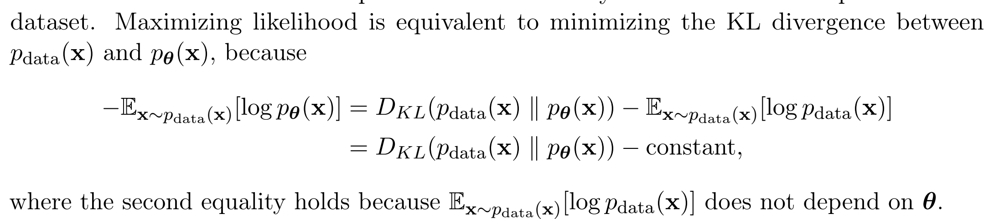

与传统概率模型的区别

传统的概率模型通常需要定义一个规范化的概率分布，即概率密度函数 $p(\mathbf{x})$ 满足积分为1的条件。这意味着模型需要满足一定的规范化条件，限制了模型的形式和复杂度。

相比之下，EBMs 只需要定义一个非规范化的能量函数，而不需要直接计算规范化的概率分布。这使得模型在功能形式上具有更大的灵活性，因为能量函数不需要满足积分为1的条件，可以采用任意的非线性回归函数来参数化。

由于能量函数可以采用任意的非线性回归函数来表示，密度估计问题基本上被简化为一个非线性回归问题。这意味着我们可以利用在分类或回归任务中开发的各种先进的神经网络架构来构建能量函数。

---

4. 能量模型的挑战：训练的困难性
尽管 EBMs 在模型灵活性上具有显著优势，但它们也面临以下主要挑战：

4.1 计算精确似然的不可行性

由于能量函数是非规范化的，计算精确的概率密度（即计算规范化常数，配分函数 $Z = \int \exp(-E(\mathbf{x})) d\mathbf{x}$）通常是不可行的，特别是在高维情况下。

4.2 从模型中精确采样的不可行性

生成新样本需要从模型的概率分布中采样，但由于缺乏明确的概率密度函数，直接采样也是不可行的。这使得模型的训练和评估变得困难。

---

最大似然与 MCMC：通过近似采样估计梯度，直接优化似然函数。
分数匹配：基于匹配数据和模型的分数函数，不涉及采样。
噪声对比估计：将密度估计转化为分类问题，使用判别模型进行训练。

训练困难：由于无法直接计算规范化常数和进行精确采样，训练过程复杂且计算成本高。
需要近似方法：必须依赖近似的训练方法，如 MCMC、分数匹配和噪声对比估计，但这些方法各有局限性。

能量模型作为生成式模型的重要一员，因其在功能形式上的灵活性，具有广泛的应用潜力。然而，训练难度的挑战促使研究者不断探索新的方法来提高模型的可训练性和性能。理解 EBMs 的原理和训练方法，对深入研究生成式模型和拓展其应用具有重要意义。

---

**困难：但从这些模型中计算精确的似然函数以及精确地生成样本通常是不可行的**

这句话的意思是，在能量模型（EBMs）中，计算精确的**似然函数**和**生成样本**的过程存在很大的困难。

1. **精确的似然函数不可行**：
   似然函数是用来衡量模型生成数据的概率。要计算出这个概率，我们通常需要对整个数据分布进行积分（也就是计算规范化常数），但对于能量模型来说，这个积分往往涉及高维空间，计算量非常大，甚至无法求解。因此，无法直接得到精确的似然函数。

2. **精确生成样本不可行**：
   从模型中生成新样本，意味着我们要根据模型的分布随机采样。但由于能量模型定义的是未规范化的概率分布（即没有精确的概率值），直接从中进行采样也是非常困难的。通常我们需要借助近似的采样方法，比如马尔可夫链蒙特卡罗（MCMC），但这些方法在高维数据上可能收敛非常慢，导致无法生成高质量的样本。

总的来说，EBMs 的训练难度大部分来自于这两个问题，因为没有精确的似然函数和采样手段，模型的优化和评估都变得非常复杂。

---

**不使用EBM，使用旧的模型就不能generally free to choose any nonlinear regression function了吗？**

是的，旧的概率模型（如自回归模型、变分自编码器、基于流的生成模型等）在选择函数形式时，确实没有像能量模型（EBMs）那样的自由。原因在于这些传统模型需要严格满足概率分布的规范化条件，限制了模型函数的形式。

我们来分析为什么旧的模型不能像 EBMs 一样灵活：

### 1. **传统模型的限制：规范化条件**

在传统的概率模型中，我们需要显式地定义一个**规范化的概率分布**。这意味着模型需要满足这样的条件：

$$
\int p(\mathbf{x}) d\mathbf{x} = 1
$$

为了满足这个条件，传统模型通常必须采用某种特定的概率结构，如高斯分布、伯努利分布、马尔可夫链等。这些分布需要通过复杂的公式推导，确保积分结果为1，因此你不能随便选择一个非线性函数。

例如：
- **自回归模型**：将联合概率分解为一系列条件概率，这要求每一步的条件分布必须是明确可解的。
- **变分自编码器（VAE）**：假设潜在变量服从某种特定的分布（如标准高斯分布），以便使用变分推断来计算损失函数。
- **基于流的模型**：通过可逆变换将复杂分布变换为简单分布，但这些变换必须是可微且雅可比行列式可以计算的，限制了其形式。

因此，传统模型需要严格的概率分布定义，这些模型通常需要依赖特定的假设（如线性结构、可逆变换、特定的分布形式）来确保可解性和规范化条件的满足。

### 2. **EBM 的灵活性：非规范化能量函数**

能量模型打破了这些限制，因为它们只需要定义一个**非规范化的能量函数**。这个能量函数可以是任意的非线性回归函数，不必满足积分为1的条件。因此，在能量模型中，你可以使用更加复杂的函数（例如，神经网络或其他高度非线性的模型架构）来建模数据的分布，只要这个能量函数**原则上可以规范化**。

由于 EBMs 只关心能量函数的相对高低，而不是显式的概率值，它们不需要像传统模型那样严格的分布假设，从而提供了更多的自由度。

### 3. **总结：为什么旧模型没有这种自由？**

旧的概率模型需要对概率分布进行明确的规范化，要求模型函数满足特定的结构和假设，以保证计算和采样的可行性。这限制了你对模型函数的自由选择。相比之下，EBMs 只定义能量函数，不需要直接处理概率分布的规范化，因此你可以在选择能量函数时更加自由地使用任意的非线性回归函数。

因此，传统模型的规范化要求限制了非线性回归函数的使用，而 EBMs 的非规范化特性使得它们更加灵活。

---

这段话讲解了**能量模型（Energy-Based Models, EBMs）**的基本原理，特别是**规范化常数**（partition function）的计算难题，以及它对模型训练的影响。我们分解并分析其中的关键内容：

---

### **1. EBM 的概率密度函数**

能量模型中的概率密度函数 \( p_{\theta}(x) \) 定义如下：

$$
p_{\theta}(x) = \frac{\exp(-E_{\theta}(x))}{Z_{\theta}}
$$

其中：
- \( E_{\theta}(x) \) 是能量函数，它是一个参数化的非线性回归函数，表示为 \( \theta \) 参数的函数。能量函数越低的地方对应着数据越有可能出现的地方。
- \( Z_{\theta} \) 是规范化常数，也叫**配分函数（partition function）**，它确保概率分布的总和为1。

这一公式的结构与经典的**玻尔兹曼分布**相似，能量越低的状态概率越高。

### **2. 配分函数 \( Z_{\theta} \)**

配分函数 \( Z_{\theta} \) 的定义是：

$$
Z_{\theta} = \int \exp(-E_{\theta}(x)) dx
$$

这是一个积分，它对所有可能的 \( x \) 进行求和（或求积分），以确保模型生成的概率分布是规范化的，即满足 \( \int p_{\theta}(x) dx = 1 \)。配分函数是一个关于参数 \( \theta \) 的函数，但与数据 \( x \) 无关。

### **3. 规范化常数的计算挑战**

要训练能量模型，通常需要最大化对数似然函数（log-likelihood），即：

$$
\log p_{\theta}(x) = -E_{\theta}(x) - \log Z_{\theta}
$$

在这个公式中，计算似然函数对参数 \( \theta \) 的导数是至关重要的。然而，这带来了两个主要的挑战：

1. **配分函数的计算**：\( Z_{\theta} \) 是一个包含所有 \( x \) 的积分，对于高维数据，直接计算这个积分非常困难，甚至不可行。对于像图像、文本等复杂数据，\( x \) 的维度很高，导致这个积分无法在有限时间内精确求解。

2. **对数似然的梯度计算**：当我们计算对数似然 \( \log p_{\theta}(x) \) 时，还需要对配分函数 \( Z_{\theta} \) 求导。然而，配分函数本身是一个复杂的积分，所以它的梯度同样难以计算。这意味着我们在训练能量模型时，无法直接对参数 \( \theta \) 进行梯度下降，因为导数计算涉及不可行的积分。

### **4. 训练中的困难**

由于配分函数和其梯度难以计算，直接通过最大似然估计（MLE）训练 EBMs 是非常困难的。这是因为：
- 你不能轻易得到 \( Z_{\theta} \) 的值，也不能轻松求得它的导数。
- 这个问题在高维数据上尤为严重，因为高维空间中的积分问题更加复杂。

### **5. 总结**

EBMs 的核心在于通过定义能量函数来表示数据的概率分布，但这种灵活性也引发了训练上的困难，主要是因为配分函数 \( Z_{\theta} \) 的计算和对参数 \( \theta \) 的导数计算涉及不可行的积分。这种不可解性使得直接使用最大似然估计法进行训练变得不切实际，因此在实际应用中，研究者们通常会使用一些近似方法（如 MCMC 采样、分数匹配、噪声对比估计等）来避开对 \( Z_{\theta} \) 的精确计算。

这也是为什么 EBMs 灵活但计算成本高，训练过程比较复杂的原因。

---

生成模型中最大似然和KL divergence是一致的：

---

