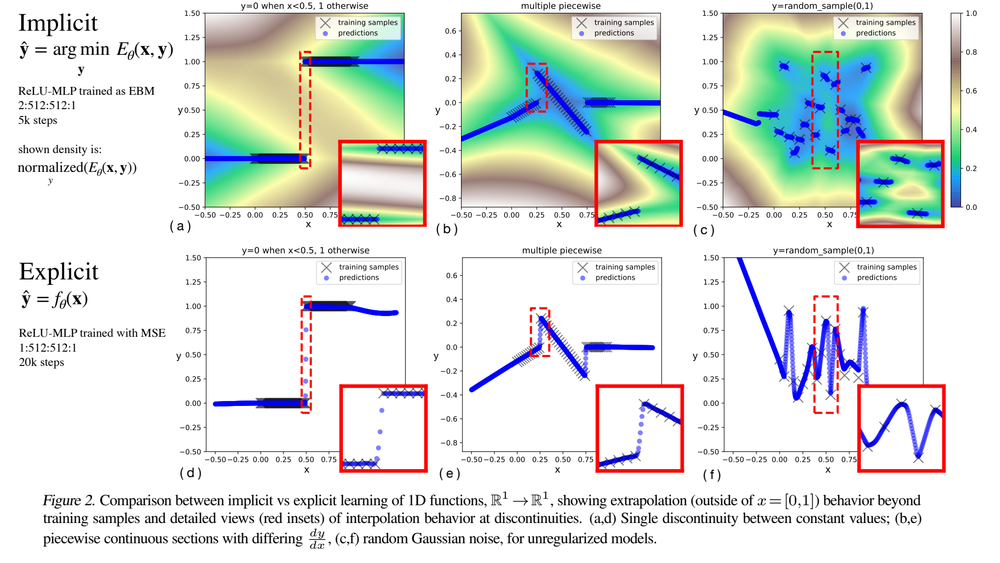
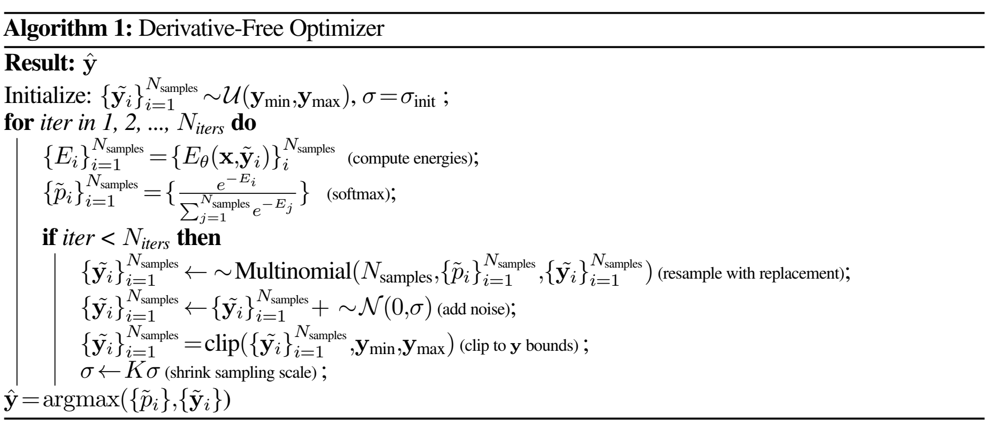
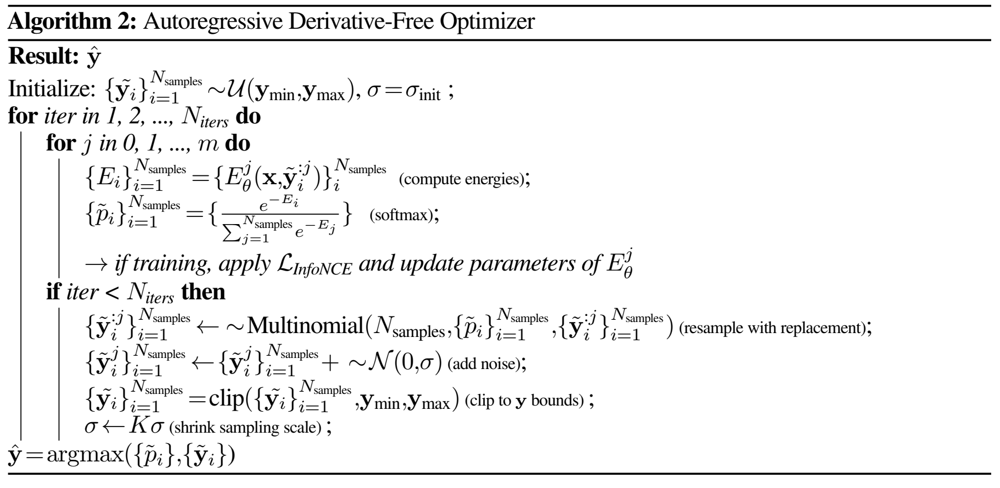

# 
 Energy-Based Model Training and Implicit Inference 

## Objective

我们要做两件事，给定(x,y)数据组，比如在强化学习专家策略中可以使(state,action) pair.

第一：训练一个能量模型$E_{\theta}(x,y)$，这个模型能够对数据组(x,y)进行打分，分数越低，说明这个数据组越符合我们的目标。我们希望降低样本内的能量，同时不忘提高样本外的能量。

第二：我们希望能够通过这个能量模型，进行隐式推理，即给定一个x，我们希望找到一个y（集合Y），使得$E_{\theta}(x,y)$最小。

## 隐式模型（比如能量模型）好处

隐式模型的优势：在处理具有不连续性的复杂数据时，隐式模型能够精确地表示不连续点，并且在不连续点处保持尖锐的预测，不会因为插值而引入错误的中间值。

显式模型的局限：由于拟合的是连续函数，显式模型在不连续点处会进行插值，导致无法准确表示数据的真实变化，尤其当不连续性频繁出现时。

模型选择的考虑：
- 数据特性：如果数据包含大量不连续性，且这些不连续性对模型的准确性至关重要，选择隐式模型可能更为合适。
- 正则化的重要性：在无关联的数据和无正则化的情况下，隐式模型依然能够保持一定的预测特性，而显式模型可能需要正则化来避免过拟合。
- 应用场景：隐式模型适用于需要精确捕捉数据不连续性的领域，如计算机视觉中的边缘检测、语音处理中的语音活动检测等。

附加说明：

- 隐式模型：通常通过定义一个能量函数或判别函数，间接地描述输入和输出之间的关系。这允许模型在输入空间中呈现复杂的结构，包括不连续性。
- 显式模型：直接拟合输入到输出的映射，通常假设这个映射是连续且光滑的，因此在处理不连续数据时会受到限制。

隐式模型的优势：

- 处理不连续性： 能够精确地处理不连续和多值函数，不会因假设连续性而受限。
- 外推能力强： 在训练数据之外，隐式模型能够可靠地进行外推，提供准确的预测。
- 适应多值函数： 在多值函数的情况下，隐式模型能够准确地捕捉数据的多样性。
- 适应高维输入： 在将高维度的图像输入映射到连续输出时，表现出色的泛化能力。

显式模型的局限性：

- 假设连续性： 基于目标函数连续的假设，当面对不连续或多值函数时，表现不佳。
- 外推困难： 在训练数据范围之外，难以准确地外推，泛化能力受限。
- 无法处理多值函数： 在多值函数的情况下，显式模型可能无法准确地捕捉数据的多样性，比如MSE loss更倾向取平均。
- 高维任务挑战： 在高维视觉任务中，难以处理数据的复杂性和不确定性。

## 论文中运用场景

隐式能量基模型（EBM）在各种机器人任务领域中，相对于显式模型展现了显著的优势。以下是根据文本中提到的实验，总结这些优势：

---

### **1. 更好地处理不连续性和多模态性**

- **精确逼近尖锐的不连续点：**
  - **隐式模型：** EBM 能够在不引入中间伪影的情况下，精确地逼近数据中的不连续点。在需要时，模型可以精确地切换行为，这在存在突变或决策边界的任务中至关重要。
  - **显式模型：** 由于拟合连续函数，倾向于在不连续点进行插值，导致在需要突然变化的任务中性能不佳。

- **学习多值函数：**
  - **隐式模型：** 通过在 argmin 操作中考虑一组最小化器，可以表示给定输入的多个最优输出。这使得 EBM 能够捕获所有可能的最优动作，在多模态任务中尤为重要。
  - **显式模型：** 通常会平均多个模式，无法表示所有可能的最优动作。

**任务证据：**

- **N 维粒子积分器：** 在处理具有不连续性的 oracle 策略时，隐式策略在更高维度（最高 16 维）上取得成功，而显式策略仅在 8 维内达到相同的成功率。
- **真实机器人操作（插入蓝色块任务）：** 在需要精确且不连续行为的任务中，隐式策略达到了显著更高的成功率。

---

### **2. 更好的外推和泛化能力**

- **在训练数据凸包外的外推：**
  - **隐式模型：** 在靠近训练数据域边缘的地方执行分段线性外推，能够更好地泛化到未见过的输入。
  - **显式模型：** 由于依赖连续性假设，在凸包之外的外推往往失败。

- **处理高维输入的视觉泛化：**
  - **隐式模型：** 能够将高维图像输入转换为准确的连续输出，即使在众所周知的对卷积网络具有挑战性的任务中也表现出色。
  - **显式模型：** 难以处理高维输入，常常无法泛化到训练数据之外。

**任务证据：**

- **视觉坐标回归任务：** 隐式模型在数据较少的情况下表现出良好的外推能力，测试集误差降低了 1-2 个数量级。
- **平面清扫任务：** 基于图像的隐式策略比显式策略高出 7%，在未知的粒子配置上表现出更好的泛化能力。

---

### **3. 在数据较少的情况下表现更好**

- **在较少的训练样本下的高效性：**
  - **隐式模型：** 在有限的示范下也能达到高成功率，在数据稀缺的环境中表现出稳健性。
  - **显式模型：** 需要更多数据才能达到可比的性能水平。

**任务证据：**

- **N 维粒子积分器：** 隐式策略在相同数量的示范下保持了 95% 的成功率，而显式策略无法做到。
- **真实机器人操作：** 隐式策略在仅有少量远程操作示范的情况下，表现优于显式策略。

---

### **4. 对数据质量更高的敏感性**

- **优先高质量数据：**
  - **隐式模型：** 当在按回报排序的前 50% 示范上训练时，性能显著提升，表明对数据质量的重视更高。
  - **显式模型：** 使用优先采样时，性能提升不明显。

**任务证据：**

- **D4RL 基准测试：** 隐式策略在使用高质量数据子集训练时，取得了与最新方法相当的结果。

---

### **5. 处理复杂和高维动作空间的能力**

- **在高维动作空间中的表现：**
  - **隐式模型：** 有效地管理复杂的动作空间（高达 30 维），表现优于显式模型。
  - **显式模型：** 难以处理复杂性，导致性能下降。

- **多智能体场景中的协调：**
  - **隐式模型：** 更善于协调多个智能体或执行器，在需要精确时序和控制的任务中至关重要。
  - **显式模型：** 在管理协调复杂性方面效果较差。

**任务证据：**

- **模拟双手清扫任务：** 隐式模型比显式模型高出 14%，成功地处理了两个机器人手臂之间的精确协调。
- **模拟推送和平面清扫任务：** 展现了对多物体交互和组合复杂性的优越处理。

---

### **6. 更好地适应随机动力学**

- **处理不确定性和变异性：**
  - **隐式模型：** 能够适应具有随机动力学的环境，例如带有不可预测滑动的块推送任务。
  - **显式模型：** 在不确定条件下难以动态调整策略。

**任务证据：**

- **模拟推送任务：** 隐式模型在块从末端执行器滑落的情况下仍能保持性能，而显式模型表现挣扎。

---

### **7. 与不同架构组件的协同效应**

- **与各种编码器的兼容性：**
  - **隐式模型：** 与空间 soft(arg)max 等编码器结合时表现出性能提升，增强了处理视觉输入的能力。
  - **显式模型：** 从这些架构组件中受益较少。

**任务证据：**

- **平面清扫任务：** 使用空间 soft(arg)max 的基于图像的 EBM 表现优于使用池化的版本，显示了协同效应。

---

### **8. 避免过拟合，泛化能力更强**

- **超越训练数据的泛化：**
  - **隐式模型：** 在不过拟合训练数据的情况下，对未见过的情景进行良好的泛化，不像最近邻方法。
  - **显式模型：** 更容易过拟合，导致泛化能力较差。

**任务证据：**

- **最近邻基线比较：** 在 N 维粒子积分器等任务中，隐式策略优于无法泛化的最近邻方法。

---

### **任务特定亮点**

- **D4RL 基准测试：**
  - 隐式策略显著超越了基准上的行为克隆（BC）基线，与最新的强化学习方法匹敌。

- **真实机器人操作：**
  - 在排序和精确插入等任务中，隐式策略的成功率比显式策略高出一个数量级。
  - 在仅使用原始图像输入和长任务时限的真实环境中表现出稳健性。

- **模拟任务（推送、清扫）：**
  - 隐式模型在处理复杂动力学、协调和多物体交互的任务中表现出色。

---

**结论**

隐式的 EBM 方法在学习控制策略方面，相对于显式方法具有显著的优势。这些优势包括：

- **更好地处理不连续性和多模态性。**
- **更好的外推和泛化能力，特别是在高维空间中。**
- **在有限和高质量数据情况下的改进性能。**
- **有效处理复杂、高维动作空间和随机动力学。**
- **与处理高维输入的架构组件的增强协同效应。**

这些优势使得隐式 EBM 成为机器人和其他需要稳健性、适应性和泛化能力的领域中策略学习的强大选择。

---

## $L_{\text{InfoNCE}}$ Loss Function

LInfoNCE 损失函数之所以受到信息噪声对比估计（InfoNCE）的启发，是因为它们都旨在通过对比学习的方法估计高维随机变量之间的互信息。以下是对这种启发的详细分析，以及对该损失函数性质的探讨。

**1. InfoNCE 的启发来源：**

- **互信息的估计困难：** 在高维空间中，直接计算两个随机变量 \( X \) 和 \( Y \) 之间的互信息 \( I(X; Y) \) 非常困难。InfoNCE 提供了一种通过对比学习间接估计互信息的方法。

- **对比学习的思想：** InfoNCE 利用正样本（真实关联的 \( (x, y) \) 对）和负样本（随机配对的 \( (x, y') \) 对）来训练模型。通过最大化模型对正样本的预测概率，同时最小化对负样本的预测概率，模型学会了捕捉 \( X \) 和 \( Y \) 之间的关联。

- **损失函数形式：** InfoNCE 的损失函数可以表示为：

  \[
  \mathcal{L}_{\text{InfoNCE}} = -\mathbb{E} \left[ \log \frac{f(x, y)}{f(x, y) + \sum_{y'} f(x, y')} \right]
  \]

  其中 \( f(x, y) \) 是一个衡量 \( x \) 和 \( y \) 关联程度的打分函数。

**2. 在能量基模型中的应用：**

- **能量函数的引入：** 在能量基模型（EBM）中，使用能量函数 \( E(x, y) \) 来衡量样本对 \( (x, y) \) 的不兼容程度。较低的能量表示样本对更可能来自真实数据分布。

- **从 InfoNCE 到 LInfoNCE：** 受到 InfoNCE 的启发，LInfoNCE 将能量函数融入到对比损失中，通过对比正负样本对的能量值，训练模型以区分正负样本。

- **LInfoNCE 损失函数形式：**

  \[
  \mathcal{L}_{\text{LInfoNCE}} = -\mathbb{E}_{x, y} \left[ \log \frac{\exp(-E(x, y))}{\exp(-E(x, y)) + \sum_{y' \in \mathcal{Y}_{\text{neg}}} \exp(-E(x, y'))} \right]
  \]

  这里，\( \mathcal{Y}_{\text{neg}} \) 是与 \( x \) 不相关的负样本集。

**3. 损失函数的性质分析：**

- **（1）最大化互信息：**

  - **解释：** LInfoNCE 损失函数通过最大化模型对正样本的预测概率，最小化对负样本的预测概率，从而间接地最大化 \( X \) 和 \( Y \) 之间的互信息。

  - **数学直观：** 该损失函数的最小化相当于最大化以下目标：

    \[
    I(X; Y) \geq \log(N) - \mathcal{L}_{\text{LInfoNCE}}
    \]

    其中 \( N \) 是负样本的数量。

- **（2）对比学习的有效性：**

  - **正负样本的区分：** 通过对比正负样本，模型学会了更有效地捕捉数据中的关联模式。

  - **减少模式崩塌：** 对比损失可以防止模型陷入退化解，例如将所有输入映射到同一表示。

- **（3）计算上的优势：**

  - **避免归一化常数：** 传统的能量基模型需要计算难以处理的归一化常数。LInfoNCE 通过对比损失避免了这个问题，因为计算中只涉及相对的能量差异。

  - **可扩展性：** 该损失函数适用于大规模数据集和高维数据。

- **（4）鲁棒性和泛化能力：**

  - **对噪声的鲁棒性：** 通过使用大量的负样本，模型对噪声和异常值具有更强的鲁棒性。

  - **提高泛化性能：** 对比学习的方法有助于模型学习到更通用的特征表示，提升在未知数据上的性能。

- **（5）温度参数的影响：**

  - **引入温度参数 \( \tau \)：** 为了控制对比的敏感度，通常在损失函数中加入温度参数：

    \[
    \mathcal{L}_{\text{LInfoNCE}} = -\mathbb{E}_{x, y} \left[ \log \frac{\exp(-E(x, y)/\tau)}{\exp(-E(x, y)/\tau) + \sum_{y' \in \mathcal{Y}_{\text{neg}}} \exp(-E(x, y')/\tau)} \right]
    \]

  - **影响：** 调整 \( \tau \) 可以平衡正负样本之间的区分程度，影响模型的训练动态。

**4. 实践中的注意事项：**

- **负样本的选择：**

  - **数量和多样性：** 负样本数量越多、多样性越高，模型的对比学习效果越好。

  - **采样策略：** 可以采用困难负样本挖掘等策略，选择对模型区分能力提升最大的负样本。

- **批量大小的影响：**

  - **批量大小与负样本：** 在小批量训练中，批内的其他样本通常被视为负样本，批量大小会直接影响负样本的数量。

  - **内存和计算资源：** 较大的批量需要更多的计算资源，需要在性能和资源之间权衡。

- **模型架构的选择：**

  - **表示能力：** 为了有效地捕捉数据的复杂模式，需要选择具有足够表示能力的模型架构，如深度神经网络。

  - **能量函数的设计：** 能量函数 \( E(x, y) \) 的形式需要精心设计，以确保其能够有效地衡量样本对的不兼容程度。

**5. 总结：**

LInfoNCE 损失函数受到了 InfoNCE 的启发，通过在能量基模型中引入对比学习的思想，提供了一种高效、稳定地训练模型的方法。其主要性质包括：

- **最大化互信息：** 间接地最大化了输入变量之间的互信息，提升了模型对数据关联的捕捉能力。

- **对比学习优势：** 利用大量负样本，提高了模型的区分能力和泛化性能。

- **计算效率：** 避免了归一化常数的计算，适合大规模、高维数据的训练。

- **鲁棒性和灵活性：** 对噪声具有鲁棒性，且易于与不同的模型架构结合。

我们可以看到 LInfoNCE 损失函数在能量基模型中的应用有效地解决了高维数据建模中的一些关键问题，充分利用了对比学习的优势，实现了对复杂数据分布的准确建模。

---

## Method A：Method with Derivative-Free Optimizatio

这个方法描述了一种用来训练能量基模型（Energy-Based Model, EBM）并进行隐式推断的无导数优化方法。该方法旨在通过采样和优化的方式找到模型输出中最优的结果。这种方法类似于交叉熵法（Cross Entropy Method, CEM），但它有一些特定的改动，使得该算法更适合在训练条件下的应用。以下是这个方法的详细介绍：

### 1. **训练阶段**
无导数优化方法的训练相对简单。对于每个样本，在训练时从均匀分布 \( U(y_{\text{min}}, y_{\text{max}}) \) 中采样反例 \( \tilde{y} \)，然后使用 **LInfoNCE** 损失函数对模型进行训练。关键的训练参数如下：
- 使用 Adam 优化器，β1=0.9, β2=0.999。
- 批量大小为 512，每个样本配 256 个反例。
- 所有训练数据（输入和输出）都归一化为每维零均值、单位方差。
- 初始学习率为 1e-3，并且每 100 步进行 0.99 的指数衰减。
- Dropout 正则化效果不好，可能是由于训练过程中的随机性（反例采样）已经起到了类似正则化的作用。

### **2. 推断阶段：无导数优化算法**

在推断时，我们需要在给定 \( x \) 的情况下，找到最优的 \( y \) 使得能量 \( E_\theta(x, y) \) 最小。然而，由于能量函数可能是非凸的，且高维度下求解困难，我们采用了一种基于采样的无导数优化方法。

**算法步骤**：

1. **初始化样本集**：从均匀分布 \( U(y_{\text{min}}, y_{\text{max}}) \) 中随机采样 \( N_{\text{samples}} \) 个候选解 \( \{ \tilde{y}_i \} \)。

2. **迭代优化**：重复以下步骤 \( N_{\text{iters}} \) 次：
   - **计算能量和概率**：对每个候选解计算能量 \( E_i = E_\theta(x, \tilde{y}_i) \)，并通过 softmax 转换为概率 \( \tilde{p}_i = \frac{e^{-E_i}}{\sum_j e^{-E_j}} \)。
   - **重采样**：根据概率 \( \tilde{p}_i \) 有放回地重采样 \( N_{\text{samples}} \) 个候选解。
   - **添加噪声**：为每个候选解添加独立的高斯噪声 \( \tilde{y}_i \leftarrow \tilde{y}_i + \epsilon \)，其中 \( \epsilon \sim N(0, \sigma) \)。
   - **裁剪边界**：将候选解裁剪到允许的范围内 \( y_{\text{min}} \leq \tilde{y}_i \leq y_{\text{max}} \)。
   - **缩小噪声方差**：更新噪声方差 \( \sigma \leftarrow K \sigma \)，通常 \( K \in (0,1) \)。

3. **选择最优解**：在最后一次迭代后，选择具有最高概率 \( \tilde{p}_i \) 的候选解作为最终的预测 \( \hat{y} \)。

**为什么有效**：

- **概率引导的采样**：通过将能量转化为概率，算法能够将更多的采样资源分配到低能量（高概率）的区域，提高了找到最优解的可能性。

- **探索与开发的平衡**：添加噪声允许算法探索新的解空间区域，而逐步缩小噪声方差则促进了收敛。

- **无导数优化的优势**：避免了对梯度信息的依赖，适用于梯度难以计算或不可靠的情况。

- **多样性保证**：在初始阶段，由于噪声方差较大，采样具有较高的多样性，有助于避免局部最优。

### 3. **与交叉熵法的对比**
这种方法与传统的交叉熵法有几个不同之处：
1. **不使用固定的精英数量**：传统交叉熵法会根据能量值选择一部分“精英”样本，而这种方法不做固定数量的选择。
2. **使用重采样**：从样本中进行有放回的重采样，意味着每个样本有机会被多次选择。
3. **缩小采样方差**：通过预定的缩小因子 \( K \) 缩小采样方差，而不是基于经验方差计算。

通常情况下，使用 \( \sigma_{\text{init}} = 0.33 \)、\( K = 0.5 \)、\( N_{\text{iters}} = 3 \)、\( N_{\text{samples}} = 16,384 \) 来执行。

这套方法之所以有效，是因为它巧妙地利用了能量基模型（Energy-Based Model，EBM）的特点，通过一种无导数的优化策略，实现了对目标函数的有效近似和优化。下面，我将详细解释这套方法的工作原理，以及它为什么能够奏效。

### **4. 训练阶段：对比学习与 InfoNCE 损失**

在训练过程中，我们采用了对比学习的策略，使用 **InfoNCE 损失函数**。具体步骤如下：

1. **数据预处理**：将所有的输入 \( x \) 和输出 \( y \) 进行归一化处理，使每个维度的均值为 0，方差为 1。

2. **生成反例（负样本）**：对于每个真实样本对 \( (x, y) \)，从均匀分布 \( U(y_{\text{min}}, y_{\text{max}}) \) 中采样多个反例 \( \tilde{y} \)。

3. **计算能量差异**：模型计算真实样本和反例的能量 \( E_\theta(x, y) \) 和 \( E_\theta(x, \tilde{y}) \)。

4. **应用 InfoNCE 损失**：通过最大化真实样本与反例之间的能量差异，鼓励模型为真实样本分配更低的能量。

**为什么有效**：

- **对比学习的优势**：通过对比真实样本和反例，模型更容易捕捉到输入和输出之间的相关性。

- **避免明确的概率建模**：无需显式地建模条件概率分布，减少了计算复杂度。

- **随机性的正则化效果**：在每次训练中随机生成反例，增加了数据的多样性，有助于模型的泛化能力。

### **5. 与交叉熵方法（CEM）的关系与区别**

该算法与经典的交叉熵方法类似，但有以下区别：

- **不使用固定数量的精英样本**：传统的 CEM 会选择固定比例的精英样本进行更新，而这里通过概率重采样的方式，更加灵活地分配采样权重。

- **重采样机制**：采用有放回的重采样，使得高概率的样本可能被多次选中，进一步强调了对低能量区域的探索。

- **噪声方差的缩放策略**：使用预设的缩放因子 \( K \) 来调整噪声方差，而非根据经验方差计算，简化了算法的实现。

这些改进使得算法更加简单、稳定，且易于实现。

### **6. 高维度问题的考虑**

虽然这套方法在低维度情况下效果显著，但在高维度（例如超过 5 维）时，纯粹的随机采样可能难以有效覆盖整个解空间。为此，文章还探索了自回归方法和基于 Langevin 动力学的梯度采样方法，以提高在高维空间中的效率。

### **7. 方法的有效性总结**

综上，这套方法之所以有效，主要原因在于：

- **有效的训练策略**：通过对比学习和 InfoNCE 损失，模型能够学习到输入和输出之间的深层次关联。

- **无导数优化的创新应用**：在推断阶段，利用概率引导的采样和重采样策略，逐步逼近最优解，而无需依赖梯度信息。

- **算法的简单性和可实现性**：算法易于实现，计算代价相对较低，适合于实际应用。

- **灵活性**：可以根据具体问题调整参数，如噪声初始值 \( \sigma_{\text{init}} \)、缩放因子 \( K \)、迭代次数 \( N_{\text{iters}} \) 等，以适应不同的需求。

---

## Method B：Method with Autoregressive Derivative-Free Optimization

### **背景与动机**

在之前的无导数优化方法中，直接对整个输出向量 \( y \in \mathbb{R}^m \) 进行优化。当 \( m \) 较小时（例如 5 维以下），这种方法效果很好。然而，随着 \( y \) 的维度增加，直接在高维空间中进行采样和优化变得计算上不可行。因此，需要一种能够扩展到高维输出空间的方法。

为了解决这个问题，作者引入了 **自回归** 的策略。通过将高维优化问题分解为一系列一维的子问题，我们可以更有效地在高维空间中进行优化。

### **方法概述**

在自回归版本中，我们为输出向量的每个维度 \( j = 1, 2, \dots, m \) 训练一个独立的能量模型 \( E_{\theta_j}(x, y_{:j}) \)，其中 \( y_{:j} = [y_1, y_2, \dots, y_j] \) 表示输出向量的前 \( j \) 个维度。

这种方法的特点是：

- **逐维建模**：每个模型只需要关注输出向量的一部分，降低了单个模型的复杂度。这个逐维建模意思是前缀建模。
- **依次采样**：在优化过程中，我们可以依次对每个维度进行采样和优化，减少了高维采样的难度。
- **可扩展性**：能够更好地扩展到高维的输出空间，适用于维度较高的情况。

### **算法详细步骤**

下面，我们逐步解释 **Algorithm 2：自回归无导数优化器** 的每个部分。

#### **初始化**

- **采样初始候选解**：从均匀分布 \( U(y_{\text{min}}, y_{\text{max}}) \) 中采样 \( N_{\text{samples}} \) 个初始样本 \( \{ \tilde{y}_i \} \)。
- **设置初始噪声方差**：初始化噪声尺度 \( \sigma = \sigma_{\text{init}} \)。

#### **主循环**

对迭代次数 \( \text{iter} = 1, 2, ..., N_{\text{iters}} \)：

1. **对每个输出维度 \( j = 1, 2, ..., m \) 依次处理**：

    a. **计算能量值**：

    - 对于每个样本 \( \tilde{y}_i \)，计算能量 \( E_i = E_{\theta_j}(x, \tilde{y}_{i,:j}) \)。
    - 这里 \( \tilde{y}_{i,:j} \) 表示样本 \( \tilde{y}_i \) 的前 \( j \) 个维度。

    b. **计算概率分布**：

    - 通过 softmax，将能量值转换为概率：
      \[
      \tilde{p}_i = \frac{e^{-E_i}}{\sum_{k=1}^{N_{\text{samples}}} e^{-E_k}}
      \]

    c. **训练模型（如果处于训练阶段）**：

    - 如果正在训练，使用 **InfoNCE 损失** \( L_{\text{InfoNCE}} \) 来更新模型参数 \( \theta_j \)。

2. **如果不是最后一次迭代**：

    a. **根据概率进行重采样**：

    - 根据概率 \( \tilde{p}_i \) 有放回地重采样 \( N_{\text{samples}} \) 个样本 \( \tilde{y}_{i,:j} \)。

    b. **添加噪声**：

    - 对于重采样的样本的第 \( j \) 个维度，添加独立的高斯噪声：
      \[
      \tilde{y}_{ij} \leftarrow \tilde{y}_{ij} + \epsilon, \quad \epsilon \sim N(0, \sigma)
      \]

    c. **裁剪边界**：

    - 将样本裁剪到允许的范围内：
      \[
      \tilde{y}_i = \text{clip}(\tilde{y}_i, y_{\text{min}}, y_{\text{max}})
      \]

3. **更新噪声方差**：

    - 缩小噪声尺度：
      \[
      \sigma \leftarrow K \sigma
      \]
      其中 \( K \in (0,1) \) 是预设的缩放因子。

#### **最终输出**

- 在所有迭代完成后，选择具有最高概率 \( \tilde{p}_i \) 的样本 \( \tilde{y}_i \) 作为最终的预测 \( \hat{y} \)。

### **与非自回归方法的区别**

- **高维度处理**：非自回归方法直接在整个输出空间中进行采样，维度高时计算成本高。自回归方法则将高维问题拆解为一系列一维问题。
- **模型数量**：非自回归方法只需要一个能量模型 \( E_\theta(x, y) \)，而自回归方法需要为每个前缀维度 \( j \) 训练一个模型 \( E_{\theta_j}(x, y_{:j}) \)。
- **采样复杂度**：自回归方法在每次迭代中只对一个维度添加噪声和优化，降低了采样的复杂度。

### **应用示例**

假设我们有一个 3 维的输出向量 \( y = [y_1, y_2, y_3] \)，以下是算法的执行流程：

1. **初始化**：

    - 采样初始候选解 \( \{ \tilde{y}_i \} \)，每个 \( \tilde{y}_i \) 是一个 3 维向量。

2. **主循环**：

    - **第一维 (\( j=1 \))**：

        - 计算能量 \( E_i = E_{\theta_1}(x, \tilde{y}_{i,1}) \)。
        - 计算概率 \( \tilde{p}_i \)。
        - 重采样 \( \tilde{y}_{i,1} \)，并添加噪声。

    - **第二维 (\( j=2 \))**：

        - 使用更新后的 \( \tilde{y}_{i,1} \)，计算能量 \( E_i = E_{\theta_2}(x, [\tilde{y}_{i,1}, \tilde{y}_{i,2}]) \)。
        - 重复上述步骤。

    - **第三维 (\( j=3 \))**：

        - 使用更新后的 \( \tilde{y}_{i,1}, \tilde{y}_{i,2} \)，计算能量 \( E_i = E_{\theta_3}(x, [\tilde{y}_{i,1}, \tilde{y}_{i,2}, \tilde{y}_{i,3}]) \)。
        - 重复上述步骤。

3. **更新噪声方差**：在每个迭代结束时，缩小噪声方差 \( \sigma \)。

4. **最终选择**：在所有迭代完成后，选择概率最高的 \( \tilde{y}_i \) 作为最终输出。

### **训练阶段的注意事项**

- **同时训练和推断**：在这个方法中，训练和推断是交替进行的。在每个维度 \( j \) 的处理中，如果是在训练阶段，我们会使用计算得到的能量和概率，应用 **InfoNCE 损失**来更新模型参数 \( \theta_j \)。

- **数据依赖性**：由于每个模型 \( E_{\theta_j} \) 都依赖于之前的维度，因此在训练数据中需要保证样本的顺序性和一致性。

### 自回归模型的优势和局限性

自回归模型的采样步骤是在 **从 1 到当前维度 \( j \) 的前缀维度**上进行的。换句话说，在 **自回归无导数优化方法** 中，当前维度 \( j \) 的优化是基于所有之前维度的输出 \( y_{1:j-1} \) 进行的，优化的是从 \( y_1 \) 到 \( y_j \) 的前缀序列。

具体来说，每个维度 \( j \) 的采样依赖于输入 \( x \) 和之前维度 \( y_{1:j-1} \)，即对每个 \( j \) 维度的优化问题是 **条件化** 在前 \( j-1 \) 维的已知信息上，这样的逐维优化实际上是一个逐步扩展的过程：

- **前缀维度的依赖性**：对于每个维度 \( j \)，优化时不仅依赖于输入 \( x \)，还要考虑到前面维度的输出 \( y_{1:j-1} \)，也就是模型会根据前缀的部分进行条件化优化。因此，采样是在一个条件概率的上下文中进行，而不是在整个空间的独立采样。

#### **逐维采样与条件化解释**

对于 **自回归方法** 中的优化过程，当前维度的采样和优化如下：

1. **对于每个维度 \( j \)**：
   - 你需要优化的维度是当前的 \( y_j \)，但这个优化是基于之前的所有维度 \( y_{1:j-1} \) 以及输入 \( x \)。
   - **条件化的优化问题**：这个优化可以理解为在条件概率分布 \( P(y_j | x, y_{1:j-1}) \) 下进行的采样和优化。

2. **逐维优化带来的好处**：
   - 在前缀条件下逐步优化每个维度（逐维进行采样），减少了每次优化的维度复杂性（只需在一维空间上优化），提高了采样效率。
   - 每次只对当前维度进行优化，而不是同时在整个高维空间内进行采样，从而避免了直接在高维空间中采样带来的困难。

#### **补充说明：逐维条件化 vs. 高维独立采样**

1. **逐维条件化采样**：
   - **当前维度 \( y_j \) 的采样依赖于 \( x \) 和 \( y_{1:j-1} \)**。因此每次只在当前维度的空间上进行优化，减少了问题的复杂性。
   - 逐维进行，减少了在每个维度上采样时的空间搜索，提升了采样的效率。

2. **高维独立采样**：
   - 如果我们不使用自回归方法，直接对整个输出 \( y \in \mathbb{R}^m \) 进行采样，那么采样是在 \( m \) 维空间上同时进行的。这种方式会导致采样复杂度随维度的增加而迅速上升。
   - 在高维空间中，直接采样的效率很低，尤其是当我们要在一个复杂的能量函数上寻找最优解时。

#### **结论**

在自回归无导数优化方法中，每个维度 \( y_j \) 的采样确实是在**前缀维度的条件下进行**的，而不是在整个空间上进行独立采样。这种逐维的优化减少了采样空间的复杂性，因为每次优化都只在当前维度上进行，而不是在整个高维空间内进行。

因此，逐维优化带来了以下优势：

- **采样效率的提升**：因为每次只需在当前维度的空间中进行采样，而不必在整个 \( m \) 维空间中采样，避免了高维空间带来的复杂性。
- **条件依赖的建模**：通过前缀维度条件化采样，模型可以更好地捕捉维度之间的依赖关系，从而提高预测的准确性。

---

## Method C: Gradient-based, Langevin MCMC

下面展开**基于梯度的 Langevin MCMC 方法** 在训练和推理（推断）阶段的每一个实际操作步骤。这个方法主要涉及到使用 **随机梯度朗之万动力学（Stochastic Gradient Langevin Dynamics，SGLD）** 来训练能量基模型（Energy-Based Model，EBM）并进行推断。

### **准备工作**

1. **数据预处理**：

   - **输入数据 \( x \)**：按原始数据格式使用，或根据需要进行标准化。
   - **输出数据 \( y \)**：将所有 \( y \)（如动作 \( a \)）在每个维度上归一化到 \([-1, 1]\) 的范围。

2. **模型初始化**：

   - 定义能量函数 \( E_\theta(x, y) \) 的参数 \( \theta \)。
   - 初始化模型参数 \( \theta \)，通常使用随机初始化方法（如 Xavier 初始化）。

3. **超参数设置**：

   - **学习率（步长） \( \lambda \)**：初始值，建议根据多项式衰减策略调整。
   - **噪声方差 \( \sigma \)**：用于 SGLD 的噪声项，通常设置为小的正值。
   - **MCMC 链长度 \( N_{\text{MCMC}} \)**：每个样本运行的 MCMC 步数。
   - **梯度惩罚阈值 \( M \)**：用于梯度惩罚，通常设置为 \( M = 1 \)。
   - **训练批大小 \( N \)**：每次训练的样本数量。

4. **正则化设置**：

   - **谱归一化（Spectral Normalization）**：应用于模型的权重，限制最大奇异值。
   - **梯度惩罚（Gradient Penalty）**：用于稳定训练。

### **训练循环**

对每个训练批次，执行以下步骤：

#### **步骤 1：获取训练数据**

- 从训练数据中随机选取 \( N \) 个样本 \( \{ (x_i, y_i) \}_{i=1}^N \)。

#### **步骤 2：生成反例样本**

- 对于每个样本 \( (x_i, y_i) \)：

  1. **初始反例采样**：

     - 从均匀分布 \( U(y_{\text{min}}, y_{\text{max}}) \) 中采样 \( N_{\text{neg}} \) 个初始反例 \( \{ \tilde{y}_{ij}^{(0)} \}_{j=1}^{N_{\text{neg}}} \)。

#### **步骤 3：运行 SGLD MCMC 链**

- 对于每个反例 \( \tilde{y}_{ij}^{(0)} \)，运行 \( N_{\text{MCMC}} \) 步的 MCMC 链：

  - **初始化**：

    - 设置初始状态 \( \tilde{y}_{ij}^{(0)} \)。

  - **迭代更新**：

    - 对于 \( k = 1 \) 到 \( N_{\text{MCMC}} \)：

      1. **计算梯度**：

         - 计算能量函数关于 \( y \) 的梯度：
           \[
           g = \nabla_y E_\theta(x_i, \tilde{y}_{ij}^{(k-1)})
           \]

      2. **更新反例样本**：

         - 使用 SGLD 更新公式：
           \[
           \tilde{y}_{ij}^{(k)} = \tilde{y}_{ij}^{(k-1)} - \frac{\lambda_k}{2} g + \omega_k
           \]
           其中：

           - **\( \lambda_k \)**：第 \( k \) 步的学习率（步长），根据多项式衰减策略调整：
             \[
             \lambda_k = \lambda_0 \left( \frac{k}{N_{\text{MCMC}}} \right)^{-\gamma}
             \]
             其中 \( \lambda_0 \) 是初始步长，\( \gamma \) 是衰减指数（如 \( \gamma = 0.55 \)）。
           - **\( \omega_k \)**：从零均值、方差为 \( 2 \lambda_k \) 的高斯分布中采样的噪声：
             \[
             \omega_k \sim \mathcal{N}(0, 2 \lambda_k)
             \]

      3. **梯度裁剪**：

         - 对更新的步长 \( \Delta y = -\frac{\lambda_k}{2} g + \omega_k \) 进行裁剪，限制其范数（如使用最大范数裁剪）：
           \[
           \Delta y = \text{clip}(\Delta y, -\delta_{\text{max}}, \delta_{\text{max}})
           \]
           其中 \( \delta_{\text{max}} \) 是预设的最大更新步长。

      4. **更新样本**：

         - 更新反例样本：
           \[
           \tilde{y}_{ij}^{(k)} = \tilde{y}_{ij}^{(k-1)} + \Delta y
           \]

      5. **样本裁剪**：

         - 将更新后的 \( \tilde{y}_{ij}^{(k)} \) 裁剪到允许的范围 \([y_{\text{min}}, y_{\text{max}}]\) 内。

#### **步骤 4：计算损失函数**

- **InfoNCE 损失**：

  - 对于每个样本 \( (x_i, y_i) \)：

    1. **计算能量**：

       - 正样本能量：
         \[
         E_{\text{pos}} = E_\theta(x_i, y_i)
         \]
       - 反例样本能量（使用 MCMC 链的最后一步）：
         \[
         E_{\text{neg}, j} = E_\theta(x_i, \tilde{y}_{ij}^{(N_{\text{MCMC}})})
         \]

    2. **计算 InfoNCE 损失**：
       \[
       L_{\text{InfoNCE}, i} = -\log \left( \frac{e^{-E_{\text{pos}}}}{e^{-E_{\text{pos}}} + \sum_{j=1}^{N_{\text{neg}}} e^{-E_{\text{neg}, j}}} \right)
       \]

- **梯度惩罚损失**：

  - 对于每个反例样本 \( \tilde{y}_{ij}^{(N_{\text{MCMC}})} \)：

    1. **计算梯度范数**：
       \[
       \left\| \nabla_y E_\theta(x_i, \tilde{y}_{ij}^{(N_{\text{MCMC}})}) \right\|_\infty
       \]
       （即梯度向量中元素的最大绝对值）

    2. **计算梯度惩罚项**：
       \[
       L_{\text{grad}, ij} = \left( \max \left( 0, \left\| \nabla_y E_\theta(x_i, \tilde{y}_{ij}^{(N_{\text{MCMC}})}) \right\|_\infty - M \right) \right)^2
       \]

- **总损失**：

  - 对所有样本求平均：
    \[
    L = \frac{1}{N} \sum_{i=1}^{N} \left( L_{\text{InfoNCE}, i} + \frac{1}{N_{\text{neg}}} \sum_{j=1}^{N_{\text{neg}}} L_{\text{grad}, ij} \right)
    \]

#### **步骤 5：反向传播与参数更新**

- 使用优化器（如 Adam）对模型参数 \( \theta \) 进行更新：

  1. **反向传播**：

     - 计算损失函数 \( L \) 对模型参数 \( \theta \) 的梯度。

  2. **参数更新**：

     - 根据优化器的更新规则，更新参数 \( \theta \)。

  3. **注意事项**：

     - **停止梯度传播**：在生成反例样本的 SGLD MCMC 链中，不通过链的步骤反向传播梯度，即对 \( \tilde{y}_{ij}^{(k)} \) 使用 `stop_gradient()`，防止梯度回传到样本生成过程。

#### **步骤 6：步长调整**

- 根据多项式衰减策略，更新学习率（步长） \( \lambda \)。

#### **步骤 7：重复训练**

- 重复上述步骤，直到遍历完所有训练数据或达到预定的训练轮数。

---

### **推断（推理）阶段**

在推断阶段，我们使用训练好的能量基模型 \( E_\theta(x, y) \) 来预测给定输入 \( x \) 下的最优输出 \( y \)。

#### **步骤 1：输入准备**

- **给定输入 \( x \)**：需要预测的输入数据。

#### **步骤 2：初始化样本**

- **初始采样**：

  - 从均匀分布 \( U(y_{\text{min}}, y_{\text{max}}) \) 中采样 \( N_{\text{samples}} \) 个初始样本 \( \{ \tilde{y}_i^{(0)} \}_{i=1}^{N_{\text{samples}}} \)。

#### **步骤 3：运行 SGLD MCMC 链**

- **设置参数**：

  - **MCMC 链长度**：建议比训练时多一倍，即 \( N_{\text{MCMC, infer}} = 2 \times N_{\text{MCMC, train}} \)。
  - **步长（学习率） \( \lambda \)**：可以与训练时相同的初始值，但可能需要调整以获得更好的结果。

- 对于每个初始样本 \( \tilde{y}_i^{(0)} \)，运行 \( N_{\text{MCMC, infer}} \) 步的 MCMC 链：

  - **初始化**：

    - 设置初始状态 \( \tilde{y}_i^{(0)} \)。

  - **迭代更新**：

    - 对于 \( k = 1 \) 到 \( N_{\text{MCMC, infer}} \)：

      1. **计算梯度**：

         - 计算能量函数关于 \( y \) 的梯度：
           \[
           g = \nabla_y E_\theta(x, \tilde{y}_i^{(k-1)})
           \]

      2. **更新样本**：

         - 使用 SGLD 更新公式：
           \[
           \tilde{y}_i^{(k)} = \tilde{y}_i^{(k-1)} - \frac{\lambda_k}{2} g + \omega_k
           \]
           其中：

           - **\( \lambda_k \)**：第 \( k \) 步的步长，可能需要调整。
           - **\( \omega_k \)**：从零均值、方差为 \( 2 \lambda_k \) 的高斯分布中采样的噪声。

      3. **梯度裁剪（可选）**：

         - 可以根据需要对 \( \Delta y \) 进行裁剪，确保更新步长不过大。

      4. **样本裁剪**：

         - 将更新后的 \( \tilde{y}_i^{(k)} \) 裁剪到允许的范围 \([y_{\text{min}}, y_{\text{max}}]\) 内。

#### **步骤 4：选择最优样本**

- **能量评估**：

  - 对于每个样本 \( \tilde{y}_i^{(N_{\text{MCMC, infer}})} \)，计算其能量：
    \[
    E_i = E_\theta(x, \tilde{y}_i^{(N_{\text{MCMC, infer}})})
    \]

- **选择最优输出**：

  - 从所有样本中选择能量最小的样本作为最终的预测输出 \( \hat{y} \)：
    \[
    \hat{y} = \tilde{y}_{i^*}^{(N_{\text{MCMC, infer}})}, \quad \text{其中 } i^* = \arg\min_i E_i
    \]

#### **步骤 5：反归一化（如果需要）**

- 如果在训练时对 \( y \) 进行了归一化（如缩放到 \([-1, 1]\)），需要将预测结果 \( \hat{y} \) 反归一化，恢复到原始尺度。

---

## **注意事项**

1. **步长调整**：

   - 在训练和推断时，步长 \( \lambda \) 的选择对结果有较大影响。可以根据经验或通过验证集调整。

2. **梯度裁剪**：

   - 在训练和推断过程中，对梯度更新进行裁剪有助于稳定性，防止更新步长过大导致的数值问题。

3. **噪声项**：

   - 噪声的方差通常与步长相关，确保噪声项与梯度项的影响平衡。

4. **MCMC 链长度**：

   - 增加 MCMC 链的长度可以提高采样质量，但也增加了计算成本。训练时的链长度应适当，推断时可以适当增加。

5. **模型正则化**：

   - 使用谱归一化和梯度惩罚有助于稳定模型训练，防止过拟合和梯度爆炸。

6. **停止梯度传播**：

   - 在训练中，确保生成反例样本的过程不参与梯度反传，即使用 `stop_gradient()`，只对模型参数 \( \theta \) 计算梯度。

7. **多次采样**：

   - 在推断时，可以多次运行 SGLD 链，取平均或选择能量最低的样本，以提高预测的可靠性。

---

## **总结**

- **训练阶段**：

  - 通过生成反例样本，运行 SGLD MCMC 链，计算 InfoNCE 损失和梯度惩罚损失，更新模型参数。

- **推断阶段**：

  - 使用训练好的模型，对给定输入，运行 SGLD MCMC 链，采样输出样本，选择能量最低的样本作为预测。

- **关键要点**：

  - **利用梯度信息**：SGLD 结合梯度和噪声，引导采样向能量较低的区域移动。
  - **稳定性**：通过梯度裁剪、梯度惩罚和正则化，确保训练过程的稳定性。
  - **参数调整**：步长、噪声方差、MCMC 链长度等超参数需要根据具体情况调整。

----

## Q&A

问题：

- 1. **为什么要对一个样本$y_i$,采取多个反例$y_{i}^j$**
- 2. **为什么要把随机取的反例用MCMC采样，这样结果不是造成反例越来越接近真实吗，就不能当做反面了**

---

### **问题 1：为什么要对一个样本 \( y_i \) 采取多个反例 \( \tilde{y}_{ij} \)**

对每个真实样本 \( y_i \) 生成多个反例 \( \tilde{y}_{ij} \) 的主要原因是为了增强模型的对比学习效果，提高训练质量。具体来说：

1. **丰富负样本多样性**：

   - **多样性**：多个反例可以覆盖更广的输出空间，提供多样化的负样本。这有助于模型更全面地学习如何区分真实样本与各种可能的错误预测。
   - **防止过拟合**：使用多种负样本可以防止模型过拟合于某些特定的负样本模式，提高模型的泛化能力。

2. **加强对比学习信号**：

   - **强化信号**：在对比学习（如 InfoNCE 损失）中，模型通过拉近正样本与输入的关系、推远负样本与输入的关系来学习。更多的负样本提供了更强的信号，促进模型更有效地调整能量函数 \( E_\theta(x, y) \)。
   - **梯度稳定性**：多个负样本可以平滑梯度，有助于训练过程的稳定性。

3. **提高训练效率**：

   - **并行计算**：在现代硬件（如 GPU）上，计算多个负样本的能量和梯度可以高效地并行处理，提高训练效率。
   - **降低噪声**：相对于使用单个负样本，多个负样本可以降低梯度估计的方差，使得参数更新更可靠。

**总结**：

通过对每个样本使用多个反例，模型可以更全面、更稳定地学习到输入与输出之间的关系，提升模型的性能和泛化能力。

---

### **问题 2：为什么要把随机取的反例用 MCMC 采样？这样不会导致反例越来越接近真实样本，无法再作为反例吗？**

**回答：**

将随机初始化的反例通过 MCMC（如 Langevin 动力学）进行采样的目的是为了生成更具挑战性的负样本，促进模型更深入地学习数据分布。以下是详细解释：

1. **反例的演化过程**：

   - **初始反例**：最初的反例 \( \tilde{y}_{ij}^{(0)} \) 是从均匀分布随机采样的，可能与真实样本 \( y_i \) 相差较大。
   - **MCMC 采样**：通过运行 MCMC 链，反例逐步演化，向能量较低（模型认为更可能）的区域移动。

2. **促进模型学习更细致的区别**：

   - **逼近真实分布**：随着反例接近模型的高概率区域，模型需要学会区分真实样本与自身生成的高质量样本。这迫使模型细化能量函数，捕捉更细微的特征。
   - **避免简单任务**：如果反例与真实样本差异过大，模型很容易将其区分出来，学习效果有限。难度更高的反例可以提高模型的判别能力。

3. **训练过程中的对抗性**：

   - **动态博弈**：模型在降低真实样本的能量的同时，提高反例的能量。反例通过 MCMC 采样不断接近模型的高概率区域，形成一种动态博弈，促进模型优化。
   - **平衡能量分布**：随着反例接近真实样本，模型需要调整能量分布，使得真实样本的能量更低，反例的能量更高，从而更准确地逼近数据分布。

4. **反例仍然有用**：

   - **提供有效的学习信号**：即使反例接近真实样本，只要它们与真实样本存在差异，模型就能从中学习到细微的区别。
   - **防止模式崩溃**：如果反例过于简单，模型可能只关注少数特征，导致模式崩溃（mode collapse）。更接近真实样本的反例可以防止这种情况。

**总结**：

使用 MCMC 采样使反例逐步接近模型的高概率区域，这并不会使反例失去作用，反而可以提供更具挑战性的负样本，促进模型更深入地学习数据分布，提高模型的判别能力和生成质量。

---

### **补充说明**

- **能量基模型的目标**：通过调整能量函数 \( E_\theta(x, y) \)，使得真实样本的能量较低，模型生成的样本（反例）的能量较高。

- **对比学习的本质**：关键在于区分真实样本与模型生成的样本。随着训练的进行，模型生成的样本质量会提高，但模型也会同步提升自身的判别能力。

- **理论支持**：这种训练策略与对抗训练（如 GAN）有相似之处，都是通过生成难度逐渐提高的负样本来提升模型性能。

---

## 关于以上三个方法的思考

### A: Derivative-Free

“**Derivative-Free**” 在前两个方法中指的是 **在推断阶段（inference phase）** 进行优化时，不需要显式计算能量函数 \( E_\theta(x, y) \) 的梯度来优化输出 \( y \)。这与训练阶段中通过 **LInfoNCE 损失反向传播** 更新模型参数是不同的概念。

---

#### **1. 推断阶段的“Derivative-Free”**

在推断阶段，目标是找到给定输入 \( x \) 时，使能量函数 \( E_\theta(x, y) \) 最小的输出 \( y \)，即通过最小化能量来进行预测。在前两个方法中（无导数优化和自回归无导数优化），我们不需要显式地计算能量函数关于 \( y \) 的梯度，取而代之的是通过随机采样和概率更新来优化 \( y \)。

- **无导数优化方法（Method 1：Derivative-Free Optimization）**：
  - 在推断过程中，使用采样（如从均匀分布中随机取样），然后通过重采样和加入噪声的方式来更新 \( y \)，而不是使用梯度下降来优化 \( y \)。

- **自回归无导数优化方法（Method 2：Autoregressive Derivative-Free Optimization）**：
  - 这里优化 \( y \) 是逐维进行的，也是通过采样、概率计算（softmax）、重采样和加入噪声来优化每个维度的 \( y \)，而不是计算每个维度的梯度。

**总结**：在推断阶段，所谓的 “Derivative-Free” 意味着 **优化输出 \( y \) 时不需要显式地计算梯度**。这种方法通过 **采样、重采样和噪声调整** 的方式，避免了计算能量函数 \( E_\theta(x, y) \) 关于 \( y \) 的梯度。

---

#### **2. 训练阶段的 LInfoNCE 反向传播**

与推断阶段不同，**在训练阶段**，我们需要通过 **LInfoNCE 损失** 来优化模型的参数 \( \theta \)，因此需要计算能量函数 \( E_\theta(x, y) \) 关于模型参数 \( \theta \) 的梯度，并通过反向传播更新模型。

- **LInfoNCE 损失** 是对比学习中的一种损失函数，通过最小化真实样本的能量、最大化反例的能量来训练模型。计算 LInfoNCE 损失需要反向传播，以更新模型参数 \( \theta \)。

因此，在 **训练阶段**，模型需要使用反向传播来更新参数 \( \theta \)，这时候需要 **计算能量函数关于参数 \( \theta \) 的梯度**，但这与“无导数优化”无关，因为它涉及的是 **模型参数的优化**。

---

#### **3. 为什么推断阶段可以“无导数”优化？**

推断阶段的目标是优化输出 \( y \)，而不是优化模型的参数 \( \theta \)。所以即使我们在训练阶段需要通过梯度更新参数，在推断阶段仍然可以避免显式地计算梯度。以下是推断阶段可以采用无导数优化的原因：

- **高维度优化的复杂性**：在高维空间中，直接使用梯度信息可能导致不稳定的优化过程，尤其是在复杂的非凸能量函数下。因此，通过 **采样和重采样** 的方式来优化输出，尽管不直接使用梯度，但可以提供一种更稳定且有效的方法来找到最优解。

- **概率引导**：通过计算能量的 softmax 概率分布，再结合随机噪声调整，可以使样本更好地探索高概率区域，而不是依赖于局部的梯度信息。

- **避免局部最优**：直接使用梯度下降可能容易陷入局部最优，而通过随机采样和重采样的方式，模型能够探索更广的解空间，有助于找到更好的解。

---

#### **4. 总结：推断阶段的 Derivative-Free 与训练阶段的反向传播的区别**

- **推断阶段（inference）**：
  - **“Derivative-Free”** 是指在优化输出 \( y \) 时不需要显式计算梯度，而是通过随机采样、重采样和噪声调整的方式来找到能量最低的 \( y \)。
  - 不涉及参数的优化，而是通过概率引导的方法找到最优的 \( y \)。

- **训练阶段（training）**：
  - 在训练阶段，为了优化模型的参数 \( \theta \)，需要通过反向传播计算损失函数（如 LInfoNCE）相对于 \( \theta \) 的梯度，并更新参数。
  - 这部分不是“无导数”的，因为优化模型参数必须要用到梯度信息。

---

#### **结论**

在前两个方法中，“Derivative-Free” 指的是 **在推断阶段优化输出 \( y \) 时不依赖显式的梯度计算**。虽然在训练阶段需要通过反向传播来优化模型参数 \( \theta \)，但这与推断阶段的输出优化是两个不同的过程。

### B: paper list mentioned

some useful papers mentioned：

- **comprehensive paper** —> [19] Y. Song and D. P. Kingma. How to train your energy-based models. arXiv preprint arXiv:2101.03288, 2021.
- **autoregressive energy models** —> [64] C. Nash and C. Durkan. Autoregressive energy machines.
- **spectral normalization, clip gradient steps, stochastic gradient Langevin dynamics (SGLD)** —>[12] Y. Du and I. Mordatch. Implicit generation and modeling with energy based models.
- **approaches for improving stability of Langevin-based training, such as loss functions with entropy regularization** —> [37] Y. Du, S. Li, B. J. Tenenbaum, and I. Mordatch. Improved contrastive divergence training of energy based models.

### C: 实际中如何利用能量模型实现多值输出？（不再像传统拟合函数或者高斯分布只有一个输出）

#### **采样方法**

- **使用 Langevin MCMC 或 Hamiltonian Monte Carlo 等采样算法，从能量函数对应的概率分布中采样。**

- **优点：**

  - 能够探索能量函数的整个低能量区域。

  - 更有可能捕获到所有重要的最优解。

- **缺点：**

  - 采样过程可能需要较多的计算时间。

  - 采样质量依赖于步长、噪声等超参数的选择。

#### **混合方法**

- **结合优化和采样：**

  - 先使用采样方法获得初始点。

  - 然后使用梯度下降精确地找到最小值。

- 这样既能探索不同的区域，又能精确找到最优解。

