# 
 GRPO 

## 传统PPO方法：

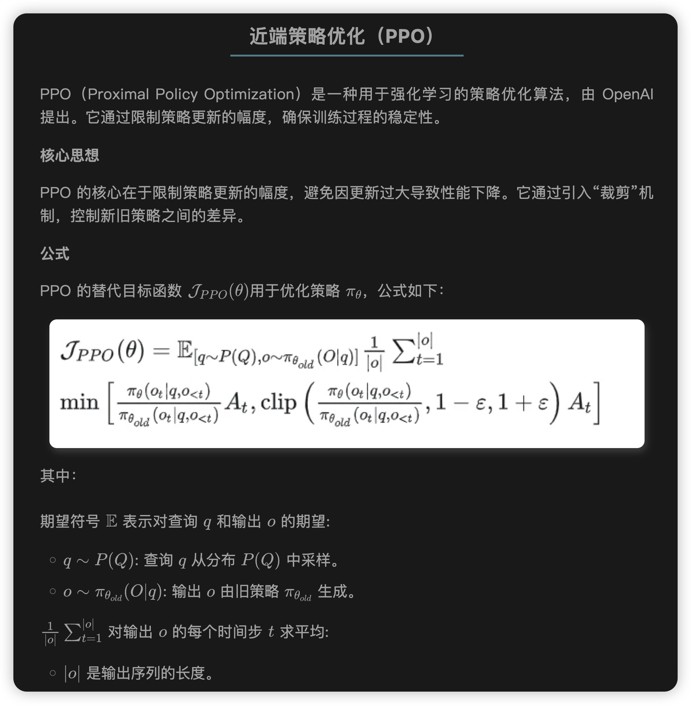

这里的$A_t$是GAE。

### GAE 介绍
在PPO（Proximal Policy Optimization）算法中，**GAE（Generalized Advantage Estimation）** 是一个用于估计 **优势函数（advantage function）** 的技术，它的目的是在**偏差和方差之间找到一个好的折中**，以获得更稳定和高效的策略梯度估计。

在策略梯度方法中，**策略更新的方向取决于 Advantage**，它表示“当前动作比平均水平好多少”。

形式上，优势函数为：

\[
A_t = Q(s_t, a_t) - V(s_t)
\]

但直接估计 \(Q\) 或 \(A\) 会有**高方差**，影响训练稳定性，于是引入 GAE 来更好地估算 \(A_t\)。

GAE 提供了一种通过时间差分（TD）来估计 advantage 的方式。它引入一个超参数 \(\lambda \in [0, 1]\)，来平衡偏差与方差。

定义 **TD 残差（Temporal Difference Residual）**：

\[
\delta_t = r_t + \gamma V(s_{t+1}) - V(s_t)
\]

GAE 的优势估计为：

\[
\hat{A}_t^{\text{GAE}(\gamma, \lambda)} = \sum_{l=0}^{\infty} (\gamma \lambda)^l \delta_{t+l}
\]

也就是多个 TD 残差的加权和，权重是 \((\gamma \lambda)^l\)。

---

## GRPO

GRPO 是一种在线学习算法（online learning algorithm），这意味着它通过使用训练过程中由训练模型自身生成的数据来迭代改进。GRPO 的目标直觉是最大化生成补全（completions）的优势函数（advantage），同时确保模型保持在参考策略（reference policy）附近。

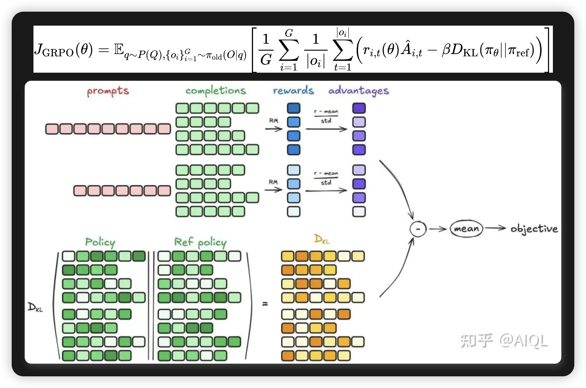

为了理解 GRPO 的工作原理，可以将其分解为四个主要步骤：

1. 生成补全（Generating completions）
2. 计算优势值（Computing the advantage）
3. 估计KL散度（Estimating the KL divergence）
4. 计算损失（Computing the loss）

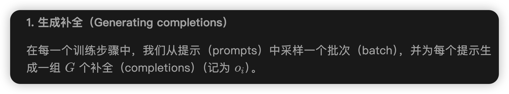

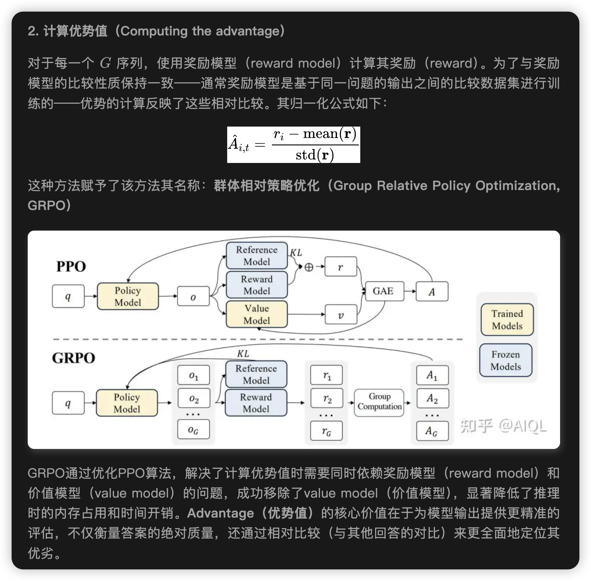

GRPO避免像 PPO 中那样做额外价值函数近似，而是使用针对同一问题产生的多个采样输出平均奖励作为基线。这样就避免了训练value model。

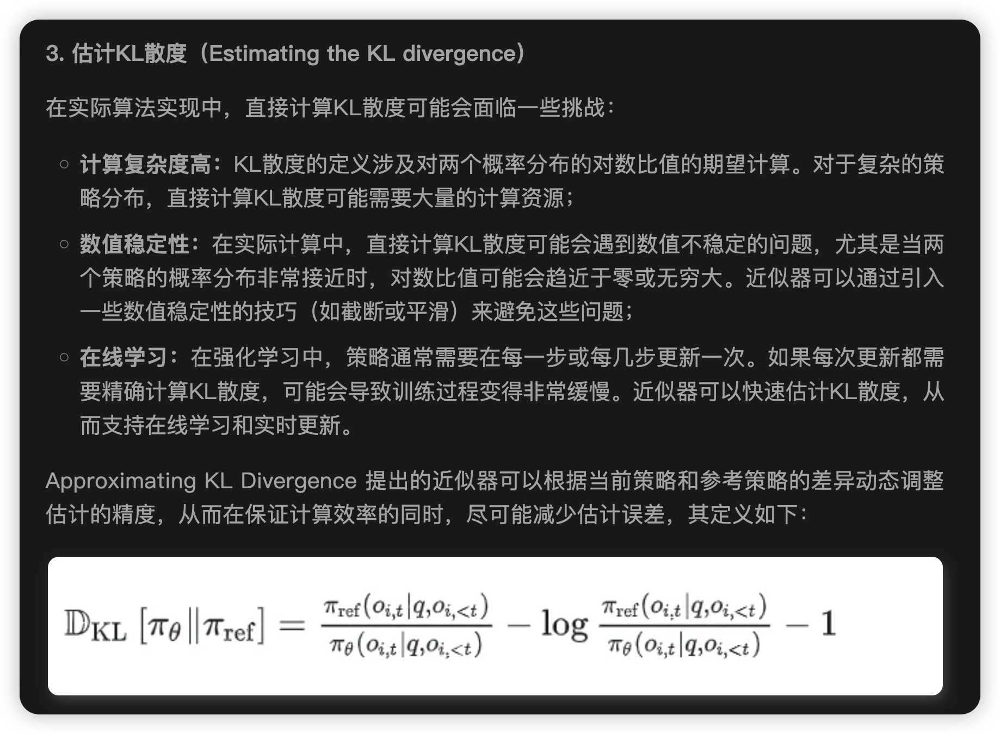

**这个KL散度的近似计算可以看我的另外一篇博客[Approximating KL Divergence](https://detect.wiki/post/75ed94ba.html)**

由于这里天然采样了一系列样本，所以合适使用MC方法作为KL的估计。

另请注意，GRPO 不是在奖励中添加 KL 惩罚，而是通过将训练策略和参考策略之间的 KL 散度直接添加到损失中进行正则化，从而避免使优势 $A_{i,t}$ 的计算复杂化。

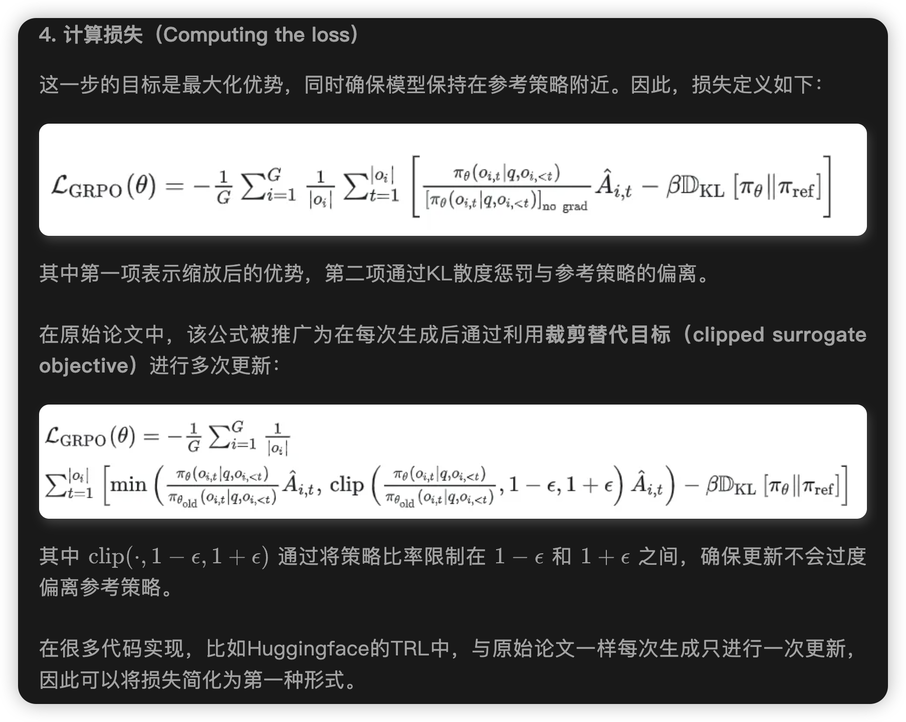

## GRPO三种方式

 **GRPO（Generalized Reweighted Policy Optimization）** 进行强化学习训练大语言模型（LLM）的三种监督方式：**结果监督（Outcome Supervision）**、**过程监督（Process Supervision）**，以及**迭代强化学习（Iterative RL）**。它们分别在不同粒度、不同时间尺度上给予奖励信号，帮助策略模型（即语言模型）学习更高质量的生成。

### ✅ 一、结果监督（Outcome Supervision） with GRPO

**目标**：对完整输出结果进行评分，让模型生成更高质量的结果。

#### 流程：

1. **采样输出**：对于某个问题 \( q \)，从旧策略模型（旧的语言模型）中采样出一组完整输出：
   \[
   \{o_1, o_2, \dots, o_G\}
   \]
2. **评分打分**：使用**结果奖励模型（ORM）**对每个输出 \( o_i \) 给出一个分数 \( r_i \)，形成奖励集合：
   \[
   r = \{r_1, r_2, \dots, r_G\}
   \]
3. **归一化奖励**：对这组奖励做标准化（去均值除以标准差）：
   \[
   \tilde{r}_i = \frac{r_i - \text{mean}(r)}{\text{std}(r)}
   \]
4. **赋予优势函数**：将归一化后的奖励赋值为每个输出中所有 token 的优势（advantage）：
   \[
   \hat{A}_{i,t} = \tilde{r}_i,\quad \forall t
   \]
   （意思是：整个输出中的每个 token 得到相同的 advantage）

5. **策略优化**：使用 GRPO 中定义的损失函数（类似于 policy gradient）去更新策略模型。

### ✨ 优点：

- 简单高效。
- 适合结果明确的任务，如问答、分类。

#### ⚠️ 局限：

- 只能在生成**结束**后才有奖励信号，对中间推理过程无法指导。
- 对于复杂任务如数学推理，不足以训练出高质量策略。

---

### ✅ 二、过程监督（Process Supervision） with GRPO

**目标**：为输出的每个推理步骤提供奖励，强化正确的中间思维步骤。

#### 流程：

1. **采样输出序列**：从策略模型中采样一批完整输出：
   \[
   \{o_1, o_2, \dots, o_G\}
   \]
2. **标注步骤索引**：每个输出包含多个“推理步骤”，每一步有个结束位置 \( \text{index}(j) \)。

3. **逐步打分**：使用**过程奖励模型（PRM）**对每一步进行评分：
   \[
   R = \left\{ \{r_1^{\text{index}(1)}, \dots, r_1^{\text{index}(K_1)}\}, \dots \right\}
   \]
4. **归一化奖励**：对所有 step-level 奖励做归一化，得到 \(\tilde{r}_i^{\text{index}(j)}\)

5. **优势计算（逐 token）**：对于输出中的每个 token \(o_{i,t}\)，其 advantage 是**之后所有推理步骤的 reward 总和**：
   \[
   \hat{A}_{i,t} = \sum_{\text{index}(j) \ge t} \tilde{r}_i^{\text{index}(j)}
   \]

6. **策略优化**：同样使用 GRPO 对策略模型进行更新。

#### ✨ 优点：

- 更细粒度，能强化“中间思维步骤”的正确性。
- 对数学、代码推理等多步骤任务效果更好。

---

### ✅ 三、使用 GRPO 的迭代强化学习（Iterative RL）

**动机**：策略模型不断变强后，原来的奖励模型就跟不上了——评估能力不够强，容易误导策略。

#### 解决方法：**训练过程中持续更新奖励模型**

#### 流程：

1. **采样生成新数据**：用当前的策略模型生成新的输出数据。
2. **训练奖励模型**：用这些数据训练新的奖励模型（结果奖励或过程奖励）。
   - 加入 10% 的历史数据作为 replay buffer，防止“灾难性遗忘”。
3. **更新参考模型**：将当前策略模型设为新的参考模型（用于计算概率比等）。
4. **强化训练策略模型**：使用新奖励模型继续训练策略。

这个过程循环进行，策略和奖励模型不断协同进化，从而提升整体强化学习效果。

code：
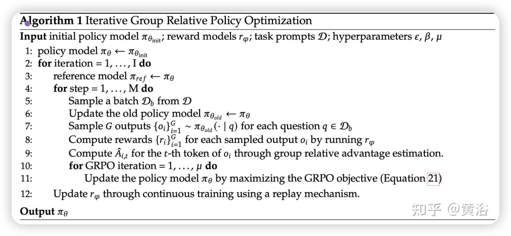

----

## 高视角下的 RL 的训练方法。

提供一个统一的范式来分析不同的训练方法，例如 SFT、RFT、DPO、PPO、GRPO，并进一步进行实验来探索统一范式的因素。一般来说，关于一种训练方法的参数梯度可以写成：

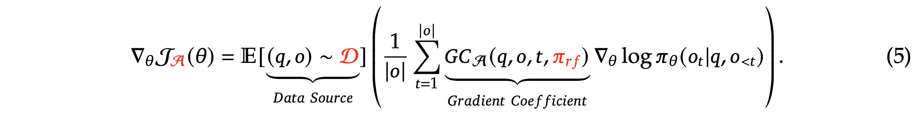

存在三个关键组件：
1）数据源 D，它决定训练数据；
2）奖励函数和$\pi_{rf}$，它是训练奖励信号的来源；
3）算法 A：它将训练数据和奖励信号处理为梯度系数 ，该梯度系数决定了数据的惩罚或强化程度。基于这种统一范式的几种代表性方法如下：

• 监督微调 (SFT)：SFT 在人类选择的 SFT 数据上微调预训练模型。
• 拒绝抽样微调 (RFT)：RFT 在基于 SFT 问题从 SFT 模型中采样的过滤输出上进一步微调 SFT 模型。RFT 根据答案的正确性过滤输出。
• 直接偏好优化 (DPO)：DPO 使用成对 DPO 损失，通过对从 SFT 模型中采样的增强输出进行微调来进一步完善 SFT 模型。
• 在线拒绝采样微调 (Online RFT)：与 RFT 不同，Online RFT 使用 SFT 模型启动策略模型，并使用从实时策略模型采样的增强输出进行微调来完善它。
• PPO/GRPO：PPO/GRPO 使用 SFT 模型初始化策略模型，并使用从实时策略模型采样的输出来强化它。

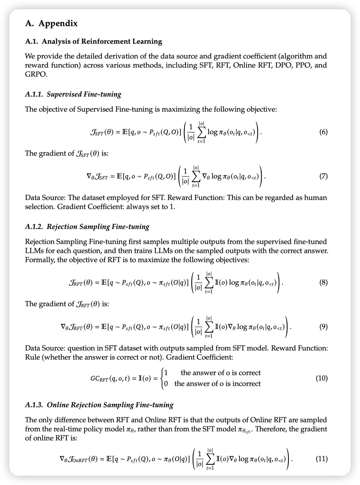

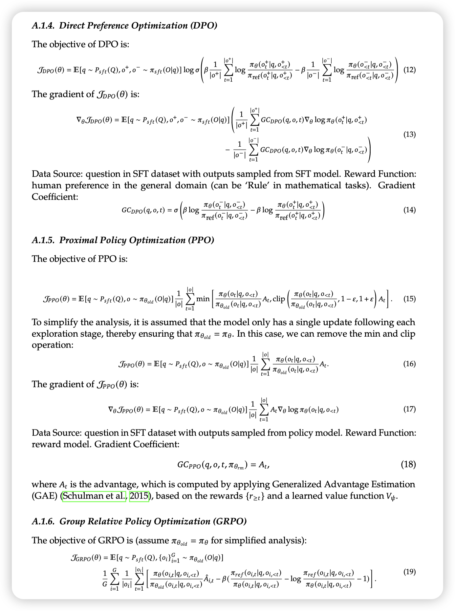

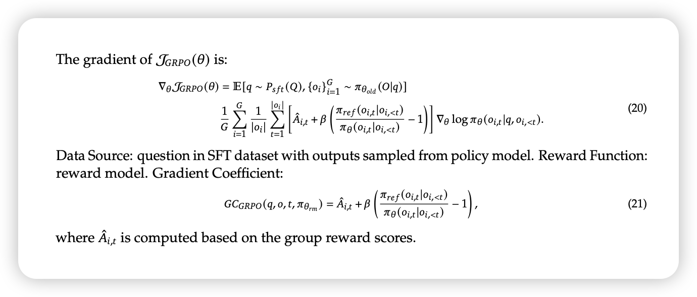