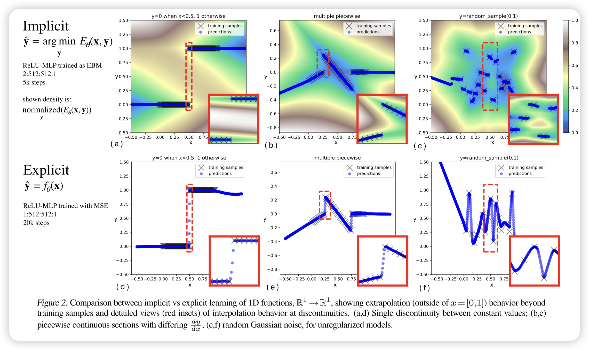
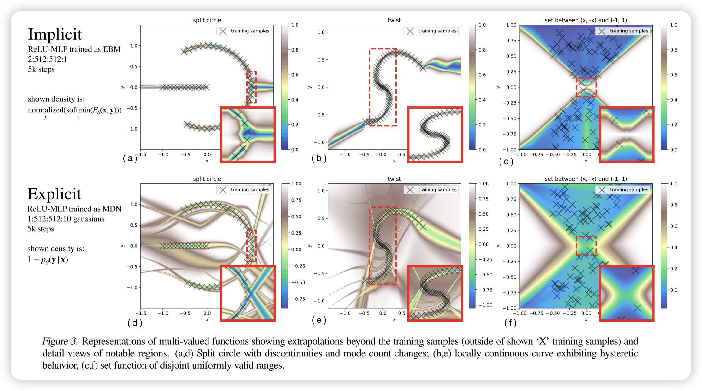
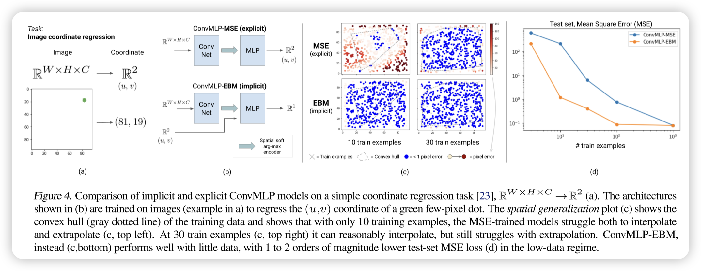
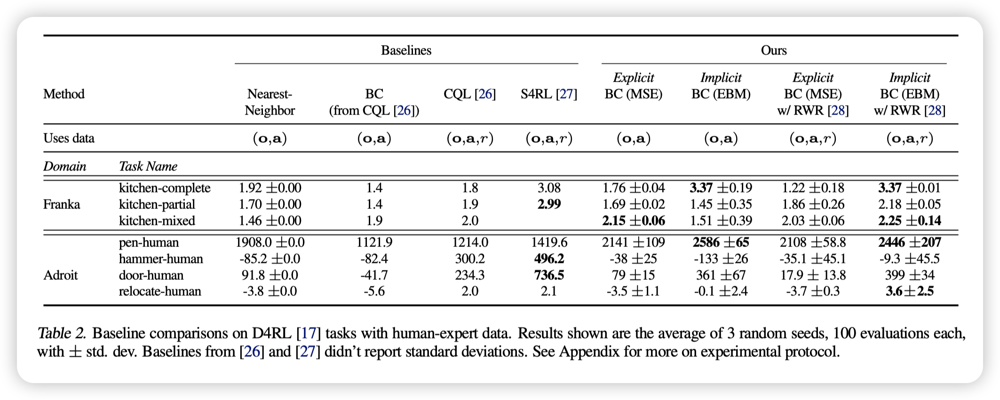

## 
 Implicit Behavioral Cloning

### Abstract:

On robotic policy learning tasks we show that implicit behavioral cloning policies with energy-based models (EBM) often outperform common explicit (Mean Square Error, or Mixture Density) behavioral cloning policies, including on tasks with high-dimensional action spaces and visual image inputs.

## Method:

很多时候，我们直接用$\hat{a} = F_\theta(o)$，作为agent动作的输出，这是常见的explicit behavioral cloning。

最近随着能量模型的火爆，我们可以用能量模型来做implicit behavioral cloning。这里的能量模型是指$E_\phi(o, a)$，其中$o$是observation，$a$是action，$\phi$是能量模型的参数。我们训练能量模型，在做action决策时，使用额外的$argmin$通过sample或者gradient descent来找到对应的action。

$$\hat{a} = \argmin_{a\in A} E_\theta(o,a)$$

### how to train $E_\phi(o, a)$

因为在能量模型中所有事物都没有绝对的概念，而是相对的概念，所以没法轻易使用想explicit那样简单的监督学习+MSE的方法，所以我们使用了contrastive learning的方法：

$$\mathcal{L}_{\text{InfoNCE}} = \sum_{i=1}^{N} -\log \left( \tilde{p}_\theta(y_i | x, \{ \tilde{y}_{ij} \}_{j=1}^{N_{\text{neg}}}) \right)$$

$$\tilde{p}_\theta(y_i | x, \{ \tilde{y}_{ij} \}_{j=1}^{N_{\text{neg}}}) =
\frac{e^{-E_\theta(x_i, y_i)}}
{e^{-E_\theta(x_i, y_i)} + \sum_{j=1}^{N_{\text{neg}}} e^{-E_\theta(x_i, \tilde{y}_{ij})}}$$

含义其实就是考虑把真实样本和负样本以能量概率的形式来区分开的负对数最大似然。

这里比较考究的一点是，我们的负样本是怎么来的。简单的方法是uniform sample，但是效果肯定不好，之后会谈这个。

### how to solve $\hat{a}=\argmin_{a\in A} E_\theta(o,a)$

We use either
- a) aderivative-free (sampling-based) optimization procedure
- b) an auto-regressive variant of the derivative-free optimizer which performs coordinate descent
- c) gradient-based Langevin sampling with gradient penalty loss during training

## Intriguing Properties of Implicit vs. Explicit Models

Comparing these models, we examine:
- (i) how do they perform near discontinuities?
- (ii) how do they fit multi-valued functions?
- (iii) how do they extrapolate?

### discontinuities

隐式模型能够精确逼近不连续点，而显式模型则会在不连续点进行插值，导致伪影。 随着不连续性的频率增加，隐式模型仍能保持清晰的边界，并进行分段线性外推，而显式模型则在每个不连续点进行平滑插值。当训练数据无关联且无正则化时，隐式模型表现出类似**最近邻（nearest-neighbor）**的行为，但在每个样本点附近仍然存在非零梯度，使其在局部范围内保持一定的连续性。

### multi-valued functions

隐式模型（EBM）可以自然地表示多值函数，而显式模型（如 MDN）需要显式建模概率分布。 通过 argmin 操作，隐式模型可以返回多个可能的最优值，而不是单一输出，这使得它能够更好地处理多模态分布。对比实验（图 3）显示，在多值函数的拟合任务中，EBM 在捕捉不同模式方面比 MDN 更灵活，既可以通过优化选出最优解，也可以通过概率采样生成可能的输出。

这里argmin后可以是概率集合的抽样，或者梯度下降的一个解，总之是多样性的。在处理多峰分布时，对比传统的高斯+KL的拟合，EBM可以更好建模。

### extrapolation

隐式模型在凸包外的外推通常表现为分段线性延伸，而显式模型则执行全局线性外推，假设目标函数是连续的。 由于隐式模型基于 argmin 选择最优解，其外推行为依赖于训练数据边界处的局部线性结构，因此在处理不连续或多值函数时更加灵活。而显式模型（如 MLP 直接回归）则倾向于执行全局线性外推，无法适应不连续情况，可能导致误差增大。

简而言之EBM在外推时更重视局部。

### Visual Generalization

在一些传统CNN做的不好的领域，比如说视觉坐标回归任务。

隐式模型（EBM）在高维视觉任务中的外推能力显著优于显式模型（MSE 训练的 Conv-MLP）。 在视觉坐标回归任务中，传统的 Conv-MLP（即使结合 CoordConv）在训练数据凸包外的区域外推能力较差，而基于 Late Fusion 训练的 EBM 仅需少量训练数据即可实现高质量外推，测试误差比显式模型低 1-2 个数量级。这一实验表明，隐式模型的外推能力优势不仅限于多模态任务，还在高维视觉输入到连续输出的映射问题中表现出色。

## Experiments result

**在 D4RL 基准测试中，隐式模型（EBM）和显式模型（MSE）均显著优于行为克隆（BC）基线，并与最先进的离线强化学习方法（如 CQL 和 S4RL）竞争。** 其中，隐式 BC 模型（EBM）在数据质量更高的情况下（如仅使用回报最高的 50% 数据），其性能进一步提升，并在某些任务上达到了**新的 SOTA 水平**，而显式 BC 模型的提升较小。这表明 **隐式 BC 策略比显式 BC 策略更依赖于高质量数据**。

此外，尽管 D4RL 任务涉及高维动作空间（最高 30 维），但未涵盖所有感兴趣的任务特性，因此进一步测试了包含**高随机性动力学、复杂多物体交互和组合复杂性**的任务，以全面评估模型的泛化能力。

补充：

在论文中，显式（Explicit）方法主要是 **MSE 训练的 MLP（Mean Squared Error Behavioral Cloning, MSE-BC）** 和 **混合密度网络（Mixture Density Network, MDN）** 这两种。

#### **显式方法的实现**
论文明确指出两种显式 BC 方法：
- **MSE 训练的 MLP（MSE-BC）**
  - 采用全连接神经网络（MLP）
  - 训练目标是最小化均方误差：
    \[
    \mathcal{L}_{\text{MSE}} = \sum_i || f_\theta(x_i) - y_i ||^2
    \]
  - 适用于单模态数据，但难以处理多值或不连续情况。

- **混合密度网络（MDN）**
  - 采用 MDN 训练，学习高斯混合分布：
    \[
    p(y | x) = \sum_{k=1}^{K} \pi_k(x) \mathcal{N}(y | \mu_k(x), \sigma_k(x))
    \]
  - 适用于多模态数据，但在复杂分布上可能难以拟合。

---

## Theoretical Insight: Universal Approximation with Implicit Models

### **隐式模型的理论能力与泛化优势**
论文在前面的实验中已经**验证了隐式模型在处理不连续性（discontinuities）方面的能力**，并提出了两个核心的理论问题：
1. **隐式模型是否有可证明的函数表示能力？**
   - 也就是说，是否可以数学上证明隐式模型能够表示某类特定函数？
   - 现有研究 [33] 证明了：由有限个**多项式不等式**定义的函数可以通过 `argmin_y g(x, y)` 近似，而 \( g(x, y) \) 可由 **求和平方（SOS）多项式** 表示。
   - 本文进一步证明，**如果 \( g_\theta(x, y) \) 由连续函数逼近器（如深度 ReLU-MLP）表示，则隐式模型可以逼近更广泛的函数，包括**：
     - **多值函数（multi-valued functions）**
     - **不连续函数（discontinuous functions）**
   - **定理 1（Thm. 1）** 和 **定理 2（Thm. 2）** 形式化地证明了这一点，且可达到**任意精度（arbitrary accuracy）**。

2. **能量函数的近似误差是否会影响推理稳定性？**
   - 在实际数据中，学习到的能量函数 \( E(x, y) \) **始终存在非零逼近误差**，这是否会导致 `argmin` 选择错误的解？
   - 具体而言：
     - **能量函数的“虚假峰值”（spurious peaks）** 可能导致 `argmin` 选择错误的解，从而引发推理时的行为偏移。
     - 论文探讨了这些风险，并通过约束能量函数来减少其影响。

---

### **隐式模型比显式模型更强的泛化能力**
1. **隐式模型可以逼近 Lipschitz 常数极大的函数，而不会带来训练困难**
   - 论文指出，即使显式目标函数 \( F(x) \) 具有极大或极小的 Lipschitz 常数（即变化率极高或极低），隐式模型仍然可以用**受限的 Lipschitz 常数**来逼近它。
   - 这意味着：
     - **显式模型（如 MLP）** 需要严格匹配大梯度的目标函数，否则会导致泛化问题。
     - **隐式模型（如 EBM）** 可以通过 `argmin` 机制，使得训练更加稳定，而不需要学习陡峭的梯度。

2. **隐式模型能够高效表示多值函数和不连续函数**
   - **显式模型的局限**：
     - MSE 训练的 MLP 只能学习单值映射，无法直接处理多模态或不连续数据。
     - MDN 可以建模多值分布，但需要显式地设定高斯分布的数量，并可能在复杂场景下拟合不足。
   - **隐式模型的优势**：
     - 通过 `argmin_y E(x, y)` 操作，可以**自然地处理多值映射**，不需要显式建模概率分布。
     - 在不连续函数上，隐式模型不会像 MLP 那样进行错误的平滑插值，而是直接学习正确的断裂点。

---

### **总结**
- **理论证明**：隐式模型可以**任意精度**地逼近 **不连续函数** 和 **多值函数**（定理 1 & 2）。
- **泛化能力更强**：
  - **显式模型需要匹配大梯度函数，训练困难**，而隐式模型不受此限制。
  - **隐式模型在多值和不连续任务上的表示能力远超显式模型**。
- **推理稳定性**：
  - **能量函数的误差可能引发推理偏移**，但可以通过约束能量函数来减小这种影响。

这进一步解释了为什么**隐式行为克隆（EBM）方法能在复杂任务（如机器人控制、视觉任务）上显著超越传统显式 BC 方法**。

---

## Related Work

这一节直接给gpt总结，有需要在原论文里找对应的引用。

本节回顾了**能量基模型（Energy-Based Models, EBMs）** 在不同领域的研究和应用，尤其是在**强化学习（Reinforcement Learning, RL）** 和**模仿学习（Imitation Learning）** 任务中的表现。

---

### **1. 能量基模型（EBM）与隐式学习**
EBM 是一种通过定义 **能量函数 \( E_\theta(x, y) \)** 来学习数据分布的框架：
\[
p_\theta(y | x) = \frac{e^{-E_\theta(x, y)}}{Z(x, \theta)}
\]
其中，\( Z(x, \theta) \) 是归一化常数。

#### **EBM 在不同领域的应用**
- **计算机视觉（Computer Vision）**
  - 最近研究表明，EBM 在 **目标检测、图像分类和图像生成任务** 上表现优异 [35, 36]。
- **生成建模（Generative Modeling）**
  - 研究 [12, 37, 38] 发现，EBM 在**文本生成、图像生成**等任务上达到了 SOTA 级别的表现。
- **隐式函数学习（Implicit Function Learning）**
  - 研究 [39, 40, 41, 42] 探索了隐式层（Implicit Layers）在深度学习中的作用。
  - 在几何表示学习（Geometry Representation Learning）中，隐式模型被广泛用于 3D 物体建模 [43, 44, 45, 46]。
- **机器人动力学建模（Robotics Contact Dynamics）**
  - 隐式模型被用于处理机器人接触动力学的**不连续性** [47]，这在机器人操作任务中尤为重要。

#### **隐式学习的关键优势**
隐式模型（如 EBM）相比显式模型（如 MLP）具有如下优势：
1. **更好的泛化能力**：能够学习多模态分布，而不像 MSE 训练的 MLP 那样只能学习单峰分布。
2. **可以处理不连续性（Discontinuities）**：适用于复杂的机器人控制任务。
3. **能够建模隐式约束（Implicit Constraints）**：适用于高维度问题，如几何建模、物体接触建模等。

### **2. EBM 在策略学习（Policy Learning）中的应用**
在**强化学习（RL）** 任务中，EBM 也被用于**策略表示（Policy Representation）**：
- **[13] 研究使用 EBM 作为策略表示**，将策略学习转换为能量最小化问题：
  \[
  \pi_\theta(a | s) = \frac{e^{-E_\theta(s, a)}}{Z(s, \theta)}
  \]
- **[14] 研究探索 EBM 在基于模型的规划（Model-Based Planning）中的应用**，表明 EBM 可以提升策略优化的稳定性。
- **[48] 研究在模仿学习中使用 EBM，但使用了 On-Policy 训练**，而本文的方法则适用于**离线模仿学习（Offline Imitation Learning）**。

此外，近年来许多 RL 研究都将 EBM 作为算法的一部分：
- 研究 [15, 16] 结合 EBM 和强化学习，探索**基于能量的状态价值函数建模**。

### **3. 模仿学习（Imitation Learning）中的策略学习**
模仿学习（Imitation Learning, IL）包括许多方法，最常见的是**行为克隆（Behavioral Cloning, BC）**：
- **传统 BC 方法**：
  - 直接使用监督学习来模仿专家演示。
  - 低数据需求，无需奖励信息。
  - **但容易出现分布偏移问题（Compounding Errors）**，导致模型偏离专家策略。
- **基于分布匹配的 IL 方法**
  - **GAIL（Generative Adversarial Imitation Learning）** [7] 通过对抗训练来匹配专家策略，但需要**大量环境交互**。
  - **ValueDice** [55] 通过离线匹配专家策略分布，提高样本利用率。
  - **但这些方法难以扩展到高维观察空间（如图像输入）和高维动作空间（如 30 维机器人控制任务）。**

**BC 仍然是一个强大基线**
尽管许多研究探索了更复杂的 IL 方法，研究发现：
- **最简单的 BC 方法在许多情况下仍能取得惊人的好效果！**
- **在离线 RL 任务（D4RL Benchmark）上，BC 仍然可以与 SOTA RL 方法相媲美 [17, 56]。**
- 在**真实世界机器人学习**中，BC 因为其**低数据需求和稳定性**，被广泛应用 [4, 30, 5, 25]。

**BC 的优势**
1. **最低的数据收集成本**（无需奖励、无需 on-policy 交互）。
2. **数据高效性**（无需大量采样）。
3. **易于实现和调优**（超参数少，稳定性高）。

### **4. 结论**
本节回顾了**能量基模型（EBM）** 在多个领域的最新进展，并分析了其在**强化学习（RL）和模仿学习（IL）** 任务中的应用：
- **EBM 在计算机视觉、生成建模、隐式函数建模等领域取得了 SOTA 级别的结果。**
- **在策略学习中，EBM 作为策略表示可以增强 RL 和 IL 任务的稳定性和泛化能力。**
- **尽管 RL 和 IL 领域有很多复杂方法，行为克隆（BC）因其低数据需求和稳定性，仍然是强大基线。**

这为**隐式 BC（EBM 训练的 BC 方法）** 在强化学习和模仿学习中的优势提供了理论支持，解释了为何其能在**D4RL 任务和真实机器人操作**中超越传统 BC 方法。

---

## Conclusion

隐式能量基模型（EBM）在模仿学习、机器人控制、高维决策任务等场景中具有显著优势，尤其在高维空间、视觉任务和不连续问题上表现更优。

计算开销是主要限制，但实验表明，在实际机器人任务中仍然可以高效运行，训练时间也优于部分离线强化学习方法。

理论贡献包括对隐式模型的通用逼近能力的探讨，揭示了其超越传统显式模型的能力。

---

## remarks

### **基于梯度的 Langevin MCMC 方法（Gradient-based Langevin MCMC）解析**

在基于梯度的马尔可夫链蒙特卡洛（MCMC）训练中，采用**随机梯度 Langevin 动力学（SGLD）** 方法，通过更新规则
\[
y^{(k)} = y^{(k-1)} - \lambda \frac{1}{2} \nabla_y E_\theta(x_i, y^{(k-1)}) + \omega_k, \quad \omega_k \sim \mathcal{N}(0, \sigma)
\]
进行采样，其中梯度仅对 \( y \) 求导。初始样本从均匀分布采样，并通过 MCMC 进行优化，每个负样本执行 \( N_{\text{MCMC}} \) 步更新。步长 \( \lambda \) 采用**多项式衰减策略**，并在采样过程中使用 **stop_gradient()** 避免反向传播。此外，为了提高推理质量，推理时会运行两倍于训练时的 Langevin 采样步数，并对梯度更新 \( \Delta y \) 进行裁剪，以提升稳定性。所有 \( y \)（即动作 \( a \)）在训练时均归一化到 \([-1,1]\) 区间，以确保数值稳定性。

这里引入了一点对抗学习的思想，特别是用训练时用当前的mcmc结果做为负样本，帮助模型更好地利用数据学习（相比baseline直接用uniform sample作为负样本，使用当前模型mcmc作为负样本能更好针对当前模型优化收敛）。

### Gradient penalty

为了提高训练的稳定性，本文在 **光谱归一化（Spectral Normalization）** 的基础上，引入 **梯度惩罚（Gradient Penalty）**，其公式如下：
\[
\mathcal{L}_{\text{grad}} = \sum_{i=1}^{N} \sum_{j=1}^{N_{\text{neg}}} \sum_{k=\{ \cdot \}} \max(0, ||\nabla_y E_\theta(x_i, y_{ij}^{(k)})||_\infty - M)^2
\]
其中，\( i \) 代表训练样本，\( j \) 代表每个样本的对比负样本，\( k \) 代表 MCMC 采样步骤（仅在最终步 \( k = N_{\text{MCMC}} \) 计算梯度）。梯度上限 \( M \) 控制梯度相对于 **SGLD 采样中的噪声** \( \omega \) 的规模：若 \( M \) 过大，则噪声影响变小，若 \( M \) 过小，则噪声主导优化，影响收敛。实验证明，**\( M = 1 \) 是一个较优选择**。在每次训练迭代中，梯度惩罚项 \( \mathcal{L}_{\text{grad}} \) 与 **LInfoNCE 损失** 相加进行优化，即：
\[
\mathcal{L} = \mathcal{L}_{\text{grad}} + \mathcal{L}_{\text{InfoNCE}}
\]
此外，论文还提到其他提升 **Langevin MCMC 训练稳定性** 的方法，例如 **熵正则化（Entropy Regularization）**。最后，为了直观理解梯度约束的合理性，**推论 1.1 证明了能量模型可以具有任意的 Lipschitz 常数**，这意味着隐式模型可以在保持稳定的同时，高效逼近具有大梯度变化的目标函数。

### 不同 EBM 变体的比较（EBM Variants Comparison）

论文对三种 **能量基模型（EBM）** 训练方法在 **N 维粒子环境（N-D Particle Environment）** 中进行了对比，主要探讨它们在 **高维动作空间（High-Dimensional Action Spaces）** 下的性能差异，并权衡计算复杂度与泛化能力的关系。

#### **1. 三种 EBM 训练方法**
1. **无导数优化（Derivative-Free Optimization, DFO, Sec. B.1）**
   - **方法**：直接从均匀分布采样，计算能量并选择最优解，不使用梯度信息。
   - **问题**：
     - **维度灾难（Curse of Dimensionality）**：在 \( N > 5 \) 维的情况下，该方法难以找到合适的解，因为采样空间指数增长，导致搜索效率低下。
     - **低维度可行**，但高维度失败。

2. **自回归无导数优化（Autoregressive DFO, Sec. B.2）**
   - **方法**：
     - 将高维问题拆分为多个低维子问题，并逐步优化每个维度。
     - 适用于高维空间，无需新的梯度稳定化技术。
   - **优点**：
     - **可以可靠地求解 \( N \leq 16 \) 维的任务**，并在 \( N = 32 \) 维仍有一定成功率。
     - **与标准 DFO 相比，提高了采样效率**。
   - **缺点**：
     - **内存占用高**，因为它需要 **N 个独立模型** 来优化 \( N \) 维动作空间。

3. **Langevin 动力学（Langevin Dynamics, Sec. B.3）**
   - **方法**：
     - 采用 **Langevin MCMC 采样**，结合梯度信息进行优化。
   - **优点**：
     - **能够扩展到高维空间，仅需一个模型即可优化整个高维动作空间**。
     - **在 32 维空间仍能取得非零成功率**，优于 DFO 版本。
   - **缺点**：
     - **需要梯度稳定化（Gradient Stabilization）**，否则可能训练不稳定。

---

## **2. 关键对比（Tradeoff Analysis）**
| 方法 | 计算开销 | 训练稳定性 | 高维扩展性 | 额外需求 |
|------|--------|----------|----------|--------|
| **DFO（Sec. B.1）** | 低 | 稳定 | **仅适用于 \( N \leq 5 \)** | 无 |
| **Autoregressive DFO（Sec. B.2）** | **高（需 \( N \) 个模型）** | **稳定** | **可扩展至 \( N = 16 \)，部分成功 \( N = 32 \)** | **占用大量内存** |
| **Langevin MCMC（Sec. B.3）** | **中等（梯度计算）** | 需梯度稳定化 | **可扩展至 \( N = 32 \)** | **需额外正则化** |

- **DFO 方法适用于低维任务（\( N \leq 5 \)），但无法扩展到高维度。**
- **Autoregressive DFO 方法在 \( N = 16 \) 维问题上表现良好，但内存占用过高。**
- **Langevin MCMC 方法最适合高维任务（\( N = 32 \)），但需要额外的梯度稳定化。**

---

