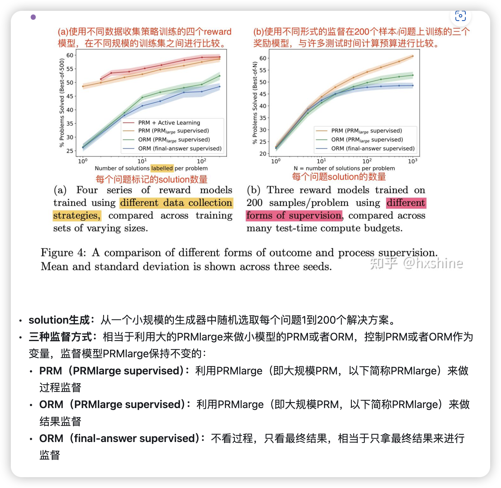
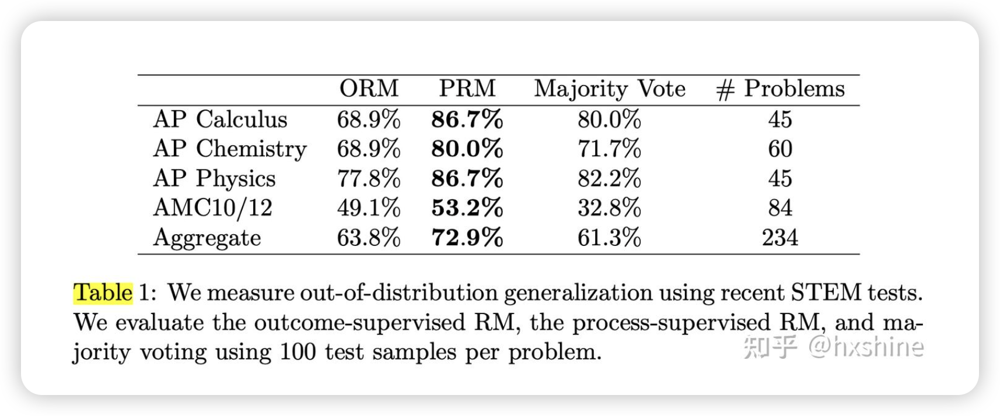

# 
 Let’s Verify Step by Step 

Problem：数学问题。

Solution：解题的过程/步骤。

Answer：数学答案。

Generator：在复杂任务场景中，需要一系列的推导步骤才能得到答案。为每个复杂问题Problem生成一系列解题步骤Solution和最终答案Answer。每个Solution之间按照换行符进行分隔。

Reward Model：奖励模型（也可以视为验证器verifier），对生成的内容进行评判，分为以下两种结果奖励监督模型ORM和过程奖励监督模型PRM。
- ORMs：结果监督奖励模型(Outcome-supervised)，只对完整答案进行评分。
- PRMs：过程监督奖励模型 ( process-supervised)，可以对每个解题步骤进行评分。

Generator和Reward Model关系：
- 训练阶段：作为RLHF中的reward模型，提升LLM（Generator）对齐效果。
- 推理阶段：作为Verification验证模型，对Generator生成的多个候选进行重排序，确保LLM输出更高的一致性和准确性，eg ：reject sampling场景。
- Generator
    这里面应该是引入了SFT，但是应该是规模很小的SFT，可能是类似于LIMA一样仅需要几千条数据进行，因为这一步的目的仅仅是学会按照newline的方式生产step-by-step的数据，并不需要模型学会额外的知识（避免引入额外的偏差）。所以就很简单：通过Few-Shot的方法提示某个模型（大概率是正式版的GPT-4）来生成少量格式正确的数据，并且人工再过滤一遍，把没有过程、直接预测的给丢掉，这一步也是数据合成里面比较常见的。之前做过类似的实验，大概只需要几百条数据就可以让一个模型按照一个固定的格式回答问题了。

ORMs和PRMs区别：
- 监督信号不一样：ORMs：结果监督奖励模型，只对完整答案进行评分。PRMs：过程监督奖励模型 ，可以对每个解题步骤进行评分。
- ORM更简单，PRM更复杂。

## 数据收集

- 结合人工标准 + 模型生成with人工筛选 得到训练用的数据集

甚至可以是个迭代过程
- step标注：训练好的generator采样出分步的CoT solution，人工标注每步的正确性，包括positive/negative/neutral三个类别，设置一个neutral类别的好处是允许模型通过延迟决策的方式来处理模棱两可的情况，不让模型快速推动流程，要做尽可能多的talking思考。
- 样本选择策略：由于标注成本昂贵，我们应该给标注员呈现对当前PRM更具挑战性（欺骗性）的样本，作者强调选择具有更高反馈价值的convincing wrong-answer solutions，这里的convincing是指当前PRM打分高的solution，而wrong-answer是指最终结果错误，这种hard case对优化模型更有价值
- 迭代优化：假设已经有一个训练好的PRM，每次迭代generator对每个问题生成N个solution，用当前PRM对这些solution打分，挑选出前K个step分数高且answer错误的数据（convincing wrong-answer solutions）用于训练PRM。
- 标注positive：对的过程，对解答有帮助。negative：错的过程。neutral：对的过程，但是对解答没帮助。

## PRM模型训练和使用

### 阐述一下PRM迭代训练的过程

1. Generator生成N个solution
2. PRM对每个solution进行打分
3. 机器判断对错
4. 对打分高同时错误的数据晒出来
5. 人工标注哪里错了
6. 把数据又去SFT PRM模型

### PRM打分

以每个step最后一个token的embedding预测当前step的分数，定义一个solution的分数为每个step都正确的概率。

其实就是每个step的分数，连乘(全对总概率)，或者取min也可以。

## 结果

### PRM对比ORM

背景：由于数据集构建，监督方法的不同，以及结果评判方法的不同，直接对比ORM和PRM有点不太好比较

原因：（1）ORM和PRM的训练集无法直接进行比较：PRM训练集是通过主动学习构建的，偏向于错误答案的解决方案，并且规模小了一个数量级。（2）ORM最终答案的评分正确但可能推理过程错误带来评判不公平。（3）收集人工反馈的成本很高，无法轻易地通过人工标注者去除这些因素

解决方法：使用大规模的PRM（PRMlarge）来监督较小的模型来进行相关的消融实验。这个设置可以以较低的成本模拟大量的数据收集。

Figure 4a 中active learning细节：

重点就是选择信息量大的数据做微调。

### 泛化能力

在其他领域做了测试

