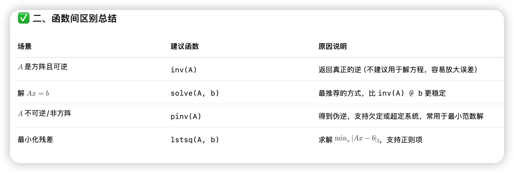
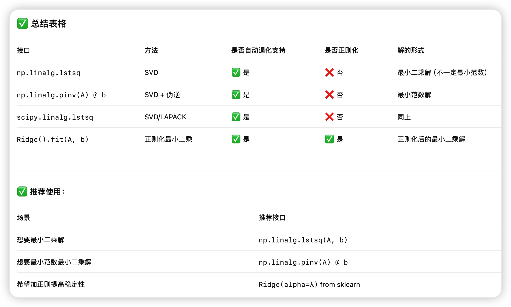
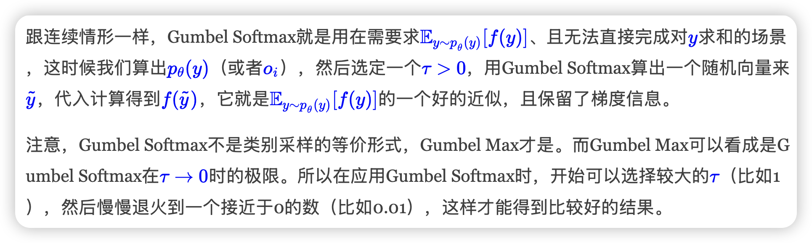

## Math Guide

本page作为指南页，收集一些数学相关的知识或者trick

#### 1. [Approximating KL Divergenc](https://detect.wiki/post/75ed94ba.html)

主要介绍使用MC方法来近似KL散度的技巧。层层递进，目标是既无偏又具有较低方差的采样估计。

#### 2. [KKT条件使用说明书：实战 · 避坑 · 反例](https://zhuanlan.zhihu.com/p/19271359098)

本文为KKT操作指南（Cookbook），Step1到Step7，从实践视角，融合优化理论最新成果，详陈使用KKT条件确定约束优化问题全局最优解的操作步骤

#### 3. [nju矩阵计算课程笔记](https://detect.wiki/post/725267af.html)

为南京大学25spring李易峰老师矩阵计算课程的笔记

目录：

#### 4. [低秩近似之路（一）：伪逆](https://spaces.ac.cn/archives/10366)

1. **问题引入**：在线性方程 AB = M 中，当 A 不可逆或非方阵，逆矩阵失效，需考虑误差最小化。
2. **优化定义**：通过最小化 Frobenius 范数引出右伪逆和左伪逆的优化表达式。
3. **基础工具**：介绍 Frobenius 范数、迹与内积，为后续推导提供支持。
4. **解析推导**：利用链式法则求梯度，推导出在 AᵀA 可逆时的闭式伪逆解：
   $$
   A^† = (A^ᵀ A)^{-1} A^ᵀ
   $$
5. **正则化拓展**：当 AᵀA 不可逆时，引入正则项以确保解的唯一性，并构造极限表达：
   $$
   A^† = \lim_{\epsilon \to 0} (A^ᵀ A + \epsilon I)^{-1} A^ᵀ
   $$
6. **数值计算**：推荐使用谱分解形式（SVD）稳健计算伪逆，并解释零特征值的处理方式。
7. **小结**：总结 Moore–Penrose 伪逆的性质，强调其在低秩近似与工程计算中的核心作用。

#### 5. [重要性采样](https://zhuanlan.zhihu.com/p/695130713)

p是目标分布，q是我们选择的采样分布。

$$
\sigma_q^2 = \mathbb{E}_{x \sim q(\cdot)} \left[ f^2(\mathbf{x}) \left( \frac{p(\mathbf{x})}{q(\mathbf{x})} \right)^2 \right] - \mu^2 ;
$$

- 启发1： $\frac{p(x)}{q(x)}$不能太大
    最严重的是如果p关于q是重尾的(heavy tail)，那么Importance Sampling估值的方差就是无穷大。举个的例子，如果要估计gaussian，那么用student就很好，在x极大时，覆盖住了gaussian的尾部。
- 启发2： 精心的设计importance probabality，可以提高经典蒙特卡洛积分的收敛速度。
    同样如果估计x>4.5的标准gaussian，如果传统采样，因为很难有样本落在这个区域，所以收敛很慢。我们可以直接用截断指数函数（只保留x>4.5部分）来采样。

#### 6.

原博客里直接实现的np code

- ✅ Softmax

    指数归一化，保序且可微，是 argmax 的光滑近似，输出稠密分布。

- ✅ Margin Softmax

    在 logits 上引入 margin，加强类间分离，适用于检索任务和句向量训练。

- ✅ Taylor Softmax

    用 exp(x) 的偶数阶泰勒多项式近似替代 exp，长尾特性更强，可用于线性化 attention。

- ✅ Sparse Softmax

    训练阶段截断 logits，仅保留 Top-k，有助于训练/推理一致，适合微调。

- ✅ Perturb Max / Gumbel Max

    通过添加随机噪声再取 argmax 来定义分布，可用于采样重参数和近似 softmax。

- ✅ Sparsemax

    将 logits 投影到概率单纯形，显式输出稀疏分布，适合多标签分类或可解释 attention。方法里使用$\lambda(x)$来控制$\sum p=1$，计算这个$\lambda(x)$可以用数值方法得到，梯度也一样。

- ✅ Entmax-α

    Sparsemax 的泛化，引入参数 α 控制稀疏度，在 Softmax 和 Sparsemax 之间平滑过渡。

#### 7. [Softmax后传：寻找Top-K的光滑近似](https://spaces.ac.cn/archives/10373)

- 迭代构造法（Iterative Composition）
    核心思路：每次从残差中提取一个 Soft Top-1，再累计叠加，重复 k 次逼近 Top-k。
    缺乏理论收敛保证。
    无法满足极限下严格趋近于硬 Top-k，数值上不精确。

- 梯度引导法（Gradient-guided / GradTopK）
    核心思路：Top-k 选择的梯度正好等于 Multi-Hot 向量，即 $$T_k(x) = \nabla_x \sum_{i \in Ωk(x)} x_i$$ 构造其光滑近似 $\log \sum{|S|=k} \exp(\sum_{i\in S} x_i)$，再对 $x$ 求导。
    可以通过递推来加速算这玩意儿，但数值不太稳定

- 待定常数法（Threshold-adjusted / ThreTopK）
    核心思路：构造满足如下形式的可调阈值函数 $$ ST_k(x) = f(x - \lambda(x)),\quad \sum f(x_i - \lambda(x)) = k $$ 其中 $f$ 为光滑、单调且输出值在 $[0,1]$ 的函数（如 $\sigma(x)$）。
    一般形式无解析解，需额外求导或写反向传播。

#### 8. [漫谈重参数：从正态分布到Gumbel Softmax](https://spaces.ac.cn/archives/6705#mjx-eqn-eq%3Abase)

从loss层面看，我们需要分连续和离散两种情形：连续情形下，重参数是用采样形式且不损失梯度地写出loss的方法；离散情形下，重参数有着跟连续情形一样的作用，不过更根本的原因是降低计算量（否则直接遍历求和也行）。从梯度估计层面看，重参数是降低梯度估计方差的一种有效手段，而同时还有其他的降低方差手段也被不少学者研究中。