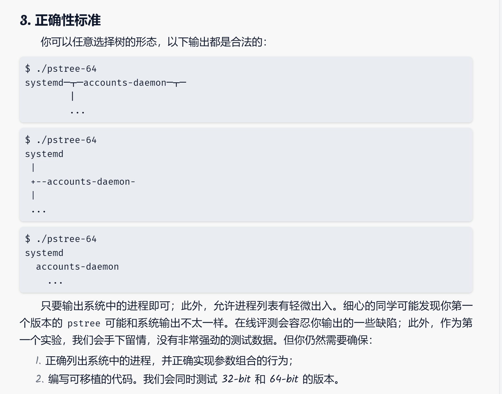
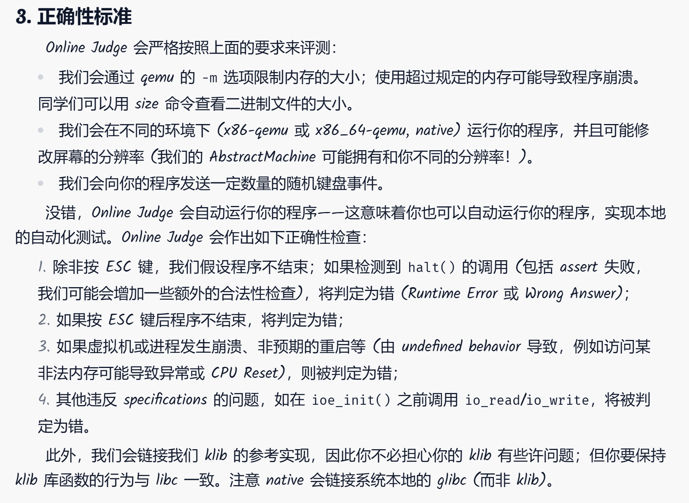
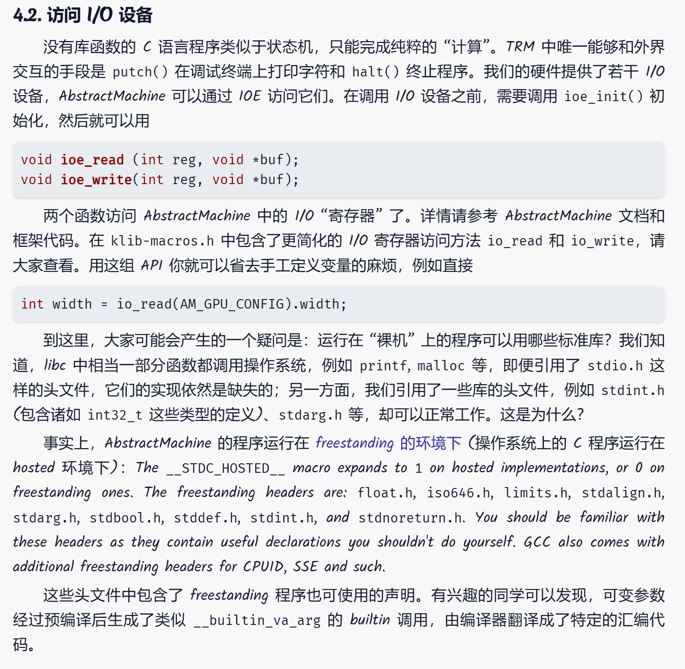
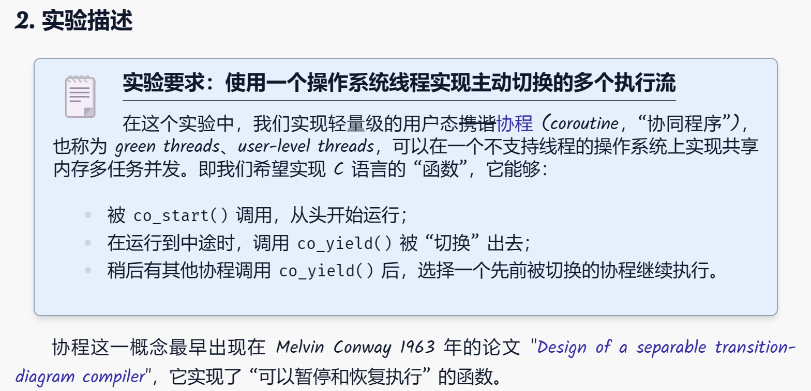
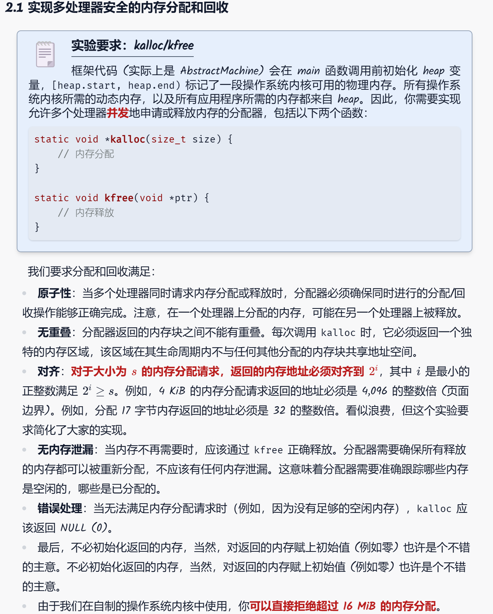

# <center> OS lab </center>

## [M1: 打印进程树 (pstree)](https://jyywiki.cn/OS/2024/labs/M1.md)



总体思路按照实验指南：

1. 得到命令行的参数，根据要求设置标志变量的数值；
2. 得到系统中所有进程的编号 (每个进程都会有唯一的编号) 保存到列表里；
3. 对列表里的每个编号，得到它的的父亲是谁；
4. 在内存中把树建好，按命令行参数要求排序；
5. 把树打印到终端上。

### 1. 得到命令行的参数

c可以在main入口函数中得到命令行参数，这里的参数是一个字符串数组，每个字符串是一个参数，由空格分隔。于是遍历这些参数，并转化成我们需要的标志变量。

```c
int main(int argc, char *argv[])

    for (int i = 0; i < argc; i++) {
        assert(argv[i]); // C 标准保证
                         // printf("argv[%d] = %s\n", i, argv[i]);
        if (argv[i][0] == '-' && argv[i][1] == '-') {
            char *p = argv[i];
            if (strcmp(p + 2, "show-pids") == 0) {
                arg_p = true;
            } else if (strcmp(p + 2, "numeric-sort") == 0) {
              //  printf("!\n");
                arg_n = true;
                if(i==argc-1){
                    id = 1;
                    continue;
                }
                if (argv[i + 1][0] == '-') {
                    id = 1;
                } else {
                    id = strtol(argv[i + 1], NULL, 10);
                    i++;
                }
            } else if (strcmp(p + 2, "version") == 0) {
                arg_v = true;
            }
        } else {
            if (argv[i][0] == '-') {
                if (argv[i][1] == 'p') {
                    arg_p = true;
                } else if (argv[i][1] == 'n') {
                    arg_n = true;
                    if(i==argc-1){
                        id = 1;
                        continue;
                    }
                    if (argv[i + 1][0] == '-') {
                        id = 1;
                    } else {
                        id = strtol(argv[i + 1], NULL, 10);
                        i++;
                    }
                } else if (argv[i][1] == 'V') {
                    arg_v = true;
                }
            }
        }
    }
    assert(!argv[argc]); // C 标准保证
```

### 2. 得到系统中所有进程的编号

需要在c中完成文件读写，查找。

最关键的遍历文件操作：

```c
while ((entry = readdir(dir)) != NULL)
```

这一行代码是在一个循环中，它使用 `readdir()` 函数来逐个读取从 `opendir()` 打开的目录流中的目录条目。这个循环会一直进行，直到 `readdir()` 返回 `NULL`，表示目录中没有更多的条目可读取了。下面详细解释这段代码的工作原理和各个组成部分：

#### 工作原理

1. **`readdir()` 函数**：
   - `readdir()` 用于从指定的目录流（在这种情况下是由 `opendir()` 打开的 `/proc` 目录）中读取一个目录条目。
   - 每次调用 `readdir()` 时，它都会读取目录流中的下一个条目，并返回一个指向 `struct dirent` 结构的指针。这个结构包含了目录条目的详细信息，如条目的名称 (`d_name`) 和类型 (`d_type`)。
   - 当目录中没有更多条目可读时，`readdir()` 将返回 `NULL`。

2. **`while ((entry = readdir(dir)) != NULL)`**：
   - 这个 `while` 循环通过不断调用 `readdir()` 来遍历目录中的所有条目。
   - 在每次循环迭代中，`readdir()` 读取下一个条目并将结果赋值给变量 `entry`。
   - 循环条件检查 `readdir()` 的返回值是否为 `NULL`。如果不是 `NULL`，表示成功读取到一个条目，循环继续；如果是 `NULL`，表示已经没有更多条目可读，循环结束。


```c
    DIR *dir;                 // 指向 DIR 类型的指针，用于目录流
    struct dirent *entry;     // 指向 dirent 结构的指针，用于存储 readdir() 读取到的每个条目信息

    dir = opendir("/proc");   // 打开 /proc 目录并返回指向目录流的指针
    if (dir == NULL) {        // 检查目录是否成功打开
        perror("opendir");    // 如果 opendir() 返回 NULL，则打印错误信息
        return EXIT_FAILURE;  // 并返回失败状态码
    }

    // 遍历 /proc 目录
    while ((entry = readdir(dir)) != NULL) {  // 使用 readdir 逐个读取目录条目，直到返回 NULL
        // 如果是数字命名的目录，则代表一个进程
        if (entry->d_type == DT_DIR && strspn(entry->d_name, "0123456789") == strlen(entry->d_name)) {
            Getinfo(entry->d_name);  // 调用 Getinfo 函数处理每个进程目录
        }
    }
    closedir(dir);  // 完成目录遍历后，关闭目录流
```

这样一来，可以检测在/proc文件夹里面，有多少数字组成的文件夹，并调用Getinfo函数处理每个进程目录。


### 3. 对列表里的每个编号，得到这个进程的相关信息

这里的关键是读取文件，然后解析文件，这里是解析/proc/[pid]/status文件。

```c
// 定义一个函数 Getinfo，它接收一个指向字符串的指针 pid，该字符串代表进程的标识符（PID）。
void Getinfo(const char *pid)
{
    char path[256];  // 声明一个字符数组 path，用于存储要访问的文件路径。
    FILE *fp;        // 声明一个 FILE 类型的指针 fp，用于文件操作。
    char line[256];  // 声明一个字符数组 line，用于读取文件中的每一行。

    // 使用 snprintf 函数构建路径字符串，指向 /proc/[pid]/status 文件，其中 [pid] 是传入的进程 ID。
    snprintf(path, sizeof(path), "/proc/%s/status", pid);

    // 尝试以 "r"（只读模式）打开文件，文件路径由 path 指定。
    fp = fopen(path, "r");
    // 如果文件打开失败（即 fp 为 NULL），打印错误信息并退出函数。
    if (fp == NULL) {
        perror("fopen");
        return;
    }

    // 增加全局变量 tot 的值，用于追踪处理的进程数量（假设 tot 已在外部定义）。
    tot++;
    // 使用 fgets 从文件中逐行读取内容，存储在 line 数组中，直到文件结束。
    while (fgets(line, sizeof(line), fp)) {
        // 检查当前行是否以 "PPid:" 开头。
        if (strncmp(line, "PPid:", 5) == 0) {
            // 从行中提取父进程 ID，并将其转换为长整型存储到 a[tot].fa 中。
            a[tot].fa = strtol(line + 6, NULL, 10);
            // 将当前进程的 PID 也转换为长整型后，存储到 a[tot].pid 中。
            a[tot].pid = strtol(pid, NULL, 10);
            // 设置 a[tot].isthread 标志为 false，表示当前处理的是进程而非线程。
            a[tot].isthread = false;
            // 可选打印进程信息（当前被注释掉）。
            // printf("Process %s's parent process ID: %s", pid, line + 6);
        // 检查当前行是否以 "Name:" 开头。
        } else if (strncmp(line, "Name:", 5) == 0) {
            // 移除字符串 line 中末尾的换行符。
            line[strcspn(line, "\n")] = 0;
            // 将进程名（去掉前导 "Name: "）复制到 a[tot].name 中。
            strcpy(a[tot].name, line + 6);
            // 可选打印进程名（当前被注释掉）。
            // printf("Process %s's name: %s\n", pid, line + 6);
        }
    }

    // 完成文件读取后，关闭文件。
    fclose(fp);

    // 调用 GetThreadInfo 函数，进一步获取关于进程的线程信息。
    GetThreadInfo(pid, a[tot].name);
}

```

以下是解析/proc/[pid]/task文件，也就是解析进程的子线程信息。

```c
// 定义函数 GetThreadInfo 用于获取特定进程的所有线程信息
void GetThreadInfo(const char *pid, const char *faname)
{
    char taskPath[512];  // 创建字符数组用于存储目录路径
    // 使用 snprintf 构建访问特定进程的 task 目录的路径
    snprintf(taskPath, sizeof(taskPath), "/proc/%s/task", pid);

    DIR *dir = opendir(taskPath);  // 尝试打开该路径指向的目录
    if (dir == NULL) {  // 检查目录是否成功打开
        perror("opendir");  // 如果失败，打印错误信息并退出函数
        return;
    }

    struct dirent *entry;  // 用于存储目录条目的 dirent 结构
    // 循环遍历目录条目
    while ((entry = readdir(dir)) != NULL) {
        // 跳过 "." 和 ".." 目录，这些目录不代表线程
        if (strcmp(entry->d_name, ".") == 0 || strcmp(entry->d_name, "..") == 0) {
            continue;
        }

        char threadPath[512];  // 创建字符数组用于存储线程状态文件的路径
        // 构建路径到线程的状态文件
        snprintf(threadPath, sizeof(threadPath), "/proc/%s/task/%s/status", pid, entry->d_name);

        // 如果目录名与主进程的 PID 相同，则跳过，因为我们只关注线程
        if (strcmp(pid, entry->d_name) == 0)
            continue;

        ++tot;  // 增加进程计数器
        // 将线程的 PID 转换为整数并存储
        a[tot].pid = strtol(entry->d_name, NULL, 10);
        // 将主进程的 PID 转换为整数并作为父 PID 存储
        a[tot].fa = strtol(pid, NULL, 10);
        // 为线程名加上括号，表示它是主进程的线程
        snprintf(a[tot].name, strlen(faname) + 2 + 1, "{%s}", faname);
        // 标记此条目为线程
        a[tot].isthread = true;
    }

    closedir(dir);  // 关闭打开的目录
}
```

都需要标记好自己的name，父进程的pid，自己的pid，是否是线程等信息。

接下来就是喜闻乐见的根据信息建树，然后打印树，没什么含金量，就不拓展开说了。


另外再补充一下，**-v打印信息默认是打印到标准错误流里。**

GPT对其的一些的一些介绍：

----

### 打印至stderr

在 C 语言中，`fprintf()` 是一个标准库函数，用于向指定的输出流写入格式化的字符串。在 `fprintf(stderr, "xxxx");` 这个函数调用中，它向 `stderr`（标准错误流）输出一个字符串。

#### 解析 `fprintf(stderr, "xxxx");`

- **`stderr`**: 这是一个 FILE 指针，指向标准错误流。标准错误流是一个预定义的输出流，专门用于输出程序的错误消息。默认情况下，它是未缓冲的，并且直接输出到用户的屏幕。这保证了错误消息可以立即显示，即使程序崩溃或意外终止。

- **`"xxxx"`**: 这是要写入的字符串。在这个例子中，字符串只包含 "xxxx"，但通常这里可以是任何文本，包括含有格式占位符的复杂字符串，后者可以用来插入变量值等。

#### 使用场景

使用 `fprintf()` 将错误信息写入 `stderr` 在编程中非常常见，特别是在需要对错误处理和正常输出进行区分的情况下。通过将错误信息发送到 `stderr`，可以：

1. **使错误信息脱离正常输出**：有时候，正常输出（如数据处理结果）可能会被重定向到文件或其他设备。将错误信息发送到 `stderr` 确保这些消息仍然能够显示在屏幕上或记录到错误日志中。

2. **立即反馈**：由于 `stderr` 通常是未缓冲的，错误信息可以立即显示给用户，不需要等待输出缓冲区被填满。

3. **调试与日志记录**：在开发过程中或生产环境中跟踪问题时，能够清晰地看到错误信息非常关键。

#### 示例代码

下面是一个更实际的使用示例，其中包含了格式化的输出：

```c
#include <stdio.h>

int main() {
    int errorCode = 404;
    fprintf(stderr, "Error: Failed to open the file. Code %d\n", errorCode);
    return 1;
}
```

在这个例子中，如果打开文件失败，程序会向 `stderr` 输出一个包含错误代码的消息，并返回错误代码 `1`。

#### 结论

`fprintf(stderr, "xxxx");` 是一个简单而强大的方式，用于在 C 程序中处理和报告错误。它利用 `stderr` 的优势，即即使在输出重定向的情况下，也能确保错误信息的可见性和即时性。


----

**最终在pstree目录，make一下，然后运行./pstree32 --show-pids --numeric-sort --version，就可以看到效果了。**


-----

## L0: 为计算机硬件编程




本次作业的任务是在Abstract Machine上打印图片。

我们目前没有任何库，输出方式只有在Abstract Machine提供的：(意味着整数/指针的打印得自己实现printf)
```c
void putch(char ch); //putch 会在调试终端上输出一个字符；
```

事实上，裸机编程过程中，我们缺少了打量库函数：



1. 通过:
```c
void ioe_read (int reg, void *buf);
void ioe_write(int reg, void *buf);
```
访问IO设备寄存器，比如打印图片所必须得屏幕长宽带大小。

```c
    AM_GPU_CONFIG_T info = {0};
    ioe_read(AM_GPU_CONFIG, &info);
    w = info.width;
    h = info.height;
```

2. 把图片转化为数组形式，直接include<image.h>暴力把图片数据导进来。

```c
//image.h
uint32_t image[] = {
    0x906B5C,
    0x906B5C,
    0x926D5D,
    0x956F5F,
    0x987160,
    0x9B7461,
    0xA07562,
    0xA47865,
    0xA87A66,
    0xAD7E68,
    0xB1806A,
    0xB5826B,
    0xB9856C,
    ...........
```

```c
//kernel.c
#include "image.h"
```

至于如何把图片变成数组，请右转python万能脚本。

3. 绘制图片

所幸这一步下发的文件给了示例，直接改api就可以了。

```c
static void draw_tile(int x, int y, int w, int h, uint32_t color)
{
    uint32_t pixels[w * h]; // WARNING: large stack-allocated memory
    AM_GPU_FBDRAW_T event = {
        .x = x,
        .y = y,
        .w = w,
        .h = h,
        .sync = 1,
        .pixels = pixels,
    };
    for (int i = 0; i < w * h; i++) {
        pixels[i] = color;
    }
    ioe_write(AM_GPU_FBDRAW, &event);
}

void splash()
{
    AM_GPU_CONFIG_T info = {0};
    ioe_read(AM_GPU_CONFIG, &info);

    w = info.width;
    h = info.height;

    for (int x = 0; x * SIDE <= w; x++) {
        for (int y = 0; y * SIDE <= h; y++) {
            if ((x & 1) ^ (y & 1)) {
                draw_tile(x * SIDE, y * SIDE, SIDE, SIDE, 0xffffff); // white
            }
        }
    }
}
```

这是示例代码，打印了全白的图片。

我们把SIDE设置为1，就可以调用其一个个打印像素点。

```c
void print_image()
{
    AM_GPU_CONFIG_T info = {0};
    ioe_read(AM_GPU_CONFIG, &info);
    w = info.width;
    h = info.height;

    //w = 477;
    //h = 337;

    /*  uint32_t pixels[w * h];
       for (int i = 0; i < w * h; i++) {
           pixels[i] = 0xffffff;
       }
   */
    for (int y = 0; y < h; y++)
        for (int x = 0; x < w; x++)
            draw_tile(x, y, 1, 1, image[Getid(477,337,x,y)]);
}
```

这里477和337是图片本身的width和length。

4. 适应不同屏幕

等比例缩放，取最近像素就可以了。

```c
int Getid(int W,int H,int x,int y){
    int X = x * W / w;
    int Y = y * H / h;
    return Y * W + X;
}
```

5. 最后在main中打印图片，并设置键盘事件。

```c
/*
run
qemu-system-x86_64 -serial mon:stdio -machine accel=tcg -smp "1,cores=1,sockets=1" -drive format=raw,file=./build/kernel-x86_64-qemu
*/

// Operating system is a C program!
int main(const char *args)
{
    ioe_init();

    print_image();

    puts("Press any key to see its key code...\n");
    while (1) {
        AM_INPUT_KEYBRD_T event = {.keycode = AM_KEY_NONE};
        ioe_read(AM_INPUT_KEYBRD, &event); // how to read multiple letter input?
        if (event.keycode != AM_KEY_NONE && event.keydown) {
            puts("Key pressed: ");
            puts(key_names[event.keycode]);
            puts("\n");
            if (event.keycode == AM_KEY_ESCAPE) {
                halt(0);
            }
        }
    }
    return 0;
}
```


总结一下，本次实验的c程序由于是在裸机上跑，实际上功能只是状态机的跳转，一些常见的syscall还得自己实现。

本次实验涉及的syscall，用了写好的putch输出字符，ioe_read和ioe_write读写io设备，还有AM_GPU_CONFIG_T和AM_GPU_FBDRAW_T来读取屏幕信息和绘制像素点。最后halt(0)终止程序。

---
## [M2: 协程库 (libco)](https://jyywiki.cn/OS/2024/labs/M2.md)



我们需要实现协程库 co.h 中定义的 API：

```c
struct co *co_start(const char *name, void (*func)(void *), void *arg);
void       co_yield();
void       co_wait(struct co *co);
```

我们分析一下要求，co_start是创建一个协程，co_yield是让出cpu，co_wait是等待一个协程结束。

所以我们的c程序需要实现一个协程调度器，能够存储所有的协程，然后根据调度策略，调度协程。

调度协程这里是一个难点，我们需要上下文切换，关键在于协程切换使用了 ucontext API，这允许在不同协程间保存和恢复执行状态，包括寄存器和堆栈。


### 定义协程

```c
#define STACK_SIZE 1024 * 64

typedef struct co {
    ucontext_t context; //协程的上下文，用于保存和恢复协程的执行状态。
    char stack[STACK_SIZE];//协程的堆栈，大小为64KB。
    void (*func)(void *);//协程执行的函数。
    void *arg;//传递给协程函数的参数。
    struct co *next;//指向下一个协程的指针，用于形成协程链表。
    char *name;//协程的名称。
    int finished;//标记协程是否已经结束。
    int id; // 为每个协程分配唯一ID
} co_t;
```


### 初始化协程

```c
void co_init()
{
    if (co_initialized)
        return;
    srand(time(NULL)); // 初始化随机数生成器，仅初始化一次
    co_initialized = 1;

    // 初始化主协程
    co_t *main_co = (co_t *)malloc(sizeof(co_t));
    getcontext(&main_co->context); // 获取当前上下文作为主协程的上下文
    //使用 getcontext() 函数获取当前的执行上下文，保存到主协程的 context 字段。
    //这样做是为了保留程序原始的执行状态，以便之后可以从主协程恢复执行。

    main_co->stack[0] = '\0';      // 主协程使用调用栈，无需单独堆栈空间
    main_co->func = NULL;          // 主协程没有单独的函数入口
    main_co->arg = NULL;
    main_co->name = strdup("main_co");
    main_co->finished = 0;
    main_co->id = co_count++; // 为主协程分配ID
    // 将当前主协程插入到协程链表中
    main_co->next = co_head;
    co_head = main_co;
    co_current = main_co; // 将当前协程设置为主协程

}
```

### 执行协程

```c
static void co_entry(co_t *co)
{
    co->func(co->arg);//执行对应函数及参数调用
    co->finished = 1;//协程执行完毕后，将 finished 标记设为 1，表示这个协程已经完成了其任务。
    // 协程结束后立即让出CPU，这里直接调用co_yield可能导致当前协程再次被选中
    // 因此可能需要在co_yield逻辑中处理已完成协程的情况
    co_yield ();
}

struct co *co_start(const char *name, void (*func)(void *), void *arg)
{
    co_init();//必须初始化main，多次运行只会初始化一次

    co_t *co = (co_t *)malloc(sizeof(co_t));

    getcontext(&co->context);
    /*这一行调用 getcontext() 函数来初始化 co->context 变量，这个变量是 ucontext_t 类型的。
    getcontext() 会将当前的执行上下文（包括所有寄存器、栈指针等）保存在 co->context 中。
    这样做的目的是为了之后能够使用这个上下文来进行上下文切换，即保存或恢复执行状态。*/
    co->context.uc_stack.ss_sp = co->stack;
    /*这一行设置 ucontext_t 结构中的 uc_stack 成员，它代表此上下文使用的栈。ss_sp 是栈的起始地址，这里将其设置为预先分配的 co->stack 数组的起始地址。
    这意味着当这个上下文被激活时（通过 setcontext() 或 swapcontext()），系统将使用 co->stack 作为栈空间。*/
    co->context.uc_stack.ss_size = sizeof(co->stack);
    /*此处设置 uc_stack 的 ss_size 字段，即栈的大小。
    sizeof(co->stack) 返回预分配栈数组的大小，确保系统知道这个栈的边界，避免栈溢出或栈不足的问题。*/
    co->context.uc_link = NULL;
    /*uc_link 是 ucontext_t 结构中的一个指针，用于指向另一个 ucontext_t 对象。当当前上下文结束（即通过 setcontext() 调用了其他上下文，或者协程自然结束）时，系统会自动激活 uc_link 指向的上下文。
    将 uc_link 设置为 NULL 意味着当前上下文结束时不会自动切换到其他上下文。这通常是因为在协程库中，上下文的切换由协程调度器控制，而不是自动发生。*/


    co->func = func;
    co->arg = arg;
    co->name = strdup(name);
    //使用 malloc() 分配足够的内存以容纳给定字符串 name。并将 name 字符串复制到新分配的内存中。
    co->finished = 0;
    co->id = co_count++; // 分配ID
    co->next = co_head;  // 插入到链表头部
    co_head = co;

   // printf("%d\n", co_count);

    makecontext(&co->context, (void (*)())co_entry, 1, co);

    return co;
}
```


### 等待协程

```c
void co_wait(struct co *co)
{
    //printf("start\n");
    // 等待指定的协程执行完成
    while (!co->finished) {
        //printf("!");
        co_yield();
    }

    // 清理逻辑
    // 1. 从协程列表中移除已完成的协程
    //p.s. 好骚的写法
    co_t **p = &co_head;
    while (*p && *p != co) {
        p = &(*p)->next;
    }
    if (*p) {
        *p = co->next; // 将当前协程从列表中移除
    }

    // 2. 释放协程名称
    if (co->name) {
        free(co->name);
    }

    // 3. 释放协程结构体本身
    free(co);
}
```

### 切换协程

```c
void co_yield ()
{
    if (!co_head || !co_initialized)
        return; // 如果没有协程或者未初始化，则直接返回

    int count = 0;
    co_t *temp = co_head;
    while (temp) { // 计算当前活跃的协程数
        if (!temp->finished){
            count++;
        }
        temp = temp->next;
    }

    if (count == 0)
        return; // 如果没有活跃的协程，直接返回

    int chosen = rand() % count; // 随机选择一个协程

    co_t *selected = co_head;
    while (selected && (selected->finished || chosen-- > 0)) {
        selected = selected->next;
    }


    if (selected != co_current) {
        co_t *prev = co_current;
        co_current = selected;
        swapcontext(&prev->context, &selected->context);
    }
    /*
    如果已有正在执行的协程，并且选中的协程不是当前协程，执行上下文切换。
    swapcontext() 函数保存当前上下文（第一个参数），并激活新的上下文（第二个参数）。
    这样，CPU 的控制权被转移给新的协程，而旧的协程状态被保存，以便未来可以恢复执行。
    */

}
```

我们对核心api：ucontext做一点深入的解释：

### ucontext

`ucontext` 结构体是 POSIX 标准中定义的一种数据类型，用于表示某个线程或协程的执行上下文。这个上下文包括了程序运行所需的几乎所有信息，使得系统可以在某个特定点暂停程序的执行，并在之后某个时刻恢复执行。具体来说，`ucontext` 包含以下关键信息：

#### 1. 寄存器状态
`ucontext` 结构体中包含了一系列寄存器的状态，这些寄存器包括：
- **通用寄存器**：如程序计数器（PC）、堆栈指针（SP）、基指针（BP）和其他依赖于具体硬件架构的寄存器。
- **程序计数器**：存储了程序下一条指令的地址，即当前正在执行的代码位置。
- **状态寄存器**：包含了影响处理器状态和操作的各种标志位。

#### 2. 信号掩码
`ucontext` 包含了一个信号掩码，这是一个用于指定在当前上下文中哪些信号被阻塞（不被处理）的位掩码。通过控制信号的处理，可以避免在危险的操作过程中被信号中断，从而增加程序的稳定性和安全性。

#### 3. 栈信息
包含了当前上下文使用的堆栈的信息，这对于协程或线程的操作至关重要。它允许上下文在恢复执行时，能够使用和暂停时相同的数据和局部变量。具体包括：
- **堆栈指针**（`ss_sp`）：指向堆栈的开始位置。
- **堆栈大小**（`ss_size`）：堆栈的总大小。

#### 4. 链接到其他上下文
`ucontext` 结构体可能会包含一个指向另一个 `ucontext` 的指针（`uc_link`），当当前上下文终止时，控制权可以自动传递到这个链接的上下文。这在实现协程切换和函数的嵌套调用中非常有用。

#### 代码示例
在C语言中，`ucontext` 结构的使用通常如下：
```c
#include <ucontext.h>

ucontext_t context;

// 获取当前的上下文
getcontext(&context);

// 设置堆栈
context.uc_stack.ss_sp = malloc(STACK_SIZE);
context.uc_stack.ss_size = STACK_SIZE;
context.uc_link = NULL;

// 修改上下文以继续执行另一个函数
makecontext(&context, function, args_count, ...);
```

#### ucontext总结
`ucontext` 提供了一种机制，通过保存和恢复执行上下文，使得开发者可以实现复杂的控制流变化，如用户级线程（协程）的实现和非局部跳转。它是进行低级并发编程时一个非常强大的工具，尽管它的使用可能比较复杂且依赖于操作系统的支持。

### 总结
至此，我们就实现了一个简单的协程库。

## [L1: 物理内存管理 (pmm)](https://jyywiki.cn/OS/2024/labs/L1.md)



题目给定了一段堆空间，要求我们在多处理器下实现内存的malloc和free。

首先分析一下我们需要什么？

1. 我们需要一个数据结构来管理内存，知道哪些内存可以用，哪些正在被占用。
2. 数据结构可以支持添加，删除一段区间。
3. 可以支持快高效率并发。注意：这里高效并发定义在当前workload下，即以小数据或者4k页数据居多。

### 代解决的问题

1. 数据结构需要内存，栈区被题目ban掉了，堆区是我们正在实现的功能。所以如何分配数据给数据结构成了一个难题。
2. 数据结构需要高效并发，这里我们可以使用锁，但是如何使用锁以及如何保证数据结构在锁上高效成了问题。

### 一些可行的思路

#### 1.线段树

使用线段树，每个叶子节点是4k的内存，对于不满4k的内存分配，再对叶子开一个链表，记录可用空间。

每个cpu指定线段树的一段区间，避免频繁的使用锁。

需要大内存分配时，再对线段树上全局锁，并查询可用内存。并标记被占用的cpu专属内存。

### 2.对2^i小内存和4k单独开链表

对于2^i小内存和4k内存，我们提前把堆区内存分配到2^i和4k为单位的若干个链表中，每个链表对应一个cpu。

这样我们可以用一个类似生产者消费者模型，每个cpu要取内存，从特定size的list中拿锁。

free时，直接把内存放回对应的list中。

### 3. cpu专属内存配大内存list锁

对于每个cpu，分配专属内存（每一块4k），需要用直接取。

对于大内存，需要对全局list加锁。（这一部分内存占总堆的$\frac{1}{3}$

### 4. 多个list

粗暴一点，把堆内存分成很多块，每一块一把锁，cpu需要内存时随机抽一个list获得锁并检查有无可用的free内存块。


---

我选择了方法4，因为这个方法容易实现，而且在当前workload下，效率也是可以接受的。

接下来继续解决list内存分配的问题。

由于我没办法调用malloc给list开内存，所以只能在给定的内存上找到一种映射方式，可以储存链表信息。

具体的，我们需要构造一种新的数据结构，这种数据结构完全依托于一段内存。

于是我们这样定义：

- 每个free block的由**24个byte的header组成**，包括next指针，size，以及list编号（用于获得对应的锁）。这之后有连续的size大小的内存。
- next指针指向下一段free block（注意next指针指向下一个header和内存之间的位置。）

基于上述定义我们实现以下函数：


