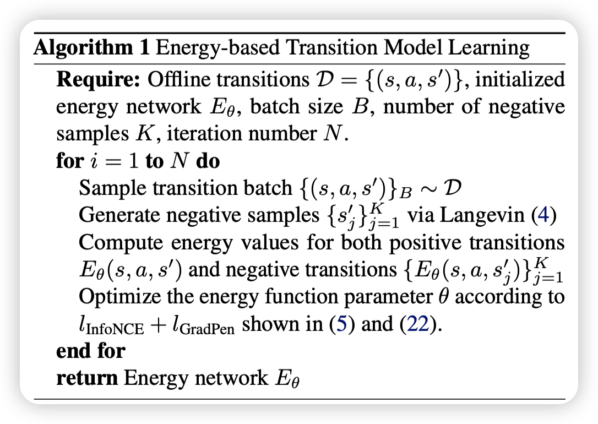

# 
 Offline Transition Modeling via Contrastive Energy Learning 

建议看之前的IBC这篇文章，这篇文章是基于IBC的一个延伸，IBC用implicit的能量模型做behavior cloning，这篇文章用explicit的能量模型做offline transition modeling，这两篇文章都是用contrastive learning来训练模型。

基本就是按照IBC论文，输入是(s,a)，以前的transition model是一个简单的神经网络，直接给出s'或者gaussian distribution，这里则用能量模型，是一个$E_{\theta}(s,a,s')$，我们去做argmin，使得$E_{\theta}(s,a,s')$在s'上最小，这样就能得到一个s'，这个s'就是我们的transition model的输出。

注意这里的argmin在实践中往往是梯度下降或者采样，得到的实际是一个set，这里就可以看出能量模型很好建模多峰。

具体怎么train和如何采样，请看IBM的blog，这里就不再赘述了。

文章额外分析了一下能量模型的$\mathcal{L}_{infoNCE}$这个对比学习和极大似然的关系。

比较有趣，这里总结一下：

### **InfoNCE 损失与最大似然（MLE）原理的推导**
本节的目标是**证明 InfoNCE 损失是最大似然估计（MLE）的一种鲁棒变体**，即 InfoNCE 近似 MLE，但对负样本分布误差更具鲁棒性。以下是详细推导过程。

### 背景说明：

我们有能量模型定义的条件分布：

\[
p_{\theta}(y|x) = \frac{\exp(-E_{\theta}(x, y))}{Z_{\theta}(x)}
\]

- \(E_{\theta}(x, y)\) 是能量函数。
- \(Z_{\theta}(x)=\int \exp(-E_{\theta}(x,y)) dy\) 是归一化项（难以精确计算）。

### 1. 最大似然（MLE）目标（原目标）

最大似然的目标是最大化观测数据的对数似然，即：

\[
\mathcal{L}_{\text{MLE}}(\theta) = \mathbb{E}_{(x,y)\sim D}[\log p_{\theta}(y|x)]
\]

对应的负对数似然（NLL）梯度为：

\[
\nabla_{\theta}[-\log p_{\theta}(y_i|x_i)]
= \nabla_{\theta}E_{\theta}(x_i,y_i) - \mathbb{E}_{p(y|x_i;\theta)}[\nabla_{\theta} E_{\theta}(x_i, y)]
\]

等价于最小化以下目标：

\[
l(x_i, y_i; \theta)=E_{\theta}(x_i, y_i)-\mathbb{E}_{p(y|x_i;\theta)}[E_{\theta}(x_i, y)]
\]

但上式难以直接计算，因为我们无法从真实分布 \( p(y|x_i;\theta) \) 精确地采样。

### **2. 引入对比散度（Contrastive Divergence, CD）近似**

为了规避难以从 \( p(y|x_i;\theta) \) 采样的问题，我们用 **对比散度**：

\[
l_{\text{CD}}(x_i, y_i; \theta) = E_{\theta}(x_i, y_i)-\mathbb{E}_{\hat{p}(y|x_i)}[E_{\theta}(x_i, y)]
\]

这里 \(\hat{p}(y|x_i)\) 为通过MCMC得到的近似负样本分布。

但是，\(\hat{p}(y|x_i)\) 与真实的 \(p(y|x_i;\theta)\) 总存在误差，我们考虑该误差受限于一个KL散度：

\[
D_{\text{KL}}(p(y|x_i; \theta)\|\hat{p}(y|x_i)) \leq \epsilon
\]

### **3. 从约束优化到对偶问题**

为容忍MCMC采样误差，定义下面的鲁棒优化问题：

\[
\max_{\bar{p}: D_{\text{KL}}(\bar{p}, \hat{p})\leq \epsilon}\left[E_{\theta}(x_i, y_i)-\mathbb{E}_{\bar{p}(y|x_i)}[E_{\theta}(x_i, y)]\right]
\]

引入Lagrange乘子 \(\lambda > 0\)，可得对偶优化问题：

\[
\max_{\bar{p}} \left[ E_{\theta}(x_i, y_i) - \mathbb{E}_{\bar{p}(y|x_i)}[E_{\theta}(x_i, y)] - \lambda D_{\text{KL}}(\bar{p}(y|x_i)\|\hat{p}(y|x_i)) \right]
\]

### **4. 对 \(\bar{p}(y|x_i)\) 求解**

固定 \(\lambda\)，对上述目标关于 \(\bar{p}(y|x_i)\) 求变分导数，并设为0：

设Lagrange函数为：

\[
\mathcal{L}(\bar{p}, \lambda)=E_{\theta}(x_i, y_i)-\int \bar{p}(y|x_i)E_{\theta}(x_i, y)dy - \lambda\int \bar{p}(y|x_i)\log\frac{\bar{p}(y|x_i)}{\hat{p}(y|x_i)}dy
\]

对 \(\bar{p}\) 求导，得：

\[
-E_{\theta}(x_i,y)-\lambda\left(\log\frac{\bar{p}(y|x_i)}{\hat{p}(y|x_i)}+1\right)=0
\]

整理得：

\[
\log\frac{\bar{p}(y|x_i)}{\hat{p}(y|x_i)} = -1 - \frac{1}{\lambda}E_{\theta}(x_i, y)
\]

从而得到最优分布的表达式：

\[
\bar{p}(y|x_i)=\frac{\hat{p}(y|x_i)\exp(-\frac{1}{\lambda}E_{\theta}(x_i,y))}{Z'(x_i)}
\]

其中 \(Z'(x_i)\) 为归一化常数：

\[
Z'(x_i)=\int\hat{p}(y|x_i)\exp(-\frac{1}{\lambda}E_{\theta}(x_i,y))dy
\]

### **5. 将最优解代回原问题得最终目标**

将上面的最优解代入对偶问题中，整理后得到最终优化目标：

\[
E_{\theta}(x_i,y_i)+\lambda\log\mathbb{E}_{\hat{p}(y|x_i)}\left[\exp\left(-\frac{1}{\lambda}E_{\theta}(x_i,y)\right)\right]
\]

此即论文中的公式(9)。

## **6. InfoNCE 损失的近似形式**

回忆 InfoNCE损失函数：

\[
\mathcal{L}_{\text{InfoNCE}}=-\log\frac{\exp(-E_{\theta}(x_i,y_i))}{\sum_{j=1}^{K}\exp(-E_{\theta}(x_i,y_j))}
\]

当负样本 \(K\) 足够大时，有：

\[
\frac{1}{K}\sum_{j=1}^{K}\exp(-E_{\theta}(x_i,y_j)) \approx \mathbb{E}_{\hat{p}(y|x_i)}[\exp(-E_{\theta}(x_i,y))]
\]

代回得到：

\[
\mathcal{L}_{\text{InfoNCE}}\approx-\log\frac{\exp(-E_{\theta}(x_i,y_i))}{K\mathbb{E}_{\hat{p}(y|x_i)}[\exp(-E_{\theta}(x_i,y))]}
\]

舍去常数项\(\log K\)，得：

\[
\mathcal{L}_{\text{InfoNCE}}\approx E_{\theta}(x_i,y_i)+\log\mathbb{E}_{\hat{p}(y|x_i)}[\exp(-E_{\theta}(x_i,y))]
\]

与上面的对偶问题的目标（公式9）完全一致，只差一个常数因子。

---

## **结论：**

- InfoNCE 损失可以看作最大似然训练的一种鲁棒变体。
- 相比于直接最大似然，它能够容忍负样本分布与真实分布之间的误差（即MCMC采样误差）。
- 因此，**InfoNCE 既是一种最大似然近似，也是一种更鲁棒的训练方法**。

----

## Framework

### Overall Model Learning Framework
The learning process of energy-based transition models issummarized in Algorithm 1. We use fully-connected net-works with the same hidden layers and widths as in forward transition models to represent the energy function in later ex-periments for fair comparisons. The reward function r(s, a)can either be jointly learned by adding an extra dimensionto s′, or separately incorporates a standard reward model.The detailed hyperparameter setting is listed in Appendix C.

---

## Related Work and Conclusion

下面是对论文“Energy-based Transition Models”中相关工作和结论部分的总结与分析：

### **1. 相关工作综述**

**转移模型（Transition Modeling）：**
- **传统方法**：标准转移模型通常使用概率前馈网络来直接输出状态预测的均值和方差，通常假设状态服从对角高斯分布（例如 Chua et al., 2018）。这种方法虽然计算简单，但难以捕捉复杂的动态特性。
- **改进方法**：随后有研究提出采用自回归模型或 Transformer 架构来表示轨迹分布，从而更好地刻画状态转移中的依赖关系。同时，还有工作通过对抗训练来缓解累积误差问题，或通过逆向强化学习学习具有泛化性的动态奖励。
- **重放缓冲区**：也被视为一种非参数的转移模型，用于保存所有过往的转移经验，并通过经验重放来增强策略学习。

**离线模型基强化学习（Offline Model-based RL）：**
- 离线 RL 利用从静态离线数据中学习到的转移动态模型来生成 rollouts，从而辅助策略优化。但由于数据有限，模型误差容易被放大，因此近年来很多方法都加入了保守性设计，如利用不确定性估计或者限制策略在数据分布附近进行探索。

**离策略评估（Off-Policy Evaluation, OPE）：**
- 现有 OPE 方法主要包括基于拟合 Q 值、重要性采样、双重稳健方法以及直接利用模型 rollouts 的方法。有的工作还尝试将模型 rollouts 与值函数拟合结合起来，进一步提高评估的准确性。

**能量基模型（Energy-based Models, EBMs）：**
- 能量基模型在分布建模领域已有丰富历史（如 LeCun et al., 2006; Song & Kingma, 2021），其训练通常依赖于 Langevin MCMC 采样。近年来，EBM 在计算机视觉（例如生成图像建模）、条件概率回归以及模仿学习与规划任务中均展现出出色的性能。
- 本文尝试将能量基方法应用于转移动态建模，提出了能量基转移模型（ETM），以应对前向转移模型在处理不连续和复杂动态时的局限性。

---

### **2. 结论与局限性**

**核心结论：**
- **ETM 的优势**：论文证明了能量基转移模型（ETM）在离线控制任务中具有很大潜力，特别是在捕捉真实环境中普遍存在的不连续转移行为上。实验证明，ETM 不仅能更好地泛化到分布外数据，而且在离策略评估（OPE）任务中表现出显著改进，进而提升了离线 RL 中模型基策略优化的效果。
- **理论支撑**：通过使用对比学习目标（InfoNCE 损失），ETM 能够在不直接预测下一个状态的情况下，通过优化能量函数来隐式定义转移概率分布。这使得模型可以灵活地表示复杂、多模态甚至不连续的动态行为，而不需要依赖于对角高斯这种严格假设。

**局限性：**
- **推理时间成本**：ETM 的一个主要不足在于推理过程中需要迭代的梯度采样（如 Langevin MCMC），这导致其推理时间显著高于标准前馈模型（FTM）。例如，ETM 在推理时大约需要 FTMs 的 5 倍时间；在实际应用中，如 EMPO 算法中，整体训练时间也会增加约 40%。
- **改进方向**：这一限制可以通过引入更高效的采样技术或采用参数化模型来减少对迭代搜索的依赖，从而提升实时性和效率。

---

### **3. 总结分析**

论文的核心贡献在于：
- **提出了基于能量的转移模型（ETM）**，解决了传统前向模型在面对真实世界复杂、非平滑、甚至不连续动态时的泛化不足问题。
- **利用对比学习（InfoNCE 损失）训练能量函数**，使得模型能够灵活地表达复杂转移分布，而无需受限于传统概率分布的假设。
- **在离策略评估与离线 RL 任务中**，ETM 展现出更低的预测误差和更好的策略评估性能，证明了其在实际应用中的优势。

尽管 ETM 的迭代采样带来了额外的计算开销，但其在捕捉真实环境动态、提高模型泛化能力和稳定性方面展现出的优势，使其成为离线控制和离策略评估领域一种有前景的模型化方法。
