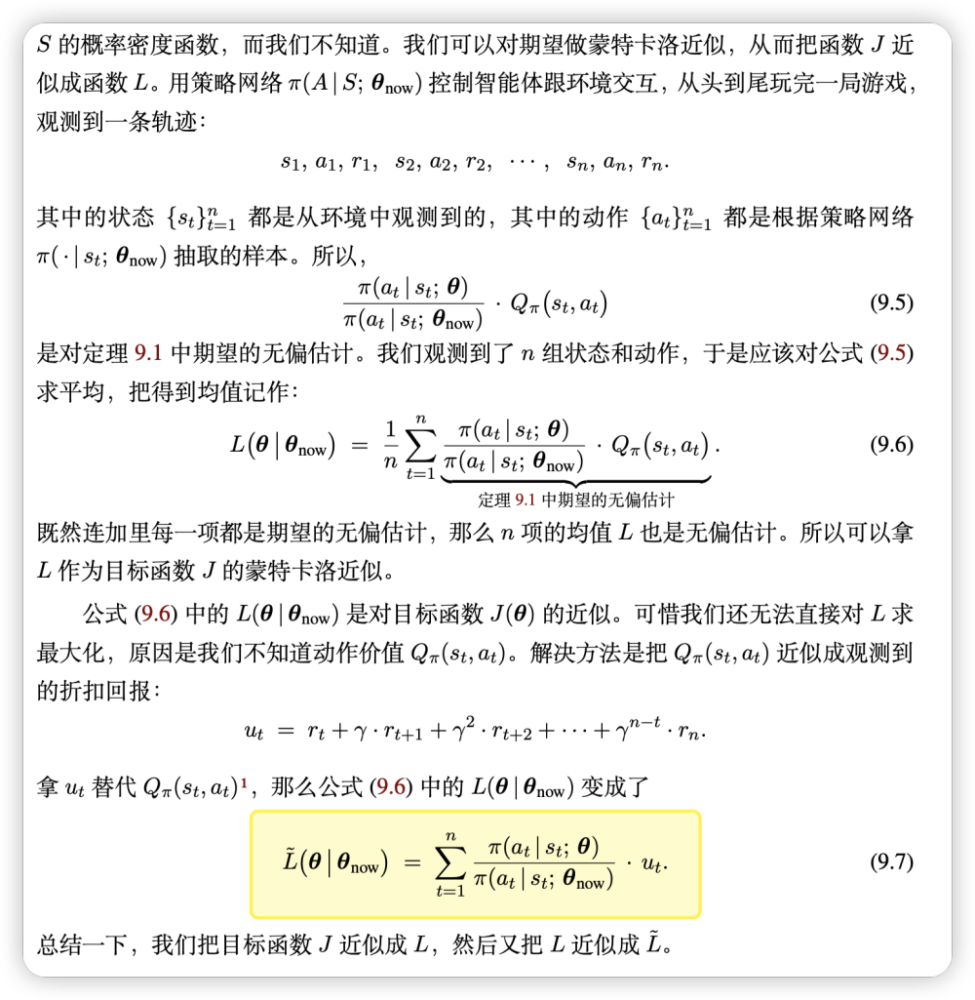

# 
 Proximal Policy Optimization(PPO) 

#### 
 detect0530@gmail.com 

## Background: PG and TRPO

#### Policy Gradient

我们使用策略网络进行决策，对于每一版的policy network，我们使用on-policy的方法获得数据，并使用这些数据更新网络，得到下一版的policy network。

更新过程其实就是根据Reward来调整给每一个action分配的权重。

**Tips:**
- 增加一个基线
    原始算法我们用reward的大小作为引导，但是reward设计的不好时，由于采取动作都会有奖励，一是有noise，二是这样引导会错过一些未访问过的good action。于是我们引入基线（一般设置为V(s),表示所有采样序列的平均奖励），高于基线，给正奖励；低于基线，给负奖励。
    
- 折扣因子
    降低未来reward的权重，只需要对奖励序列的求和计算增加一个gamma因子即可。
- 优势函数
    回顾之前的算法，对于一个采样序列中的数据点，我们都是用相同的$R(\gamma)$作为系数，这样很粗糙。实际上好的做法是从当前$(s,a)$开始用后缀奖励和减去基线，这样就是优势函数。
    $$A^{\theta}(s_t,a_t) = \sum_{t'>t}\gamma^{t'-t}r^{t'} - V_{\phi}(s_t)$$

    这样一来，我们的优势函数准确地刻画了当前状态下采取当前动作相较于其它动作的优势，这样我们就可以用优势函数来更新策略网络。

#### TRPO

TRPO是PG的一种改进，主要是解决PG的收敛性问题。TRPO的核心思想是，我们不再使用原始的PG更新策略，而是使用一种叫做trust region的方法来更新策略。

具体的讲解在我过去的blog有，这里不再对细节做赘述。

总的来说，TRPO在旧的网络上做出调整，使得对$J(\theta)$的蒙特卡洛无偏估计尽可能得大，同时保证KL散度的变化不会太大。

## Proximal Policy Optimization(PPO)

因为传统的PG算法都是on-policy，意味着当前收集的数据只能用一次，这样效率很低，policy更新一次就有需要再跑一次策略去采样。

为了提高我们的训练速度，并且让采样得到的数据可以重复使用，我们用另一个相近的策略网络来采样，然后用IS(Importance Sampling)的方法让policy在这些数据上可以反复update。

当然通过这种采样方式的分布p和q不能差距过大，否则，会由于采样的偏离带来谬误。

回到我们的PPO中，我们在用旧的网络采集数据后，进行多次更新，但是每次更新会对梯度做一个重要度采样。

最后，结合上述优势函数等tips，我们最终得到：

$$\nabla R = E_{\gamma \sim p_{\theta'(\gamma)}}[\frac{p_{\theta}}{p_\theta'}A\nabla \log p_{\theta}(\gamma)] = \sum_{t=1}^T\frac{p_{\theta}(a_t|s_t)}{p_{\theta'}(a_t|s_t)}A_t(s_t,a_t) \nabla \log p_{\theta}(a_t|s_t)$$

$$A^{\theta}(s_t,a_t) = \sum_{t'>t}\gamma^{t'-t}r^{t'} - V_{\phi}(s_t)$$

同时，依据重要性采样原则，$p_{\theta}$和$p_{\theta'}$不能差别太远了。(因为这个原因，用旧数据也不宜update太多次)

一般对此有两种方法：

- 引入KL散度作为惩罚项 
- 用clip的方法，限制比值的大小

Well,现在我们只需要找到方法更新critic函数就可以了，$V_{\phi}(s)$的估计可以用已经存在的trajectory来诱导，不断的用采样数据（真实数据）去更新critic网络（预测数据）。

网上看到一个贴切的ppo解读：

