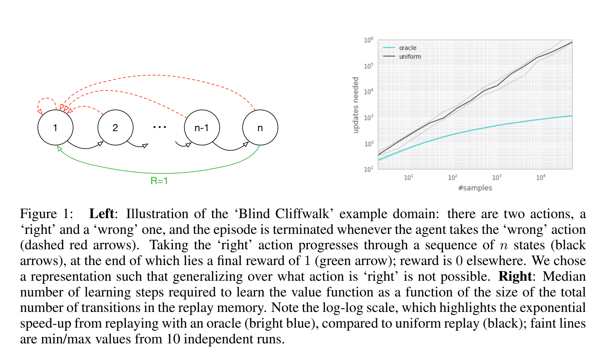
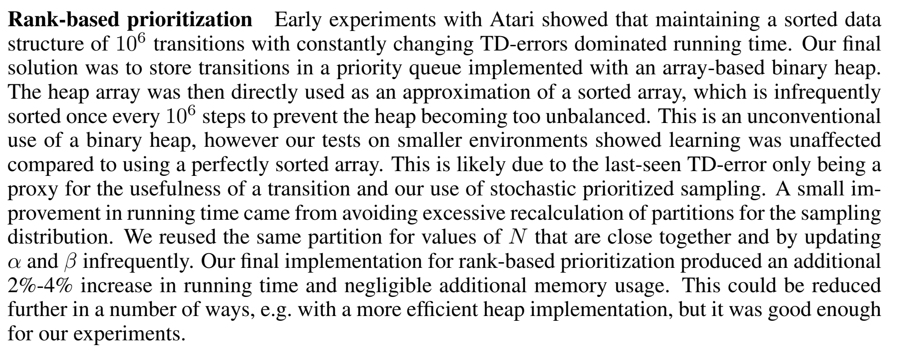
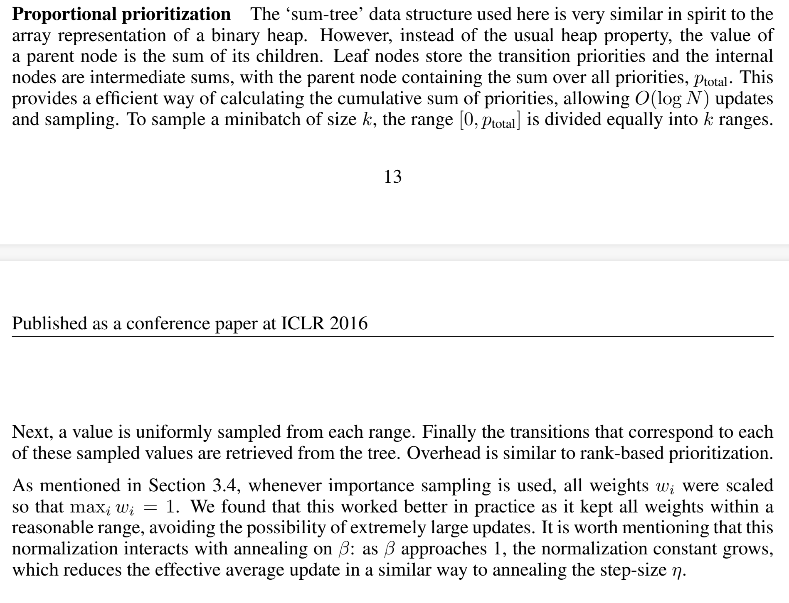
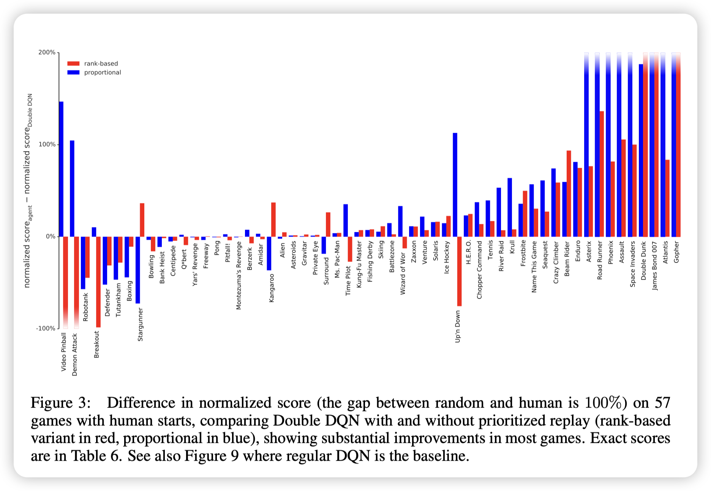
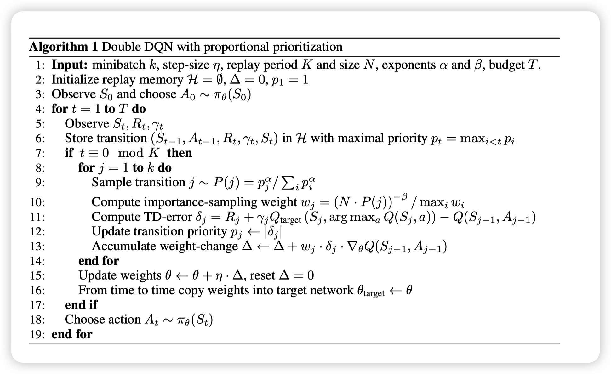
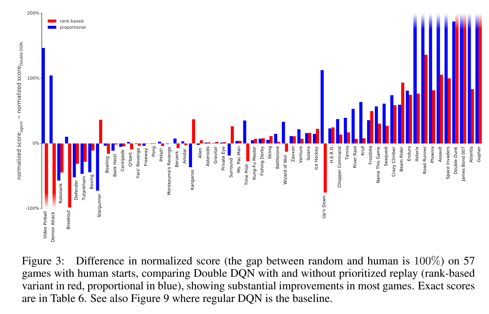

### Experience replay的演化

online RL:缺点：经验之间是correlated的，不满足stochastic gradient-decent的要求。另外，有用的好经验被使用一次后就遗忘了。

普通的experience replay可以记下经验，然后抽样更新参数，这样一方面减少了对打量经验的需求，转而用更多的计算力和内存（经常比RL agent和环境交互更cheaper）

而Prioritized experience replay further liberates the agents from considering transitions with the same frequency that they are experienced.

### 一些tricks
总的来说，用TD error来衡量经验的重要性，但是这样有两个问题：

(a) loss of diversity，影响stochastic gradient descent的性能。
(b) introduce bias，需要我们用importance sampling去纠正。

这样一来可以更快，并且state-of-the-art

background: 过去有类似的方法，在supervised learning中有用positive/negative分别抽样去做replay，在某些特定领域这些做法也有较好但是表现。

现在我们对prioritized experience replay引入stochastic sampling，这样可以保持diversity，同时也可以加速并提升训练质量。

### 启发实验

在一个只有rare action才能有收益的环境中，考虑收益大的action是很有用得，因为一旦得到宝贵的分数，就可以据此来更新，而不是还要经历一个随机uniform抽样过程。

在log-log右图中，可以看到oracle的经验选择在指数上遥遥领先于uniform sampling。

理想的priority标准应该是RL从transition中学习的速度，但是这个值不能直接获得，一个合理的代替是用TD-error，which indicates how surprising a transition is.（但是对于reward有noise的情况可能会不太准）

和之前的uniform choose和oracle相比，TD-error-greedy-choose也能有指数级别的提升，同时为了保证至少抽样一次，在经验第一次加入时外面将其优先级设置为最高。

#### 但是直接按照greedy-priority会有问题：
- TD-error较低的transition在很长时间不会再被replay
- 同时在reward有noise的情况下在bootstrapping中会恶化。
- diversity缺失，因为这样attention全在一个较小的subset里，意味着容易过拟合。

未来解决这些问题，我们在pure priority和uniform中平衡，我吗需要保证所有的transition都有大于0的概率被抽样，同时又要根据不同的TD-error设置不同的抽样概率。

其中平衡的degree由超参数$\alpha$决定。

其中$P_i$就是我们设定的有限度。

#### $P_i$的表示方法

- $p_i=|\delta_i+\epsilon|$
- $p_i=\frac{1}{rank(i)}$

两者都是随着$\delta$单调的，但是后者更robust，因为和具体的量级不敏感。

实现上来看，因为N（经验回放数组）一般非常大，所以我们希望抽样k（batch）的时间与N无关。论文中采用分段抽样的方法，根据N，k，$\alpha$提前计算好分块，每次从k块里每个块uniformly抽一个，近似上述公式的抽样效果。

Rank-based prioritization

用数组实现的二叉堆确保大概是有序的，然后在上面做sample，同时隔一段时间sort一次防止过于不平衡。

Proportional prioritization

----

### Importance sample

然而，使用prioritized 经验放回算法是有缺陷的，因为收敛正确性的假设与pure stochastic gradient decent有关，但是显然，即使上述修正过的优先抽样算法也会introduce bias，影响最后收敛的结果。

所以我们需要尽可能修正这个bias，和sutton书中off-policy中更具概率调整评估值比较相似。

$$W_i = (\frac{1}{N}\cdot\frac{1}{P(i)}^{\beta})$$

当$\beta$是1时，就是一个完全概率补偿，为了更稳定，所有$W$都要乘以$max(w_i)$，确保$W_i$小于1.

在最后一步计算梯度时，乘上$W_i$即可。（优先度依然是按照pure TD-error计算。）

虽然保持$\beta$为1可以是unbiased，但是这样会降低我们优先sampling的效果，所以我们采用退火的想法，$\beta$从初始值$\beta_0$(接近0的较小值)到最后的1，这样可以兼顾两者的好处。

同时importance sample还有一个好处，因为在deep network中一阶泰勒近似只在local field成立，步长不能太大，而优先TD-error一定是大的，但是引入importance sample和会被中和，对梯度下降也是好事。

### 实验制定

- 1e6经验空间
- 32batch 每次进4个
- reward和TD-error都被截断到$[-1,1]$ （更稳定）
- 其他结构和传统DQN相同
- 学习率下调4倍 因为相对梯度都比较大

rank形式的优先抽样会更好
- 分布图是heavy-tail，更保证抽样的diversity，同时minibatch gradient保持在一个相对稳定的大小。
- 在reward稀疏和noisy时候，不会太受影响，因为对相对error不敏感。

优先经验回放还有这样的好处：

- 确保至少抽到一次（对于没抽样的bonus）
- 不会太会只抽到一次，越旧的不会再更新，因为已经有很多机会更新了。越新的transition说明value evaluation越不准确。

总的来说，所提出的假设表明，在类别不平衡的数据集中，训练过程可能会无意中更加关注罕见类别，并且会策略性地选择来自常见类别的样本，以改善模型的性能，类似于硬负样本挖掘的效果。

### 一些思路拓展

- 制造很多并发但是异构的actor（不同的exploration hyperparameter），我们的优先度决策可以指导运算资源的分配。

内存里的优先经验存放的机制很灵活：

- 可以删除经验，因为以及被频繁访问的经验或者没有价值的经验没有用处了。
- 删除同时应该强调diversity，比如更具how old they are进行调节，已保留足够的旧经验来防止循环。
- 可以继承其他（如人类专家）的经验数据，如保留一定比列的外部经验。

diversity:

- 按照不同priority分开抽样
- 制定奖励分，一个transition越久不replay就越加分。（可以维护一个全局步数轻松实现）

- Reverse replay: 发现一个change很大的s，我们反向拓展可能会到s的节点s',调高s'的优先度。

### 实验结果

实现伪代码：

在数据不平衡时，优先度经验回放works

IS:让学习不再那么激进，在初始阶段会慢一些，但是更小概率会不成熟收敛，同时sometimes ultimately better results.

。

