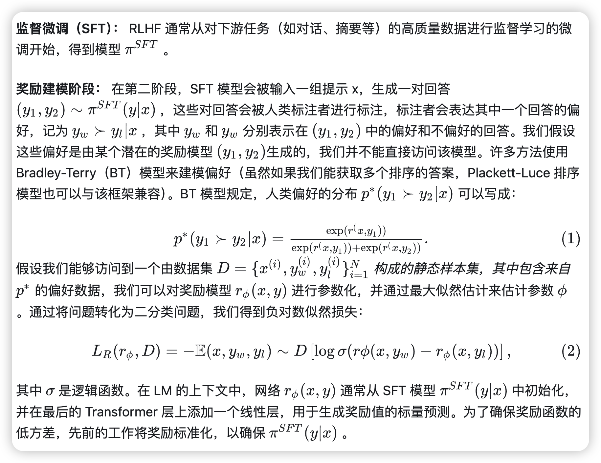

# 
 RLHF and DPO 

#### 
 detect0530@gmail.com 

## RLHF

我们回顾一下 Ziegler 等人提出的 RLHF 管道（后续工作）通常包括三个阶段：

1.监督微调（SFT）；2. 偏好采样和奖励学习；3. 强化学习优化。

(2)式就是把负对数似然函数作为loss function，用了点恒等变形如下：

## DPO

#### 一个很好的 **[博客link](https://zhuanlan.zhihu.com/p/5553806141)**

虽然大规模无监督语言模型（LMs）能够学习广泛的世界知识和一定的推理技能，但由于其训练过程完全无监督，要实现对其行为的精确控制是非常困难的。现有的方法通过收集模型生成的相对质量的人类标注，微调无监督LM以符合这些偏好，通常采用从人类反馈中进行的强化学习（RLHF）。然而，RLHF是一种复杂且通常不稳定的过程，首先需要拟合反映人类偏好的奖励模型，然后使用强化学习来微调无监督LM以最大化这一估计的奖励，同时避免与原始模型偏离过远。本文提出了一种新的奖励模型参数化方法，使得可以通过封闭形式提取相应的最优策略，从而仅需通过一个简单的分类损失来解决标准的RLHF问题。所提出的算法称为“直接偏好优化”（Direct Preference Optimization，DPO），其稳定、高效且计算负担轻，无需在微调过程中从LM采样或进行大量超参数调整。

DPO中三个非常重要的loss函数：

详细过程看博客link。

### Step

针对 ppo 的 loss 函数进行变换。

构造：

证明了PPO最优解就是这个式子。

也就是说，在已知 Reward_model 的参数$r_\phi$的情况下，我们可以求得 PPO 的最优解$\pi^\star$；那如果我们已知 PPO 的最优解$\pi^\star$，是不是也可以反向求解$r_\phi$呢？

然后直接用收集的资讯来train策略网络，而不是先train好reward model再train策略网络。

这是个数学上直接对齐的过程。

## DPO广义上也是inverse RL的一种

原本RLHF是Reward Model+RL，而DPO是纯粹的Reward Model，作者证明了一下DPO也是inverse Q-Learning（Rl）的一种。

具体的过程看博客link。

## DPO局限性
从数学公式来看，可以看出DPO的推导非常完美，在更新DPO的同时也就是在更新RLHF的reward model。然而从很多文章和实验中可以发现，DPO的效果并不好，这是为什么呢？

其实DPO和RLHF的关系很像AE和VAE之间的关系。AE最大的问题就是因为数据量本身的少，导致其训练数据的隐变量无法覆盖整个隐变量空间（VAE用高斯分布将数据的隐变量限制在了很小的区域），从而导致隐变量空间存在很多无用的区域。DPO也是这样，由于不可能存在无限多的数据，DPO只能将训练数据下的偏好完美的和reward model预测出来的偏好对齐，但一旦涉及数据集分布外的数据，DPO就无能为例了，而传统的RLHF的方式可以让大模型本身提供一些没有见过数据，并利用reward model的泛化性来辅助大模型的训练。

简单来说就是DPO训练的policy是和reward model在一起的，只利用到了数据集本身的数据，没有一个向外自由探索的过程。