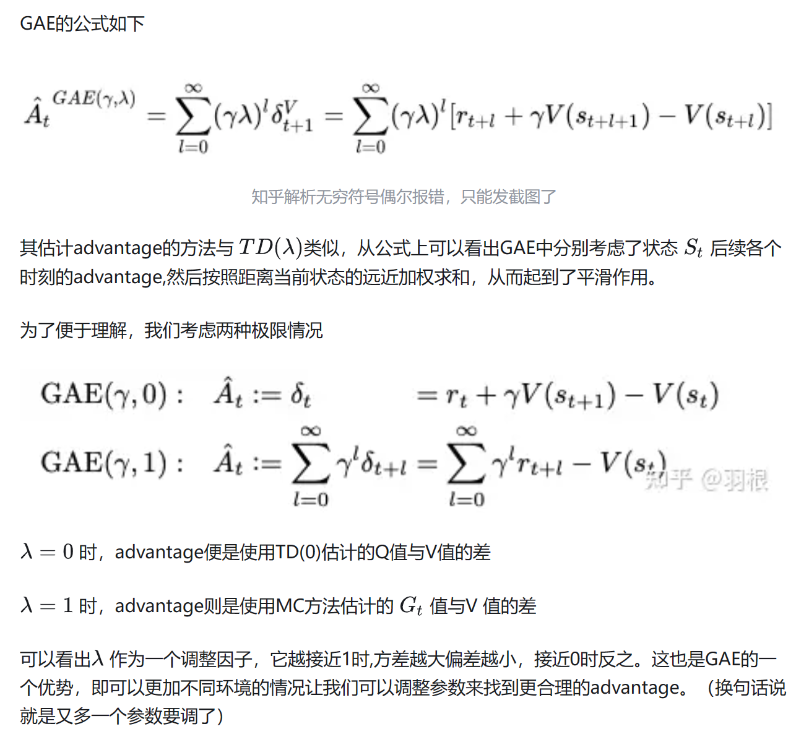

### Advantage and GAE

- [zhihu-Link](https://zhuanlan.zhihu.com/p/343943792)

上文从为什么在Policy base的强化学习中引入Advantage概念开始讲起（用于控制policy在梯度方向上的更新幅度），最后引入GAE（Generalized Advantage Estimation）的概念，用于解决Advantage的估计问题。