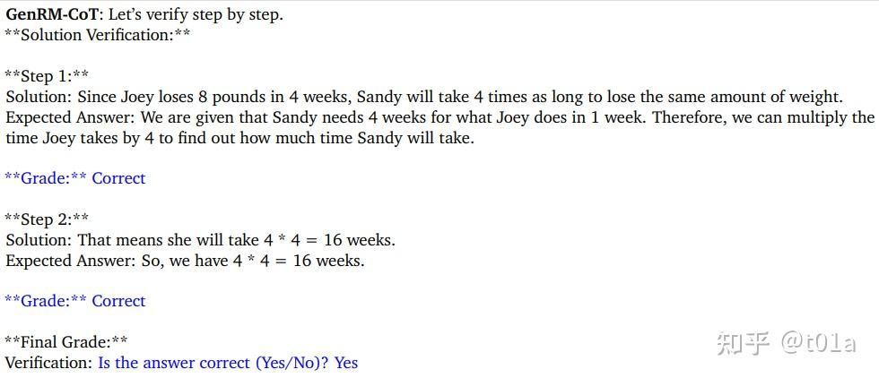

# <center> Generative Verifiers: Reward Modeling as Next-Token Prediction </center>


## 过去的几种奖励模型


## Background

这篇文章是Generative RM的一个变种，目标用微调过的RM预测客观问题答案的对错。对于数学、逻辑推理等领域的问题，通常存在一套客观的标准或规则判断答案的正确性，但准确判断的成本不一定低；比如有多种解法的几何证明题，或者一些结果正确过程错误的解答等，故也可以用RM去做这类客观问题的批量回答评分。

## Step 1


这里我们对原始llm利用标记的数据做sft，帮助其更好地对齐输出。

## Step 2

更进一步，我们可以认为LLM的生成能力和判别能力是相互促进的；模型本身有能力生成正确答案的话，对于答案判别的准确度也会更高。因此我们可以直接把$y^+$拿来训练模型，提高模型的生成能力；


为什么还要分成两个 loss 项，\(\mathcal{L}_{\text{SFT}}(\theta, D_{\text{verify}})\) 和 \(\lambda \mathcal{L}_{\text{SFT}}(\theta, D_{\text{correct}})\)？

### 1️⃣ 表达语义不同（判断能力 vs 生成能力）

- **\(\mathcal{L}_{\text{SFT}}(\theta, D_{\text{verify}})\)**
  是在训练一个 **“判断器”**：看到一个答案（正确或错误），学会回答 Yes / No
  → 这是**分类任务 / 判断任务**，目标是提升判断正确性的能力。

- **\(\mathcal{L}_{\text{SFT}}(\theta, D_{\text{correct}})\)**
  是在训练模型去 **生成** 正确答案
  → 这是**生成任务 / 语言建模任务**，目标是提高生成质量。

所以两者本质上训练目标不同。**不是只是权重的问题，而是任务范式完全不同**。

### 2️⃣ 两个数据集结构不同，分开更清晰

- `D_verify` 的样本格式是：
  ```text
  Prompt: Is the answer correct?
  Input: (x, y⁺) or (x, y⁻)
  Target: "Yes" or "No"
  ```

- `D_correct` 的样本格式是：
  ```text
  Prompt: x
  Target: y⁺（正确答案）
  ```

所以两个数据集的输入输出结构根本不同。

### 3️⃣ 两种能力可以独立调控（通过 λ）

引入一个超参数 \(\lambda\)，可以调节“生成能力”和“判断能力”之间的权重：

\[
\mathcal{L}_{\text{GenRM}} = \mathcal{L}_{\text{verify}} + \lambda \cdot \mathcal{L}_{\text{correct}}
\]

这样我们就能：

- 调大 \(\lambda\)：更重视生成质量
- 调小 \(\lambda\)：更专注于提升判断准确率

## Step 3

再进一步，我们可以利用let's verify step by step[2]的chain of thought(COT)思想，让LLM先逐步判断答案每个步骤的准确性，最后再输出答案整体yes or no，如图所示；



## 💡 什么是 GenRM-CoT？如何让模型学会“逐步验证”答案的正确性？

在复杂任务中，仅靠判断一个答案是否正确可能不够可靠。我们希望大模型不仅能判断“对 or 错”，还能像人类一样**一步步分析、验证答案是否合理**。为此，GenRM-CoT（生成式奖励模型 + Chain-of-Thought）提出了一种训练范式，让模型学会“逐步推理+最终判断”。


### 🧱 训练数据的构造

GenRM-CoT 的训练数据引入了 Chain-of-Thought 推理路径，每条样本包括以下内容：

- \(x\)：输入问题（Prompt）
- \(y^+\) / \(y^-\)：模型生成的回答（正确 / 错误）
- \(I_{\text{CoT}}\)：固定提示，引导模型进入逐步验证模式（如 `"Let’s verify step by step."`）
- \(v_{\text{CoT}}\)：模型生成的逐步推理过程
- \(I\)：最终判断提示（如 `"Is the answer correct (Yes/No)?"`）
- Label：回答应为 "Yes" 或 "No"

样本形式如下：

\[
D_{\text{CoT}} = \left\{(x, y^+, I_{\text{CoT}}), (v_{\text{CoT}}, I, \text{‘Yes’})\right\} \cup \left\{(x, y^-, I_{\text{CoT}}), (v_{\text{CoT}}, I, \text{‘No’})\right\}
\]


### 📌 举个例子

假设输入问题是：

> **Mary has 4 classes a week for 4 weeks. How many classes in total?**

- 答案 \(y^+\)：`4 * 4 = 16 classes`
- 引导提示 \(I_{\text{CoT}}\)：`Let’s verify step by step.`
- 推理路径 \(v_{\text{CoT}}\)：
  `Step 1: Mary has 4 classes/week.`
  `Step 2: 4 weeks × 4 classes/week = 16 classes.`
- 最终判断提示 \(I\)：`Is the answer correct (Yes/No)?`
- 标签：`Yes`

### 🔁 Majority Voting 机制提升准确性

为了提升判断的稳定性和鲁棒性，GenRM-CoT 支持“多次推理再判断”。即：

> 对同一个输入 \(x, y\)，生成多条推理路径 \(v_{\text{CoT}}^{(i)}\)，然后分别判断其答案是否正确，最后对结果取平均。

其打分公式如下：

\[
r_{\text{MajV@K}}(x, y) = \frac{1}{K} \sum_{i=1}^{K} p_\theta(\text{Yes} \mid x, y, I_{\text{CoT}}, v_{\text{CoT}}^{(i)}, I)
\]

这种方式可以显著减少偶然推理误判带来的影响，进一步提高整体判断准确性。


### ✅ 总结

GenRM-CoT 提供了一种更强的监督方式：让模型不仅判断答案对错，更要学会**分步骤解释和验证**。结合 Majority Voting 等机制，还能增强稳定性与鲁棒性，是当前 LLM 奖励建模和评估中非常值得关注的技术路径。


## Result

本文主要通过Best-of-N的方式评价不同RM；即计算对一个问题用某个LLM sample多次回答，再用RM挑选得分最高的回答，用这个回答评测准确率，即下限为随机挑选（等价pass@1），上限为选到了质量最高的回答(等价于pass@N)。整体上GenRM-CoT相对已有方法有一定的优势；


其中LLM-as-a-judge是直接用未额外训练的LLM做判断，DPO是使用DPO loss对LLM做训练，再根据不同答案生成的概率做判别；Discriminative RM是指传统的Sequence Classifiers。

另一方面，GenRM-CoT做best-of-N时，可以使用更少的N生成和Discriminative RM best-of-N质量一样的回答；


实质上等于节约了推理时消耗的算力。

以及对sft on correction、cot、majority voting的分别消融试验；


说明correct的学习和Cot思维链和投票机制是有效果的。


**整体上的话本文等于是用SFT+COT+Maj@N结合起来做出了有竞争力的Generative RM**