# Self-Attention 机制

## 场景

输入不只是一个向量，有可能是一个向量组，且向量长度和向量组集合大小都不确定。

比如文本输入，一段文本可以看作是一个向量组，每个向量是一个词向量，向量组的大小是文本的长度。

但是这些文本如果按照简单的编码是不定长，且文本的order对其解读有很大影响。传统的输入方式以上特征都无法满足。

(to learn more: word embedding in weblink)

又比如声音信号：（也是一堆向量组成的向量组）

图也可以作为，比如人际关系图中，每个人的attributes可以看作是一个向量。同时向量之间是有联系的。 

## 一些输入输出的例子：

- 每个向量都有输出

e.g. 词性判断、语音识别、购物推荐

- 只输出一个lable就好

e.g. sentiment analyisis、speaker recognition

- 机器自己决定输出（sequence to sequence）

e.g. 翻译、语音辨识

## 初步考虑

### Windows

如果我们需要关联上下文，是不是开一个足够大的windows就好了呢？

如图我们开了一个全连接的windows，可以包含所有的内容，自然可以顾及到上下文。

**但是计算了非常大，也意味着容易过拟合。**

### Self-Attention

Self-Attention处理整个sequence的资讯，FC专注于处理某个位置上的资讯。

交替使用self-attention和FC，可以达到很好的效果。
(Attention is all you need  by google)

## Self-Attention

既然叫作self-attention，我们的第一个问题就是如何评估attention，即，如何评估两个向量之间的相关性？

两个vector分别经过$W_q$和$W_k$的矩阵线性变化，再做dot product，得到一个标量，用来表示两个向量的相关性。

注意最后的$\alpha$向量，经过normalization后（这里是softmax），可以体现为相关系的评估。

最后所有初始向量再经过$W_v$线性变化，与归一化后的$alpha$ 向量做dot product，得到最后的输出。

可以想见的是，如果$alpha$向量中的某个值很大，那么对应的向量就会被放大，反之则会被压缩。于是如果$\alpha_i$与$\alpha_1$关联性大，说明$\alpha_i$占比大，意味着$b_1$更接近$v_i$。

于是谁的attention分数越大，就会dominate抽出来的结果$v_i$。

整体流程：

注意到对于每一个输入的向量，可以并行处理。

### Multi-Head Attention

实际上就是每个输入多开一组变化矩阵，然后把结果concat起来。（conca过程又引入线性变化的矩阵参数$W_o$

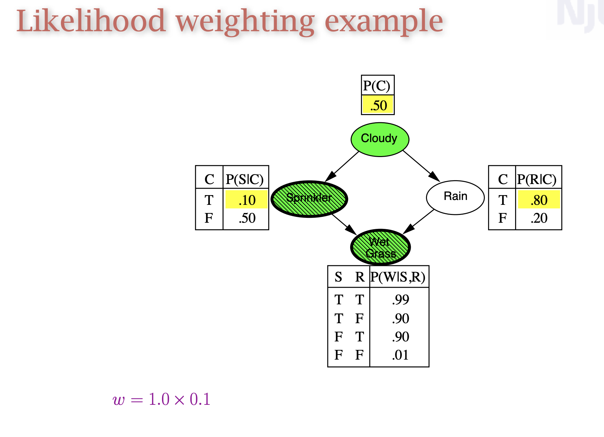

应用场景，比如翻译，可以用不同的head来关注不同的词性，比如名词、动词、形容词等。相关这件事情，有很多种不同的形式定义，不同的$q,k$负责不同的相关性。

### 位置编码

对于self-attention，我们需要考虑到位置信息，因为位置order也包含了很多有效信息。但是上述方法并没有考虑到位置信息。

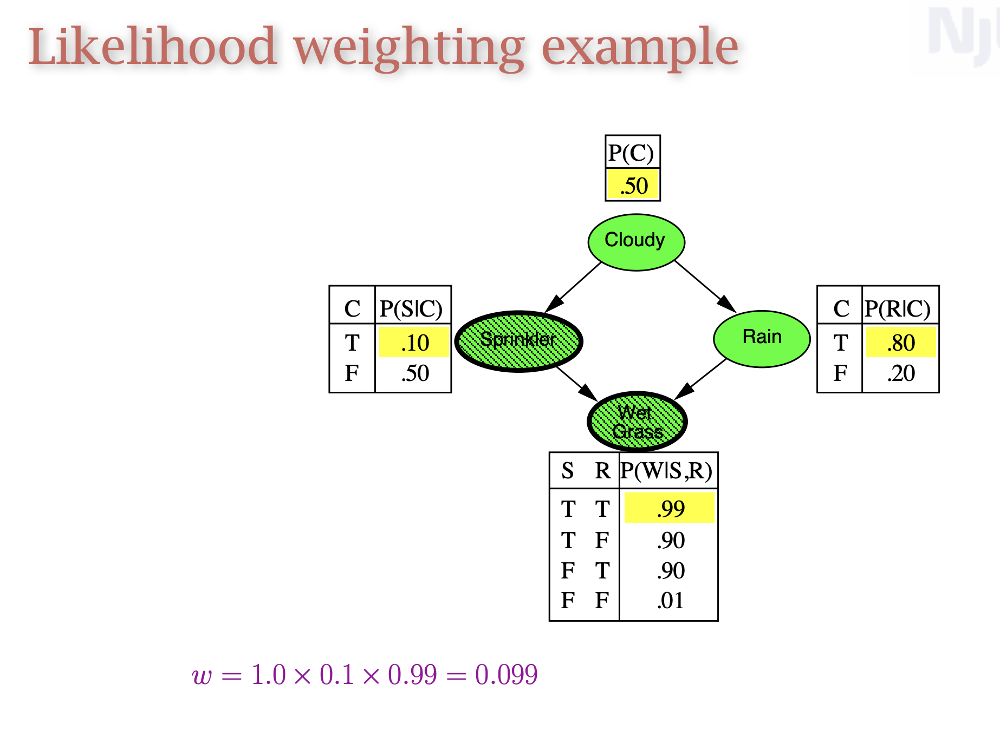

很朴素的考虑，单独设置一个位置向量，然后和输入向量相接，就可以把位置信息加入到输入向量中。

## Application

### NLP

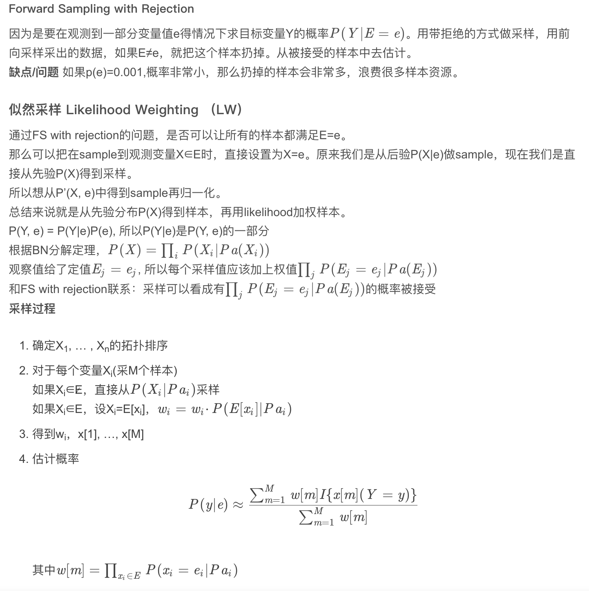

直接对口的NLP,现在主流的语言模型都运用了self-attention。

### Phone Recognition

需要一点调整：语音用声音信号表示太长了，所以只用截取相临近的一段就可以了。（HW2）

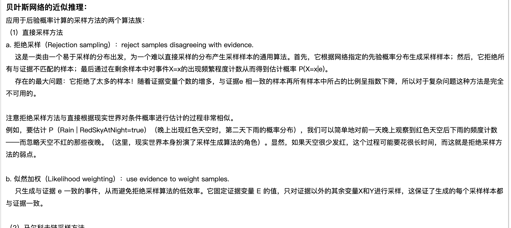

### Image

也可以看成是一个向量组，每个向量是一个pixel，长度是channel的数量。

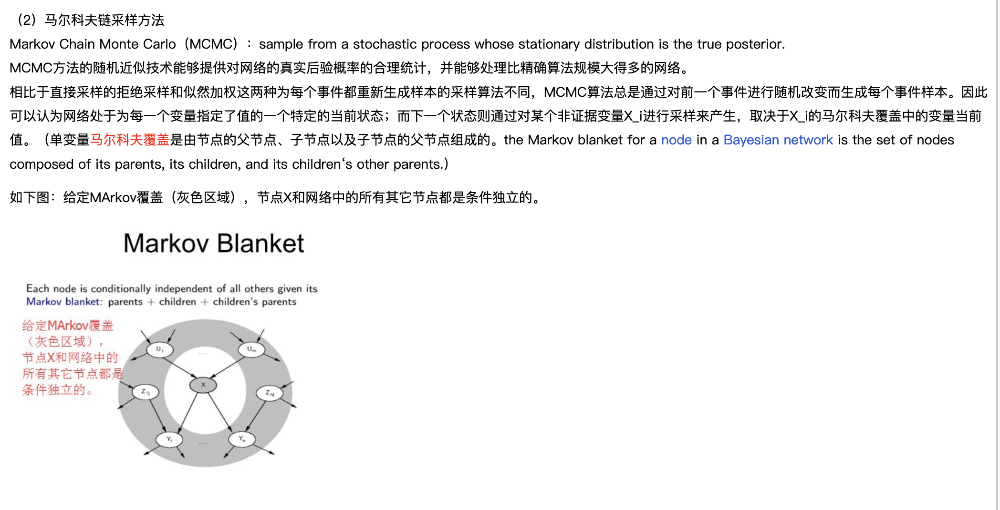

由此我们进一步思考CNN和Self-Attention的关系。

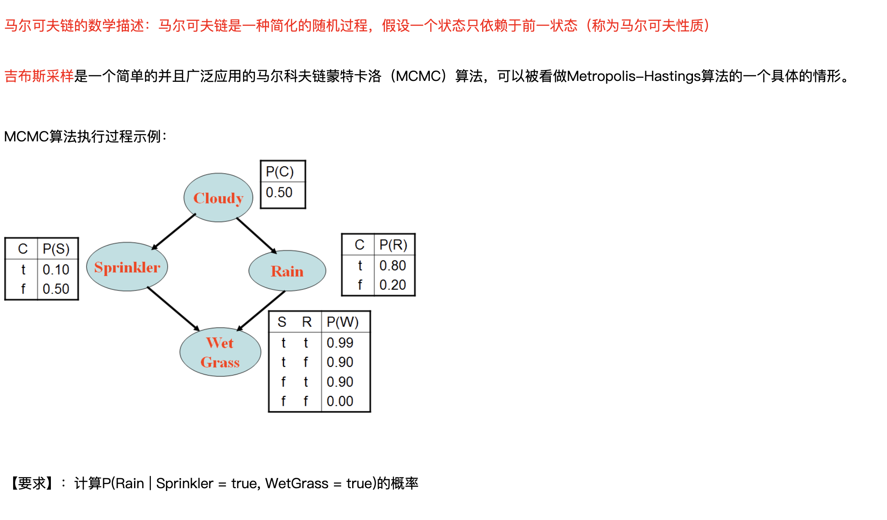

CNN其实也是指定考虑一个范围内的信息，所以可以说CNN是一种self-attention的特例。而Self-Attention可以看作是CNN的一种泛化，因为self-attention考虑的东西不是像CNN那样提前人为确定好的，而是自己学习得到的。

于是我们可以说，只要Self-Attention设定合适的参数，就可以做到和CNN一模一样的事情。

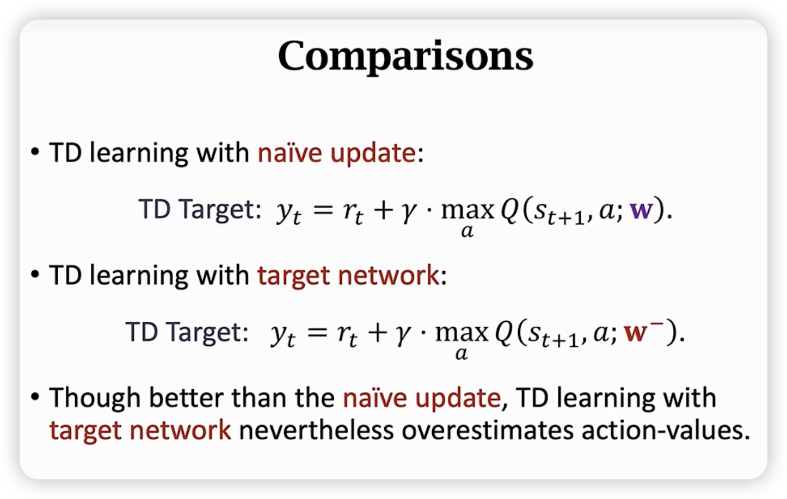

于是Self-Attentio更加flexible，意味着可以做到更好的效果，但是数据不够的时候容易过拟合而导致效果不好。

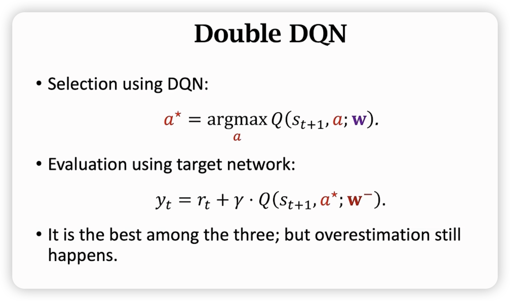

从google的paper能得到检验。

## Self-Attention v.s RNN

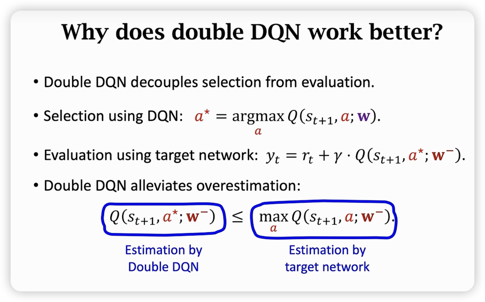

RNN可以通过正反双向的链式链接，来考虑到上下文的信息。但是这样的结构导致了RNN的计算量很大，而且不容易并行化，同时距离相对较远的信息难以联系起来。

RNN随着Self-Attention的出现，已经逐渐成为时代的眼泪了。

(to learn more: RNN in weblink)

## Self-Attention for Graph

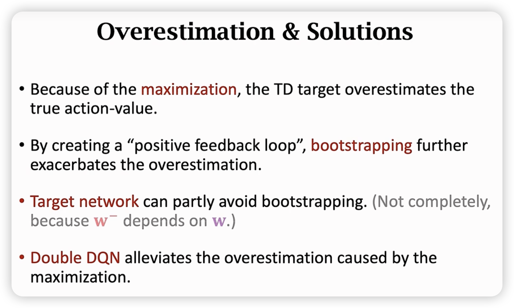

将self-attention应用到图上，边意味着相关，对于每一个点我们考虑其有边的相邻点，此时可以用上述的self-attention的方法来处理。

(to learn more: Graph in weblink)

## To Learn More about Self-Attention

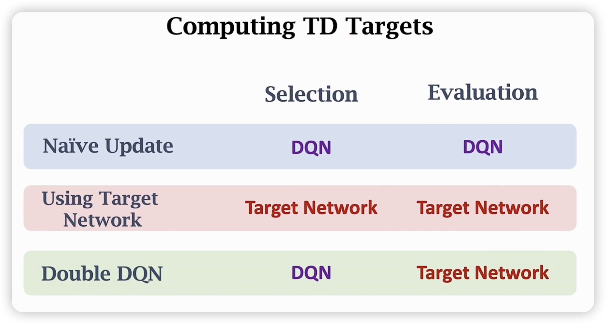

各种xxxformer的出现。

有更快的xxxformer，但是性能往往会变差。

