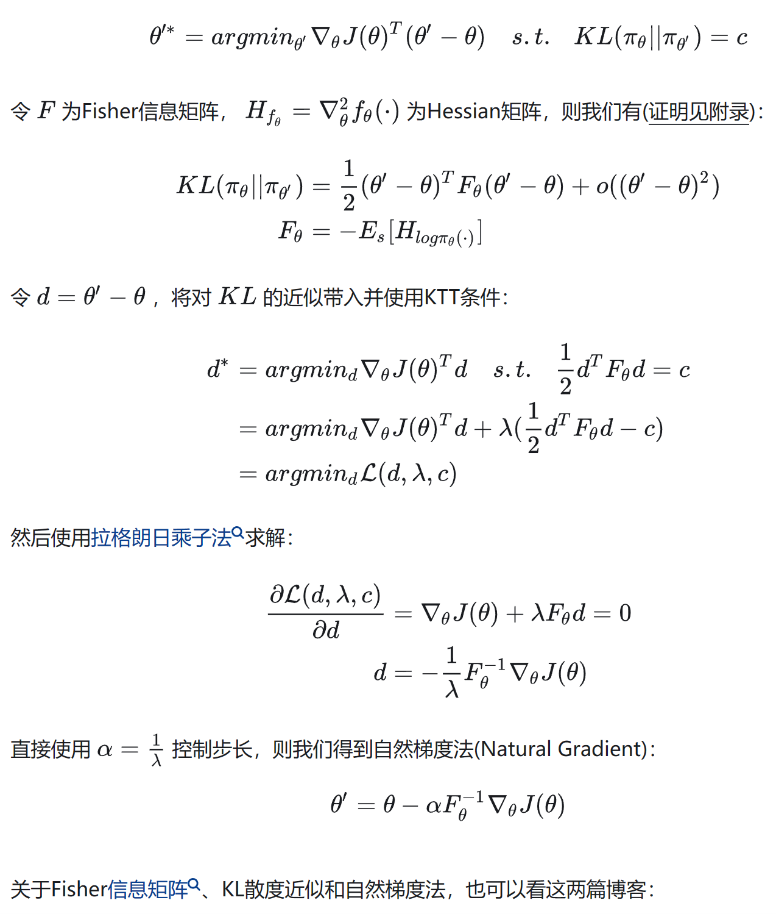
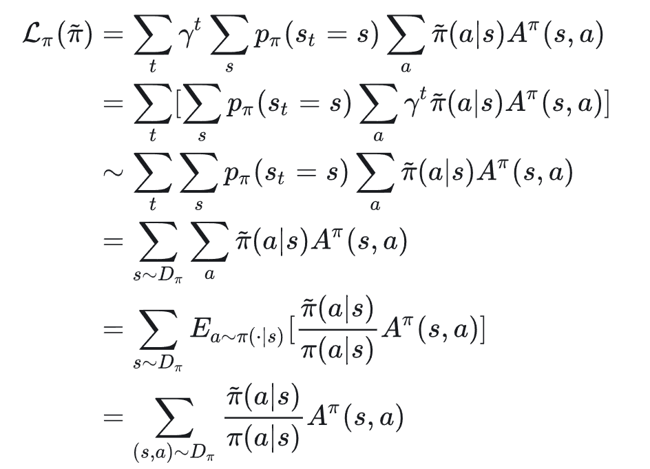
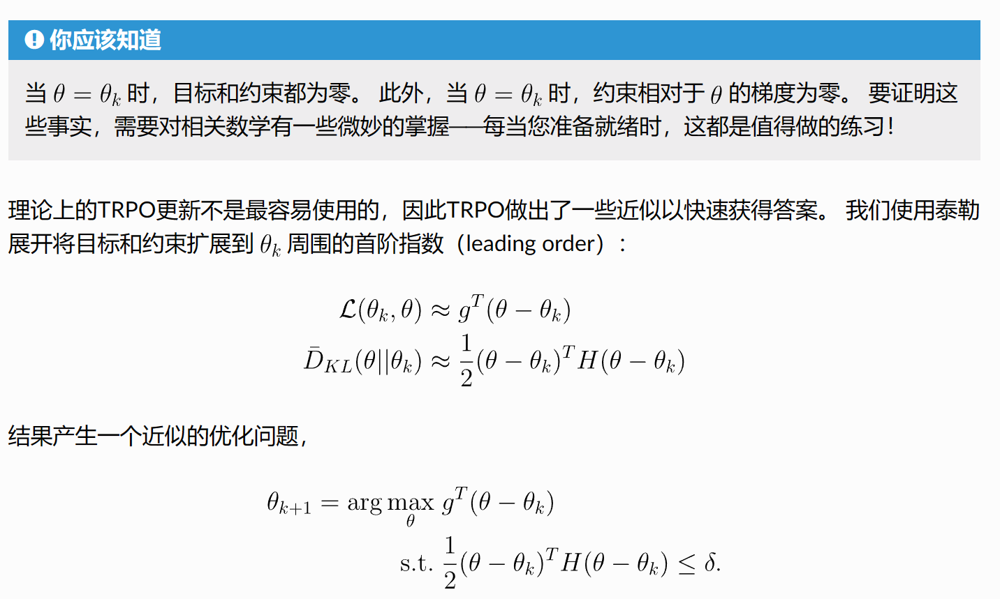
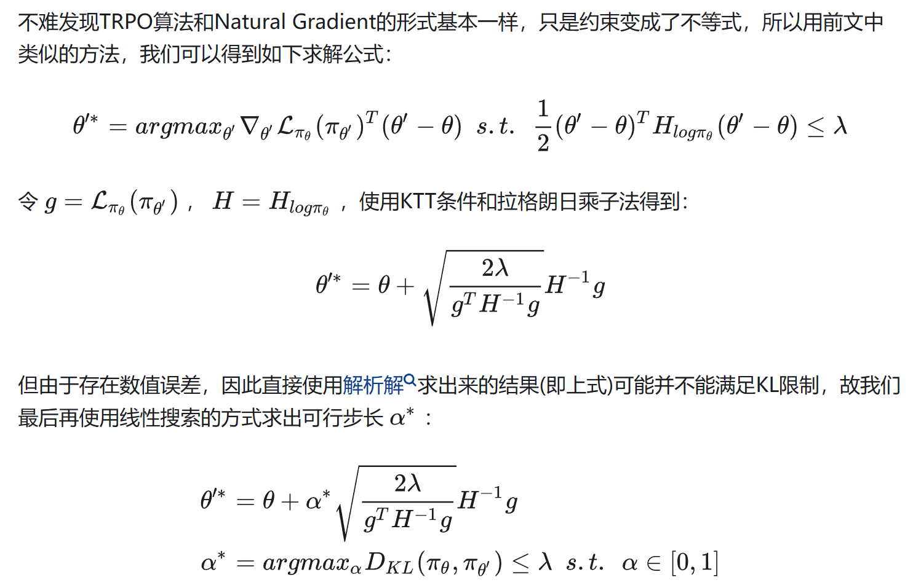
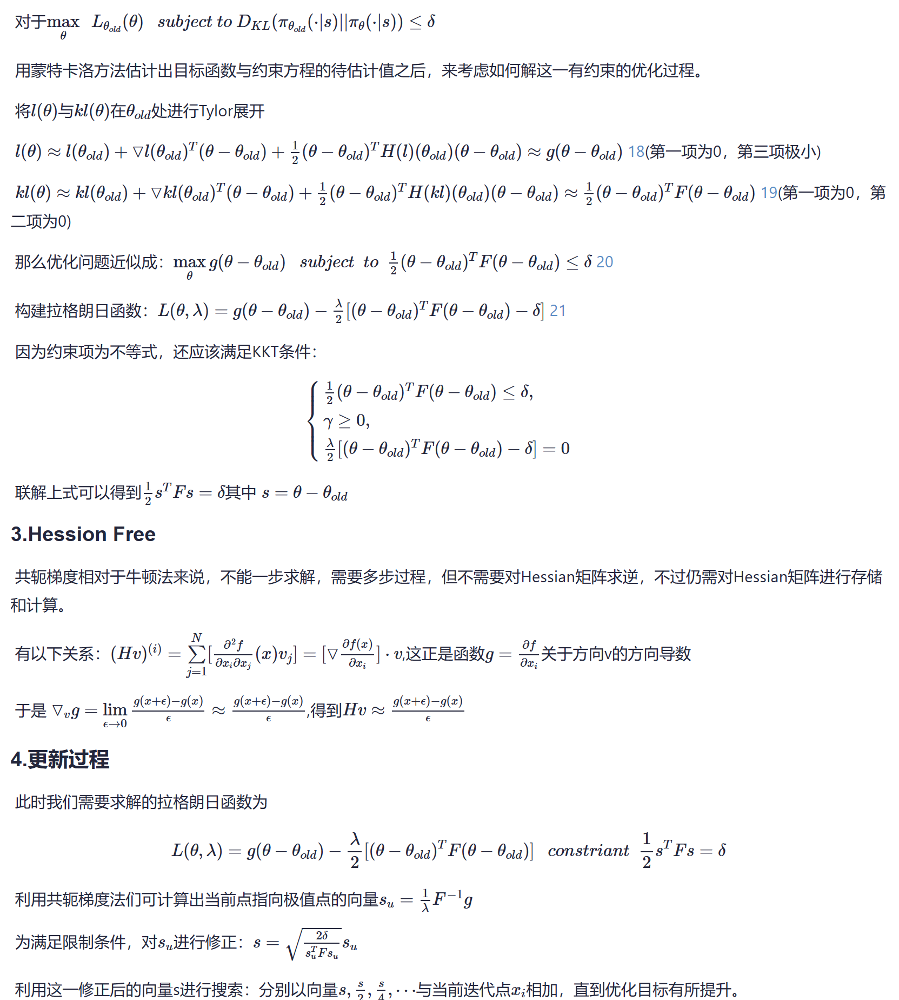
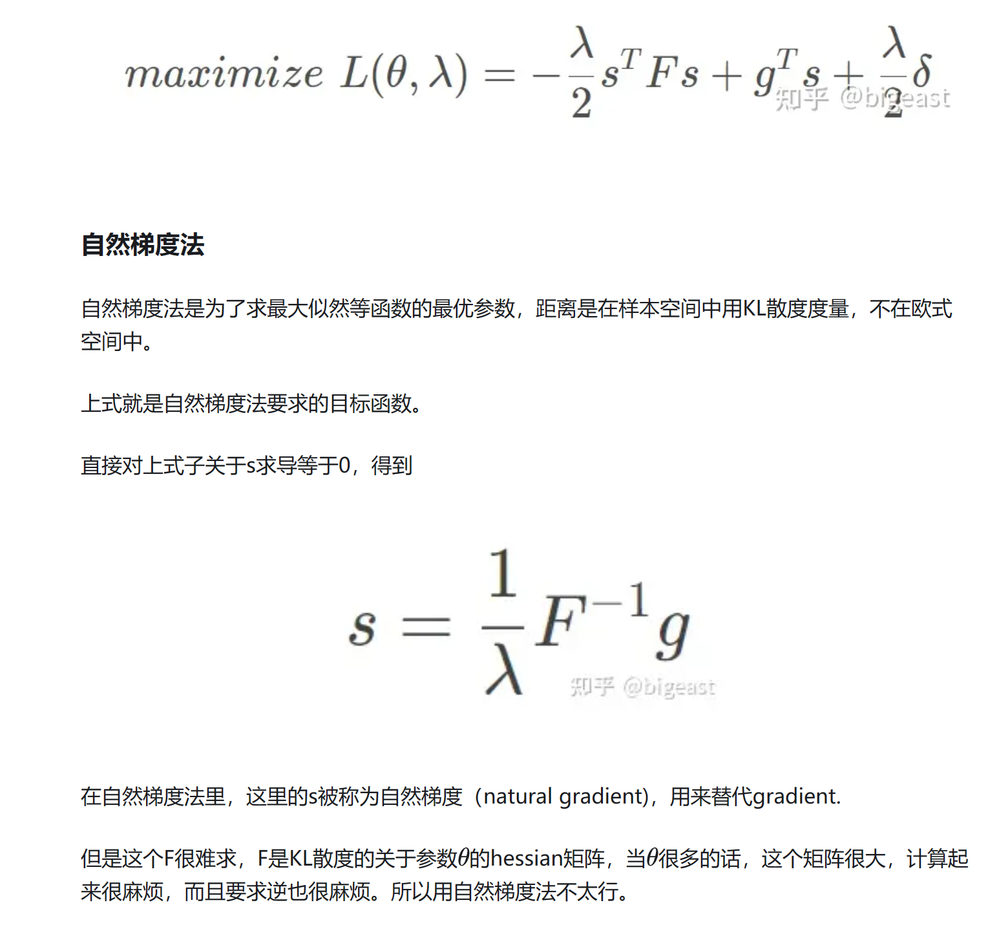
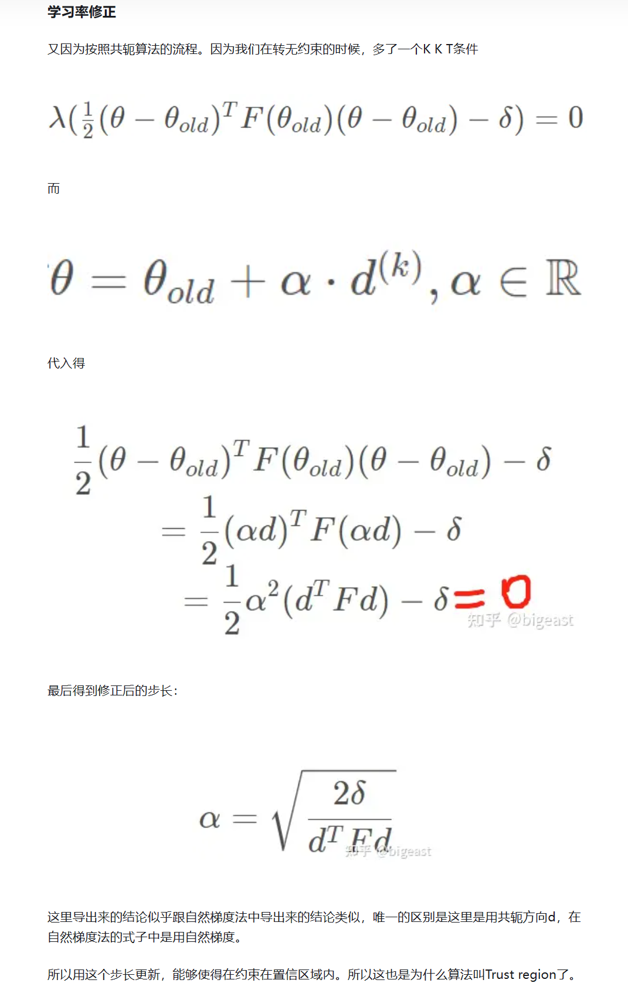
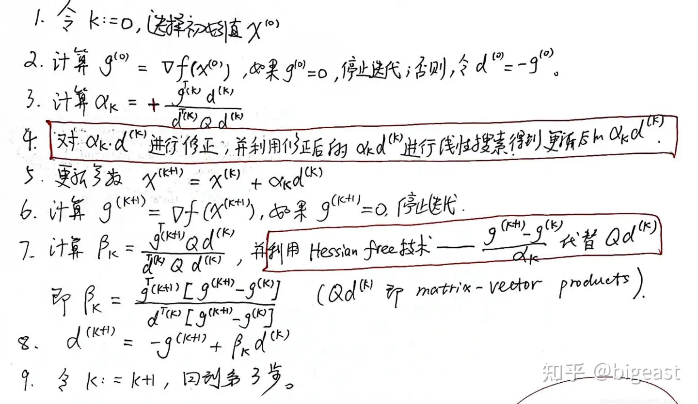

# 
 TRPO 

## Background

在进入TRPO和PPO（两者同根生），我们先从自然梯度法（Natural gradient）引入信赖领域（proximal region）的概念。假设我们要求解的是某个概率分布$\pi_\theta(s)$，那么一节梯度下降法本质就是对$J(\theta)$进行一阶展开：
$$\theta'=\argmin_{\theta'}\nabla_\theta J(\theta)^T(\theta'-\theta)$$

但是直接这样粗暴的更新会带来问题：

1. 参数空间$\theta$的微小变动，会导致策略分布大幅度变化，让优化不稳定。
2. 参数空间对策略分布的影响不一样，有些参数对策略分布的影响大，有些参数对策略分布的影响小，这样会导致优化效率低下。

于是我们放弃使用参数空间$\theta$作为优化的“步长”，转而到$\pi_\theta$中。我们用KL散度来衡量两个分布之间的差异，我们把策略空间用KL散度衡量的距离作为邻域。

## TRPO - 策略优化

我们的优化目标：

$\eta(\pi')=\eta(\pi) + E_{r \sim {\pi'}}[\sum_{t=0}^\infin\gamma^t A^\pi(s_t,a_t)]$

我们希望这个优化目标可以有稳定的提升。

这里我们用差增量的形式表示出优化前后的区别，其中$A$是旧策略的优势函数，具体证明将A的定义式展开即可。

我们继续把上式变形：

$\eta(\pi') = \eta(\pi) + \sum_{t=0}^\infin \sum_s P_{\pi'}(s_t=s)\sum_{a_t}\pi'(a_t|s_t)\gamma^t A_\pi(s_t,a_t) \\ =\eta(\pi) + \sum_{(t,s_t)\sim D_{\pi'}}\sum_{a_t}\pi'(a_t|s_t)\gamma^t A_\pi(s_t,a_t)$

其中$D_{\pi'}$是新策略大量采样后得到的数据集。我们的目的是找一个更好的新策略，显然对每一个可能得新策略有要做采样是不现实的。于是希望能用$D_{\pi}$替代$D_{\pi'}$，即求解一个proxy代理$L_{\pi}(\pi')$:

我们通过先近似，再用importance sampling技术，现在只用在dataset抽样的数据上进行优化。

下面先引入下界代理法(minorization-maximization (MM) algorithm)。

如果函数f很难优化，构造新函数g，满足：

1. $f_\theta \leq g_\theta$
2. $g_\theta$容易优化

那么我们可以通过优化g，确保f至少不变差。

于是我们现在希望可以说明当$\pi'$在$\pi$附近一个足够小的信赖邻域(即KL散度小于一个接近0的数)，此时$L_{\pi}(\pi')$能视作$\eta(\pi')$的一个下界近似。

这里具体的bound是什么呢，数学内容暂时略过：

## TRPO - practical algorithm

但到这一步，$D_{KL}^{MAX}$还是没法算（因为状态无限），所以我们用均值去近似最大值（$\pi$和$\pi'$足够接近时，mean和max也接近）。

最后对$L_\pi(\pi')$进行变换：

二到三行去掉$\gamma^t$的原因，是我们不需要得到一个真正的discounted-MDP，而是只用一个"局部视角的discount-MDP"，相当于把一个轨迹看成若干个后缀轨迹，全部都是从当前状态开始的。我们认为这样近似是target-based的。

最后一行使用了Importance Sampling，从而把抽样问题转成了在旧数据库里大量抽样（$D_\pi$中的样本，可以更新多次$\pi'$，实际一般设置为2次）。**TRPO其实不单单是提升了样本效率，根据前面的分析，其还提升了训练的稳定性(和单增性)。**

这里带约数求解过程使用了KKT条件和Hession free的共轭梯度法，具体可以参考下图：

补充：

关于TRPO的介绍到此终于结束了。总结一下，TRPO算法首先从Policy Improvement的角度找到了一个方便求解的Proxy，然后证明了该Proxy在满足信赖邻域条件时能够近似$\eta(\pi')$的下界，最后采用多步启发式近似获得了一个实际可以求解的优化目标，该优化目标使用二阶梯度方法进行求解。

## 后记

[TRPO&&PPO梳理](https://blog.csdn.net/qq_45832958/article/details/123357739)

[Gradient Descent&&Newton's Method&&Conjugate Gradient&&Hessian-Free Optimization](https://andrew.gibiansky.com/blog/machine-learning/hessian-free-optimization/)

[从梯度下降到Hessian-Free优化](https://zhuanlan.zhihu.com/p/23866364?utm_source=qq&utm_medium=social&utm_oi=1193914178270945280)

[rollout算法](https://zhuanlan.zhihu.com/p/61062275?utm_source=qq&utm_medium=social&utm_oi=1193914178270945280)

最基本的结论是：对于两个概率分布，KL-散度衡量了两个概率分布之间的差异，Fisher信息矩阵（FIM）是KL-散度的二阶近似，实际定义了概率分布空间上局部曲率。

[费舍尔信息矩阵](https://blog.csdn.net/wxc971231/article/details/135591016)

[信息论概念详细梳理](https://blog.csdn.net/wxc971231/article/details/122370306)