## 
 Word Embedding 

#### 
 detect0530@gmail.com 

#### 对word的编码是困难的，用one-hot维数太高，分类的话类别也太多，一个单词会出现的很多类中，

#### 于是，我们希望把word project到一个空间中，类似语义的词汇在space里是接近的。且每一个特定的维度有一定的意义。

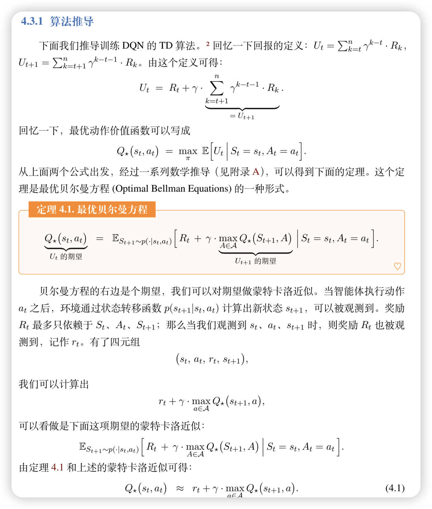

但是，我们只知道输入，不知道输出。所以我们需要一个神经网络来学习这个project的过程。

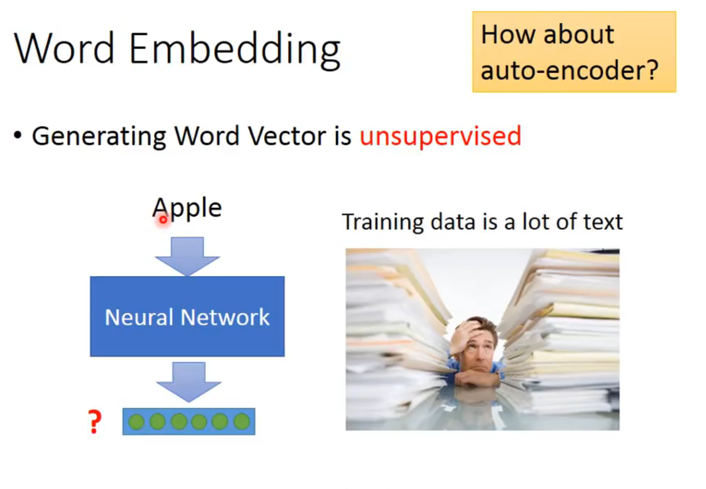

**可以用auto-encoder吗？** 弄一个encoder和decoder然后输入等于输出去训练。最后把encode拿出来就可以了？

 ### 是不行的。

 **比如你用one-of-N encoding来说，每一个单词都是独立的，把这样的vector做auto-encoder，没法train出一些有用的特征分布来编码。（根源在与基础的编码方式是独立无关的，同时如果用n-gram来表述一个单词，也许可以抓到一些前缀后缀字母组的含义，但是效果肯定不好，不会这么干）**

 ----

我们更希望从训练文本里，结合上下文找出相似关系的word。

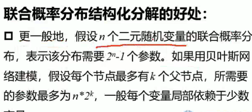

## 一些基于上述思想的方法

### Count based

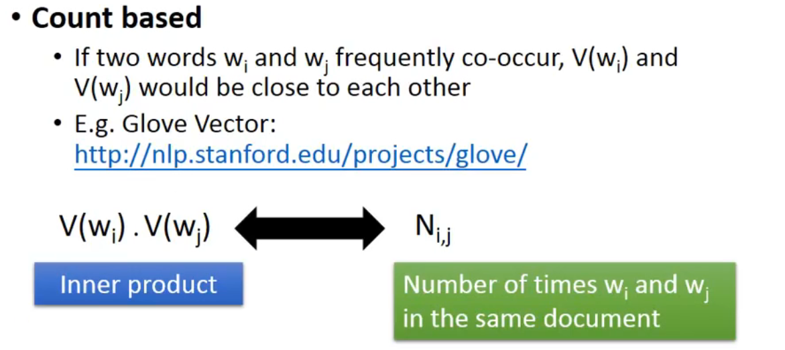

### Predict based

我们要learn一个NN，输入一个word的vector，输出是给定上一个word下一个word输出的概率。

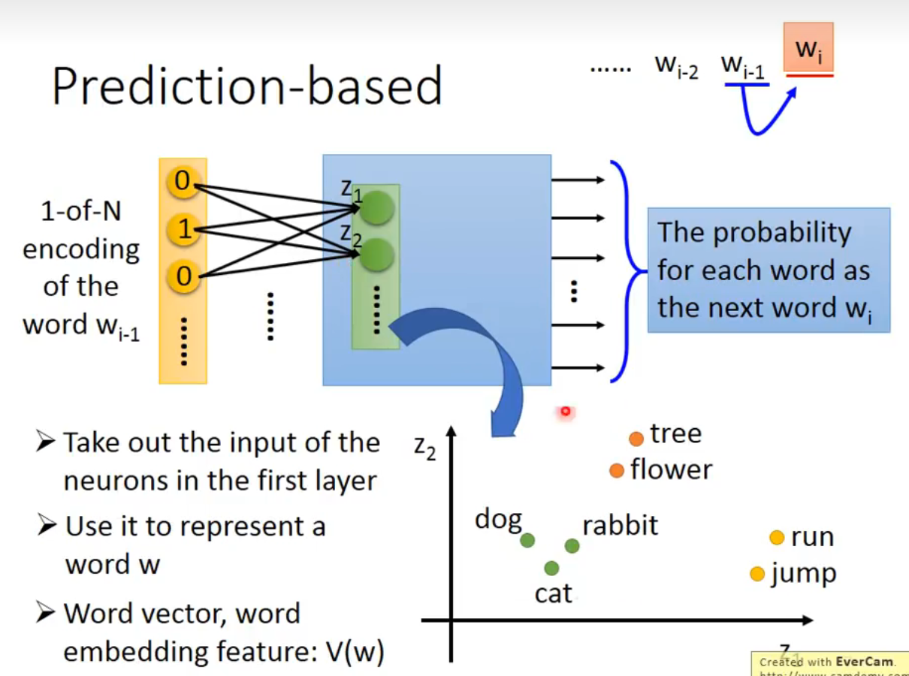

可以发现，我们选择用 firts hidden layer的向量表示word。

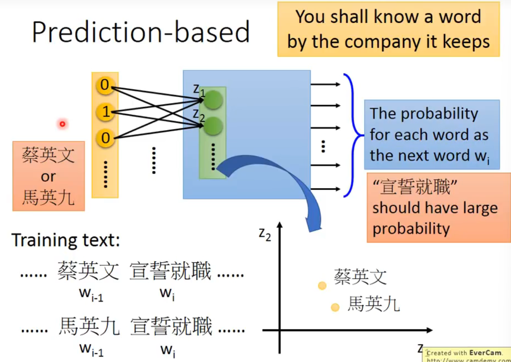

因为说对于相似的两句话，输入的单词是相似的，概率模型预测下一个词的结果是相同的，所以经过第一层的神经元的输出应该吧word投影到了接近的空间。这与我们想要找的word embedding的特性是一致的。

当然，既然是预测概率，可以把输入拓展到前10个word。

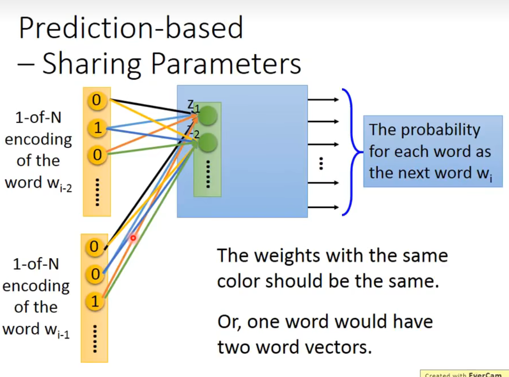

但是这样做时需要注意，word编码时同一位置的编码连到同一个hidden layer神经元的weight是一样的。

1. 如果不这样做，将同一个word放在不同位置，得到的embedding是不一样的。而我们希望放在不同位置得到的transform是一样的，否则一个word会有多个vector。
2. 减少参数量。

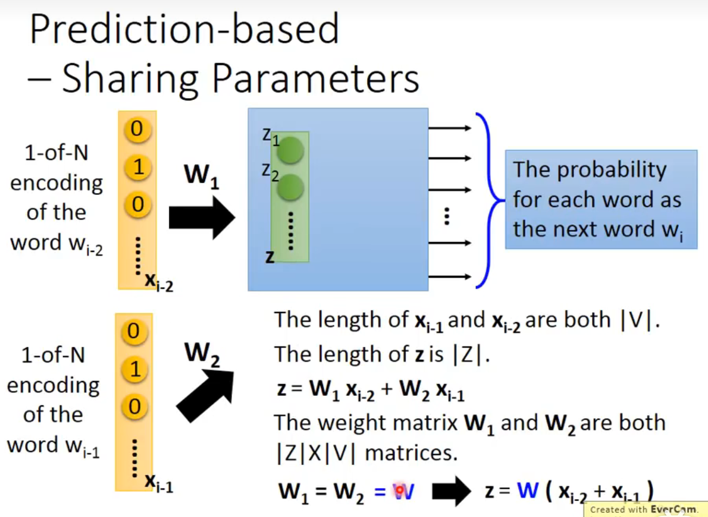

更具体地说，由于共享参数，实际上先加起来来乘以W是等价的。

所以project实际就是train出了W后，把输入的one-hot vector乘以W就可以了。

那么如何限制weight是一样的呢？
1. initialize的值是一样的
2. 在偏微分时减去所有的梯度之和。

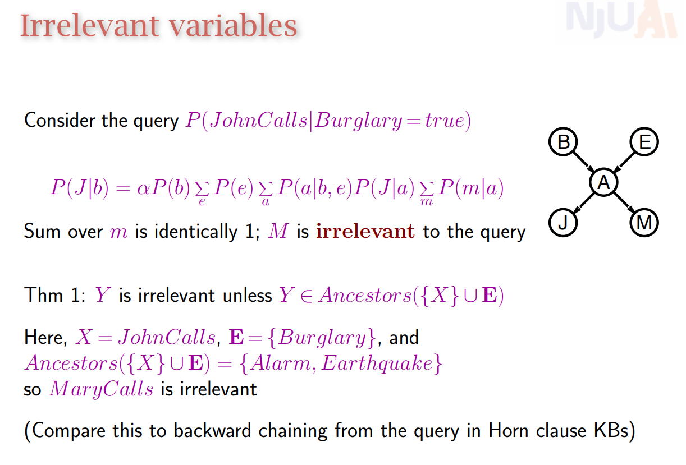

这样一来$W_i$和$W_j$就永远是tight在一起的。

## 一些Prediction-based 变种

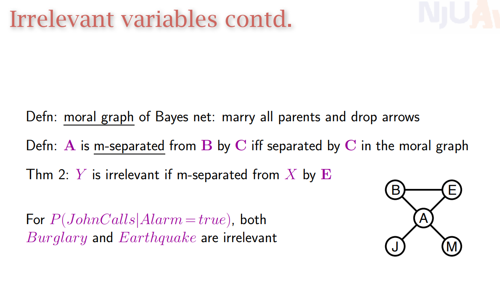

有一个问题，为什么就用第一层输出结果，这样model就不是deep了？

1. 有种种的tip，有各种直觉的sence，所以跑出来效果很好。

2. 过去用deep，但其实不用deep也可以做，且运算量小，可以跑很多epoch。

----

## 一些word vector 推论

向量相减如果接近，说明这两对词组有相似的关系。

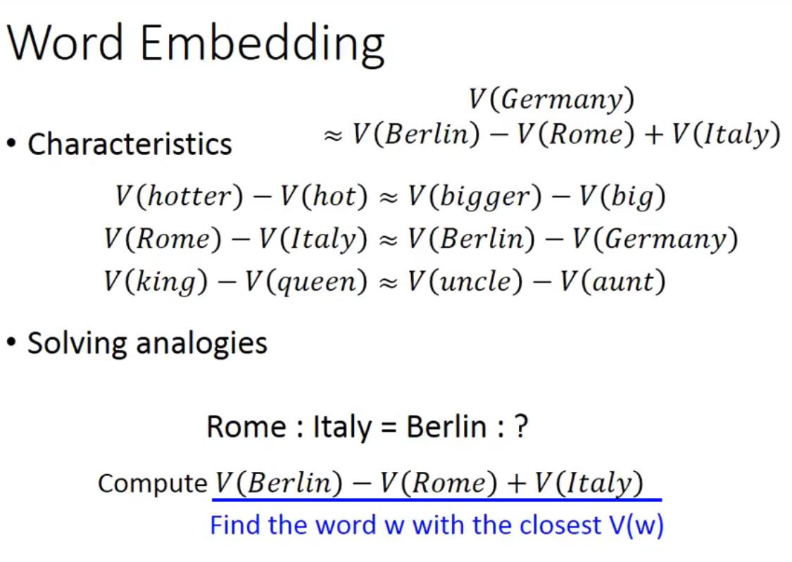

---
  
我们还可以对不同语言做一个project。

但是如果硬做的话，没什么用，因为训练集里面中文和英文是隔离的，corpus里面没有任何关系（没有中英文混杂在一起的句子）。

但是加入已经事先知道一些对应到一起的中文英文词汇，我们再训练一个model把这些对应的词汇project到space上的同一个点上，此时对于新的word用model再project一遍，就可以实现中英单词对应的效果。

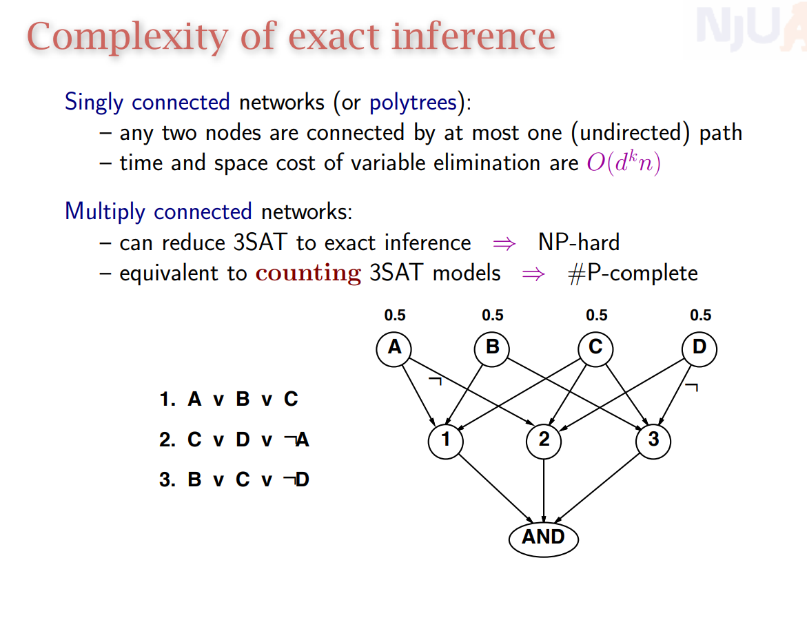

----

还可以运用在多模态，挺有趣的。

比如先train好了word embedding，然后把图片的feature vector和word embedding的vector对应起来，再train一个model，这样就可以实现图片和word的对应了。

更surprising的是，对于marchine从来没见过的图片种类，经过训练好的model映射在语义space里面，也能和对应的语义vector十分接近。

首先模型通过大量的阅读知道了不同分类的关系，再通过图片到文本vector的对应训练，知道了图片一些特征和word的关系。那么对于一张没见过tag（但是word训练里有）的新的图片，依然可以按照其特征正确分类。

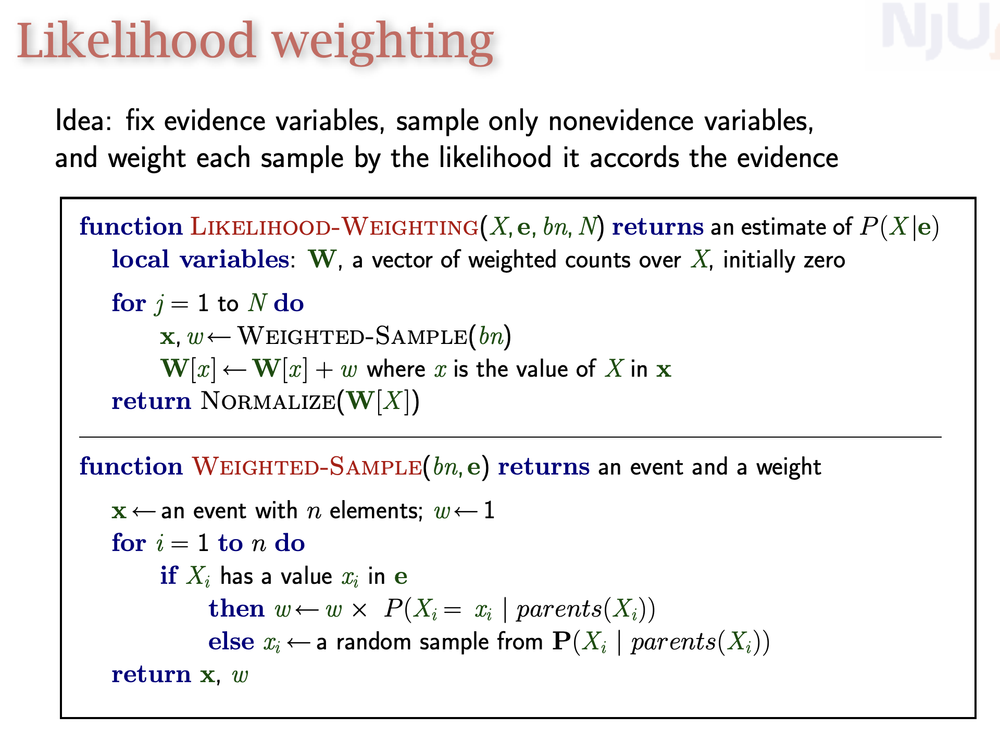

----

