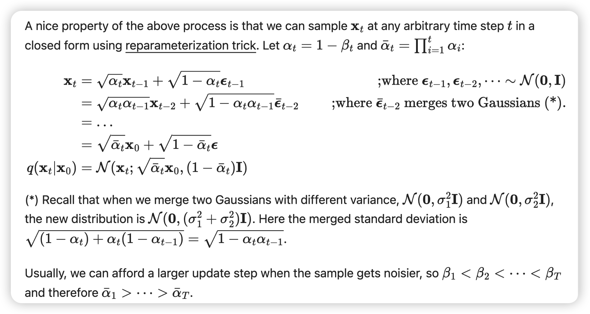
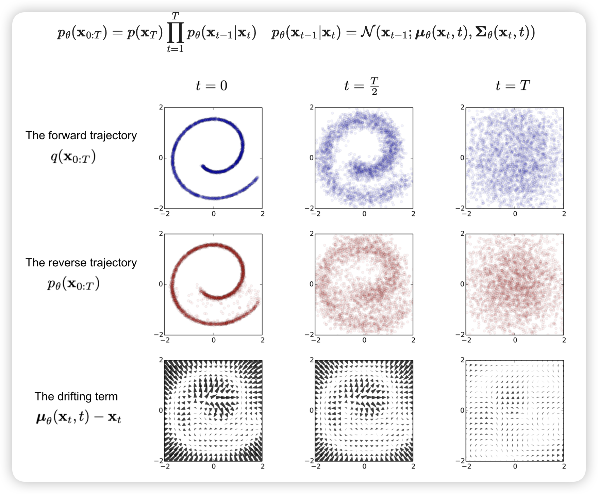
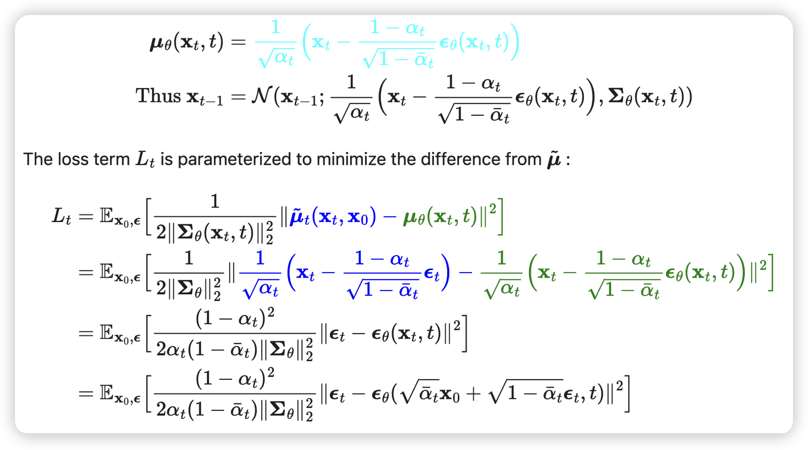
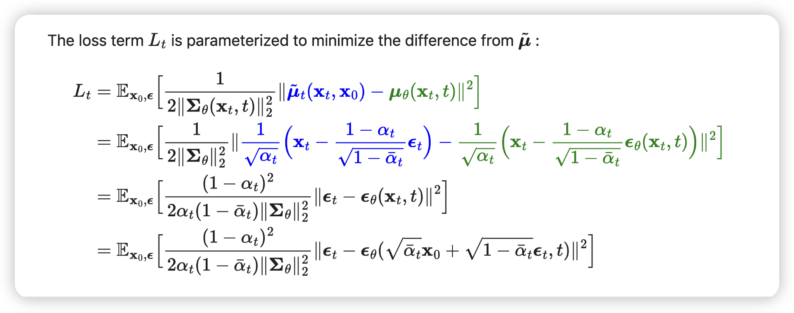
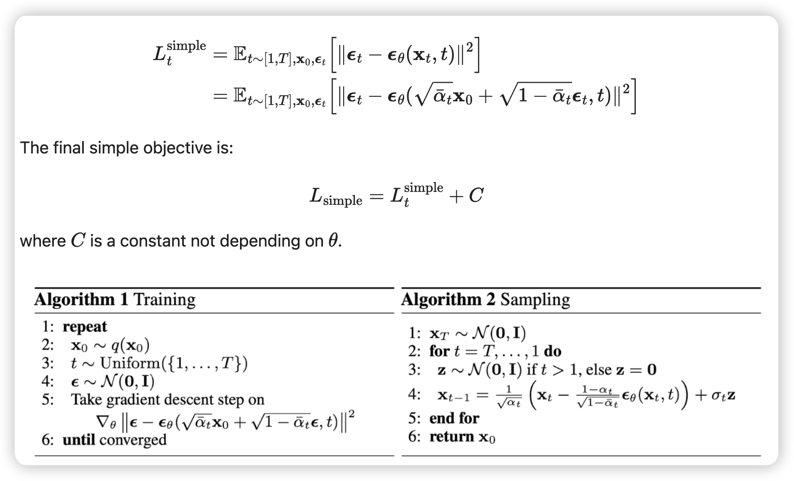
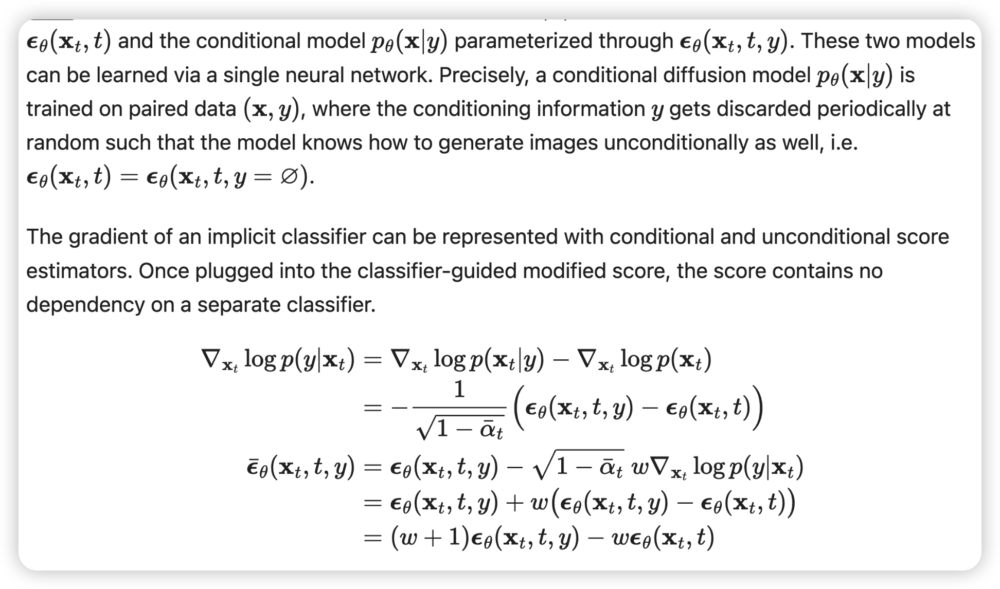
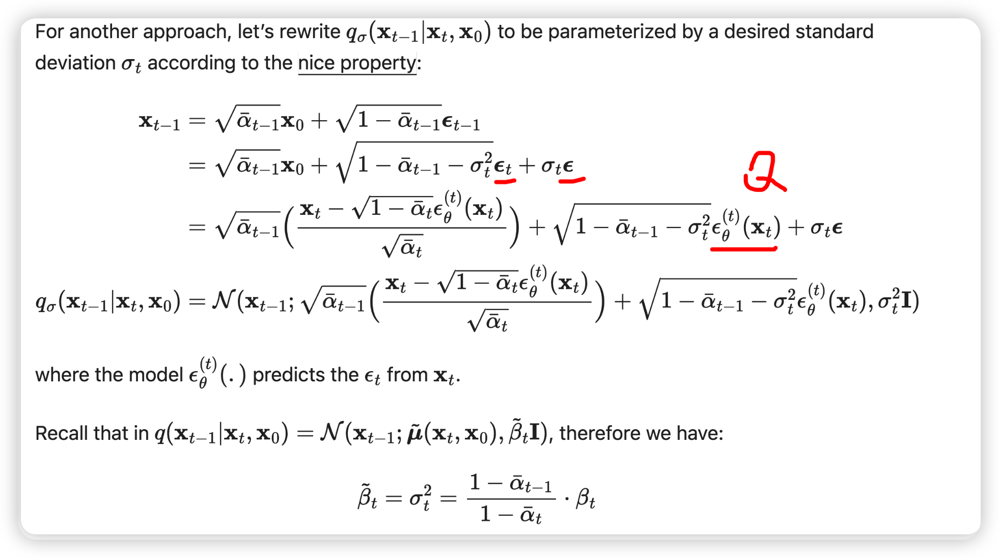

diffusion blog

可以一步计算任何t时刻的正向传播

虽然逆向顺序没法算

但是：可以通过引入$x_0$作为条件，然后用正向的一步表达式的反演又把$x_0$从$x_{t-1}$的表达式中去掉，达到从$x^t$导出$x^{t-1}$的inverse diffusion process的效果

这里的$\epsilon_t$是由x0和xt计算出来的

同上，对于理解式子很重要，这里道理应该是given了xt。

只不过loss function里面反演的是epsilon

与score function的联系

带条件的，第一步对梯度关系进行贝叶斯很关键！

首先，这里应该是完全等价的变形，但是这里第一部分的转换为什么可以换出$\epsilon_t$，用网络预测应该是given了$x^T$，不是简单的正态分布了？（疑似这里就是近似了一步，不是严格等价的？）

DDIM has the same marginal noise distribution but deterministically maps noise back to the original data samples.

因为是DDIM确定性(方差是0），所以可以跳步骤。

但是既然是确定性的，为什么不能直接跳到最后？

 因为这里式子是从X_t强行变换出来的，即使没有扰动，预测能力本来是对标t-1，强行依靠正向的闭合式子和当前已知的x^t跳跃是可以，但是能力有限，否则直接从噪音跳到图片网络做不到。

但是正是因为去掉了每次出噪音，ddim可以加速这个过程，一次跳几步还是可以的。

---

**很好的ddim解释**：https://zhuanlan.zhihu.com/p/7185787461

ddim其实是拿掉了马尔科夫性，且额外引入了先验gaussian（范围比ddpm更广
2. 保留了方差作为待定变量，gaussian的其它系数用待定系数法反解出来
3. 用KL作为loss训练
4. 当方差取一定数值时，就是ddpm
5. 一般我们用ddim时方差取0，称取0时为ddim
