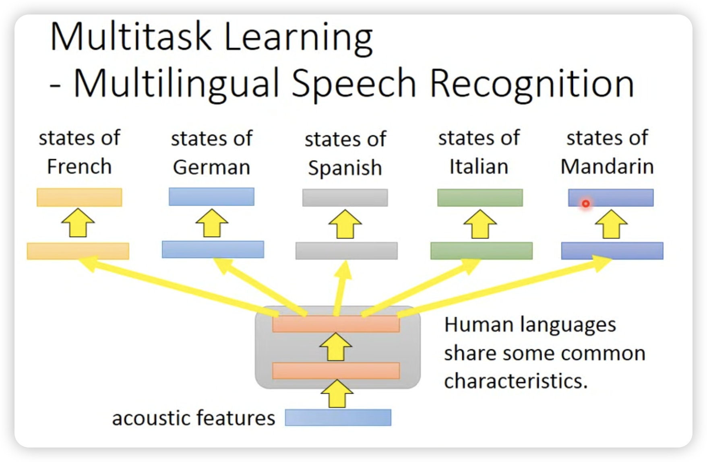

## 
 Domain Adaptation 

当我们有一个模型在一个domain上训练好了，我们想要将这个模型应用到另一个domain上，这时候就需要domain adaptation。

简单来说，就是训练集和测试集的分布不一样，我们需要让模型适应新的分布。其实和transfer learning很像，但是transfer learning更加广泛，不仅仅是domain adaptation。

### Transfer Learning

按照有无label，可以分为几种case：

- Fine-tune

直接fine-tune，加上参数的L2正则化。

或者只对一个layer进行fine-tune。

但是哪些layer会被fine-tune呢？这个不同任务差异很大。

- Multi-task learning

一个成功的例子是多语言的speech recognition。

- Domain-adversarial training

和GAN有点像，希望把domain的信息去掉，只保留task-specific的信息。

- Zero-shot learning

先提取attribute，然后查表，看哪一个最接近。

甚至可以做attribute embedding:

然后直接在embedding space上找最接近的。

两个zero-shot例子：

- self-taught learning

先学一个好用的feature extractor，然后在target domain上用这个feature extractor去learn。

---

让我们回归到domain adaptation。

- domain shift

有很多种：

我们按照对target domain的了解程度分类：

- little but labeled

- large amount of unlabeled data

为了利用共同的feature，我们尝试找这个feature extractor

同时我们希望对于target domain的内容的predictor输出离boundary越远越好。

