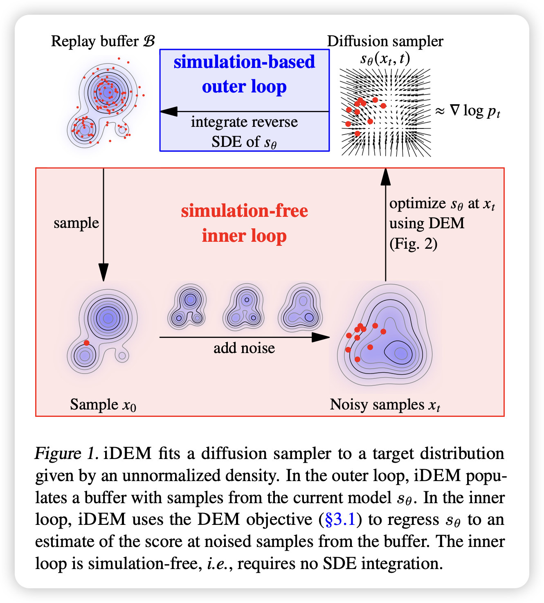
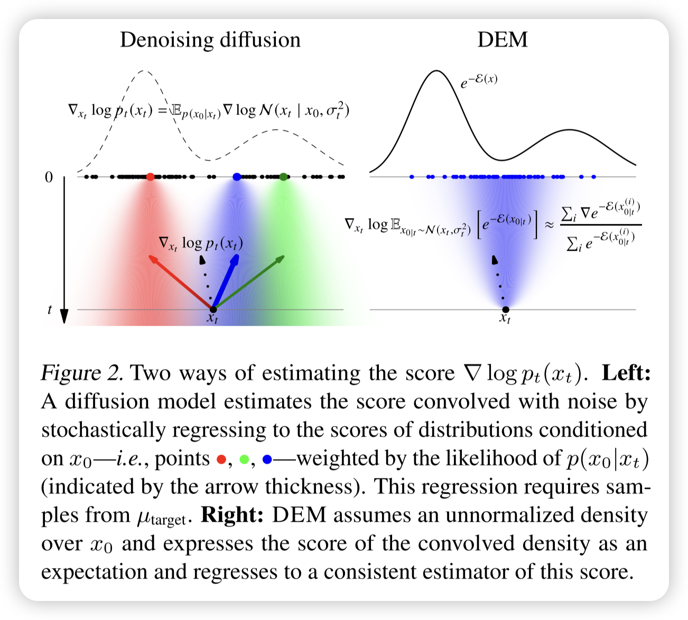
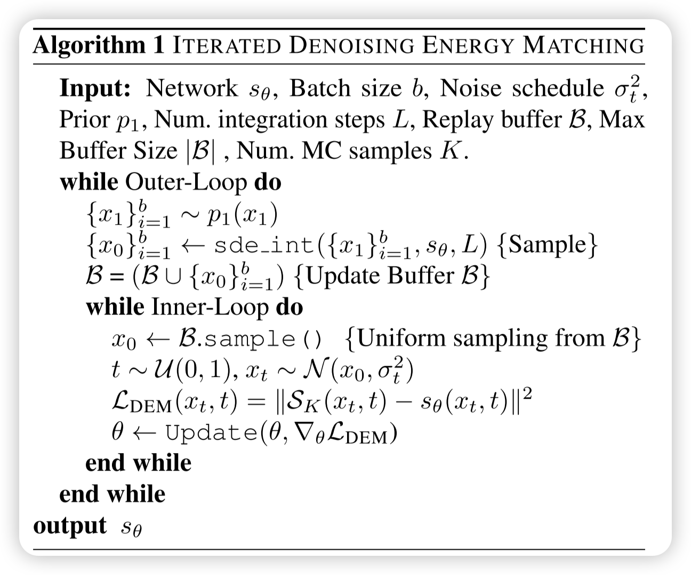
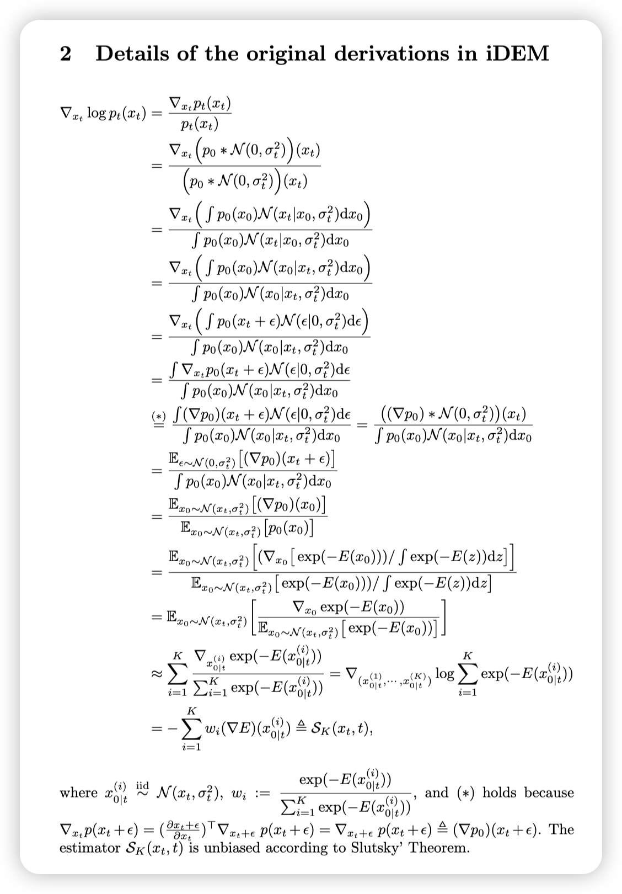
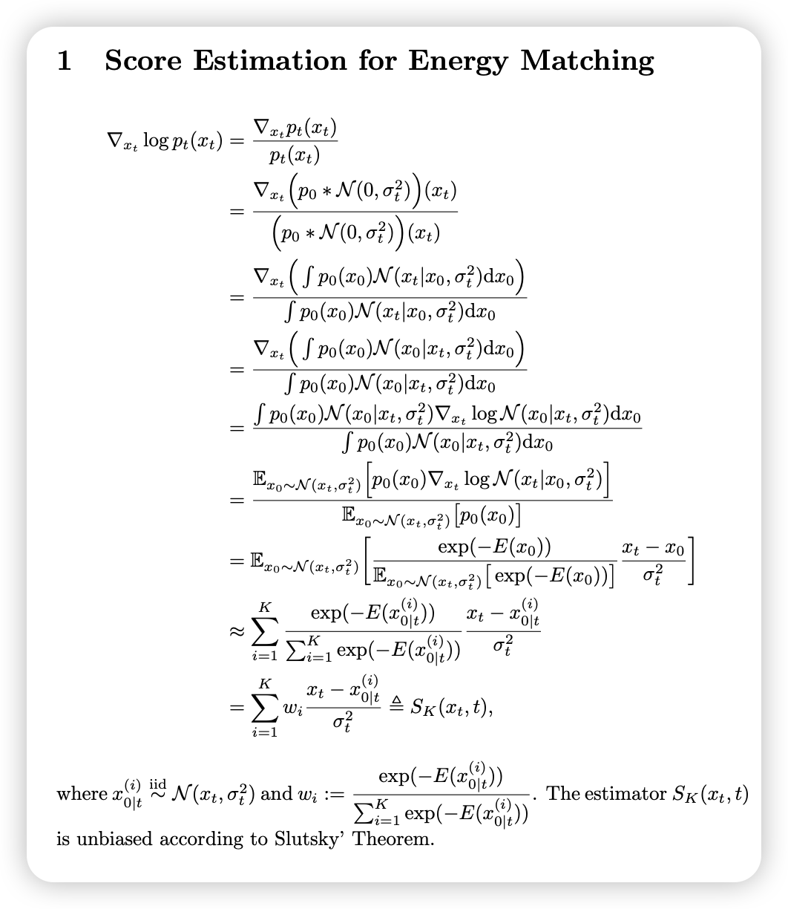

# 
 Iterated Denoising Energy Matching for Sampling from Boltzmann Densities 

## Background

### 采样的核心挑战:

从高维复杂分布采样是困难的，主要面临以下挑战：

- 多模态问题（Multi-modality）：目标分布可能存在多个模式，导致简单的采样方法难以探索所有模式。
- 高能量屏障（Energy Barriers）：Boltzmann分布中的不同模态可能被高能量屏障隔开，使得采样器难以在模式之间跳跃。
- 计算开销大（Computational Cost）：传统的马尔可夫链蒙特卡洛（MCMC）方法，如Langevin Dynamics，需要大量迭代才能收敛。

### 现有方法

- Langevin MCMC：使用梯度信息来更新样本，但在高能量屏障情况下可能难以有效探索。
- Contrastive Divergence (CD)：用于训练能量基模型，但依赖于短步Langevin采样，可能导致模型分布与目标分布不匹配。
- Score Matching：学习目标分布的对数梯度，但通常要求明确的概率密度函数。

| 方法 | 目标 | 主要挑战 | 计算效率 |
|------|------|---------|---------|
| **MCMC** | 从目标分布采样 | 采样慢，难以跨越高能量屏障 | 低 |
| **EBM** | 学习一个概率分布 | 依赖 MCMC，训练不稳定 | 低 |
| **扩散模型** | 从噪声生成样本 | 依赖真实数据，计算复杂 | 中 |

**为什么 iDEM 比这些方法更好？**

iDEM 结合了 **EBM 的能量建模能力** 和 **扩散模型的高效模式混合**，但**不依赖 MCMC 采样**，解决了：
1. **MCMC 的低效问题**：不需要构造马尔可夫链，采样更快。
2. **EBM 的 MCMC 依赖问题**：用扩散模型直接优化能量函数梯度，而不是通过 MCMC 采样。
3. **扩散模型的依赖数据问题**：iDEM 仅使用能量函数，而不需要真实数据样本。

### 补充一些现阶段的算法和问题

#### **解析：在 Boltzmann 分布采样中的数据不足问题及变分方法的挑战**
本文讨论了从 **Boltzmann 类型分布**（Boltzmann-type distributions）采样的挑战，尤其是在**数据不足**的情况下如何有效训练**深度生成模型** $q_\theta$ 来逼近目标分布 $\mu_{\text{target}}$。以下是该段内容的详细解析：

**1. 问题背景：数据不足导致难以最大化似然**
在经典的生成建模框架中，我们通常通过**最大化似然（Maximum Likelihood Estimation, MLE）** 来训练生成模型 $q_\theta$，即最小化**正向 KL 散度**：
\[
\text{KL}(\mu_{\text{target}} || q_\theta) = \mathbb{E}_{x \sim \mu_{\text{target}}} \left[ \log \frac{\mu_{\text{target}}(x)}{q_\theta(x)} \right]
\]
但这里面有一个问题：
- 计算这个 KL 散度时，需要**从目标分布 $\mu_{\text{target}}$ 采样**。
- 然而，**在 Boltzmann 分布下，我们通常无法直接获得足够的样本**，因为 Boltzmann 分布涉及高维状态空间，并且需要复杂的计算（如分子模拟）。
- **没有足够的真实数据，就无法直接用 MLE 训练生成模型**。

**结论**：在数据不足的情况下，经典的 MLE 方法（最大化 $\mu_{\text{target}}$ 的对数似然）不可行。

**2. 现有替代方法**
由于无法直接最大化 $\text{KL}(\mu_{\text{target}} || q_\theta)$，研究人员通常采用以下方法来从目标分布采样：
- **马尔可夫链蒙特卡洛（MCMC）**：通过构造马尔可夫链，渐进地收敛到目标分布，但**收敛速度慢**，尤其在高维情况下容易陷入局部模式（mode collapse）。
- **序贯蒙特卡洛（SMC）**：结合重要性采样与 MCMC，适用于动态系统，但计算成本高。
- **分子动力学（MD）**：用于物理系统的采样，但需要大量计算资源。

由于这些方法都有不同程度的问题，本文提出考虑 **变分方法（Variational Approaches）** 作为替代。

**3. 变分方法的优势**
在变分方法中，我们训练一个参数化的生成模型 $q_\theta$，使其尽可能匹配 $\mu_{\text{target}}$，但采用不同的优化准则：
- **样本从 $q_\theta$ 而非 $\mu_{\text{target}}$ 生成**（即**自采样**）。
- 这避免了 MLE 依赖目标分布样本的问题。

一个自然的选择是 **反向 KL 散度（Reverse KL divergence）**：
\[
\text{KL}(q_\theta || \mu_{\text{target}}) = \mathbb{E}_{x \sim q_\theta} \left[ \log \frac{q_\theta(x)}{\mu_{\text{target}}(x)} \right]
\]
这个度量有两个主要优势：
1. **计算可行**：因为样本是从 $q_\theta$ 采样，而不是 $\mu_{\text{target}}$，所以不依赖于目标分布的真实数据。
2. **可以直接优化 $q_\theta$ 使其匹配目标分布**，避免了传统采样方法（如 MCMC）收敛慢的问题。

**4. 反向 KL 散度的问题：模式寻优（Mode-Seeking）**
尽管反向 KL 具有计算上的便利性，但它有一个显著的问题：
- 反向 KL **倾向于将 $q_\theta$ 的概率质量集中在目标分布 $\mu_{\text{target}}$ 的高概率区域**，即它**只关注某些模式**，而可能**忽略低概率区域**。
- 这意味着 $q_\theta$ 可能会**覆盖不全整个目标分布的能量景观（energy landscape）**。

**直观理解：**
- 设想 $\mu_{\text{target}}$ 是一个复杂的能量景观，包含多个峰值（高概率区域）。
- 反向 KL 会使得 $q_\theta$ 主要匹配某个高概率峰值，而忽略其他模式。
- **这就导致 $q_\theta$ 不能很好地探索整个分布，造成模式塌陷（mode collapse）**。

**5. 解决方案**
为了克服反向 KL 的**模式寻优问题**，研究人员通常采用：
1. **混合 KL 散度优化**：同时最小化正向 KL 和反向 KL，以平衡探索性和模式匹配能力。
2. **能量匹配（Energy Matching）**：iDEM 采用了一种新的**能量匹配损失**，让模型不仅关注高概率区域，还能更好地探索整个能量景观：
   \[
   \mathcal{L}_{\text{DEM}} = \mathbb{E}_{q_\theta} \left[ ||\nabla_x E(x) - \nabla_x \log q_\theta(x) ||^2 \right]
   \]
   这里 $\nabla_x E(x)$ 代表目标分布的能量梯度，而 $\nabla_x \log q_\theta(x)$ 代表当前模型 $q_\theta$ 的梯度。这个损失强制 $q_\theta$ 逐步学习整个能量景观，而不是仅仅集中在某些模式上。

3. **使用扩散模型（Diffusion Models）**：扩散模型在训练过程中**添加噪声**，这有助于 $q_\theta$ 访问低概率区域，并最终学到更完整的分布。

**6. 总结**
- 由于从 **Boltzmann 分布** 采样的数据不足，传统的 MLE 训练生成模型的方法不可行。
- 变分方法（如最小化反向 KL 散度）可以避免数据不足的问题，但会导致模式寻优（mode-seeking）问题。
- iDEM 提出了一种新的 **能量匹配方法** 和 **扩散模型结合**，从而克服了反向 KL 的局限性，实现更高效的概率分布匹配。

## Algorithm

### score function的MC估计方法：

论文方法：

陈提出的无需梯度方法：

两种方法都是对的（依赖高斯卷积奇妙的性质），只是推演过程不同。
论文方法中，可以使用logsumexp技巧缓解数值稳定。
陈的方法中，也可以在计算weight的时候直接把抽样出的$x^i$都减去其mean来缓解数值稳定。（这一点和优势函数A=Q-V有相似之处）

---
本文提出了一种新型神经采样器 **iDEM（Iterated Denoising Energy Matching）**，用于从已知能量函数 $E(x)$ 的 **Boltzmann 分布** 进行高效采样。iDEM 基于**去噪扩散模型（Denoising Diffusion Models）**，结合了一种新颖的 **模拟无关（simulation-free）随机回归目标**，实现了高效、可扩展的采样方法。

本文的贡献可以归纳为以下几个关键点：

### **1. iDEM 的核心创新**
**1.1 计算效率高**
- iDEM **避免了 MCMC、变分推断（Variational Objectives）、重要性采样（AIS, FAB）、序贯蒙特卡洛（SMC）** 等方法中的高计算成本问题（Tab. 1）。
- 其计算复杂度显著低于现有方法，使得 **首次成功扩展到 LJ-55 体系**（Lennard-Jones 55 粒子系统）。

**1.2 能够良好覆盖目标分布的所有模式**
- 传统的 MCMC 和变分方法容易**模式塌陷（Mode Collapse）**，即无法探索目标分布的所有模式。
- iDEM 通过 **扩散采样（Diffusion Sampling）+ 探索性离策略（Exploratory Off-policy）** 方法，确保所有模式的良好覆盖。

**1.3 适用于具有对称性的科学应用**
- iDEM 能够自然地结合目标能量函数 $E(x)$ 的 **对称性（Symmetry）**，如 **SE(3) 旋转不变性** 和 **$S^n$ 对称性**。
- 这使得 iDEM **特别适用于科学计算领域**，例如分子动力学模拟、蛋白质折叠、量子力学计算等。

### **2. iDEM 的算法结构**
iDEM 采用**双层（bi-level）算法结构**：
**2.1 内循环（Inner Loop）**
- **目标**：使用 **模拟无关（simulation-free）随机回归目标**，直接在能量函数 $E(x)$ 上优化扩散采样器。
- **方法**：
  1. 使用**扩散模型**（diffusion-based sampler）对能量景观进行去噪平滑（smoothing）。
  2. 通过**随机梯度下降（SGD）**优化采样器，使其更接近目标分布 $\mu_{\text{target}}$。

**2.2 外循环（Outer Loop）**
- **目标**：
  1. **摊销采样（Amortized Sampling）**：随着训练进行，iDEM 逐渐模仿 **混合良好的 MCMC 链（well-mixed MCMC chain）**，加速采样。
  2. **高效探索能量景观（Efficient Exploration）**：利用内循环不断更新的扩散模型，使采样器逐渐更接近真实能量分布。
- **方法**：
  - 运行更新后的扩散采样器的**逆向随机微分方程（Reverse SDE）**，模拟从低密度区域向高密度区域的粒子转移（transporting particles from low to high-density regions）。

**直观理解**：
- iDEM 采用了 **去噪扩散模型的思想**（类似 Ho et al., 2020 提出的扩散概率模型）。
- 其**前向过程（Forward Process）** **在能量空间中添加噪声**，最终达到标准正态分布。
- **反向过程（Reverse Process）** 学习如何从噪声恢复到真实能量分布，类似于“去噪”过程。

### **3. iDEM 的理论优势**
**3.1 直接平滑能量景观（Smoothing the Energy Landscape）**
- 通过**扩散模型的模式混合特性（Fast-Mixing in High Dimensions）**，iDEM 能够有效跨越不同的模式，提高探索能力（De Bortoli et al., 2021）。
- 这避免了 MCMC **难以穿越高能量屏障**的问题。

**3.2 避免模式塌陷**
- 由于 iDEM 在内循环中使用了**广泛覆盖所有模式的学习目标**，训练过程中不会丢失某些模式。
- 传统变分推断方法（如 **KL$(q_\theta || \mu_{\text{target}})$**）可能**只会关注高概率模式，而忽略低概率模式**，iDEM 则可以更全面地学习整个分布。

**3.3 采样更加稳定**
- 由于 iDEM **不依赖于 MCMC 的样本初始化**，其采样质量不受 MCMC 初始样本的影响。
- 这使得 iDEM 更适用于**大规模科学计算**，如复杂多体系统的 Boltzmann 采样。

### **4. 实验结果**
iDEM 在多个任务上进行了验证，包括：
1. **合成高斯混合分布（Synthetic Gaussian Mixtures）**
   - 证明 iDEM 在多模态分布上的模式覆盖能力。

2. **SE(3) × $S^n$ 不变的双势阱（Double-Well）**
   - 复杂不变性系统的采样能力。

3. **Lennard-Jones 体系（LJ-13, LJ-55）**
   - iDEM 是**第一个成功扩展到 LJ-55 的能量匹配方法**。

**实验结论：**
- iDEM **在所有指标上达到或超越当前最优方法**（如 FAB, Midgley et al., 2023b）。
- **训练时间和内存需求远低于 FAB 和其他神经采样器**（PIS, DIS, DDS），使其成为**目前唯一能扩展到 LJ-55 的方法**。

### **5. iDEM 的关键贡献**
| **方面** | **iDEM 的创新点** |
|---------|----------------|
| **计算效率** | 低计算成本，不依赖 MCMC 或重要性采样 |
| **模式覆盖** | 避免模式塌陷，适用于多模态分布 |
| **对称性适应** | 可适应科学计算中的 SE(3) × $S^n$ 不变性 |
| **扩展能力** | 第一个扩展到 LJ-55 体系的方法 |
| **理论优势** | 结合扩散模型的高维快速混合特性 |

### **6. 总结**
- iDEM 结合了 **去噪扩散模型（Denoising Diffusion Models）** 和 **能量匹配（Energy Matching）**，提出了一种新颖的、无数据（data-free）的 Boltzmann 采样方法。
- 其双层结构：
  - **内循环** 迭代优化扩散采样器，进行去噪能量匹配。
  - **外循环** 运行逆 SDE 进行粒子转移，提高采样效率。
- 相比于 **MCMC、变分推断、AIS、FAB、SMC**，iDEM **计算开销更低，模式覆盖更全面，且可扩展到高维科学应用**。
- **实验结果表明**，iDEM **首次成功扩展到 LJ-55 体系**，并在多个基准任务上超越 SOTA 方法。

---

### 传统diffusion方法

下面我分步解释这些公式的推导过程。

---

#### **1. 前向扩散过程与卷积表达**

**1.1 前向过程**
考虑扩散模型的前向过程 SDE（这里以 VE 模型为例，即 α(t)=0）：
\[
dx_t = g(t)\, dw_t.
\]
从初始数据分布 \(p_0(x_0) = \mu_{\text{target}}(x_0)\) 开始，经过时间 \(t\) 后，样本 \(x_t\) 可看作在 \(x_0\) 上加入了高斯噪声。因此，
\[
p_t(x_t) = p_0 * \mathcal{N}(0, \sigma_t^2),
\]
其中 \(\sigma_t^2 = \int_0^t g(s)^2\, ds\) 表示累积噪声方差。这就是公式 (3) 的内容，也就是说，经过噪声添加后， \(x_t\) 的分布等于原始分布与一个零均值、方差为 \(\sigma_t^2\) 的高斯分布的卷积。

#### **2. 计算卷积分布的 Score 函数**

我们需要估计反向 SDE 中的项
\[
\nabla_{x_t} \log p_t(x_t),
\]
即 \(x_t\) 对数密度的梯度（也称为 score）。

**2.1 利用卷积形式求梯度**
由卷积定义，
\[
p_t(x_t) = \int p_0(x_0) \, \mathcal{N}(x_t; x_0, \sigma_t^2)\, dx_0.
\]
对 \(x_t\) 求梯度：
\[
\nabla_{x_t} p_t(x_t) = \int p_0(x_0) \, \nabla_{x_t} \mathcal{N}(x_t; x_0, \sigma_t^2)\, dx_0.
\]

我们知道，高斯分布的形式为
\[
\mathcal{N}(x_t; x_0, \sigma_t^2) = \frac{1}{(2\pi\sigma_t^2)^{d/2}} \exp\Big(-\frac{\|x_t-x_0\|^2}{2\sigma_t^2}\Big).
\]
其对 \(x_t\) 的对数梯度为
\[
\nabla_{x_t}\log \mathcal{N}(x_t; x_0, \sigma_t^2) = -\frac{x_t-x_0}{\sigma_t^2}.
\]
因此，
\[
\nabla_{x_t} \mathcal{N}(x_t; x_0, \sigma_t^2) = -\frac{x_t-x_0}{\sigma_t^2} \, \mathcal{N}(x_t; x_0, \sigma_t^2).
\]

代入积分中，我们有：
\[
\nabla_{x_t} p_t(x_t) = -\frac{1}{\sigma_t^2} \int p_0(x_0) \, \mathcal{N}(x_t; x_0, \sigma_t^2) (x_t - x_0) \, dx_0.
\]
注意到 \(x_t - x_0 = -(x_0 - x_t)\)，所以可以写成：
\[
\nabla_{x_t} p_t(x_t) = \frac{1}{\sigma_t^2} \int p_0(x_0) \, \mathcal{N}(x_t; x_0, \sigma_t^2) (x_0 - x_t) \, dx_0.
\]

接下来，利用对数求导公式：
\[
\nabla_{x_t} \log p_t(x_t) = \frac{1}{p_t(x_t)} \nabla_{x_t} p_t(x_t),
\]
我们得到：
\[
\nabla_{x_t} \log p_t(x_t) = \frac{1}{\sigma_t^2} \frac{\int p_0(x_0) \, \mathcal{N}(x_t; x_0, \sigma_t^2) (x_0 - x_t) \, dx_0}{\int p_0(x_0) \, \mathcal{N}(x_t; x_0, \sigma_t^2)\, dx_0}.
\]

这可以看作是在 \(x_t\) 条件下的 \(x_0\) 的**后验期望**：
\[
p(x_0|x_t) = \frac{p_0(x_0) \, \mathcal{N}(x_t; x_0, \sigma_t^2)}{p_t(x_t)}.
\]
因此，最终得到公式 (4)：
\[
\nabla_{x_t} \log p_t(x_t) = \mathbb{E}_{x_0 \sim p(x_0|x_t)}\left[\frac{x_0 - x_t}{\sigma_t^2}\right].
\]

#### **3. 去噪分数匹配（Denoising Score Matching）目标**

为了使用反向 SDE生成数据，需要用神经网络 \(s_\theta(x_t, t)\) 来估计上述 score 函数。于是构造了一个**随机回归目标**，即：
\[
\mathcal{L} = \mathbb{E}_{x_0 \sim p_0(x_0), \, x_t \sim \mathcal{N}(x_t; x_0, \sigma_t^2)} \left\| \frac{x_0 - x_t}{\sigma_t^2} - s_\theta(x_t, t) \right\|^2.
\]
这就是公式 (5)。

**直观解释**：
- 从 \(p_0\) 中采样一个原始数据点 \(x_0\)。
- 根据 \(x_0\) 加入噪声，得到 \(x_t \sim \mathcal{N}(x_t; x_0, \sigma_t^2)\)。
- 我们知道理论上 \(\nabla_{x_t} \log p_t(x_t)\) 应该等于 \(\frac{x_0 - x_t}{\sigma_t^2}\) 的期望。
- 因此，通过最小化上述均方误差，我们可以训练网络 \(s_\theta(x_t,t)\) 近似这个 score 函数。

**注意**：这个目标要求能够**从 \(p_0\) 中采样**，当 \(p_0\) 可采样时（如在经验数据场景下）可以直接使用；但在后续部分，当 \(p_0\) 为 Boltzmann 分布时，问题就变得更具挑战性。

----
我们可以证明这种两步采样过程等效于从后验 \(p(x_0|x_t)\) 中采样。具体原理如下：

1. **联合分布构造**
   当我们按照下面的步骤操作时：
   - 从 \(p_0(x_0)\) 中采样一个“干净”样本 \(x_0\)；
   - 对 \(x_0\) 加入噪声，令 \(x_t \sim \mathcal{N}(x_t; x_0, \sigma_t^2)\)；

   则 \(x_0\) 和 \(x_t\) 的联合分布为
   \[
   p(x_0, x_t) = p_0(x_0) \, \mathcal{N}(x_t; x_0, \sigma_t^2).
   \]

2. **条件分布的定义**
   根据贝叶斯公式，给定 \(x_t\) 后，\(x_0\) 的条件分布为
   \[
   p(x_0 \mid x_t) = \frac{p(x_0, x_t)}{p_t(x_t)} = \frac{p_0(x_0)\,\mathcal{N}(x_t; x_0, \sigma_t^2)}{\int p_0(x'_0)\,\mathcal{N}(x_t;x'_0,\sigma_t^2)\,dx'_0},
   \]
   其中 \(p_t(x_t)\) 是 \(x_t\) 的边缘分布。

3. **等价性说明**
   虽然我们直接不知道 \(p(x_0|x_t)\) 的具体形式，但当我们使用上述两步采样方法时，每个样本对 \((x_0, x_t)\) 都是从联合分布 \(p_0(x_0)\,\mathcal{N}(x_t; x_0, \sigma_t^2)\) 中抽取的。根据全概率公式，固定某个 \(x_t\) 后，\(x_0\) 的分布正好就是条件分布 \(p(x_0|x_t)\)。

   换句话说：
   - 如果你先从 \(p_0\) 采样 \(x_0\)，再从 \(N(x_t; x_0, \sigma_t^2)\) 中采样 \(x_t\)，那么对于每个固定的 \(x_t\)，所有得到的 \(x_0\) 样本分布就与 \(p(x_0|x_t)\) 相同。

   因此，通过这种方法，我们能够“间接地”从 \(p(x_0|x_t)\) 中采样，从而构造出用于训练的样本对。

---

### **总结**
- **直接采样后验困难**：我们通常无法直接计算 \(p(x_0|x_t)\) 或从中采样。
- **联合采样策略**：通过从 \(p_0(x_0)\) 中采样并利用高斯噪声生成 \(x_t\)，我们获得的样本对 \((x_0, x_t)\) 来自联合分布 \(p_0(x_0)N(x_t; x_0, \sigma_t^2)\)。
- **条件期望等价**：固定 \(x_t\) 后，\(x_0\) 的分布由联合分布归一化后正好就是 \(p(x_0|x_t)\)，从而使得
  \[
  \mathbb{E}_{x_0\sim p(x_0|x_t)}\left[\frac{x_0-x_t}{\sigma_t^2}\right]
  \]
  可以通过对从 \(p_0\) 和 \(N(x_t;x_0,\sigma_t^2)\) 中采样得到的样本对进行期望来估计。

这种方法使得我们可以通过随机回归来训练神经网络 \(s_\theta(x_t,t)\) 以近似估计 score，而无需直接知道或采样 \(p(x_0|x_t)\)。

**等价性说明**
   虽然我们直接不知道 \(p(x_0|x_t)\) 的具体形式，但当我们使用上述两步采样方法时，每个样本对 \((x_0, x_t)\) 都是从联合分布 \(p_0(x_0)\,\mathcal{N}(x_t; x_0, \sigma_t^2)\) 中抽取的。根据全概率公式，固定某个 \(x_t\) 后，\(x_0\) 的分布正好就是条件分布 \(p(x_0|x_t)\)。

   换句话说：
   - 如果你先从 \(p_0\) 采样 \(x_0\)，再从 \(N(x_t; x_0, \sigma_t^2)\) 中采样 \(x_t\)，那么对于每个固定的 \(x_t\)，所有得到的 \(x_0\) 样本分布就与 \(p(x_0|x_t)\) 相同。

   因此，通过这种方法，我们能够“间接地”从 \(p(x_0|x_t)\) 中采样，从而构造出用于训练的样本对。

---

### **1. 内循环（C1）：训练 Score 估计器**

**目标：**
- 内循环的目标是训练采样器 \(s_\theta(x_t, t)\)，使它能够近似目标分布（经过噪声卷积后的分布）在各个噪声水平 \(t\) 下的 Score 函数，即估计 \(\nabla_{x_t} \log p_t(x_t)\)。

**方法：**
- **去噪能量匹配（Denoising Energy Matching, DEM）目标：**
  通过构造一个随机回归目标，利用“干净”样本 \(x_0\) 以及根据 \(x_0\) 加入噪声得到的 \(x_t\)，构造出目标值 \(\frac{x_0 - x_t}{\sigma_t^2}\)。
  损失函数形式为：
  \[
  L_{\text{DEM}} = \mathbb{E}_{x_0 \sim p_0,\, x_t \sim \mathcal{N}(x_t; x_0, \sigma_t^2)}\Big[\Big\|\frac{x_0 - x_t}{\sigma_t^2} - s_\theta(x_t,t)\Big\|^2\Big]
  \]
  通过最小化这个损失，我们希望 \(s_\theta(x_t,t)\) 能够学到在不同噪声水平下数据的 Score。

- **灵活的训练时机（off-policy）：**
  理论上，可以在任意时刻 \(t\) 和对应的 \(x_t\) 上对 \(s_\theta\) 进行训练。但最优的策略是选择那些**具有代表性和信息量的 \(x_t\) 点**，使得网络能获得更有用的梯度信息。这种选择不必严格依赖于原始数据，而是可以利用**离策略（off-policy）**的数据，这为训练提供了灵活性。

**总结：**
内循环主要解决如何通过 DEM 目标训练出一个准确估计 Score 的网络，关键在于从 \(p_0\)（或目标分布）中获得足够的信息以逼近 \(\nabla \log p_t(x_t)\)。

---

### **2. 外循环（C2）：采样与探索能量景观**

**目标：**
- 外循环的作用是为内循环提供**信息丰富且具有代表性的样本 \(x_t\)**，以便 DEM 目标能够获得有效的训练信号。
- 具体来说，它需要**产生“起始点”**，使得在后续通过内循环的训练过程中，模型能够更快、更准确地探索目标分布的低能量区域。

**方法：**
- **利用反向 SDE 作为摊销采样器（Amortized Sampler）：**
  外循环利用当前已经训练好的采样器 \(s_\theta\) 来模拟反向随机微分方程（Reverse SDE）。
  - 通过运行反向 SDE，模型从一个简单的先验（例如标准正态分布）出发，生成新的样本 \(x_0\) 或 \(x_t\)。
  - 这种方法相当于**摊销 MCMC 采样过程**，使得采样器能够快速产生覆盖整个能量景观的样本，而不需要每次都重新进行昂贵的 MCMC 采样。

- **提高探索效率：**
  通过不断迭代，外循环生成的样本会越来越靠近目标分布的低能量区域。这样，内循环在更新 \(s_\theta\) 时，可以利用这些“高质量”样本获得更有用的梯度信号，进一步改进采样器的性能。

**总结：**
外循环主要解决如何**选择和生成具有代表性的信息点 \(x_t\)**，使得内循环在训练 Score 网络时能够获得充分且有效的信号。通过利用反向 SDE 进行采样，外循环能够实现**快速探索高维能量景观**，并摊销传统 MCMC 的计算成本。

---

### **3. 双层结构的协同作用**

- **内循环** 不断更新采样器 \(s_\theta\) 的参数，使其更好地估计不同噪声水平下的 Score 函数。
- **外循环** 利用更新后的采样器，通过反向 SDE 生成新的样本，保证采样器能够**探索到目标分布的所有模式**，为内循环提供更加“信息丰富”的训练样本。

这种**迭代互补**的过程保证了：
- 训练过程更加稳定和高效；
- 模型可以在高维、多模态的复杂能量景观中表现良好；
- 最终采样出的样本能够更好地逼近目标分布。

---

**总结：**
- **内循环（C1）**：通过 DEM 目标，训练神经网络 \(s_\theta\) 学习估计噪声添加后数据的 Score 函数，采用离策略方式允许灵活选择训练点 \(x_t\)。
- **外循环（C2）**：通过反向 SDE 利用当前的 \(s_\theta\) 生成高质量的采样点，这些样本为内循环提供有效的训练信号，并进一步改进采样器的性能。
- **双层设计**：使得模型能同时实现**高效采样**和**全面探索目标分布**，适合于高维复杂科学问题。

---

### **解析：在 Boltzmann 分布下的 iDEM 训练策略**

在这部分内容中，作者描述了 iDEM 如何处理 **\(p_0(x)\) 为 Boltzmann 分布** 时的训练方法，并提出了两大关键策略：

1. **使用蒙特卡洛方法（Monte Carlo）估计 score 函数 \(\nabla \log p_t(x_t)\)**
2. **用神经网络 \(s_\theta(x_t, t)\) 回归到这个估计的 score**

---

#### **1. 主要挑战：无法直接从 \(p_0(x)\) 采样**
在标准去噪扩散模型（如图像生成任务）中，初始分布 \(p_0(x)\) 通常是经验数据的分布，因此：
- 可以**直接采样** \(x_0 \sim p_0(x)\)，然后加入噪声生成 \(x_t\)；
- 可以**计算或回归 \(p_t(x_t)\) 的 score**，即 \(\nabla \log p_t(x_t)\)。

但是，在 iDEM 设定中：
- **\(p_0(x) \propto e^{-E(x)}\)** 是 Boltzmann 分布，而这个分布的归一化常数通常是不可计算的（因为计算 \(\int e^{-E(x)}dx\) 很困难）。
- 因此，**无法直接从 \(p_0(x)\) 采样**，也就无法像传统扩散模型那样**通过数据采样来回归 \(p_t(x_t)\) 的 score**。

#### **2. 解决方案：用蒙特卡洛方法估计 score**
**2.1 目标**
我们希望找到 \(p_t(x_t)\) 的 score，即：
\[
\nabla \log p_t(x_t)
\]
但由于 \(p_t(x_t)\) 是 Boltzmann 分布和高斯噪声的卷积：
\[
p_t(x_t) = \int p_0(x_0) \mathcal{N}(x_t; x_0, \sigma_t^2) dx_0,
\]
它也是不可直接计算的。

**2.2 使用蒙特卡洛方法近似**
从之前的推导可知：
\[
\nabla \log p_t(x_t) = \frac{1}{\sigma_t^2} \mathbb{E}_{x_0 \sim p(x_0 | x_t)} \left[ x_0 - x_t \right].
\]
但 \(p(x_0 | x_t)\) 也是未知的。因此，我们使用**蒙特卡洛方法（Monte Carlo）**来估计这个期望：
- **先从一个可用的近似分布中采样 \(x_0\)**（通常用 MCMC 采样或基于当前模型生成）。
- **然后计算**：
  \[
  \frac{x_0 - x_t}{\sigma_t^2}
  \]
  作为 \(\nabla \log p_t(x_t)\) 的估计。

**2.3 蒙特卡洛估计的优点**
- **不需要直接计算 \(p_t(x_t)\)**，避免了积分计算的困难。
- **仅需要采样 \(x_0\)**，而采样可以用各种近似方法，如 MCMC、变分方法或当前神经采样器。
- **即使 \(p_0(x)\) 复杂，仍然能提供一个无偏估计**，保证 score 估计的合理性。

#### **3. 训练策略：回归神经网络**
既然我们用蒙特卡洛估计得到了 score，我们可以用神经网络 **\(s_\theta(x_t, t)\)** 进行回归。
训练目标仍然是 **去噪能量匹配（DEM）** 目标：
\[
L_{\text{DEM}} = \mathbb{E}_{x_0 \sim p_0, x_t \sim \mathcal{N}(x_t; x_0, \sigma_t^2)} \left\| \frac{x_0 - x_t}{\sigma_t^2} - s_\theta(x_t, t) \right\|^2.
\]

这个损失的意义：
- **左侧项**：来自蒙特卡洛估计的真实 score。
- **右侧项**：神经网络 \(s_\theta(x_t, t)\) 预测的 score。
- 通过最小化二者之间的误差，**训练神经网络学习 score 估计**，从而在逆向 SDE 采样过程中引导样本朝着低能量区域前进。

#### **4. 关键总结**
**挑战**
- 在 Boltzmann 分布下，\(p_0(x)\) **不可直接采样**，\(p_t(x_t)\) **不可计算**，导致传统扩散模型的训练方法不可行。

**解决方案**
- **用蒙特卡洛方法估计 score**：
  \[
  \nabla \log p_t(x_t) \approx \frac{1}{\sigma_t^2} \mathbb{E}_{x_0 \sim p(x_0 | x_t)} \left[ x_0 - x_t \right].
  \]
- **用神经网络 \(s_\theta(x_t, t)\) 回归到这个估计**，使用去噪能量匹配（DEM）目标进行训练：
  \[
  L_{\text{DEM}} = \mathbb{E} \left\| \frac{x_0 - x_t}{\sigma_t^2} - s_\theta(x_t, t) \right\|^2.
  \]

#### **最终的训练策略**
1. **外循环（Outer Loop）**：利用当前的 \(s_\theta\) 进行反向 SDE 采样，从 Boltzmann 分布生成新的样本 \(x_0\)。
2. **蒙特卡洛估计**：利用近似方法（如 MCMC）对 \(p(x_0 | x_t)\) 进行采样，计算 score 估计值。
3. **内循环（Inner Loop）**：训练神经网络 \(s_\theta\) 来学习这个 score，并在下一次外循环中改进采样质量。

这种方法确保了即使在目标分布 **不可直接采样** 的情况下，仍然可以有效训练神经采样器，并逐步优化采样效率。

---

### **解析：去噪能量匹配（DEM）损失的回归优化**

这部分讨论了 **DEM 目标函数的回归优化**，以及它相比于传统的去噪分数匹配（DSM）目标的优势。核心思想是：

- 用 **蒙特卡洛（Monte Carlo, MC）方法** 估计 score 目标 \( S_K(x_t, t) \)，并最小化回归损失：
  \[
  L_{\text{DEM}}(x_t, t) := \| S_K(x_t, t) - s_\theta(x_t, t) \|^2.
  \]
- 该损失的**最优解** 为：
  \[
  s^*_\theta(x_t, t) = \mathbb{E}[S_K(x_t, t)],
  \]
  并且当 **\( K \to \infty \) 时，该估计趋近于真实的 score**：
  \[
  \nabla \log p_t(x_t).
  \]
- 由于 \( x_t \) 的选择是自由的（off-policy 训练），我们可以**复用过去训练过程中的样本**，避免必须按照某个特定条件分布采样。

#### **1. 目标函数：最小化 DEM 误差**
DEM 目标函数的核心形式：
\[
L_{\text{DEM}}(x_t, t) := \| S_K(x_t, t) - s_\theta(x_t, t) \|^2.
\]
其中：
- \( S_K(x_t, t) \) 是用**蒙特卡洛估计**得到的 score 估计：
  \[
  S_K(x_t, t) = \frac{1}{K} \sum_{i=1}^{K} \frac{x_0^{(i)} - x_t}{\sigma_t^2}, \quad x_0^{(i)} \sim p(x_0 | x_t).
  \]
- \( s_\theta(x_t, t) \) 是神经网络 \( s_\theta \) 预测的 score 估计。

这个目标的**最优解**是：
\[
s^*_\theta(x_t, t) = \mathbb{E}[S_K(x_t, t)].
\]
而根据**Proposition 1**（论文中给出的理论结果），当 \( K \to \infty \) 时，\( S_K(x_t, t) \) 的期望会收敛到真实的 score：
\[
\mathbb{E}[S_K(x_t, t)] \to \nabla \log p_t(x_t).
\]

**1.1 直观理解**
- 在大多数情况下，我们并不知道 **\( \nabla \log p_t(x_t) \)**（即扩散后的真实 score）。
- 但是我们可以使用 MC 估计 **\( S_K(x_t, t) \)** 作为近似值，并让神经网络 \( s_\theta(x_t, t) \) 逼近它。
- 通过最小化 \( L_{\text{DEM}}(x_t, t) \)，我们就可以训练出一个**逐渐趋近于真实 score** 的神经网络。

#### **2. 相比于传统 DSM 的优势**
**2.1 传统 DSM 的问题**
在去噪分数匹配（DSM）中，我们的目标是：
\[
L_{\text{DSM}} = \mathbb{E}_{x_0 \sim p_0, x_t \sim \mathcal{N}(x_t; x_0, \sigma_t^2)} \left\| \frac{x_0 - x_t}{\sigma_t^2} - s_\theta(x_t, t) \right\|^2.
\]
- 这里的 \( x_t \) **必须按照条件分布** \( p(x_t | x_0) \) 生成，也就是**必须先从数据分布 \( p_0(x_0) \) 采样**。
- 这意味着训练时，我们的样本 **\( x_t \) 不能随便选，而必须满足一定的采样规则**。

**2.2 DEM 目标的优势**
- 在 DEM 目标中，\( x_t \) **不需要从特定的条件分布中采样**，可以是任何合理的点。
- **“Off-policy” 训练**：可以**复用过去模型生成的样本**，不需要严格依赖特定分布的采样过程。
- 这使得 DEM **更加灵活，训练更加高效**，可以从历史采样中学习，从而更快地逼近目标分布。

#### **3. 关键思想：双重高斯卷积**
DEM 目标的训练过程涉及两个高斯卷积：
1. **第一层卷积**：
   \[
   p_t = p_0 * \mathcal{N}(0, \sigma_t^2).
   \]
   - 这个卷积表示扩散模型前向噪声过程，使 \( p_0 \) 变得更平滑。
   - **直观解释**：扩散将 \( p_0 \) 变成一个更平滑的 \( p_t \)，这样能量景观更加可探索。

2. **第二层卷积**：
   \[
   p(x_0 | x_t) \propto p_0(x_0) \mathcal{N}(x_t; x_0, \sigma_t^2).
   \]
   - 这个卷积用于计算蒙特卡洛估计的 score 目标。
   - **直观解释**：在给定 \( x_t \) 的情况下，我们用高斯分布回溯可能的 \( x_0 \)，从而估计真正的 score。

**3.1 为什么要双重卷积？**
- **第一层卷积** 让能量景观更容易探索（避免局部最优）。
- **第二层卷积** 让我们能够在给定 \( x_t \) 的情况下估计 \( p_t(x_t) \) 的 score，使得去噪训练更加稳定。

#### **4. 结论**
- **DEM 目标使用 MC 估计 score 并训练神经网络**：
  \[
  L_{\text{DEM}}(x_t, t) := \| S_K(x_t, t) - s_\theta(x_t, t) \|^2.
  \]
- **最优解**：\( s^*_\theta(x_t, t) = \mathbb{E}[S_K(x_t, t)] \)，当 \( K \to \infty \) 时，该估计收敛到真实的 score：
  \[
  \nabla \log p_t(x_t).
  \]
- **相比 DSM 目标的优势**：
  - 允许 “off-policy” 训练，不要求 \( x_t \) 必须从特定的分布采样。
  - 训练更加稳定，可复用过去采样点，提高训练效率。
- **利用双重高斯卷积**：
  - **第一层卷积** 让能量景观更平滑，提高探索能力。
  - **第二层卷积** 使得 score 估计更加准确，训练更加稳定。

这使得 iDEM **能够在没有真实数据的情况下，仅基于能量函数 \( E(x) \) 和其梯度训练高效的扩散采样器**。

---

## 实验细节tips

#### **1. 训练策略：找到信息丰富的 \( x_0 \)**
为了训练 iDEM 的采样器 \( s_\theta(x, t) \)，需要选择信息丰富的样本 \( x_0 \)。目标是让 \( x_0 \) 主要来自低能量区域（即 \( e^{-E(x_0)} \) 较大），同时保持样本的多样性，避免模型只学习到部分模式。训练过程中，使用 **逆向 SDE 采样** 来生成新的 \( x_0 \)，并采用 **off-policy 采样** 来复用历史数据，减少计算成本。此外，采用探索性策略（Exploration Strategies），如引入少量噪声，使采样器能探索能量景观的不同区域，而不完全收敛到某个模式。

| **策略** | **作用** |
|----------|---------|
| 逆向 SDE 采样 | 逐步优化采样点，提高样本质量 |
| Off-policy 采样 | 复用历史样本，减少计算成本 |
| 探索性策略 | 让采样器探索更多模式，避免模式塌陷 |

---

#### **2. 训练过程中的相互增强机制**
iDEM 采用**双循环优化策略**，包括：
1. **外循环（Outer Loop）**：使用当前的 \( s_\theta(x, t) \) 进行反向 SDE 采样，生成新的 \( x_0 \) 并存入 Replay Buffer \( B \)，确保训练数据的多样性，避免冷启动问题。
2. **内循环（Inner Loop）**：使用 DEM 目标训练 \( s_\theta(x, t) \)，逐步提高其作为采样器的质量，使其更准确地估计 Score。

通过这种循环优化，每次训练后 \( s_\theta(x, t) \) 采样质量提高，使得下一个外循环可以生成更好的样本，而更好的样本又进一步促进内循环的训练，形成**良性循环**。

| **循环** | **作用** |
|----------|---------|
| 外循环 | 生成新的 \( x_0 \)，提高数据多样性 |
| 内循环 | 训练 \( s_\theta(x, t) \)，优化采样器 |
| 整体优化 | 采样器逐步改进，最终高效探索能量景观 |

---

#### **3. iDEM 采样器架构**
iDEM 在不同任务中使用不同的神经网络架构：
- **GMM 任务（高斯混合模型）**：使用 MLP + 正弦位置编码（Sinusoidal Positional Encoding）。
- **物理等变任务（如 DW-4、LJ-13、LJ-55）**：使用 **EGNN（Equivariant Graph Neural Network）** 以确保 SE(3) 对称性。

此外，iDEM 通过固定 \( t=0 \) 时的 Score 来减少 Monte Carlo 采样的需求，提高训练效率。

| **任务** | **使用的网络架构** |
|----------|-----------------|
| GMM | MLP + 正弦位置编码 |
| 物理等变任务 | EGNN（等变 GNN） |

---

#### **4. PD-EM（Prior Denoising Energy Matching）**
PD-EM 主要区别于 iDEM 在于 **Replay Buffer（缓冲区）如何填充样本**：
- **pDEM**：仅使用 SE(3) × Sⁿ **不变先验（Invariant Prior）** 来填充样本，而不使用 iDEM 训练得到的采样器。
- **iDEM**：通过 SDE 生成新的样本来填充 Buffer，使得采样器逐步优化。

PD-EM 计算更快，但模式覆盖可能不如 iDEM。

| **方法** | **Replay Buffer 采样方式** | **计算效率** | **采样质量** |
|----------|-----------------|------------|------------|
| pDEM | 使用固定先验填充 | ✅ 更快 | ❌ 可能模式覆盖不足 |
| iDEM | 通过反向 SDE 生成样本 | ❌ 计算更慢 | ✅ 采样质量更高 |

---

#### **5. MSE 误差分析（Bias vs. Energy, TV 距离）**
实验分析了 MC 采样数 \( K \) 和时间 \( t \) 对 MSE 的影响：
- **\( K \) 增加 → log-MSE 下降**：更多 MC 采样减少方差误差。
- **\( t \) 增加 → log-MSE 上升**：分布远离模式，偏差误差增大。

此外，实验测量了 **Total Variation Distance（TV）**，发现：
- **增大 \( K \) 使 TV 误差下降**，模型更接近目标分布。
- **训练过程中 TV 逐步下降**，说明采样质量随着训练而改善。

| **影响因素** | **观察现象** | **原因** |
|-------------|------------|--------|
| \( K \) 增加 | log-MSE 下降 | 采样方差降低 |
| \( t \) 增加 | log-MSE 上升 | 远离模式，偏差增加 |
| 训练进行中 | TV 误差下降 | 采样器逐渐优化 |

---

#### **6. 估计器质量 vs. 维度**
在高维任务（40-GMM, 10,000 维）上，分析了：
- **Bias 和 MSE 随维度增加而上升**，表明高维空间的 Score 估计更难。
- **Score 估计的方向几乎正确（Cosine Similarity ≈ 1）**，误差主要来自大小（Magnitude）。
- **适当剪裁（Clipping）Score 后，即使在 10,000 维，仍能获得良好采样结果**。

| **实验** | **观察结果** | **原因** |
|----------|------------|--------|
| Bias 和 MSE 随维度增加 | 误差变大 | 高维度下 Score 估计更难 |
| Cosine Similarity ≈ 1 | 方向正确 | 误差主要来自大小估计 |
| 10,000 维任务 | 适当剪裁 Score 仍能得到良好样本 | 方向正确比大小精确更重要 |

---

#### **7. 论文的最终结论**
实验表明：
- **Jensen 估计的偏差过大，即使增加 MC 采样数量也无法解决。**
- **无偏估计的方差过大，在低采样数时计算结果会崩溃（NaN/Inf）。**
- **LogSumExp 估计是最优方案，在 Bias 和 Variance 之间取得最佳平衡。**

最终，**iDEM 采用 LogSumExp 估计作为 Score 计算方法，以保证稳定性和收敛速度**。

| **估计方法** | **是否无偏？** | **方差大小** | **适用性** |
|-------------|--------------|-------------|----------|
| Jensen 估计 | ❌ 有偏 | 低 | 误差较大，不推荐 |
| 无偏估计 | ✅ 无偏 | 高 | 计算不稳定 |
| LogSumExp 估计 | ❌ 轻微偏差 | 低 | 论文推荐，最稳定 |

---

#### **8. 总结**
iDEM 论文通过实验验证了：
1. **高质量的采样点 \( x_0 \) 对训练很重要**，使用反向 SDE 生成样本比使用固定先验（pDEM）更有效。
2. **双循环优化机制（内外循环）使采样器逐步优化，提高采样质量。**
3. **MSE 和 Bias 误差随时间 \( t \) 和维度增加，MC 采样数 \( K \) 对误差有显著影响。**
4. **LogSumExp 估计是最优 Score 计算方法，避免了 Jensen 估计的偏差和无偏估计的方差问题。**
5. **在高维任务（10,000 维）上，适当剪裁 Score 仍能保证良好的采样质量。**

这验证了 iDEM 在高维复杂能量景观中的优越性，并证明了其方法的稳定性和计算效率。

