

# 
 MOPO 

## Abstract

离线强化学习(RL)是指完全从以前收集到的大量数据中进行学习策略的问题。这个问题设置提供了利用这些数据集来获取策略的承诺，而不需要任何昂贵或危险的主动探索（研究价值）。然而，由于离线训练数据与学习策略访问的状态之间的分布转移（难点），这也具有挑战性。尽管最近取得了重大进展，但以前最成功的方法是无模型的，并将策略限制为对数据的支持，排除了推广到不可见的状态（out-of-distribution）。在本文中，我们首先观察到，与无模型的方法相比，现有的基于模型的RL算法已经在离线设置中产生了显著的收益。然而，为在线设置而设计的基于模型的标准RL方法并没有提供一个明确的机制来避免离线设置的分布转移问题。相反，我们建议修改现有的基于模型的RL方法，将其应用于被动态不确定性人为惩罚的奖励中。我们从理论上证明了该算法在真MDP条件下使策略返回的下界最大化。我们还描述了离开批数据支持的收益和风险之间的权衡。我们的算法是基于模型的离线策略优化(MOPO)，在现有的离线RL基准和两个具有挑战性的连续控制任务上优于标准的基于模型的RL算法和现有的无模型离线RL算法，这些任务需要从为不同任务收集的数据进行泛化。

整体思路：本文针对现有离线强化学习方法 主要使用model-free方法以及无法有效实现不支持区域的扩展。本文提出一个model-based的方法，引入一个惩罚奖励至model-based方法中。根据具体实际情况，用惩罚来限制policy的学习，目的是 构建出一个 policy可有效使用在各个区域上，而不仅仅只针对behavior policy支持的区域。

## Paper framework

### model-based inspiration

首先针对model-based 以及 model-free方法进行初步验证，作者使用MBPO方法以及SAC方法进行对比实验，实验的结果表明，model-based方法MBPO在offline RL任务上有较高的性能，因此可以基于该方法进行改进，实现offline RL。（这么明显的提升以前没人做吗？QAQ）

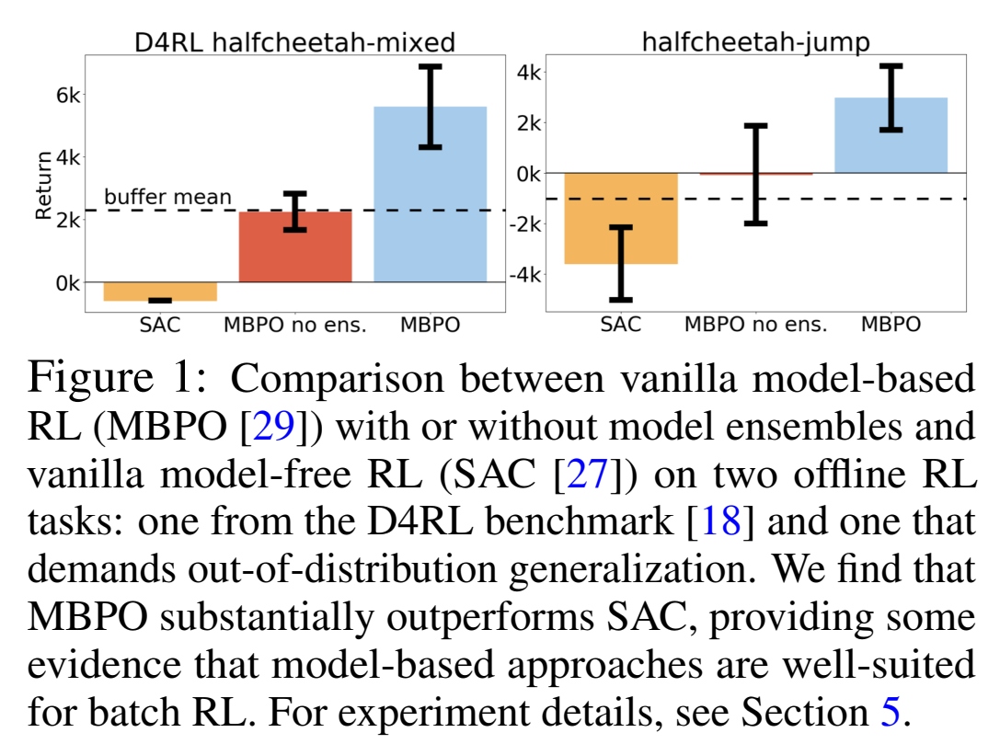

### Improvement

随后，针对MBPO进行具体分析，model-based方法在执行offlineRL时存在缺陷，无法有效地进行batch data外的扩展，并且无法使用additional experience，所以，作者希望构建出一个在out-of-distribution区域也可以进行较好实现的算法。这其中的重要因素就是 如何量化由于模型带来的risk以及平衡模型的risk以及return。（引入一个reward penalty）对于penalty依赖于action以及state，而model-free方法仅依赖于action。

### Experiment

MOPO模型构建出来之后，进行三个维度的实验：1）广泛数据集上的对比实验 2）自行设定两个out-of-distribution的任务验证对比实验。3）ablation 实验，验证reward penalty的有效性。

## MOPO Algorithm

### Quantifying the uncertainty: from the dynamics to the total return

$$G_{\hat{M}}^\pi(s,a) := \mathbb{E}_{s'\sim \hat{T}(s,a)}[V_M^\pi(s')] - \mathbb{E}_{s'\sim {T}(s,a)}[V_M^\pi(s')]$$

G函数衡量了我们自己的model($\hat{M}$)和真实模型($M$)在训练好的价值函数上的差异。实际上就是利用价值函数在分部上的差值当做两个MDP模型之间的error。

给以推导出下式：

\[
\eta_{\hat{M}}(\pi) - \eta_M(\pi) = \gamma \mathbb{E}_{(s,a) \sim \rho_{\hat{T}}^\pi} \left[ G^\pi_{\hat{M}}(s, a) \right]
\]

**proof：**

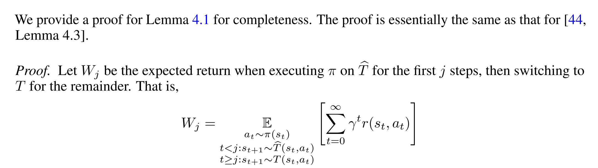
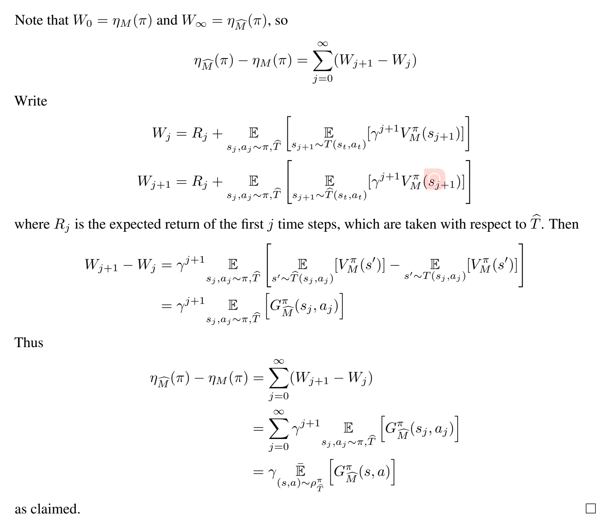

其中：

- \(\eta_{\hat{M}}(\pi)\) 表示在估计模型 \( \hat{M} \) 下的策略 \( \pi \) 的回报。$\eta_{\hat{M}}(\pi) = \mathbb{E}_{\pi,T,\mu_0}[\sum_0^\infin r^tr(s_t,a_t)]$
- \(\eta_M(\pi)\) 表示在真实模型 \( M \) 下的策略 \( \pi \) 的回报。
- \(\gamma\) 是折扣因子。
- \(\mathbb{E}_{(s,a) \sim \rho_{\hat{T}}^\pi}\) 表示在策略 \( \pi \) 下，根据估计的状态转移模型 \( \hat{T} \) 对状态 \( s \) 和动作 \( a \) 进行采样的期望。
- \(G^\pi_{\hat{M}}(s, a)\) 表示在估计模型 \( \hat{M} \) 和策略 \( \pi \) 下的回报误差项，具体描述了模型 \( M \) 和 \( \hat{M} \) 之间的差异。
-  \[
\rho^\pi_{\hat{T}}(s, a) = \pi(a | s) \sum_{t=0}^{\infty} \gamma^t P^\pi_{\hat{T}, t}(s)
\]

这个公式描述了在估计模型和真实模型下，策略回报之间的差异，并且该差异依赖于模型 \( \hat{M} \) 的误差。

特别注意这里的 **$\rho$的期望并没有保证归一性** ，因为$\rho_{\hat{T}}^\pi$是带有时间折扣的分布，所以实际上$\rho(s,a)$概率和等于$1/(1-\gamma)$。（**而不加$\gamma$折扣情况下，原式子不收敛**）

\[
\eta_{\hat{M}}(\pi) - \eta_M(\pi) = \gamma \mathbb{E}_{(s,a) \sim \rho_{\hat{T}}^\pi} \left[ G^\pi_{\hat{M}}(s, a) \right]
\]

继续推出：

\[
\eta_M(\pi) = \mathbb{E}_{(s,a) \sim \rho_{\hat{T}}^\pi} \left[ r(s, a) - \gamma G^\pi_{\hat{M}}(s, a) \right] \geq \mathbb{E}_{(s,a) \sim \rho_{\hat{T}}^\pi} \left[ r(s, a) - \gamma |G^\pi_{\hat{M}}(s, a)| \right]
\]

随后进行一个公式化规范推导，定义一个函数式：

\[
|G^\pi_{\hat{M}}(s, a)| \leq \sup_{f \in F} \left| \mathbb{E}_{s' \sim \hat{T}(s,a)} \left[ f(s') \right] - \mathbb{E}_{s' \sim T(s,a)} \left[ f(s') \right] \right| =: d_F(\hat{T}(s, a), T(s, a))
\]

其中，\( d_F \) 为由 \( F \) 定义的**积分概率度量**（IPM）。

此处对于 \( F \) function set的设定较为关键，作者应用两种**距离公式**进行对比分析：

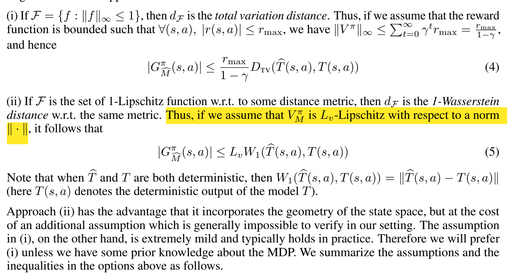

方法(ii)的优点是它包含了状态空间的几何形状，但代价是一个额外的假设（when T' and T are both deterministic），这在我们的设置中通常不可能得到验证。另一方面，(i)中的假设是极其温和的，并且在实践中通常成立。因此，我们将更喜欢(i)，除非我们对MDP有一些先验知识。

不管我们如何选择，可以再进一步抽象：

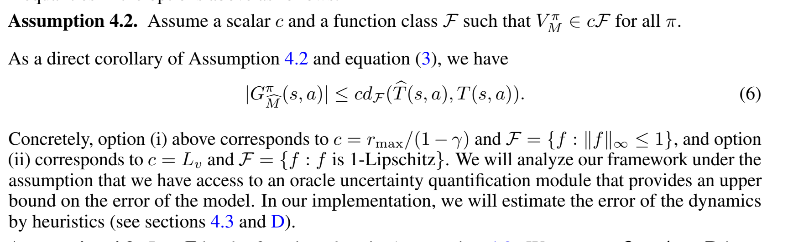

现在只需要一个函数集合作用在模型上，配合一个常数c，就可以upperbound住$G$这个表示不同模型下的价值差。（G 即在输入(s,a)后的不确定性量化 ：from the dynamics to the total return）

之后papar说如果我们找到了函数$u: S \times T \rightarrow \mathbb{R}$，这个u函数可以hold住$d_F(\hat{T}(s, a), T(s, a))$。那么就有下图的定义和不等式推导：

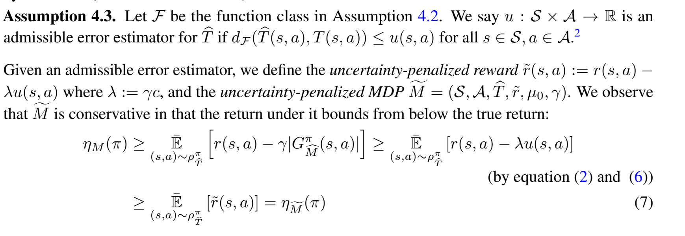

也就是说，上图这样构造的惩罚reward下的MDP问题的解一定会比true MDP更conservative。

### Policy optimization on uncertainty-penalized MDPs

根据上面的推导，我们可以在$uncertainty-penalized MDP$下进行policy optimization。这个MDP的reward是原来的reward加上一个penalty项，这个penalty项是由uncertainty function u(s,a)决定的。

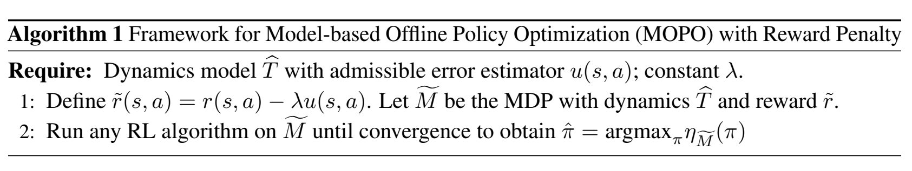

我们通过对学习到的策略 \(\hat{\pi}\) 在一组策略中的最优性进行理论分析。设 \(\pi^\star\) 为在模型 \(M\) 上的最优策略，\(\pi^B\) 为生成批数据的策略。定义 \(\epsilon_u(\pi)\) 为：

\[
\epsilon_u(\pi) := \mathbb{E}_{(s,a) \sim \rho_{\hat{T}}^\pi} [u(s, a)]
\]

注意，\(\epsilon_u(\pi)\) 依赖于 \(\hat{T}\)，但为了简化记号，我们省略了这种依赖关系。我们观察到，\(\epsilon_u(\pi)\) 表示模型在由策略 \(\pi\) 引发的轨迹上的误差。例如，考虑极端情况，当 \(\pi = \pi^B\) 时，由于 \(\hat{T}\) 是基于 \(\pi^B\) 生成的数据学习的，我们期望对于那些 \((s, a) \sim \rho_{\hat{T}}^{\pi^B}\) 的状态-动作对，\(\hat{T}\) 是相对准确的，因此 \(u(s, a)\) 倾向于较小。因此，我们期望 \(\epsilon_u(\pi^B)\) 也较小。

在策略分布的另一端，当 \(\pi\) 经常访问实际 MDP 中超出批数据分布的状态时，\(\rho_T^\pi\) 与 \(\rho_T^{\pi^B}\) 不同，我们期望 \(\rho_{\hat{T}}^\pi\) 也与批数据差异更大，因此对于那些 \((s, a) \sim \rho_{\hat{T}}^\pi\) 的状态-动作对，误差估计 \(u(s, a)\) 会很大。因此，我们可以认为 \(\epsilon_u(\pi)\) 会较大。

对于 \(\delta \geq \delta_{\min} := \min_\pi \epsilon_u(\pi)\)，令 \(\pi^\delta\) 为在模型误差不超过 \(\delta\) 的策略中最优的策略：

\[
\pi^\delta := \arg \max_{\pi: \epsilon_u(\pi) \leq \delta} \eta_M(\pi)
\]

这个式子定义了再模型误差不超过 \(\delta\) 的策略中**且在真实MDP中**的最优的策略。

利用上面这些放缩，现在去找$\eta_M(\hat{\pi})$和$\eta_m(\pi)$间的区别：

在上述所有假设下，MOPO中学习到的策略 \(\hat{\pi}\) 满足：

\[
\eta_M(\hat{\pi}) \geq \sup_{\pi} \{ \eta_M(\pi) - 2\lambda \epsilon_u(\pi) \}
\]

特别地，对于所有 \(\delta \geq \delta_{\min}\)，我们有：

\[
\eta_M(\hat{\pi}) \geq \eta_M(\pi^\delta) - 2\lambda \delta
\]

（证明放该小节后）

该公式的一个推论是，\(\eta_M(\hat{\pi}) \geq \eta_M(\pi^B) - 2\lambda \epsilon_u(\pi^B)\)。这表明策略 \(\hat{\pi}\) 至少应表现得与行为策略 \(\pi^B\) 一样好，因为正如之前所讨论的，\(\epsilon_u(\pi^B)\) 预计会很小。

同时也告诉我们，学习到的策略 \(\hat{\pi}\) 可以与任何满足 \(\epsilon_u(\pi) \leq \delta\) 的策略 \(\pi\) 一样好。换句话说，任何访问具有足够小不确定性的状态的策略都可以由 \(u(s, a)\) 来衡量。

需要注意的一个特例是，当 \(\delta = \epsilon_u(\pi^\star)\) 时，我们有：

\[
\eta_M(\hat{\pi}) \geq \eta_M(\pi^\star) - 2\lambda \epsilon_u(\pi^\star)
\]

这表明学习到的策略 \(\hat{\pi}\) 和最优策略 \(\pi^\star\) 之间的次优差距取决于 \(\epsilon_u(\pi^\star)\) 的误差。越接近批数据，\(\rho_{\hat{T}}^{\pi^\star}\) 与批数据的相似性越大，\(u(s, a)\) 在这些点上的不确定性越小。

另一方面，动态模型的不确定性误差越小，\(\epsilon_u(\pi^\star)\) 也越小。在极端情况下，当 \(u(s, a) = 0\)（完美的动态模型和不确定性量化），我们便得到了最优策略 \(\pi^\star\)。

其次，**通过改变 \(\delta\) 的选择来最大化公式的右侧，我们在风险和回报之间进行权衡。随着 \(\delta\) 增加，回报 \(\eta_M(\pi^\delta)\) 也会增加，因为 \(\pi^\delta\) 可以从更大的策略集中选择。然而，风险因子 \(2\lambda\delta\) 也随之增加**。最优的 \(\delta\) 选择是当风险平衡了从行为分布之外探索策略的收益时实现的。最优 \(\delta\) 的确切选择可能取决于具体的问题。

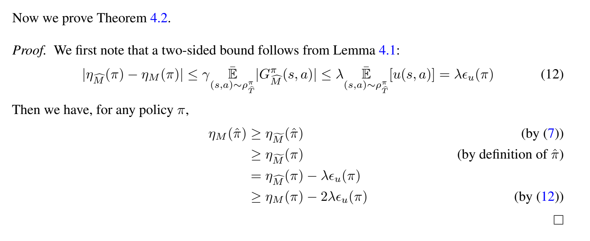

### Practical implementation

**实际实现中很扯淡，paper只用了看起来像启发式的方法去定义了那个关键的reward惩罚函数，太扯了，所有以上理论分析的前置要求都不能保证，给人一种先射箭再画靶的感觉**

这段内容的中文表达如下：

在 MBPO 的基础上，我们使用神经网络对动力学进行建模，该网络输出的是关于下一个状态和奖励的高斯分布：\( \hat{T}_{\theta, \phi}(s_{t+1}, r|s_t, a_t) = \mathcal{N}(\mu_\theta(s_t, a_t), \Sigma_\phi(s_t, a_t)) \)。我们通过极大似然法独立训练了 \(N\) 个模型集成：\( \{\hat{T}^i_{\theta, \phi} = \mathcal{N}(\mu^i_\theta, \Sigma^i_\phi)\}_{i=1}^N \)。

与 MBPO 的主要区别在于我们基于上述分析使用了不确定性量化。我们的目标是设计能够捕捉**认知不确定性（epistemic uncertainty**和 **偶然不确定性（aleatoric uncertainty**的估计器。理论上，Bootstrap 集成已被证明可以一致地估计总体均值，并在模型驱动强化学习中表现良好。与此同时，假设模型合适时，高斯概率模型学习到的方差可以理论上恢复真实的偶然不确定性。为了同时利用这两种不确定性，我们设计了误差估计器 \( u(s, a) = \max_{i=1}^N \|\Sigma^i_\phi(s, a)\|_F \)，即集成模型中学习到的最大标准差。我们使用集成元素中的最大值而非均值来使模型更加保守和稳健。**~~尽管该估计器缺乏理论保证，但发现其足够准确，能够在实践中表现良好~~**。因此，MOPO 的实际不确定性惩罚奖励计算为：

\[
\tilde{r}(s, a) = \hat{r}(s, a) - \lambda \max_{i=1,...,N} \|\Sigma^i_\phi(s, a)\|_F
\]

其中，\(\hat{r}\) 是模型 \(\hat{T}\) 预测的奖励均值。

我们将惩罚系数 \( \lambda \) 视为用户选择的超参数。由于我们没有一个真实的可允许误差估计器，理论规定的 \( \lambda \) 值可能并非实践中的最优选择；如果我们的启发式方法 \( u(s, a) \) 低估了真实误差，则 \( \lambda \) 应该较大；如果 \( u(s, a) \) 显著高估了真实误差，则 \( \lambda \) 应该较小。

## Experiments

实验部分还算扎实。

### 设定了多种数据来源buffer & 多种不同的任务

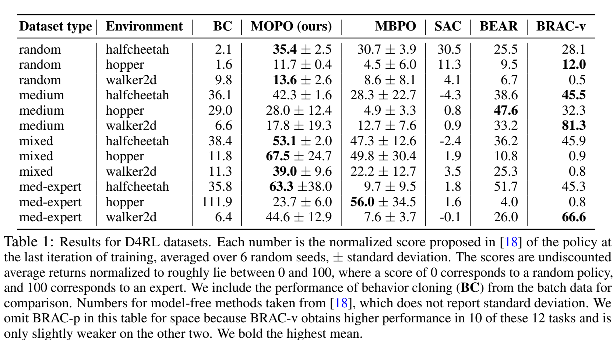

在强化学习中的数据收集过程中，D4RL基准测试中使用的四种数据集类型（random、medium、mixed、medium-expert）代表了不同的策略和训练状态下生成的数据。每种数据集的生成方式不同，目的在于测试算法在不同数据分布和策略表现下的效果。

1. **Random** （随机数据集）：
   - 生成方式：从一个**随机初始化的策略**开始（即该策略没有经过任何训练），在环境中进行 100 万步的探索（roll out）。
   - 作用：随机策略生成的数据通常覆盖状态空间的广泛部分，但可能包含大量的次优决策和低回报。这种数据集测试算法在没有有用结构信息或良好策略的情况下的表现。

2. **Medium** （中等数据集）：
   - 生成方式：使用 SAC（Soft Actor-Critic）算法**部分训练**一个策略，然后使用该策略在环境中进行 100 万步的探索。
   - 作用：部分训练的策略通常会比随机策略更好，但仍不完美。它能生成中等质量的行为数据，用来测试算法在“中等好”的策略数据上能否进一步提升策略。

3. **Mixed** （混合数据集）：
   - 生成方式：使用 SAC 算法训练一个策略，直到该策略达到某个环境特定的性能阈值（即“合格”表现），并将整个训练过程中的**重放缓冲区**（replay buffer）作为数据批次。
   - 作用：混合数据集包含了从随机探索到策略逐步改进的所有行为数据。这种数据能够测试算法在包含多个质量层次的数据上，能否进一步提升策略或纠正行为。

4. **Medium-Expert** （中等-专家数据集）：
   - 生成方式：将**一个经过完全训练的策略**（SAC 训练至专家级表现）生成的 100 万样本，与**部分训练的策略**或**随机策略**生成的 100 万样本结合在一起。
   - 作用：这种数据集包含了从非常好（专家级别）到非常差（随机或部分训练）的行为数据，旨在测试算法能否利用专家数据进一步改进策略，或者从专家行为中提炼出有用的信息，同时处理低质量数据。

这些数据集的设计是为了测试强化学习算法在不同质量的数据上，特别是在离线学习（offline RL）环境中的表现。

**表中这一结果表明，模型驱动的方法（model-based methods） 和 模型无关的方法（model-free methods） 在某些场景下具有互补性。例如，MOPO 在数据多样性较高（如混合数据集）的情况下表现出色，而在数据多样性较低的中等数据集中，模型无关方法可能表现得更好。**

### 考验out-distribution task
设计了两个跳高和ant-angle两个任务，通过修改buffer的reward来调整任务目标，从而观察算法能否在依托于旧的分布去搜索迭代新的最优策略分布。（即登记了交互数据，但是ireward改变了的情况）

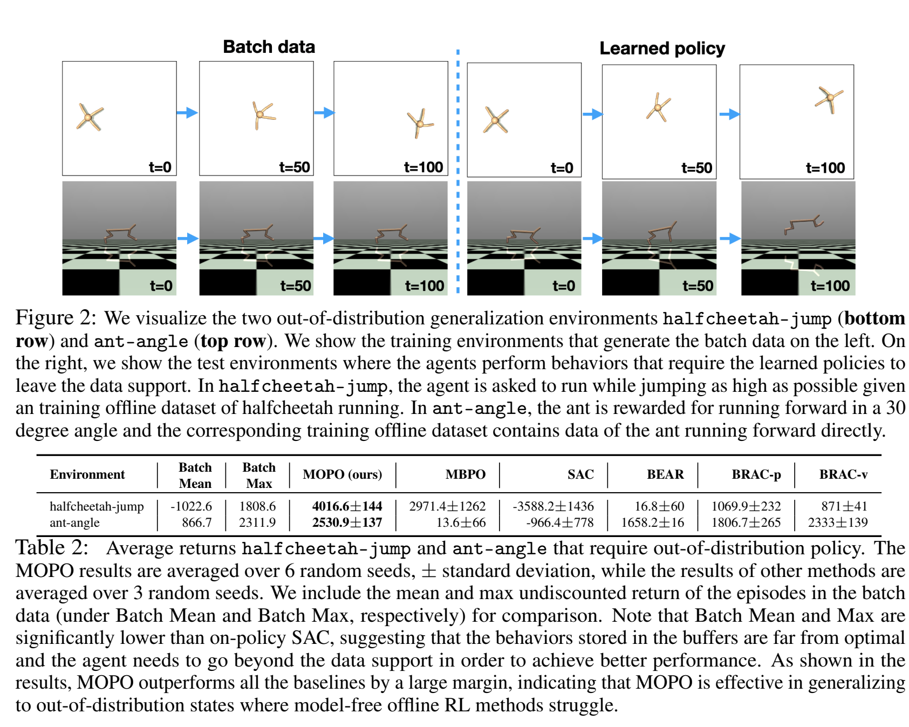

这两个任务很有设计感，迁移学习能力展现得直观。

### 伪代码

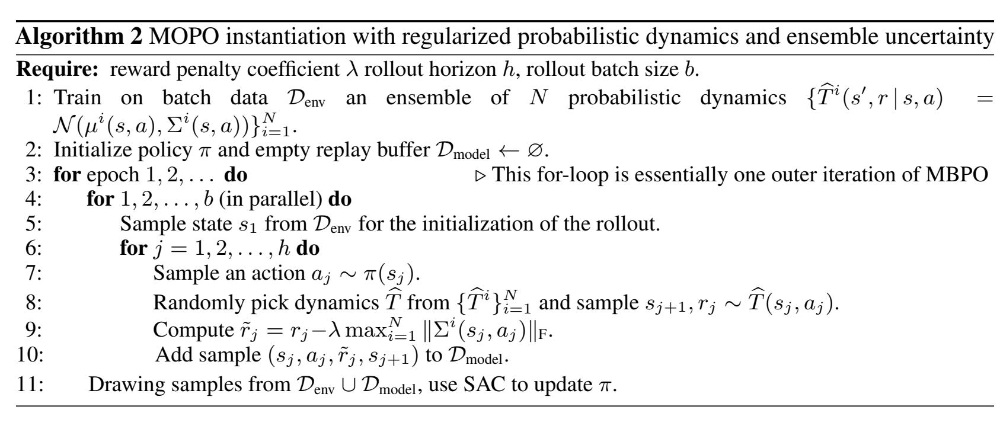

### Ablation study

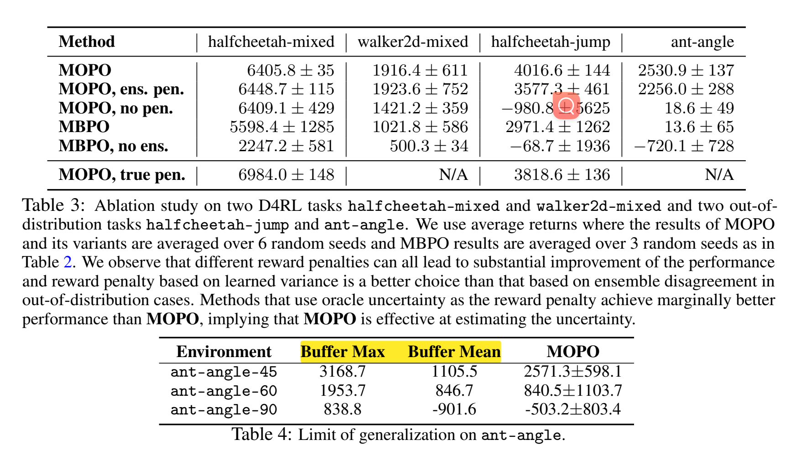

上图:

no ens.：不使用模型集成，即不通过多个模型预测来计算不确定性。
ens. pen.：使用模型集成不一致性作为奖励惩罚（即通过计算多个模型之间预测的差异来衡量不确定性）。
no pen.：不使用奖励惩罚机制，即不对高不确定性状态进行惩罚。
true pen.：使用真实的模型误差作为惩罚（上界），即通过 oracle 提供的实际模型误差来计算最优惩罚。

ens.pen. 是粗暴的用继承差异来衡量不确定性，没有后缀的是指论文里用max variance来衡量不确定性方法。

可以看到，无论是基于模型集成不一致性还是基于方差的奖励惩罚，它们的表现都比没有惩罚机制（no pen.）好得多。这表明考虑模型不确定性在批量强化学习中是至关重要的。通过对高不确定性状态进行惩罚，可以避免模型在分布外状态上做出错误的策略选择。

在 D4RL 环境中，基于学习方差的惩罚机制和基于模型集成不一致性的惩罚机制表现相当。
在分布外泛化任务中（如 halfcheetah-jump 和 ant-angle），基于学习方差的惩罚机制明显优于模型集成不一致性。这说明，在需要更强泛化能力的场景中，基于方差的不确定性估计可能更有效。
真惩罚（true pen.）的表现：在一些任务中，使用真实模型误差作为惩罚的 upper bound 可以获得略好的表现，表明如果能准确估计模型误差，性能可能会更好。然而，在一些任务中（如 halfcheetah-jump），MOPO 的表现已经非常接近真实惩罚，这说明现有的不确定性量化方法已经取得了不错的效果。

下图：

表现了离线数据集中过的所有trajacty在新reward下的表现。可以看到reward偏离越大（任务偏离越大），buffer和MOPO表现越差！

### Online-SAC vs MOPO

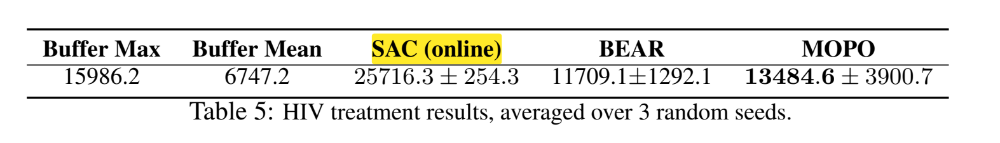

在这段实验中，**在线的 SAC（SAC online）** 比 **MOPO** 表现更好，甚至超越了 **buffer max** 的得分。这种现象可以通过以下几个方面的原因来解释：

#### 1. **在线 vs. 离线学习的区别**

- **在线 SAC** 是一种**在线强化学习**算法，在训练过程中，SAC 可以持续与环境进行交互。也就是说，SAC 可以通过**试错（trial-and-error）**不断获得新的数据，逐步调整和优化策略。由于它可以获取**新的状态和动作数据**，SAC 能够在更广泛的状态空间中进行探索，从而可能找到更优的策略，甚至超越缓冲区中的最佳轨迹（buffer max）。

- **MOPO** 是一种**离线强化学习**方法，它只能依赖已有的**离线数据**进行训练，无法像在线方法那样通过交互获得新的经验。MOPO 使用了模型来模拟环境，并依赖于现有数据的质量来进行策略优化。因此，它在性能上受到离线数据分布的限制，尤其是在数据较稀疏或分布外状态的情况下，其表现可能会受到影响。

#### 2. **SAC 的试错优势**

- **SAC 的试错能力**：SAC 在训练过程中可以通过与环境不断交互，尝试不同的策略并立即观察结果。如果某些策略导致了较差的回报，SAC 可以通过不断更新 Q 值和策略来改进，从而有效地避免低效的策略，并逐步接近最优策略。

- **MOPO 的限制**：MOPO 的策略优化依赖于它所学到的环境模型，而这个模型是基于现有数据训练的。如果数据不能充分涵盖关键的状态-动作对，MOPO 可能会在分布外状态中做出不准确的预测，导致策略效果不如预期。此外，MOPO 在分布外状态上采取了保守策略（通过不确定性惩罚机制），这虽然提高了策略的稳定性，但也可能限制了在某些任务上的表现。

#### 3. **数据的影响**

- **缓冲区数据的局限性**：在这个实验中，MOPO 使用的是**前 200k 步的离线数据**。这意味着这些数据是基于训练初期的策略生成的，因此可能并不包括任务中最优策略所涉及的状态和动作。由于 MOPO 无法像 SAC 那样生成新的数据，它只能基于这部分数据来进行优化，这在一定程度上限制了它的表现。

- **SAC 持续获取新数据**：在线 SAC 可以不断生成新的数据，因此即使初期数据质量较差，SAC 通过不断更新策略和生成更优的数据，能够突破初期数据的局限性，逐步提升策略的表现。

#### 4. **泛化与探索的平衡**

- **MOPO 的保守性**：MOPO 在处理分布外状态时采用了较为保守的策略，即对高不确定性的状态进行惩罚。这在某些情况下能够避免错误决策，但同时也可能限制了模型的探索能力，导致无法找到比离线数据中更优的策略。

- **SAC 的更广泛探索**：SAC 由于能够持续探索环境，因此可以在状态空间中进行更广泛的搜索和尝试。相比 MOPO 的保守性，SAC 能够更自由地探索，并最终找到更优的策略。

#### 5. **为什么 SAC 的得分可以超过 Buffer Max**

- **缓冲区中的数据并不最优**：缓冲区中的数据是基于初期 SAC 训练策略生成的，这些数据可能并没有完全涵盖最优策略所需的状态和动作。因此，虽然 **buffer max** 代表了历史数据中的最佳表现，但它并不是环境中最优策略的上限。在线 SAC 通过持续优化，可以找到比缓冲区数据中更优的策略，从而超过 **buffer max** 的得分。

#### 6. **结论与总结**

- **SAC 的表现优于 MOPO** 是因为在线 SAC 能够通过与环境持续交互、探索新的状态并优化策略，这使它能够超越缓冲区中的最佳轨迹，找到更优的策略。

- **MOPO** 作为一种离线强化学习方法，虽然能够在已有数据的支持下学习策略，但它的表现受限于数据的质量和分布。此外，MOPO 的保守策略虽然减少了分布外状态下的错误，但也可能限制了其在某些任务上的表现。

## Conclusion

我不好评价，引用一下paper的结论：

we develop an algorithm, model-based offline policy optimization (MOPO), which maximizes the policy on a MDP that penalizes states with high model uncertainty.MOPO trades off the risk of making mistakes and the benefit of diverse exploration from escaping thebehavioral distribution.

提出的一些展望：
1. **未来研究方向**：结合 BEAR 和 BRAC 的策略正则化思想，改善 MOPO 在“狭窄数据分布”（如 medium 数据集）上的表现。
2. **理论问题**：理解为什么基于模型（model-based）的方法在离线场景下优于无模型（model-free）的方法，可能的原因包括状态的更大监督、更稳定的梯度更新和更易进行不确定性估计。
3. **不确定性估计的重要性**：虽然重要，但不完全解释基于模型方法的优势，也不解释为何无模型方法不能从中受益。
4. **未来研究的重点**：探索如何提升无模型离线强化学习的表现，使其达到基于模型方法的水平。

最后是画饼环节：

MOPO 在离线强化学习上取得了显著进展，特别适合自动驾驶、医疗、机器人等安全关键领域，能有效减少在线数据采集的风险。**重要的是，该方法为没有专家数据的新任务提供了离线学习的可能性**。然而，如果**缺乏可靠的分布外不确定性估计技术**，模型在未遇见的场景中可能表现不可预测。此外，奖励设计的挑战和对抗性攻击的风险仍然存在。虽然技术进步可能影响就业，但离线强化学习在自动化决策中仍有巨大潜力，尤其需要进一步研究不确定性估计以确保安全应用。