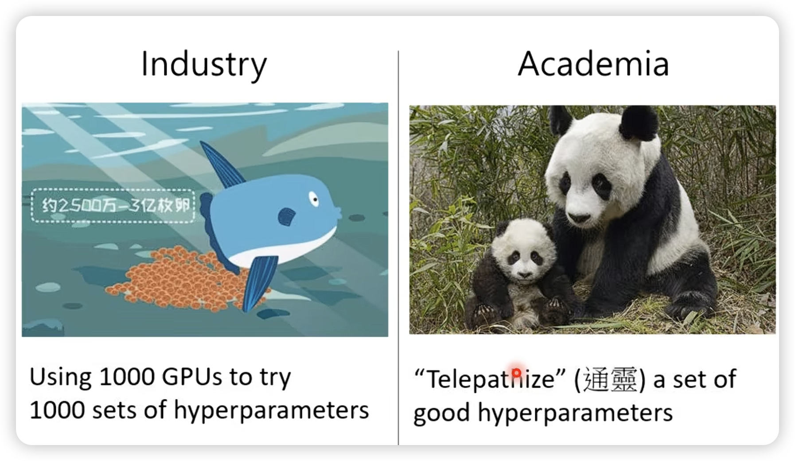
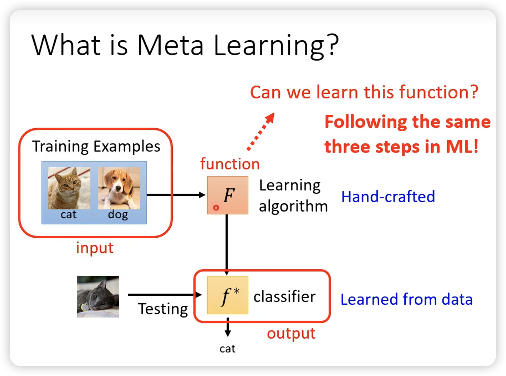
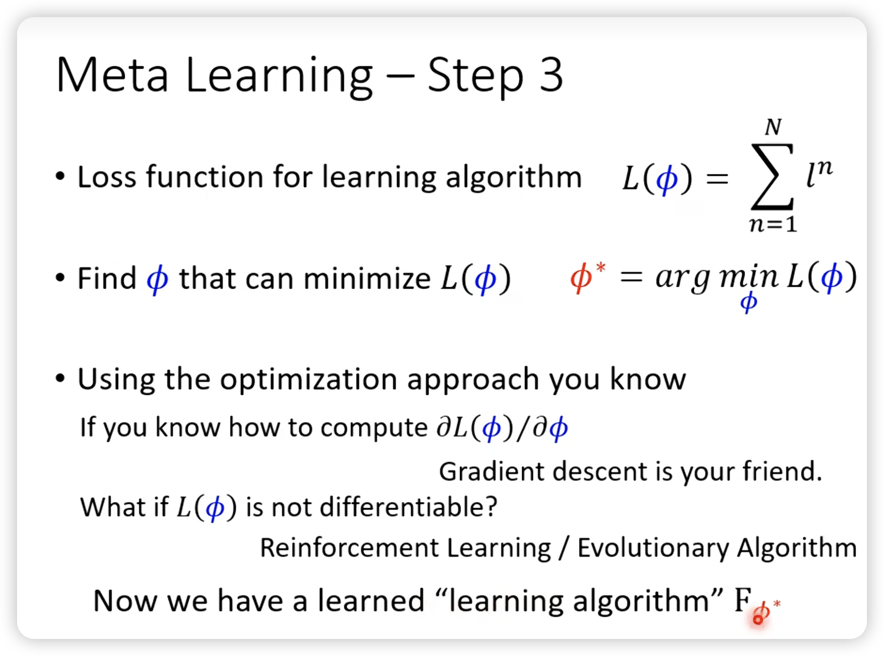
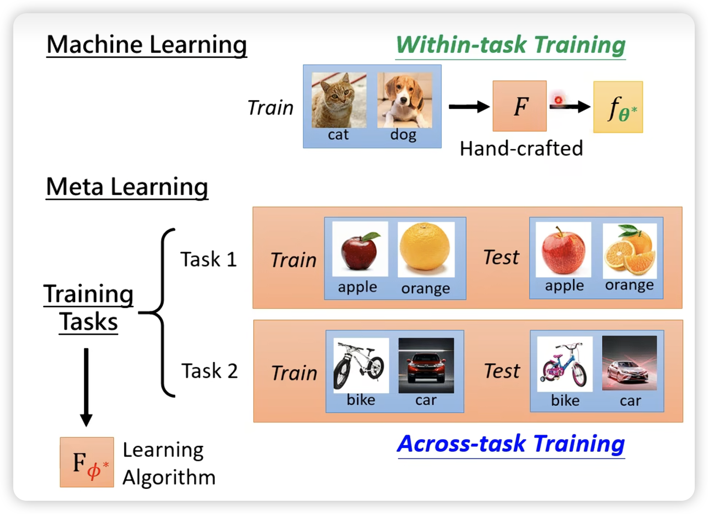
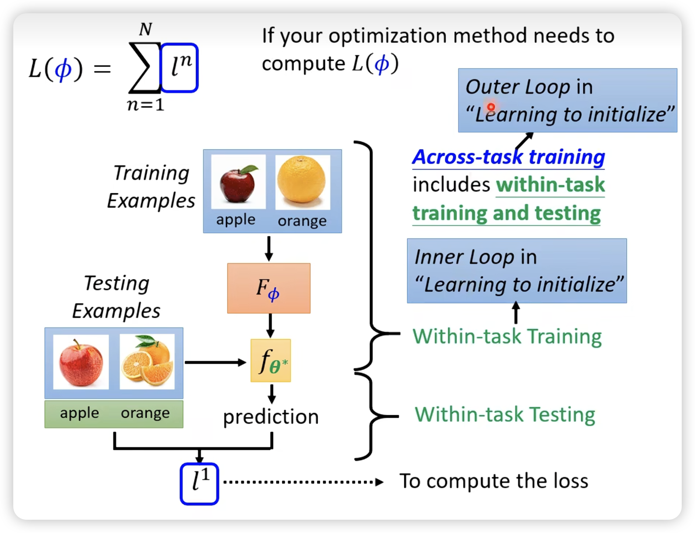
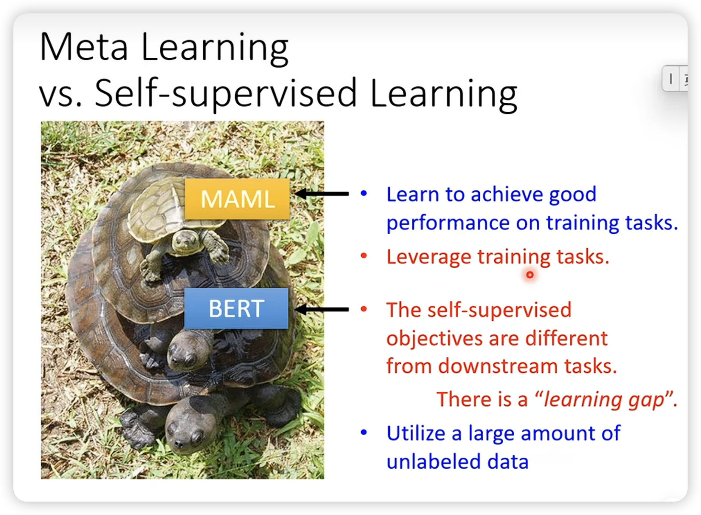
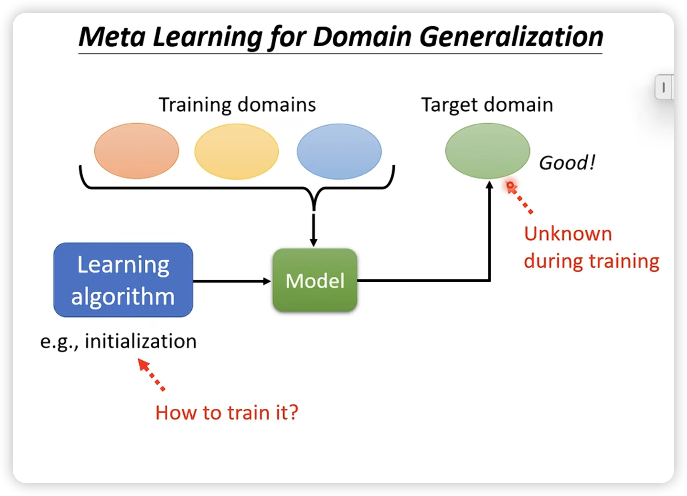
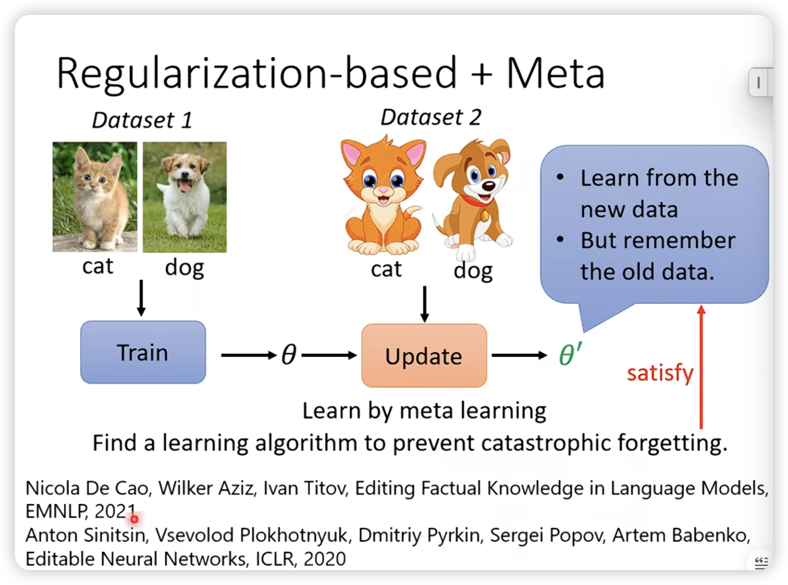

## 
 Meta-Learning 

### 关于参数

参数也是meta-learning的一个分支。

---

---

我们现在目标是学习F本身，包括网络架构，初始参数，学习率啥的。每一个东西都是meta learning的一个分支。

比如一个学习二元分类的meta learning：

然后就是强行train，如果不能微分，就上RL或者EA。

- ML v.s. Meta-Learning

difference:

similarity:

----

- MAML找一个初始化参数

好的原因：

- 还可以学习optimizer

- Network Architecture Search

- Data Augmentation

- Sample Reweighting

---

### 应用

### 补充学习

- self-supervised learning

- knowledge distillation

有文献指出，成绩好的teacher不见得是好的teacher。

引入meta learning，可以让teacher学习如何去teach。

- Domain Adaptation

在有label data的domain上很容易进行meta learning。

这里特别说一下在domain generalization上的应用。（即对一个未知的target domain，进行预测）

注意这里train的结果，是学习一个初始化参数。

- Lifelong Learning

传统方法，设计constraint，让模型不要忘记之前的知识。

我们也可以尝试用meta learning找一个比较好的leanring algorithm，可以避免catasrophic forgetting。

