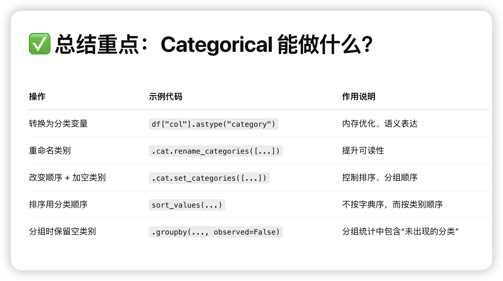

# 
 Pandas Tips 

1. series本来就是像dict，安全的获取元素方式

2. series的运算最重要是自动更具index对齐

3. 当我们想要删除nan时
.png)

4. 当我们指定index和columns时，效果不一样，index是替换，columns是保留/选择

5. 列的删除和添加

6. pandas浅拷贝和Copy on write

遇到list里面还有其他指针的可变对象时，需要deepcopy。

常见的切片，取col操作都是COW的，真正共享底层内存需要直接对df.value进行操作。

7. 用df.assign()来添加列 配合lambda函数

8. 挑选子集

注意直接df[]可以是col，也可以返回是row的切片组合df。

9. df的运算

10. describe()简单总结每一列的情况

11. sort和query

12. 单元素快速数据访问

13. 筛选过滤

要注意下面这种情况，不要连着用，不然解释器不知道你对第一个副本做还是对原始df做

使用df.loc明确说

14. pandas的缺失元素

15. 强制统一col的元素和顺序 目的是对齐

16. 运算

- 自动广播到每一列
  
- agg 把每一行元素聚合
  
- transform 利用lambda函数式变化
  

17. 生成df时，加一列是快的 ，加一行是慢的
提前存在list里面 然后直接生成df 不要iteratively去一行行add raw

用字典生成时，[]是行，{}是列,小技巧。
- [{},{},] 一行行字典生成df
- {key1：[], key2:[],} 一列列字典生成df

18. merge合并两个表格

19. df.groupby

20. MultiIndex

21. Category 分类变量

