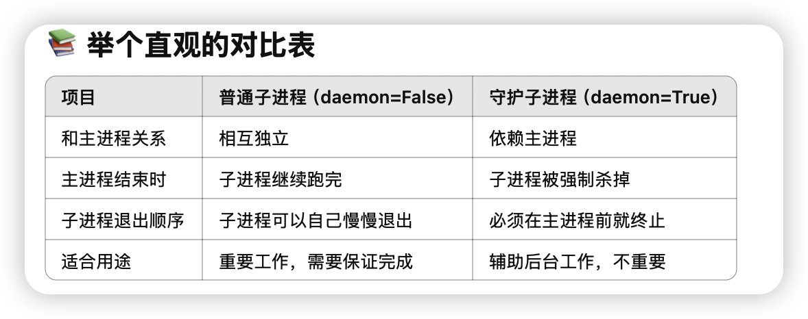

 <center> Pyhton Multiprocess </center>

众所周知，py因为有GIL的存在，导致python的多线程并不能真正实现多线程的效果。python的多进程可以有效的解决这个问题。python的多进程是通过multiprocessing模块来实现的。





一个用cond条件变量实现生产者消费者的例子

producer consumer
下面是完全用 Process 子类，并结合双 Condition 的“满/空”优化，同时保留了：
* with cond: 自动加锁/解锁
* while 循环防虚假唤醒
* notify_all() 精准唤醒
* 子类化封装，可复用、清晰

```python
from multiprocessing import Process, Condition, Value
import time, random

MAXSIZE = 10

class Producer(Process):
    def __init__(self, not_full: Condition, not_empty: Condition,
                 counter: Value, sleep: float = 1.0):
        super().__init__()
        self.not_full  = not_full
        self.not_empty = not_empty
        self.counter   = counter
        self.sleep     = sleep

    def run(self):
        while True:
            # 1) 在 not_full 上等待：只有当缓存未满时才能生产
            with self.not_full:
                while self.counter.value >= MAXSIZE:
                    print(f"{self.name}: buffer full ({self.counter.value}), waiting")
                    self.not_full.wait()

                # 2) 生产一个
                self.counter.value += 1
                print(f"{self.name}: produced → buffer size = {self.counter.value}")

                # 3) 唤醒所有在 not_empty 上等待的消费者
                with self.not_empty:
                    self.not_empty.notify_all()

            # 模拟生产耗时
            time.sleep(self.sleep * random.random())

class Consumer(Process):
    def __init__(self, not_full: Condition, not_empty: Condition,
                 counter: Value, sleep: float = 1.5):
        super().__init__()
        self.not_full  = not_full
        self.not_empty = not_empty
        self.counter   = counter
        self.sleep     = sleep

    def run(self):
        while True:
            # 1) 在 not_empty 上等待：只有当缓存非空时才能消费
            with self.not_empty:
                while self.counter.value <= 0:
                    print(f"{self.name}: buffer empty, waiting")
                    self.not_empty.wait()

                # 2) 消费一个
                self.counter.value -= 1
                print(f"{self.name}: consumed ← buffer size = {self.counter.value}")

                # 3) 唤醒所有在 not_full 上等待的生产者
                with self.not_full:
                    self.not_full.notify_all()

            # 模拟消费耗时
            time.sleep(self.sleep * random.random())

if __name__ == '__main__':
    not_full  = Condition()
    not_empty = Condition()
    counter   = Value('i', 0)

    # 启动 2 个生产者
    producers = [
        Producer(not_full, not_empty, counter, sleep=1.0)
        for _ in range(2)
    ]
    for p in producers:
        p.daemon = True
        p.start()

    # 启动 3 个消费者
    consumers = [
        Consumer(not_full, not_empty, counter, sleep=1.5)
        for _ in range(3)
    ]
    for c in consumers:
        c.daemon = True
        c.start()

    # 让它们跑 20 秒后主进程退出，一并终止所有守护进程
    try:
        time.sleep(20)
    finally:
        print("Main process exiting; all daemon workers will be terminated.")
```

这段代码中：
1. with self.not_full: / with self.not_empty:自动**acquire() + release()**，无须手动管理。
2. 使用 while 进行条件检查防止“虚假唤醒”（spurious wakeup）。
3. notify_all()精确唤醒对应一侧（生产者唤醒消费者、消费者唤醒生产者），避免无用广播。
4. Process 子类化清晰封装，参数可调，易于复用。
5. daemon=True主进程退出后，所有守护子进程会一并结束，避免“孤儿”残留。
这样，你就得到了一个既高效又规范的双 Condition 版本生产者–消费者模型。

### Barrier


可以方便的指定数量到多少后同步。

### 多进程共享内存


这两个自己来管理，自定义结构体也比较麻烦。

可以使用manager来管理共享内存，manager会自动创建一个进程来管理共享内存。


### JoinableQueue


不让consumer因为producer少就提前结束方法（检测到queue.empty but producer doesn’t end）
1. 使用joinablequeue q.join阻塞直到所有put都被调用了takedone

这个问题解决了如何让在中途消费者不会break的问题，但何时终止consumer的while呢？


整个joinablequeue流程：


## 进程池 pool

### example

如果只是同一组函数的的多次调用，使用进程池会很方便

```python
import os
import time
import random
from multiprocessing import Pool

def work(n):
    print(f'{os.getpid()} run')
    time.sleep(1)
    return n ** 2

if __name__ == '__main__':
    p = Pool()          # 创建进程池，最多同时运行3个进程
    res_l = []           # 用来保存异步结果对象

    for i in range(10):
        res = p.apply_async(work, args=(i,))
        res_l.append(res)

    p.close()             # 不再接受新的任务
    p.join()              # 等所有任务执行完

    for res in res_l:
        print(res.get())  # 取回每个任务的返回值
```
### 添加一个进程返回后的callback
```python
from tqdm import tqdm
from multiprocessing import Pool
import time
import os

# 创建进度条对象
# 总任务数为 10
pbar = tqdm(total=10)
# 设置进度条的描述文字
pbar.set_description("Sleep")

# 定义更新进度条的回调函数
update = lambda *args: pbar.update()


def work(n):
    print(f"{os.getpid()} run")
    time.sleep(1)
    return n**2


if __name__ == "__main__":
    p = Pool(3)  # 创建进程池，最多同时运行3个进程
    res_l = []

    for i in range(10):
        # 提交任务，完成后自动回调 update 更新进度条
        res = p.apply_async(work, args=(i,), callback=update)
        res_l.append(res)

    p.close()  # 不再接受新的任务
    p.join()  # 等所有任务执行完

    for res in res_l:
        print(res.get())  # 取回任务的返回值
```


