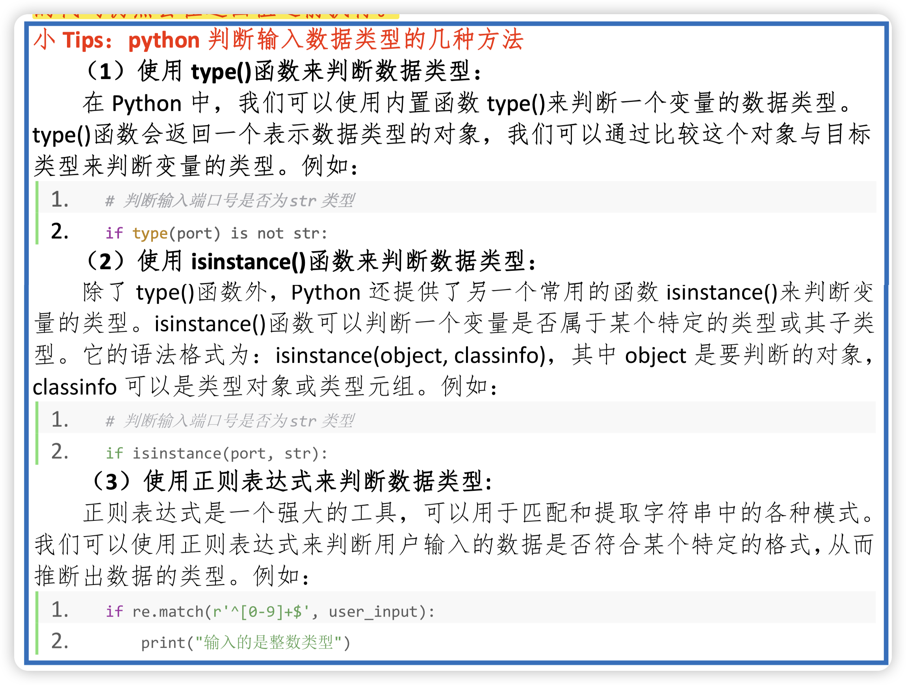
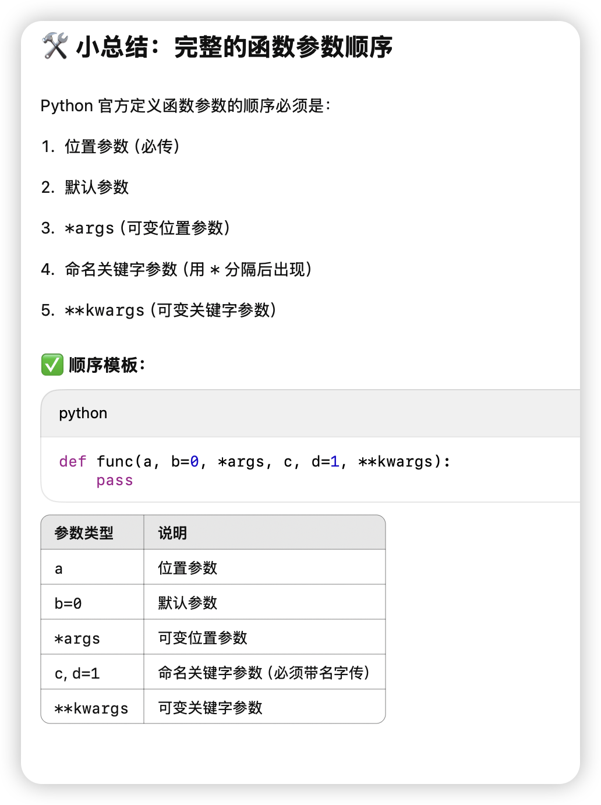

# 
 Python Tips 

1. 对于mypy静态检验，我们该怎么严谨的写py code

2. 使用logging来标注info和debug信息，可以一键屏蔽debug信息

3. 类方法 @classmethod
绑定之后，就不用传入self了 变成对这个类的元变量的函数

4. 包的绝对导入和相对导入

5. py判断数据类型

6. callable 让类的实例可以像函数一样被调用

7. 函数传参顺序

8. map返回的是惰性对象

需要list()隐式遍历来转换为list

9. ABC基类+@abstractmethod 强制实现虚接口

