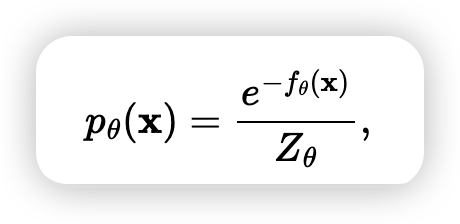
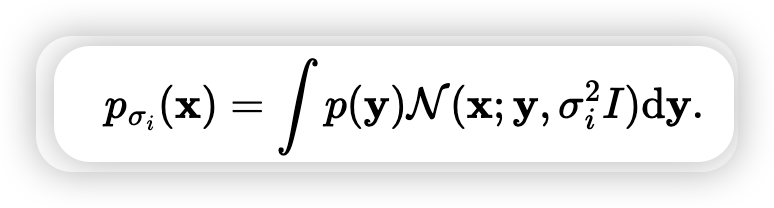
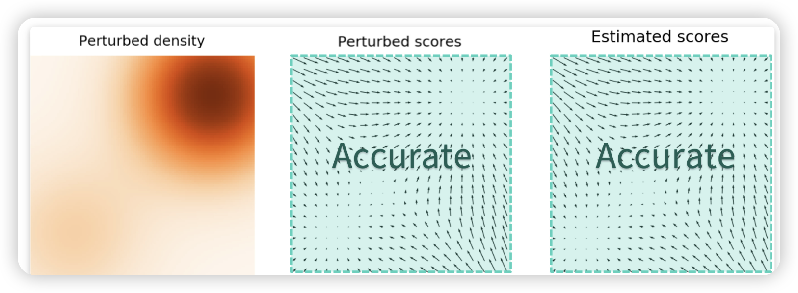
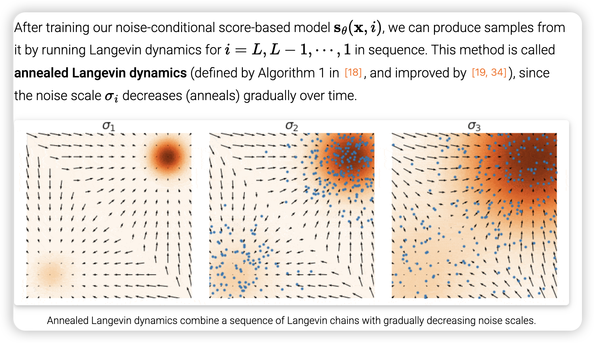
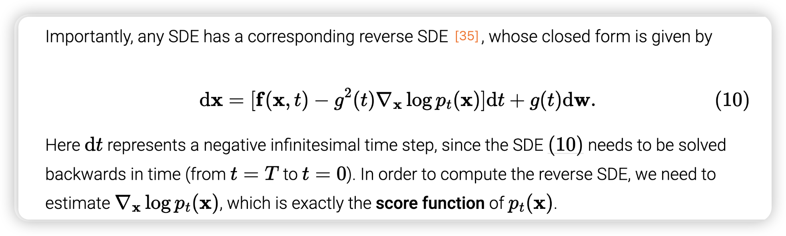
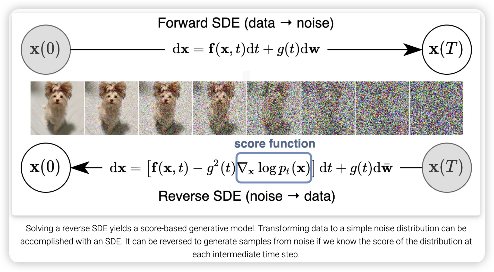
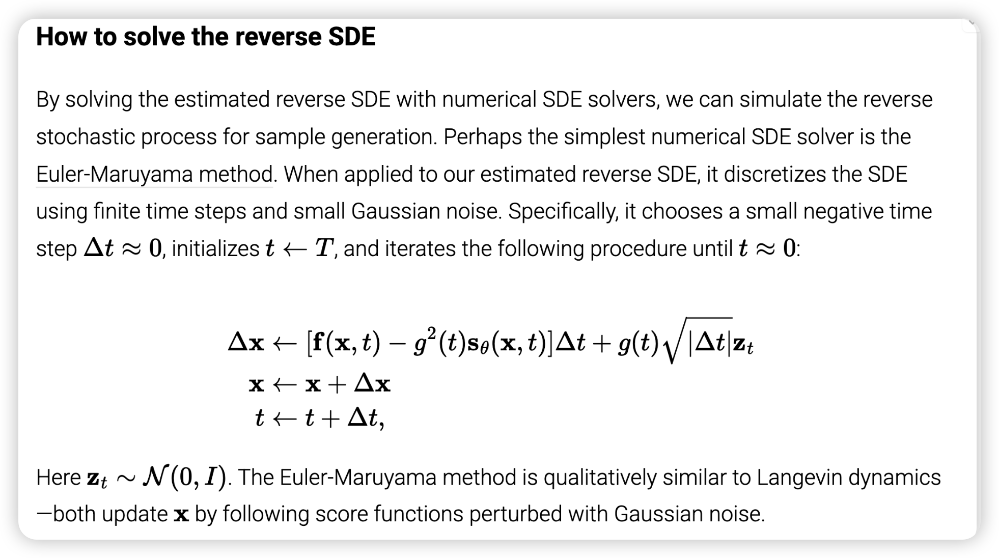
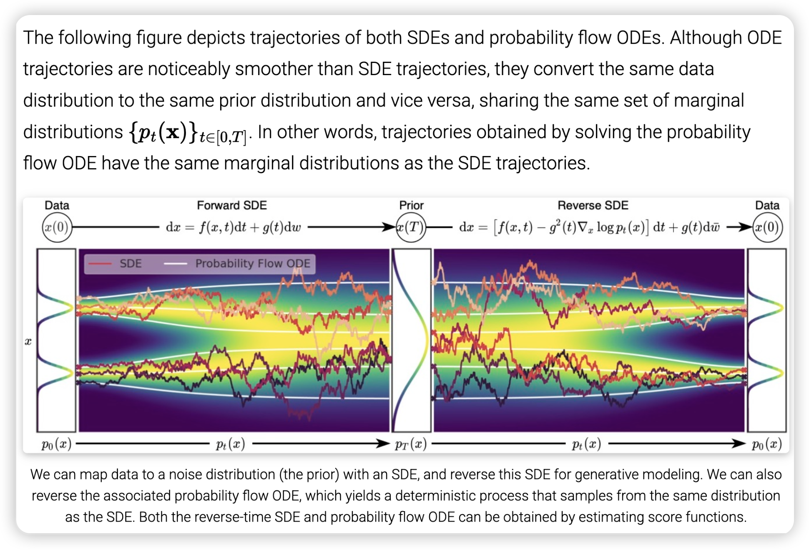

## Score-function blog 速记

为什么score function是log p的梯度，某种意义上我们一般的定义是

以往我们都是参数化f，这里log刚好去掉指数。
同时log后让对p的大幅度变化不敏感。

加上高斯卷积导致这种效果：

高斯模糊效果，和直接线性添加高斯噪音不同

退火版朗之万采样法

By generalizing the number of noise scales to infinity , we obtain not only higher quality samples, but also, among others, exact log-likelihood computation, and controllable generation for inverse problem solving.

也许也可以看出score function的重要性

在 SDE 和 ODE 过程中，任意时刻  t  的数据分布是相同的。
同时ODE时，一个采样和一个噪音是双射的

