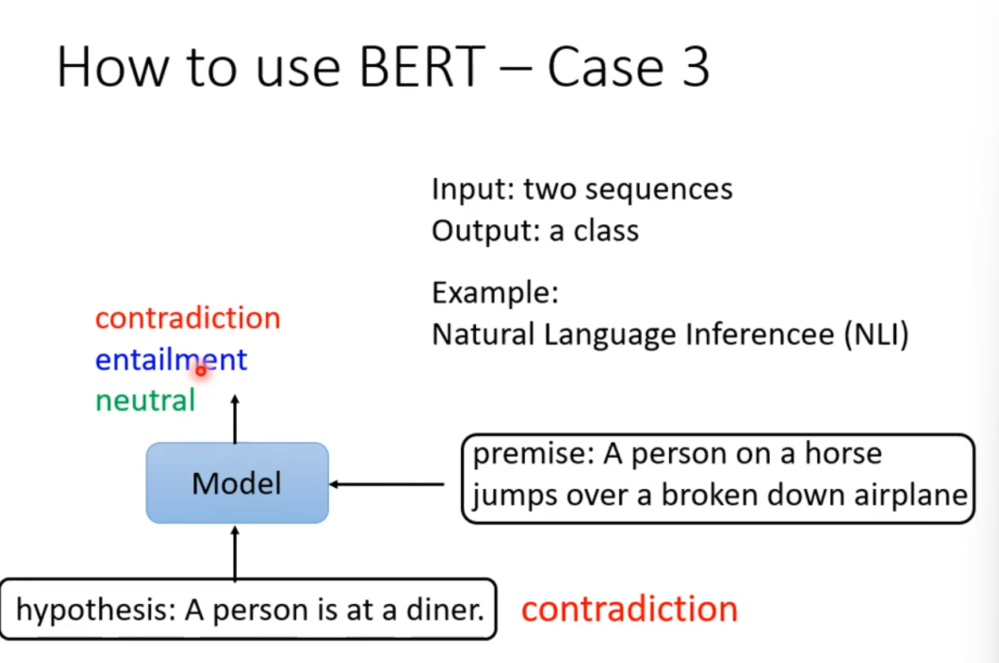

self-supervised learning也是一种unsupervised learning。

### BERT

如何做到没有label，但是又能有训练target呢？

一种方法是masking input：

还可以使用上下文，next sentence prediction，判断两句话是不是接在一起。但是这招没啥用。

有了预训练的bert填空模型，可以做很多下流任务，利用专向任务数据（包括label），fine-tune bert模型，得到更好的模型。所以bert又被称为pre-train预训练模型。

比如情感分析：

词性分析：

语言推理：

语段QA：

----

### GPT

GPT是另一种预训练模型，是一个transformer模型，但是是单向的，只能看到前面的词，不能看到后面的词。

