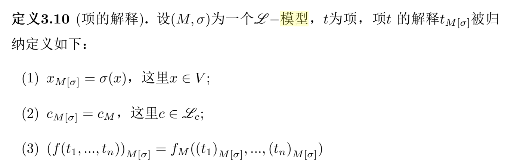
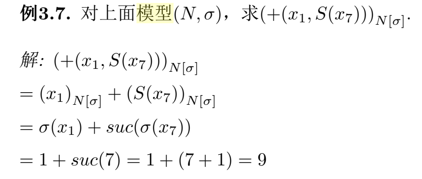
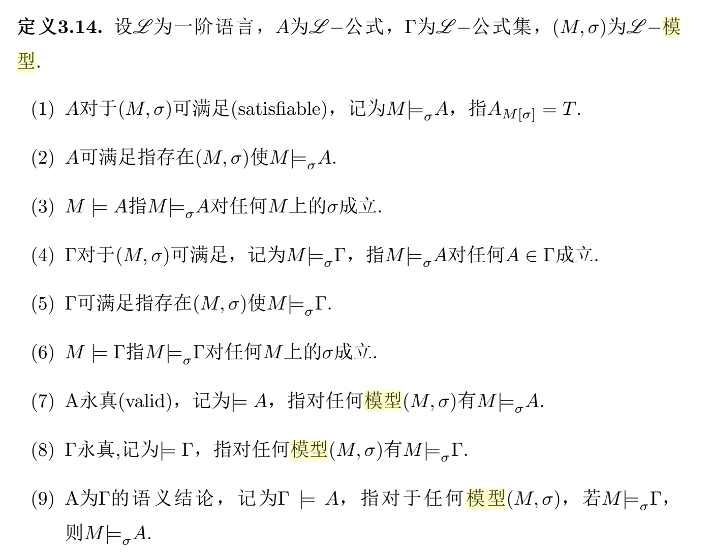

## 函数与谓词皆有元数.对于谓词 P，当 µ(P) = 0 时，我们称 P 为命题符

在数理逻辑中，函数和谓词的元数（或称为阶）指的是它们所需的参数数量。如果一个谓词的元数是0，即 \(\mu(P) = 0\)，这意味着这个谓词不需要任何参数，因此它实际上是一个命题符，可以直接作为一个命题使用，而不需要任何外部输入。这种类型的谓词本质上表达了一个确定的真值（真或假），与它们的环境或上下文无关。

### 例子

假设我们有一个谓词 \(P\)，它用来表达“今天是周末”。在逻辑符号中，如果这个谓词的元数为0，我们可以将它写作 \(P\)，而不是像其他需要参数的谓词那样写作 \(P(x)\) 或 \(P(x, y)\)。这里 \(P\) 不需要任何参数，它自身就直接表达了一个完整的命题。

这个谓词 \(P\) 能够单独作为一个逻辑表达式使用，并在不同的情况下被赋予真值。例如：

- 如果今天是星期六，那么 \(P\) 的值为真。
- 如果今天是星期一，那么 \(P\) 的值为假。

在逻辑处理中，\(P\) 被视为一个常量命题符号，其真值在具体分析时确定，而无需更多的参数输入来定义其真值。

这样的谓词可以用于更复杂的逻辑表达式，例如通过逻辑连接词与其他命题或谓词组合：

- \( \neg P \) 表示“今天不是周末”，对 \(P\) 进行否定。
- \( P \land Q \) 可以表示“今天是周末且天气晴朗”，如果我们定义 \(Q\) 为“天气晴朗”。

这种0元谓词在处理不涉及具体变量的普遍真理或状态时特别有用，它们使得表达和推理过程更为直接和简洁。

-----

## P(x,y)∧∀yR(x,y)这个例子两个y必须一致吗？

在公式 \( P(x, y) \land \forall y R(x, y) \) 中，出现的两个 \( y \) 并不必须指向相同的具体对象，这是因为量词的作用域问题导致这两个 \( y \) 在逻辑上的意义可能不同。

### 解析作用域

1. **在 \( P(x, y) \) 中的 \( y \)**：
   - 这里的 \( y \) 是自由出现的，因为它不在任何量词的控制下。这意味着在这部分表达式中，\( y \) 指向一个不具体指定的元素，其具体值取决于公式使用的上下文或假设的外部赋值。

2. **在 \( \forall y R(x, y) \) 中的 \( y \)**：
   - 这里的 \( y \) 被全称量词 \( \forall y \) 约束，它的作用是声明对所有可能的 \( y \) 的值，表达式 \( R(x, y) \) 都必须为真。在这个量词的作用范围内，\( y \) 代表了一个普遍性的对象，其指向不受外部赋值的影响。

### 逻辑影响

- **独立性**：在 \( P(x, y) \) 中的 \( y \) 与在 \( \forall y R(x, y) \) 中的 \( y \) 在逻辑上是独立的。即使它们使用相同的符号 \( y \)，在 \( \forall y R(x, y) \) 的上下文中，\( y \) 的解释和指向被全称量词全面覆盖。
- **遮蔽（Shadowing）**：这种情况在编程和逻辑中称为变量的“遮蔽”或“覆盖”。在全称量词的作用范围内，外部的同名自由变量的任何赋值或含义都被内部量词的定义“遮蔽”或忽略。

### 逻辑表达优化

- 若要避免混淆和逻辑错误，建议在此类表达式中使用不同的变量名来区分不同的作用域，或者明确标识量词控制的变量的范围，特别是在形式化证明或逻辑推导中这一点非常重要。

因此，在理解和解释含有量词和自由变量的逻辑表达式时，非常重要的一点是区分每个变量的作用域和约束情况，这有助于准确把握表达式的真实逻辑含义。在实际应用中，改用不同的变量符号以清晰区分是一个常见的做法。

---

## 2.4 对任何L的n元(n > 0)谓词P，$ I(P) \subseteq M^n $

定义3.8 (结构(Structure)). 设L 为一阶语言，L 的一个结构M 为二元组(M, I),这里
(1) M 为非空集，称之为论域(domain).
(2) I 为定义域为L 的映射，其满足：(2.1) 对任何L 的常元c，I(c) ∈ M;
(2.2) 对任何L 的n元(n > 0) 函数f，I(f) : Mn → M; (2.3) 对任何L 的0元谓词P，I(P) ∈ B = {T, F}; (2.4) 对任何L 的n元(n > 0) 谓词P，I(P) ⊆ M^n;

定义 3.8 中的第 (2.4) 部分描述了如何在一阶语言的结构中解释谓词符号，尤其是那些有一个或多个参数的谓词。我们可以逐步解析这个概念，以便更好地理解它：

#### 解释
- **L 的n元谓词P**：这指的是在一阶逻辑语言L中定义的需要n个参数的谓词。例如，如果P是一个二元谓词（比如“小于”），则它需要两个参数。
- **论域M**：这是结构的基础集合，所有的讨论和操作都是在这个集合的元素上进行的。
- **\( M^n \)**：这表示所有从论域M中取n个元素构成的n-元组的集合。如果n=2，并且M是自然数集合，那么\( M^2 \)就是所有可能的自然数对的集合，如(1,2)、(3,5)等。
- **\( I(P) \subseteq M^n \)**：这里的意思是，对于谓词P，解释函数I将P映射到\( M^n \)的一个子集上。这个子集包含了所有使得谓词P为真的n-元组。例如，如果P是“小于”这个二元关系，那么在自然数集合上，\( I(P) \)可能包括(1,2)、(2,3)等，因为1小于2，2小于3。

#### 应用
在具体的数学或逻辑结构中，这种解释方式允许我们把抽象的谓词具体化为具体元素之间的关系。这对于定义操作和证明属性非常重要。比如，如果你在处理图论问题，节点集合V可以是你的论域M，而一个二元谓词如“连接到”(连接节点A和节点B)的解释\( I(\text{连接到}) \)将是所有节点对的子集，这些节点对在图中由一条边直接连接。

#### 重要性
通过这种方式，一阶逻辑的结构提供了一种严格的方法来描述和操作对象和它们之间的关系，这对于形式化的科学和数学语言是基础。这使得逻辑和数学推理可以在明确定义的框架内进行，从而确保了逻辑结构的严密性和推导的准确性。

总之，2.4部分说明了n元谓词如何在给定的结构中被解释为论域中特定元组的集合，这些元组满足谓词定义的条件，是逻辑和数学语言精确性的关键部分。

## 项的解释

